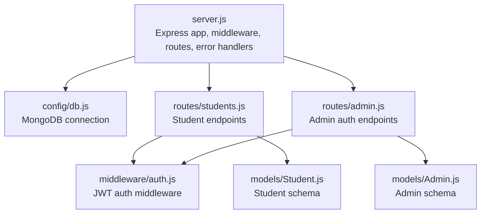
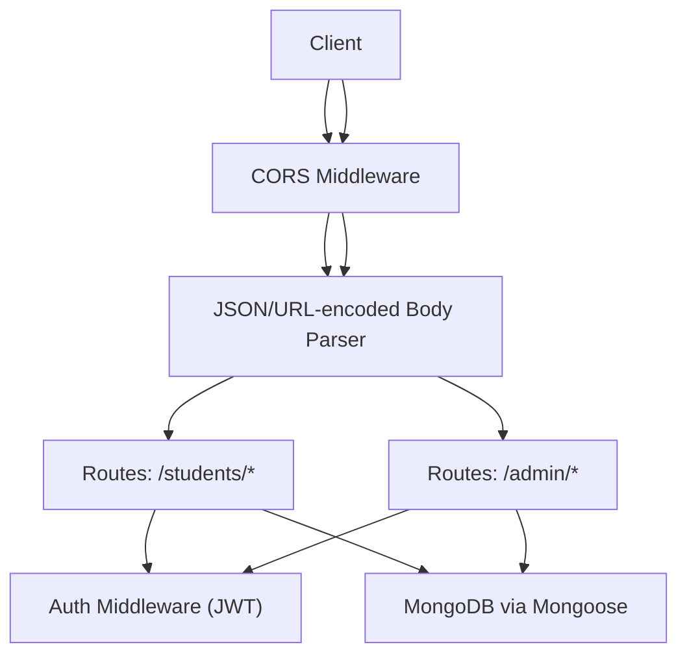
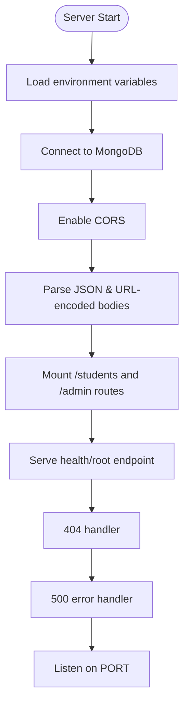
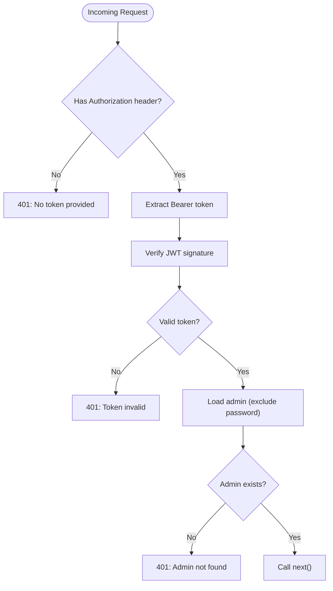
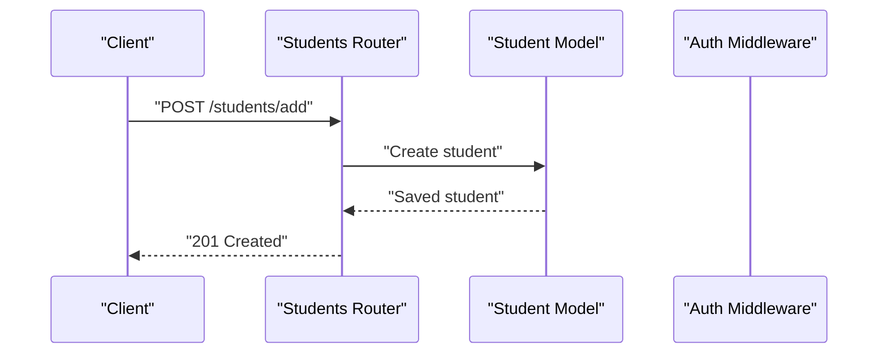
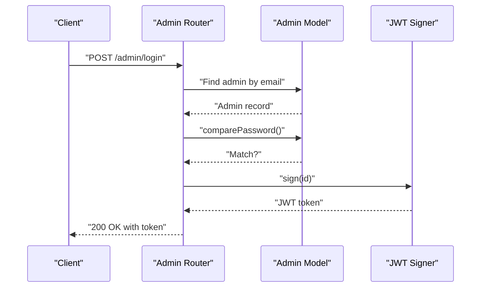
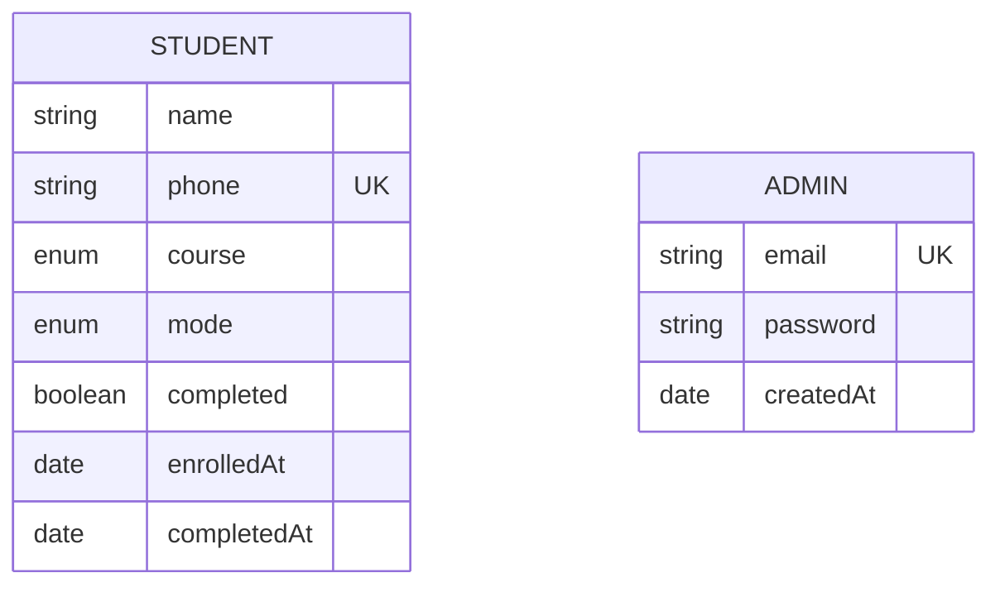
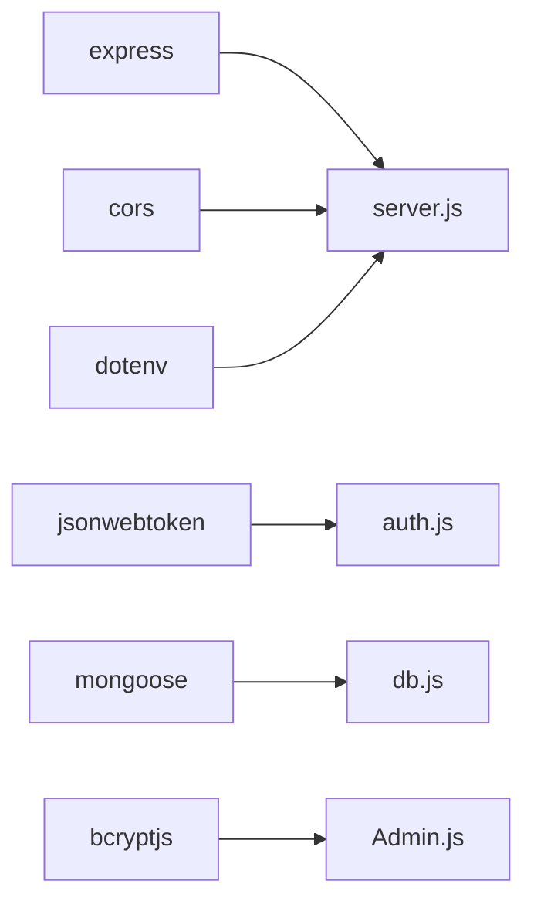

# API Architecture

<cite>
**Referenced Files in This Document**
- [server.js](file://jk-mobiles/backend/server.js)
- [students.js](file://jk-mobiles/backend/routes/students.js)
- [admin.js](file://jk-mobiles/backend/routes/admin.js)
- [auth.js](file://jk-mobiles/backend/middleware/auth.js)
- [db.js](file://jk-mobiles/backend/config/db.js)
- [Student.js](file://jk-mobiles/backend/models/Student.js)
- [Admin.js](file://jk-mobiles/backend/models/Admin.js)
- [package.json](file://jk-mobiles/backend/package.json)
- [README.md](file://jk-mobiles/README.md)
- [render.yaml](file://jk-mobiles/backend/render.yaml)
</cite>

## Table of Contents
1. [Introduction](#introduction)
2. [Project Structure](#project-structure)
3. [Core Components](#core-components)
4. [Architecture Overview](#architecture-overview)
5. [Detailed Component Analysis](#detailed-component-analysis)
6. [Dependency Analysis](#dependency-analysis)
7. [Performance Considerations](#performance-considerations)
8. [Troubleshooting Guide](#troubleshooting-guide)
9. [Conclusion](#conclusion)
10. [Appendices](#appendices)

## Introduction
This document describes the API architecture for JK Mobiles, a training institute’s full-stack application. The backend is a RESTful Express.js service exposing two primary namespaces:
- /students: public and administrative endpoints for student enrollment, certificate retrieval, and admin-only operations.
- /admin: authentication and admin verification endpoints.

It covers routing organization, middleware pipeline (CORS, JSON parsing, JWT authentication), request/response patterns, error handling, status code conventions, and guidelines for integrating new endpoints.

## Project Structure
The backend follows a modular Express architecture:
- Entry point initializes middleware, connects to the database, mounts routes, and defines global handlers.
- Routes are split into logical modules under /routes for students and admin.
- Authentication middleware enforces JWT-based protection for selected endpoints.
- Models define schemas for Student and Admin resources.
- Configuration manages MongoDB connection and deployment metadata.

**Diagram sources**
- [server.js:1-52](file://jk-mobiles/backend/server.js#L1-L52)
- [students.js:1-100](file://jk-mobiles/backend/routes/students.js#L1-L100)
- [admin.js:1-55](file://jk-mobiles/backend/routes/admin.js#L1-L55)
- [auth.js:1-34](file://jk-mobiles/backend/middleware/auth.js#L1-L34)
- [db.js:1-17](file://jk-mobiles/backend/config/db.js#L1-L17)
- [Student.js:1-39](file://jk-mobiles/backend/models/Student.js#L1-L39)
- [Admin.js:1-34](file://jk-mobiles/backend/models/Admin.js#L1-L34)

**Section sources**
- [server.js:1-52](file://jk-mobiles/backend/server.js#L1-L52)
- [README.md:7-42](file://jk-mobiles/README.md#L7-L42)

## Core Components
- Express server initialization and middleware stack:
  - CORS allows cross-origin requests from any origin for common HTTP methods and headers.
  - JSON body parsing and URL-encoded parsing.
- Route mounting:
  - /students → routes/students.js
  - /admin → routes/admin.js
- Global handlers:
  - 404 Not Found for unmatched routes.
  - Generic 500 Internal Server Error handler.
- Database connection:
  - MongoDB via Mongoose with unified topology and strict options.
- Authentication middleware:
  - Validates Authorization: Bearer tokens and attaches admin payload to requests.

**Section sources**
- [server.js:11-46](file://jk-mobiles/backend/server.js#L11-L46)
- [db.js:3-14](file://jk-mobiles/backend/config/db.js#L3-L14)
- [auth.js:4-31](file://jk-mobiles/backend/middleware/auth.js#L4-L31)

## Architecture Overview
The API is organized around two namespaces with clear separation of concerns:
- Public endpoints (no auth):
  - POST /students/add
  - GET /students/certificate/:phone
  - POST /admin/login
  - POST /admin/setup
- Protected endpoints (JWT required):
  - GET /students
  - GET /students/stats/overview
  - PUT /students/complete/:id
  - GET /admin/me

**Diagram sources**
- [server.js:12-22](file://jk-mobiles/backend/server.js#L12-L22)
- [students.js:1-100](file://jk-mobiles/backend/routes/students.js#L1-L100)
- [admin.js:1-55](file://jk-mobiles/backend/routes/admin.js#L1-L55)
- [auth.js:4-31](file://jk-mobiles/backend/middleware/auth.js#L4-L31)
- [db.js:3-14](file://jk-mobiles/backend/config/db.js#L3-L14)

## Detailed Component Analysis

### Express Server and Middleware Pipeline
- Initialization:
  - Loads environment variables.
  - Establishes database connection.
- Middleware:
  - CORS configured to accept GET, POST, PUT, DELETE and common headers.
  - JSON and URL-encoded body parsers.
- Routing:
  - Mounts /students and /admin routes.
- Global handlers:
  - 404 for unknown routes.
  - Generic 500 error handler logging stack traces.

**Diagram sources**
- [server.js:1-52](file://jk-mobiles/backend/server.js#L1-L52)
- [db.js:3-14](file://jk-mobiles/backend/config/db.js#L3-L14)

**Section sources**
- [server.js:11-46](file://jk-mobiles/backend/server.js#L11-L46)
- [server.js:48-52](file://jk-mobiles/backend/server.js#L48-L52)

### Authentication Middleware (JWT)
- Extracts Bearer token from Authorization header.
- Verifies token against JWT secret.
- Attaches admin record (without password) to request object.
- Returns 401 for missing/invalid tokens or admin not found.

**Diagram sources**
- [auth.js:4-31](file://jk-mobiles/backend/middleware/auth.js#L4-L31)

**Section sources**
- [auth.js:4-31](file://jk-mobiles/backend/middleware/auth.js#L4-L31)

### Students Namespace (/students)
Endpoints and behavior:
- POST /students/add
  - Creates a new student enrollment.
  - Validates presence of required fields.
  - Prevents duplicates by phone.
  - Returns 201 on success, 400/409/500 on failure.
- GET /students
  - Returns paginated list sorted by enrollment date (admin only).
  - Protected by JWT middleware.
- PUT /students/complete/:id
  - Marks a student as completed and sets completion timestamp.
  - Returns 404 if not found.
  - Protected by JWT middleware.
- GET /students/certificate/:phone
  - Retrieves certificate-like data gated by completion status.
  - Returns 404 if no student found.
  - Returns 403 if course not completed.
- GET /students/stats/overview
  - Returns counts and recent enrollments.
  - Protected by JWT middleware.

**Diagram sources**
- [students.js:6-25](file://jk-mobiles/backend/routes/students.js#L6-L25)
- [Student.js:3-36](file://jk-mobiles/backend/models/Student.js#L3-L36)

**Section sources**
- [students.js:6-97](file://jk-mobiles/backend/routes/students.js#L6-L97)

### Admin Namespace (/admin)
Endpoints and behavior:
- POST /admin/setup
  - Creates the first admin account if none exists.
  - Uses defaults from environment variables if not set.
  - Returns 201 on success, 400 if admin exists, 500 on error.
- POST /admin/login
  - Validates credentials and compares hashed passwords.
  - Returns signed JWT token and admin email.
  - Returns 400/401 on validation/failure.
- GET /admin/me
  - Verifies token and returns admin profile (without password).
  - Protected by JWT middleware.

**Diagram sources**
- [admin.js:28-47](file://jk-mobiles/backend/routes/admin.js#L28-L47)
- [Admin.js:28-31](file://jk-mobiles/backend/models/Admin.js#L28-L31)
- [auth.js:7-9](file://jk-mobiles/backend/middleware/auth.js#L7-L9)

**Section sources**
- [admin.js:11-52](file://jk-mobiles/backend/routes/admin.js#L11-L52)

### Data Models
- Student
  - Fields: name, phone (unique), course (enum), mode (enum), completed, enrolledAt, completedAt.
  - Validation enforced via schema.
- Admin
  - Fields: email, password, createdAt.
  - Password hashing via pre-save hook.
  - Utility method comparePassword for verification.

**Diagram sources**
- [Student.js:3-36](file://jk-mobiles/backend/models/Student.js#L3-L36)
- [Admin.js:4-19](file://jk-mobiles/backend/models/Admin.js#L4-L19)

**Section sources**
- [Student.js:3-36](file://jk-mobiles/backend/models/Student.js#L3-L36)
- [Admin.js:21-31](file://jk-mobiles/backend/models/Admin.js#L21-L31)

## Dependency Analysis
External libraries and their roles:
- express: Web framework for routing and middleware.
- cors: Cross-origin resource sharing policy.
- jsonwebtoken: JWT signing and verification for admin auth.
- mongoose: MongoDB ODM for models and connection.
- bcryptjs: Password hashing for admin accounts.
- dotenv: Environment variable loading.

**Diagram sources**
- [package.json:10-16](file://jk-mobiles/backend/package.json#L10-L16)
- [server.js:1-4](file://jk-mobiles/backend/server.js#L1-L4)
- [auth.js:1](file://jk-mobiles/backend/middleware/auth.js#L1)
- [Admin.js:2](file://jk-mobiles/backend/models/Admin.js#L2)
- [db.js:1](file://jk-mobiles/backend/config/db.js#L1)

**Section sources**
- [package.json:10-21](file://jk-mobiles/backend/package.json#L10-L21)

## Performance Considerations
- Current implementation does not include explicit rate limiting. Consider adding a rate limiter (e.g., window-based) for:
  - /admin/login to mitigate brute-force attempts.
  - /students/add to prevent spam enrollments.
- Indexes:
  - Consider indexing Student.phone for faster duplicate checks and certificate lookups.
  - Index Admin.email for efficient login lookups.
- Pagination:
  - The GET /students endpoint returns all records. Introduce pagination for large datasets.
- Caching:
  - Cache static responses for certificate data if acceptable for the use case.
- Connection pooling:
  - Mongoose uses unified topology; ensure production deployments configure connection limits appropriately.

[No sources needed since this section provides general guidance]

## Troubleshooting Guide
Common issues and resolutions:
- 401 Unauthorized
  - Cause: Missing or invalid Bearer token.
  - Resolution: Ensure Authorization header is present and valid; verify JWT_SECRET environment variable.
- 403 Forbidden (certificate endpoint)
  - Cause: Student not marked as completed.
  - Resolution: Mark student as completed via PUT /students/complete/:id before requesting certificate.
- 404 Not Found
  - Cause: Unknown route or missing student ID.
  - Resolution: Confirm endpoint path and resource identifiers.
- 409 Conflict (enrollment)
  - Cause: Duplicate phone number.
  - Resolution: Use a unique phone number for enrollment.
- 500 Internal Server Error
  - Cause: Unhandled exceptions or database errors.
  - Resolution: Check server logs for stack traces; verify database connectivity and environment variables.

**Section sources**
- [server.js:37-46](file://jk-mobiles/backend/server.js#L37-L46)
- [students.js:11-18](file://jk-mobiles/backend/routes/students.js#L11-L18)
- [students.js:46-48](file://jk-mobiles/backend/routes/students.js#L46-L48)
- [auth.js:14-19](file://jk-mobiles/backend/middleware/auth.js#L14-L19)

## Conclusion
JK Mobiles API is a compact, modular Express service with clear separation between public and protected endpoints. It employs JWT-based authentication for administrative operations and provides straightforward CRUD and reporting endpoints for student management. The architecture is easy to extend with new endpoints following the established patterns: mount routes under the appropriate namespace, apply middleware where needed, and leverage shared models and error handling.

[No sources needed since this section summarizes without analyzing specific files]

## Appendices

### API Versioning Approach
- No explicit versioning is implemented in the current codebase. To adopt versioning:
  - Prefix routes with /v1 (e.g., /v1/students, /v1/admin).
  - Maintain backward compatibility by deprecating older versions gradually.
  - Document version-specific changes in release notes.

[No sources needed since this section provides general guidance]

### Endpoint Categorization (Public vs Protected)
- Public endpoints (no auth):
  - POST /students/add
  - GET /students/certificate/:phone
  - POST /admin/login
  - POST /admin/setup
- Protected endpoints (JWT required):
  - GET /students
  - GET /students/stats/overview
  - PUT /students/complete/:id
  - GET /admin/me

**Section sources**
- [README.md:108-127](file://jk-mobiles/README.md#L108-L127)

### Rate Limiting Considerations
- Recommended placement:
  - Per-endpoint or per-route limiters for high-risk endpoints (e.g., /admin/login).
  - Sliding window or fixed window strategies to balance fairness and abuse prevention.
- Implementation tips:
  - Use in-memory store for development; prefer Redis-backed stores for production scaling.
  - Allow higher limits for read-heavy endpoints like certificate lookup.

[No sources needed since this section provides general guidance]

### Integrating New Endpoints
Steps to add a new endpoint:
- Choose namespace:
  - /students for student-related operations.
  - /admin for administrative operations.
- Create or reuse route file:
  - Define route with appropriate HTTP verb and path.
  - Apply middleware (e.g., protect) for protected endpoints.
- Implement handler:
  - Validate inputs and handle errors with appropriate status codes.
  - Use models for persistence and return structured JSON responses.
- Mount route:
  - Ensure the route module is mounted in server.js under the chosen namespace.
- Test:
  - Verify behavior with curl or Postman; confirm CORS and auth headers work as expected.

**Section sources**
- [server.js:20-22](file://jk-mobiles/backend/server.js#L20-L22)
- [students.js:1-100](file://jk-mobiles/backend/routes/students.js#L1-L100)
- [admin.js:1-55](file://jk-mobiles/backend/routes/admin.js#L1-L55)

### Status Code Conventions
- 200 OK: Successful GET/PUT/DELETE operations returning data.
- 201 Created: Successful creation (e.g., enrollment).
- 400 Bad Request: Missing required fields or invalid input.
- 401 Unauthorized: Missing/invalid token or admin not found.
- 403 Forbidden: Insufficient permissions or gated content (e.g., uncompleted course).
- 404 Not Found: Resource not found (e.g., student ID or phone).
- 409 Conflict: Duplicate resource detected (e.g., phone number).
- 500 Internal Server Error: Unexpected server errors.

**Section sources**
- [students.js:11-18](file://jk-mobiles/backend/routes/students.js#L11-L18)
- [students.js:46-48](file://jk-mobiles/backend/routes/students.js#L46-L48)
- [students.js:65-67](file://jk-mobiles/backend/routes/students.js#L65-L67)
- [admin.js:33-40](file://jk-mobiles/backend/routes/admin.js#L33-L40)
- [auth.js:14-19](file://jk-mobiles/backend/middleware/auth.js#L14-L19)

### Environment Variables and Deployment
- Required variables:
  - MONGODB_URI: MongoDB connection string.
  - JWT_SECRET: Secret for signing JWT tokens.
  - ADMIN_EMAIL, ADMIN_PASSWORD: Defaults for initial admin setup.
  - PORT: Listening port for the server.
- Deployment:
  - Render deployment configuration specifies build/start commands and environment variables.

**Section sources**
- [README.md:68-83](file://jk-mobiles/README.md#L68-L83)
- [render.yaml:7-17](file://jk-mobiles/backend/render.yaml#L7-L17)