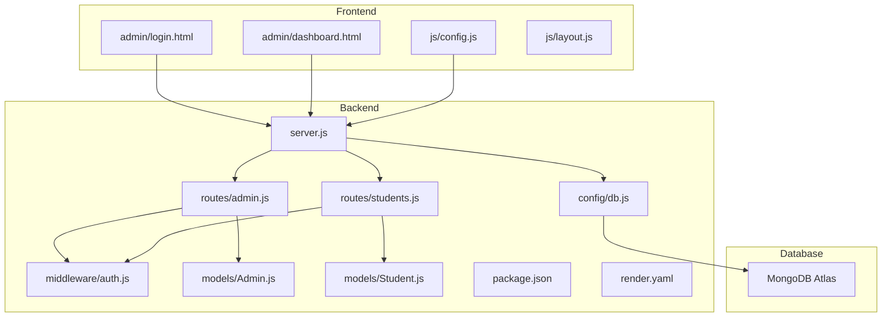
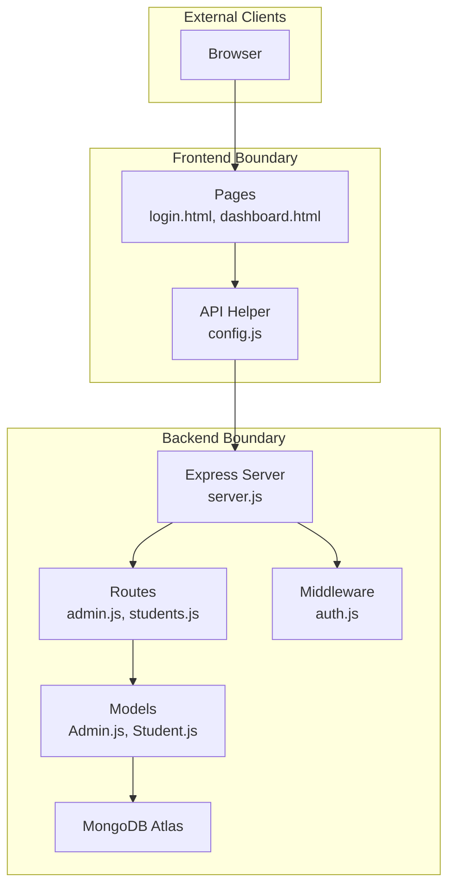
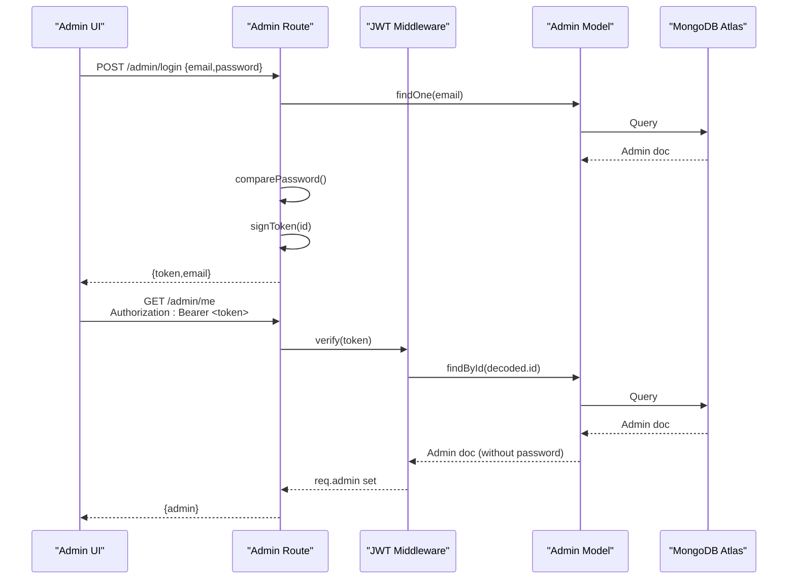
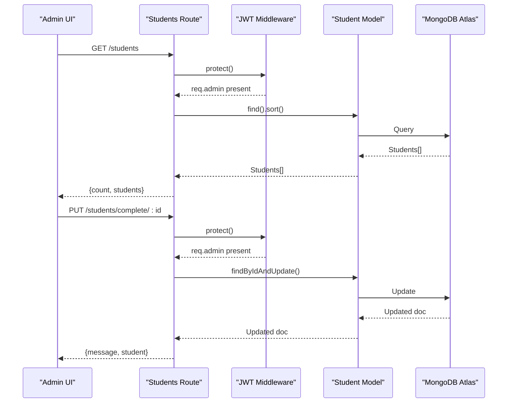
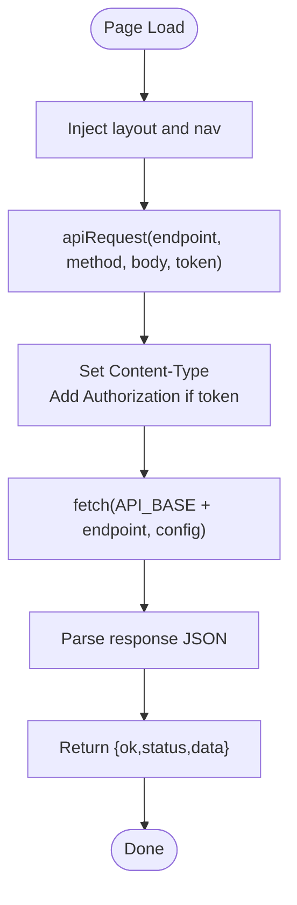
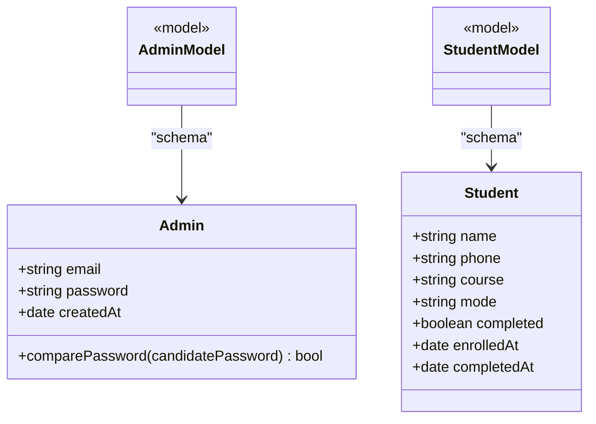
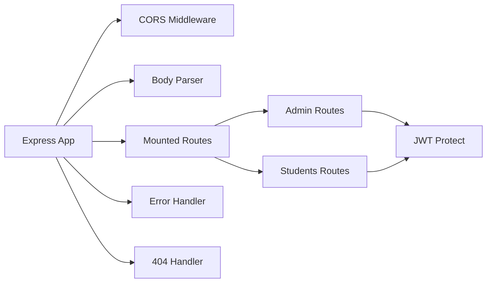
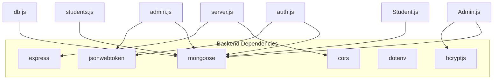
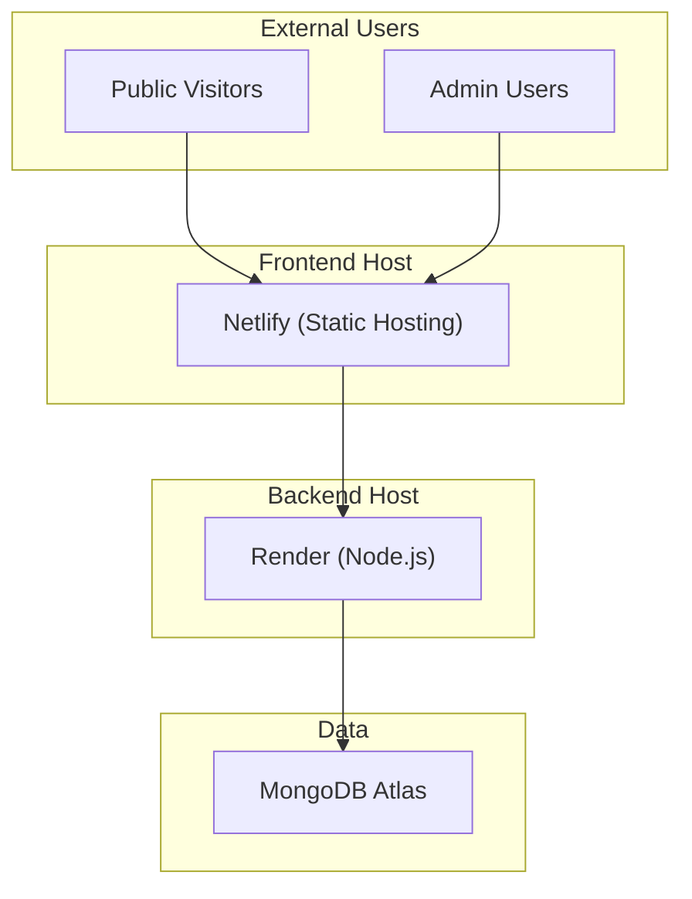

# Architecture Overview

<cite>
**Referenced Files in This Document**
- [server.js](file://jk-mobiles/backend/server.js)
- [db.js](file://jk-mobiles/backend/config/db.js)
- [auth.js](file://jk-mobiles/backend/middleware/auth.js)
- [students.js](file://jk-mobiles/backend/routes/students.js)
- [admin.js](file://jk-mobiles/backend/routes/admin.js)
- [Admin.js](file://jk-mobiles/backend/models/Admin.js)
- [Student.js](file://jk-mobiles/backend/models/Student.js)
- [package.json](file://jk-mobiles/backend/package.json)
- [render.yaml](file://jk-mobiles/backend/render.yaml)
- [config.js](file://jk-mobiles/frontend/js/config.js)
- [layout.js](file://jk-mobiles/frontend/js/layout.js)
- [login.html](file://jk-mobiles/frontend/admin/login.html)
- [dashboard.html](file://jk-mobiles/frontend/admin/dashboard.html)
- [README.md](file://jk-mobiles/README.md)
</cite>

## Table of Contents
1. [Introduction](#introduction)
2. [Project Structure](#project-structure)
3. [Core Components](#core-components)
4. [Architecture Overview](#architecture-overview)
5. [Detailed Component Analysis](#detailed-component-analysis)
6. [Dependency Analysis](#dependency-analysis)
7. [Performance Considerations](#performance-considerations)
8. [Troubleshooting Guide](#troubleshooting-guide)
9. [Conclusion](#conclusion)
10. [Appendices](#appendices)

## Introduction
This document presents the architecture of the JK Mobiles system, a full-stack solution for a training institute’s website and admin portal. It covers the high-level architecture spanning frontend (HTML/CSS/JavaScript), backend (Node.js/Express), and database (MongoDB Atlas). It documents client-server communication patterns, JWT authentication flow, CORS configuration, layered architecture (presentation, business logic, data access), system boundaries, component interactions, and deployment topology. Design patterns such as MVC and middleware are highlighted, along with scalability considerations and technology choices.

## Project Structure
The repository is organized into two primary areas:
- Backend: Node.js/Express API with routes, middleware, models, and configuration.
- Frontend: Static HTML/CSS/JavaScript pages, including admin login and dashboard.

**Diagram sources**
- [server.js:1-52](file://jk-mobiles/backend/server.js#L1-L52)
- [db.js:1-17](file://jk-mobiles/backend/config/db.js#L1-L17)
- [auth.js:1-34](file://jk-mobiles/backend/middleware/auth.js#L1-L34)
- [students.js:1-100](file://jk-mobiles/backend/routes/students.js#L1-L100)
- [admin.js:1-55](file://jk-mobiles/backend/routes/admin.js#L1-L55)
- [Admin.js:1-34](file://jk-mobiles/backend/models/Admin.js#L1-L34)
- [Student.js:1-39](file://jk-mobiles/backend/models/Student.js#L1-L39)
- [config.js:1-33](file://jk-mobiles/frontend/js/config.js#L1-L33)
- [layout.js:1-69](file://jk-mobiles/frontend/js/layout.js#L1-L69)
- [login.html:1-376](file://jk-mobiles/frontend/admin/login.html#L1-L376)
- [dashboard.html:1-1233](file://jk-mobiles/frontend/admin/dashboard.html#L1-L1233)

**Section sources**
- [README.md:7-42](file://jk-mobiles/README.md#L7-L42)
- [server.js:1-52](file://jk-mobiles/backend/server.js#L1-L52)
- [package.json:1-22](file://jk-mobiles/backend/package.json#L1-L22)

## Core Components
- Presentation layer (frontend): Static HTML/CSS/JavaScript pages with shared layout injection and API helpers.
- Business logic layer (backend): Express routes implementing CRUD and admin operations, protected by middleware.
- Data access layer (backend): Mongoose models and database connection module.
- Authentication: JWT-based admin login with bearer token propagation.
- Communication: RESTful HTTP requests with CORS enabled.

Key implementation references:
- Backend entrypoint and middleware stack: [server.js:1-52](file://jk-mobiles/backend/server.js#L1-L52)
- Database connection: [db.js:1-17](file://jk-mobiles/backend/config/db.js#L1-L17)
- JWT middleware: [auth.js:1-34](file://jk-mobiles/backend/middleware/auth.js#L1-L34)
- Admin routes and login: [admin.js:1-55](file://jk-mobiles/backend/routes/admin.js#L1-L55)
- Student routes and certificate lookup: [students.js:1-100](file://jk-mobiles/backend/routes/students.js#L1-L100)
- Admin model with password hashing: [Admin.js:1-34](file://jk-mobiles/backend/models/Admin.js#L1-L34)
- Student model schema: [Student.js:1-39](file://jk-mobiles/backend/models/Student.js#L1-L39)
- Frontend API helper and admin pages: [config.js:1-33](file://jk-mobiles/frontend/js/config.js#L1-L33), [login.html:1-376](file://jk-mobiles/frontend/admin/login.html#L1-L376), [dashboard.html:1-1233](file://jk-mobiles/frontend/admin/dashboard.html#L1-L1233)

**Section sources**
- [server.js:1-52](file://jk-mobiles/backend/server.js#L1-L52)
- [db.js:1-17](file://jk-mobiles/backend/config/db.js#L1-L17)
- [auth.js:1-34](file://jk-mobiles/backend/middleware/auth.js#L1-L34)
- [admin.js:1-55](file://jk-mobiles/backend/routes/admin.js#L1-L55)
- [students.js:1-100](file://jk-mobiles/backend/routes/students.js#L1-L100)
- [Admin.js:1-34](file://jk-mobiles/backend/models/Admin.js#L1-L34)
- [Student.js:1-39](file://jk-mobiles/backend/models/Student.js#L1-L39)
- [config.js:1-33](file://jk-mobiles/frontend/js/config.js#L1-L33)
- [login.html:1-376](file://jk-mobiles/frontend/admin/login.html#L1-L376)
- [dashboard.html:1-1233](file://jk-mobiles/frontend/admin/dashboard.html#L1-L1233)

## Architecture Overview
The system follows a classic layered architecture:
- Presentation: HTML/CSS/JavaScript pages handle UI and user interactions.
- Business logic: Express routes encapsulate API endpoints and orchestrate operations.
- Data access: Mongoose models define schemas and persistence logic.
- Security: JWT middleware validates tokens for protected routes.
- Data storage: MongoDB Atlas stores admin and student records.

System boundaries:
- Frontend: Static assets served by a CDN/hosting provider.
- Backend: REST API hosted on a platform-as-a-service with environment variables for secrets.
- Database: MongoDB Atlas cluster managed externally.

**Diagram sources**
- [server.js:1-52](file://jk-mobiles/backend/server.js#L1-L52)
- [admin.js:1-55](file://jk-mobiles/backend/routes/admin.js#L1-L55)
- [students.js:1-100](file://jk-mobiles/backend/routes/students.js#L1-L100)
- [auth.js:1-34](file://jk-mobiles/backend/middleware/auth.js#L1-L34)
- [Admin.js:1-34](file://jk-mobiles/backend/models/Admin.js#L1-L34)
- [Student.js:1-39](file://jk-mobiles/backend/models/Student.js#L1-L39)
- [config.js:1-33](file://jk-mobiles/frontend/js/config.js#L1-L33)
- [login.html:1-376](file://jk-mobiles/frontend/admin/login.html#L1-L376)
- [dashboard.html:1-1233](file://jk-mobiles/frontend/admin/dashboard.html#L1-L1233)

## Detailed Component Analysis

### Authentication and Authorization Flow
The admin authentication uses JWT:
- Admin login endpoint generates a signed token with a configured expiry.
- Subsequent admin-only endpoints require a Bearer token in the Authorization header.
- A middleware verifies the token and attaches admin identity to the request.

**Diagram sources**
- [admin.js:28-52](file://jk-mobiles/backend/routes/admin.js#L28-L52)
- [auth.js:4-31](file://jk-mobiles/backend/middleware/auth.js#L4-L31)
- [Admin.js:28-31](file://jk-mobiles/backend/models/Admin.js#L28-L31)

**Section sources**
- [admin.js:1-55](file://jk-mobiles/backend/routes/admin.js#L1-L55)
- [auth.js:1-34](file://jk-mobiles/backend/middleware/auth.js#L1-L34)
- [Admin.js:1-34](file://jk-mobiles/backend/models/Admin.js#L1-L34)

### Student Management Endpoints
Protected endpoints support listing students, marking completion, and retrieving statistics. Public endpoints include enrollment and certificate lookup.

**Diagram sources**
- [students.js:27-54](file://jk-mobiles/backend/routes/students.js#L27-L54)
- [auth.js:4-31](file://jk-mobiles/backend/middleware/auth.js#L4-L31)
- [Student.js:1-39](file://jk-mobiles/backend/models/Student.js#L1-L39)

**Section sources**
- [students.js:1-100](file://jk-mobiles/backend/routes/students.js#L1-L100)

### Client-Server Communication Patterns
- Frontend uses a shared API helper to construct requests with optional Authorization header.
- Admin pages store the JWT in local storage and reuse it for protected calls.
- CORS is configured broadly to allow cross-origin requests from the deployed frontend.

**Diagram sources**
- [config.js:9-19](file://jk-mobiles/frontend/js/config.js#L9-L19)
- [layout.js:63-68](file://jk-mobiles/frontend/js/layout.js#L63-L68)

**Section sources**
- [config.js:1-33](file://jk-mobiles/frontend/js/config.js#L1-L33)
- [login.html:312-373](file://jk-mobiles/frontend/admin/login.html#L312-L373)
- [dashboard.html:1-1233](file://jk-mobiles/frontend/admin/dashboard.html#L1-L1233)

### Data Models and Schemas
The backend defines two primary models with Mongoose.

**Diagram sources**
- [Admin.js:4-31](file://jk-mobiles/backend/models/Admin.js#L4-L31)
- [Student.js:3-36](file://jk-mobiles/backend/models/Student.js#L3-L36)

**Section sources**
- [Admin.js:1-34](file://jk-mobiles/backend/models/Admin.js#L1-L34)
- [Student.js:1-39](file://jk-mobiles/backend/models/Student.js#L1-L39)

### Middleware Pattern and Routing
- Express uses middleware for CORS, JSON parsing, and custom JWT protection.
- Routes are mounted under logical namespaces (/admin, /students).
- Error handling and 404 routing are centralized.

**Diagram sources**
- [server.js:11-46](file://jk-mobiles/backend/server.js#L11-L46)
- [auth.js:4-31](file://jk-mobiles/backend/middleware/auth.js#L4-L31)
- [admin.js:1-55](file://jk-mobiles/backend/routes/admin.js#L1-L55)
- [students.js:1-100](file://jk-mobiles/backend/routes/students.js#L1-L100)

**Section sources**
- [server.js:1-52](file://jk-mobiles/backend/server.js#L1-L52)
- [auth.js:1-34](file://jk-mobiles/backend/middleware/auth.js#L1-L34)

## Dependency Analysis
Technology stack and runtime dependencies:
- Backend: Express, Mongoose, bcryptjs, jsonwebtoken, dotenv, cors.
- Frontend: Bootstrap 5, Google Fonts, vanilla JavaScript.
- Deployment: Render for backend, Netlify for frontend.

**Diagram sources**
- [package.json:10-16](file://jk-mobiles/backend/package.json#L10-L16)
- [server.js:1-52](file://jk-mobiles/backend/server.js#L1-L52)
- [db.js:1-17](file://jk-mobiles/backend/config/db.js#L1-L17)
- [auth.js:1-34](file://jk-mobiles/backend/middleware/auth.js#L1-L34)
- [admin.js:1-55](file://jk-mobiles/backend/routes/admin.js#L1-L55)
- [students.js:1-100](file://jk-mobiles/backend/routes/students.js#L1-L100)
- [Admin.js:1-34](file://jk-mobiles/backend/models/Admin.js#L1-L34)
- [Student.js:1-39](file://jk-mobiles/backend/models/Student.js#L1-L39)

**Section sources**
- [package.json:1-22](file://jk-mobiles/backend/package.json#L1-L22)
- [README.md:162-171](file://jk-mobiles/README.md#L162-L171)

## Performance Considerations
- Database queries: Use indexes on frequently queried fields (e.g., phone) to optimize certificate lookup and duplicate checks.
- Pagination: For large student lists, implement pagination in the /students endpoint.
- Caching: Consider caching public certificate data for a short TTL to reduce DB load.
- CDN: Serve frontend assets via CDN for improved global latency.
- Connection pooling: Configure Mongoose connection pool settings for production.
- CORS: Broad origins are acceptable during development; tighten in production by specifying allowed origins.

[No sources needed since this section provides general guidance]

## Troubleshooting Guide
Common issues and resolutions:
- CORS errors: Ensure the frontend API base URL matches the deployed backend origin and that CORS allows the origin.
- JWT token invalid: Confirm the JWT_SECRET environment variable is identical on backend and frontend.
- MongoDB connection failures: Verify MONGODB_URI and network access settings in Atlas.
- Admin setup not working: Run the setup endpoint once and ensure no admin record exists before retrying.
- 404 routes: Confirm route mounting and trailing slashes in URLs.

**Section sources**
- [server.js:12-16](file://jk-mobiles/backend/server.js#L12-L16)
- [auth.js:21-30](file://jk-mobiles/backend/middleware/auth.js#L21-L30)
- [db.js:3-14](file://jk-mobiles/backend/config/db.js#L3-L14)
- [admin.js:11-26](file://jk-mobiles/backend/routes/admin.js#L11-L26)

## Conclusion
JK Mobiles employs a clean separation of concerns with a static frontend, a lightweight Express backend, and a managed MongoDB Atlas database. JWT-based admin authentication secures protected endpoints, while CORS enables cross-origin access for the deployed frontend. The system is designed for simplicity, scalability, and straightforward deployment on Render and Netlify.

[No sources needed since this section summarizes without analyzing specific files]

## Appendices

### System Boundary Diagram

[No sources needed since this diagram shows conceptual workflow, not actual code structure]

### Deployment Topology
- Backend: Node.js service on Render with environment variables for secrets and database connection.
- Frontend: Static site on Netlify.
- Database: MongoDB Atlas cluster.

**Section sources**
- [render.yaml:1-18](file://jk-mobiles/backend/render.yaml#L1-L18)
- [README.md:60-102](file://jk-mobiles/README.md#L60-L102)