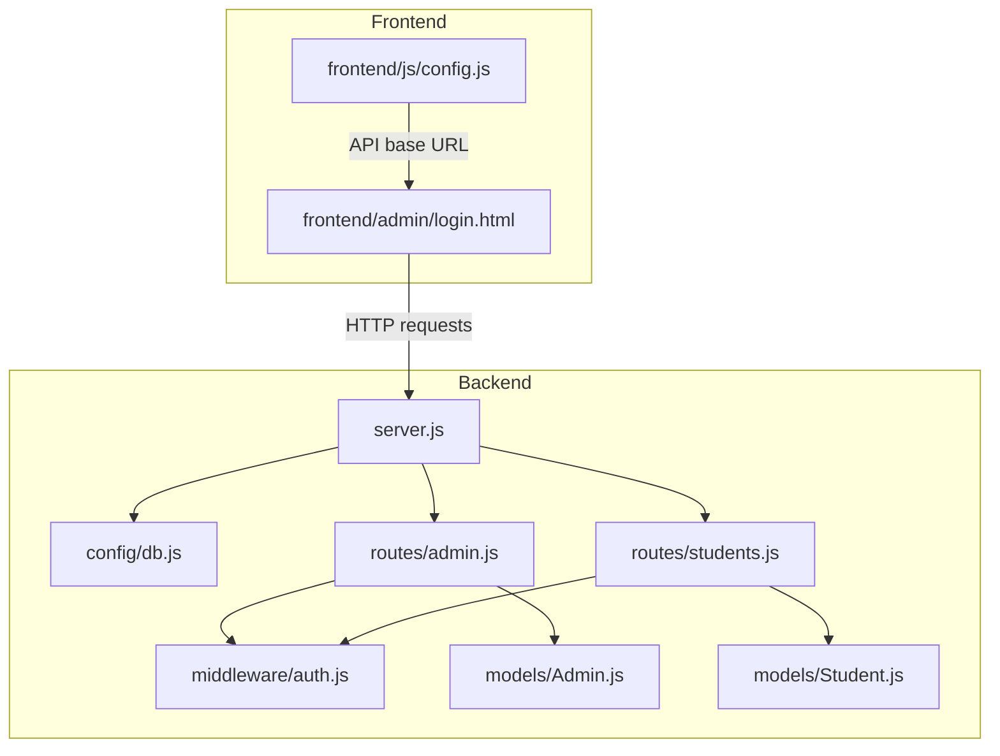
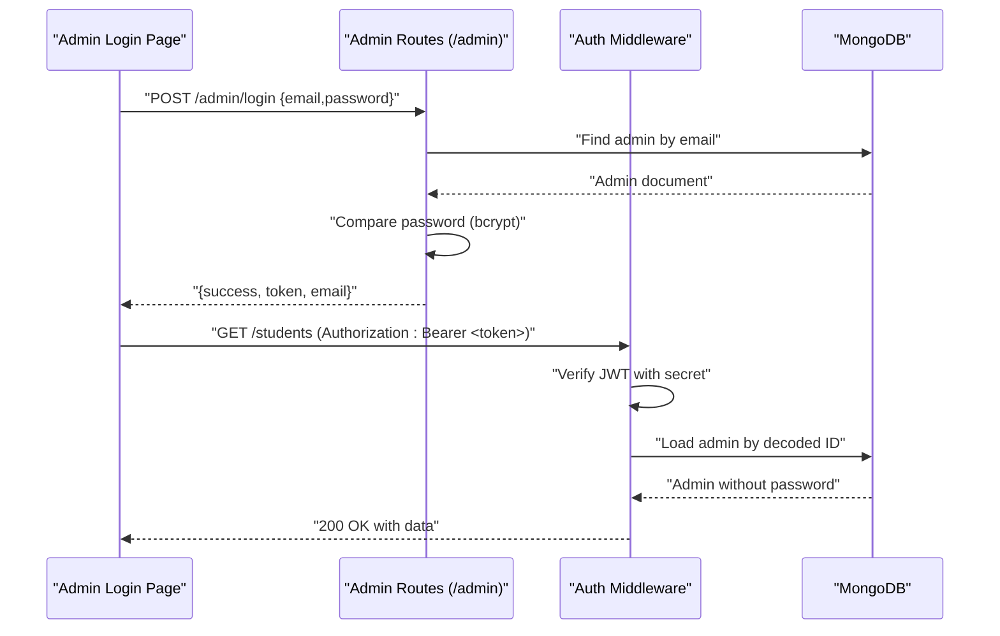
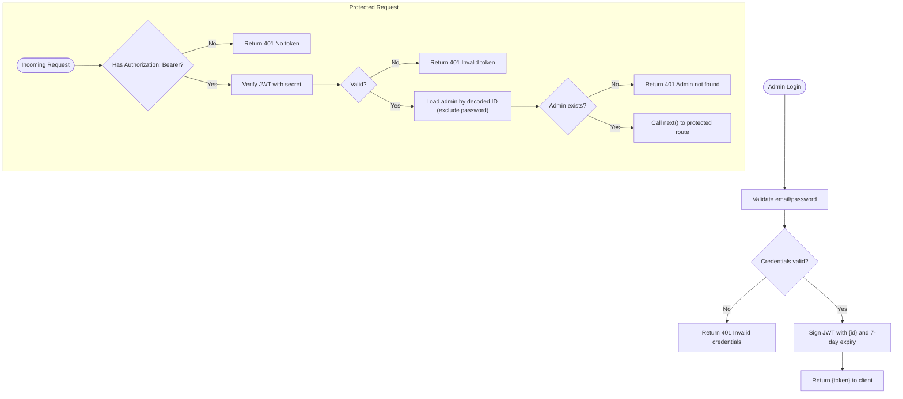
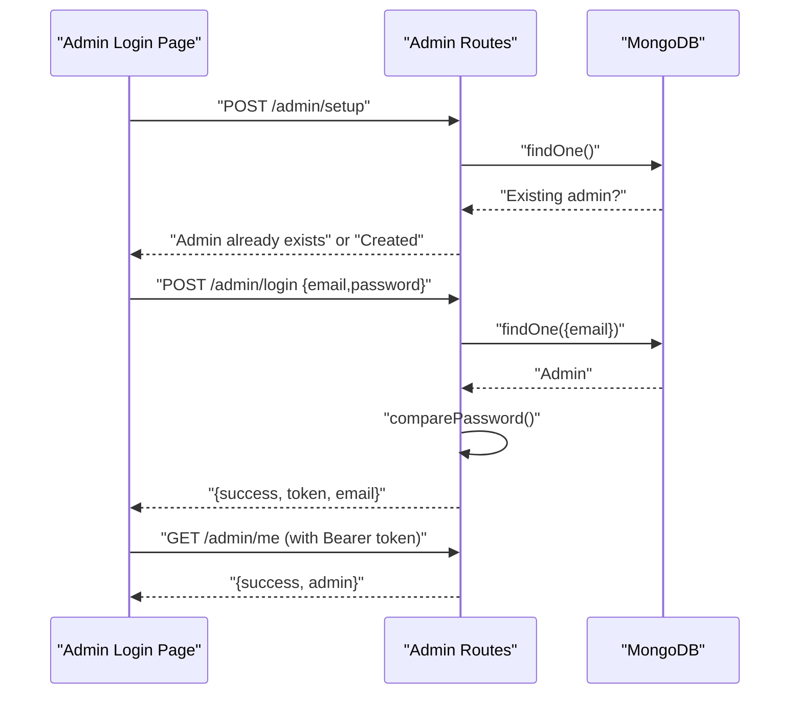
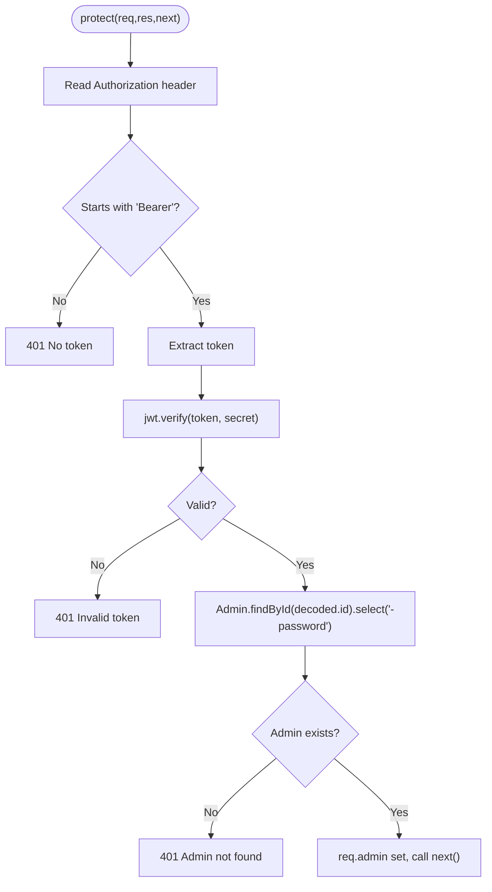
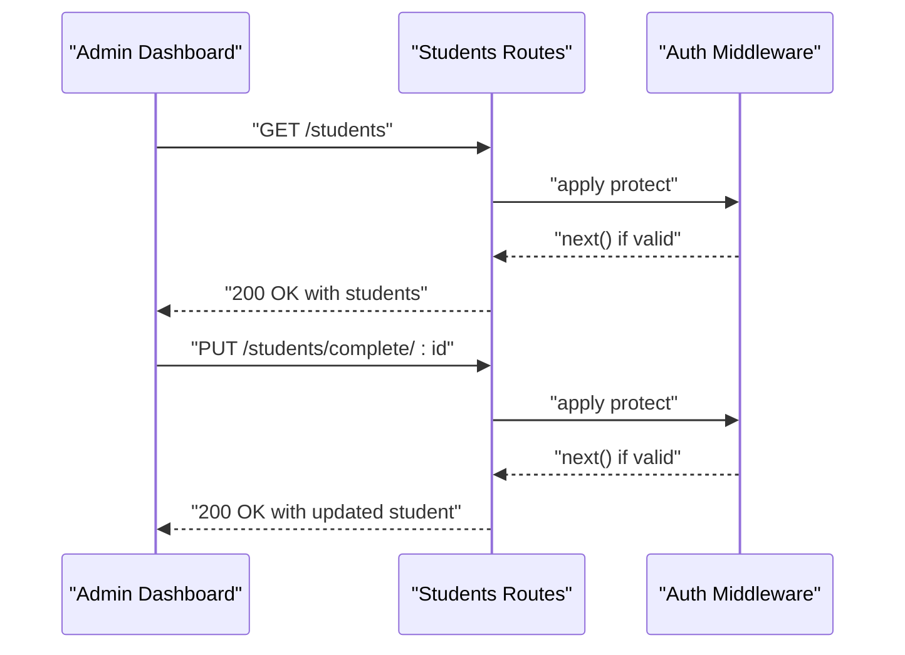
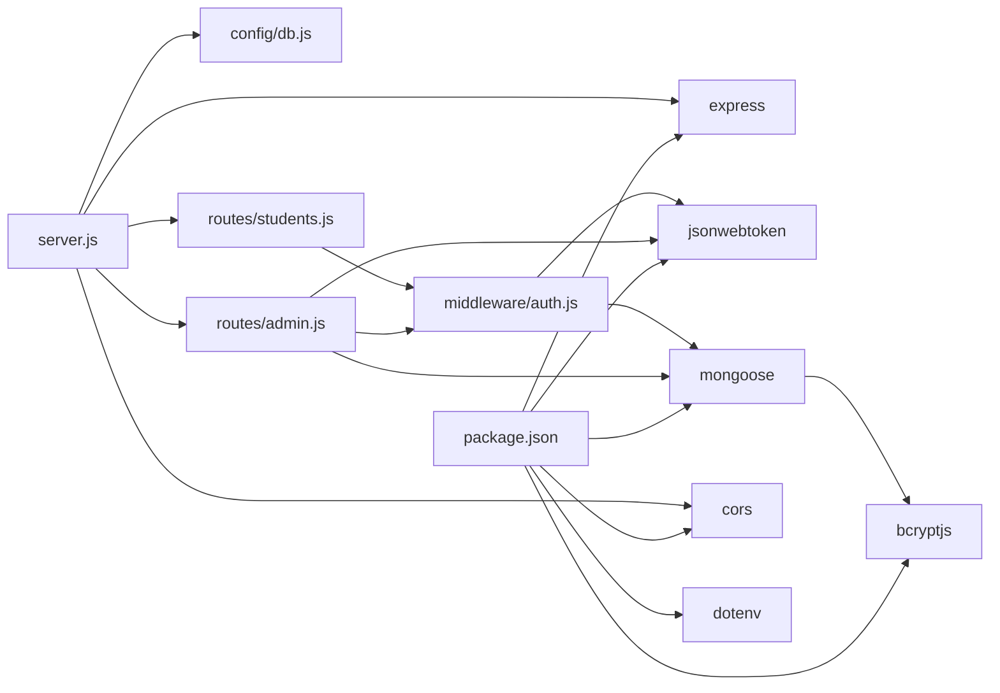

# Authentication System

<cite>
**Referenced Files in This Document**
- [server.js](file://jk-mobiles/backend/server.js)
- [db.js](file://jk-mobiles/backend/config/db.js)
- [auth.js](file://jk-mobiles/backend/middleware/auth.js)
- [admin.js](file://jk-mobiles/backend/routes/admin.js)
- [students.js](file://jk-mobiles/backend/routes/students.js)
- [Admin.js](file://jk-mobiles/backend/models/Admin.js)
- [Student.js](file://jk-mobiles/backend/models/Student.js)
- [login.html](file://jk-mobiles/frontend/admin/login.html)
- [config.js](file://jk-mobiles/frontend/js/config.js)
- [README.md](file://jk-mobiles/README.md)
- [render.yaml](file://jk-mobiles/backend/render.yaml)
- [package.json](file://jk-mobiles/backend/package.json)
</cite>

## Table of Contents
1. [Introduction](#introduction)
2. [Project Structure](#project-structure)
3. [Core Components](#core-components)
4. [Architecture Overview](#architecture-overview)
5. [Detailed Component Analysis](#detailed-component-analysis)
6. [Dependency Analysis](#dependency-analysis)
7. [Performance Considerations](#performance-considerations)
8. [Troubleshooting Guide](#troubleshooting-guide)
9. [Conclusion](#conclusion)
10. [Appendices](#appendices)

## Introduction
This document explains the JWT-based authentication system for JK Mobiles. It covers token generation and validation, admin authentication flow, middleware implementation, token structure and expiration, secure storage recommendations, protected route enforcement, error handling for unauthorized access, security considerations, token refresh strategies, and integration with frontend authentication workflows. It also documents password hashing with bcrypt, admin account setup, and session management patterns.

## Project Structure
The authentication system spans backend services, middleware, models, and frontend pages. The backend exposes admin login and protected routes, enforces JWT-based protection via middleware, and persists admin credentials securely using bcrypt. The frontend integrates with the backend using bearer tokens stored locally.

**Diagram sources**
- [server.js:1-52](file://jk-mobiles/backend/server.js#L1-L52)
- [db.js:1-17](file://jk-mobiles/backend/config/db.js#L1-L17)
- [auth.js:1-34](file://jk-mobiles/backend/middleware/auth.js#L1-L34)
- [admin.js:1-55](file://jk-mobiles/backend/routes/admin.js#L1-L55)
- [students.js:1-100](file://jk-mobiles/backend/routes/students.js#L1-L100)
- [Admin.js:1-34](file://jk-mobiles/backend/models/Admin.js#L1-L34)
- [Student.js:1-39](file://jk-mobiles/backend/models/Student.js#L1-L39)
- [login.html:1-377](file://jk-mobiles/frontend/admin/login.html#L1-L377)
- [config.js:1-34](file://jk-mobiles/frontend/js/config.js#L1-L34)

**Section sources**
- [README.md:106-127](file://jk-mobiles/README.md#L106-L127)
- [server.js:20-22](file://jk-mobiles/backend/server.js#L20-L22)

## Core Components
- JWT middleware: Extracts and validates the Authorization header, verifies the token against the secret, loads the admin, and enforces protected routes.
- Admin model: Defines admin schema, hashes passwords before save, and provides a password comparison method.
- Admin routes: Handles admin setup (one-time), login (JWT issuance), and profile verification.
- Students routes: Enforce JWT protection for administrative actions.
- Frontend integration: Sends login credentials, stores the JWT in local storage, and attaches the token to subsequent requests.

**Section sources**
- [auth.js:4-31](file://jk-mobiles/backend/middleware/auth.js#L4-L31)
- [Admin.js:21-31](file://jk-mobiles/backend/models/Admin.js#L21-L31)
- [admin.js:11-52](file://jk-mobiles/backend/routes/admin.js#L11-L52)
- [students.js:27-97](file://jk-mobiles/backend/routes/students.js#L27-L97)
- [login.html:312-374](file://jk-mobiles/frontend/admin/login.html#L312-L374)
- [config.js:10-20](file://jk-mobiles/frontend/js/config.js#L10-L20)

## Architecture Overview
The authentication flow consists of:
- Admin login: Frontend posts credentials to the backend.
- Backend validates credentials and issues a signed JWT with a fixed expiration.
- Frontend stores the token and sends it in Authorization headers for protected routes.
- Middleware verifies the token and loads the admin for protected endpoints.

**Diagram sources**
- [admin.js:28-47](file://jk-mobiles/backend/routes/admin.js#L28-L47)
- [auth.js:21-30](file://jk-mobiles/backend/middleware/auth.js#L21-L30)
- [Admin.js:28-31](file://jk-mobiles/backend/models/Admin.js#L28-L31)
- [students.js:27-35](file://jk-mobiles/backend/routes/students.js#L27-L35)

## Detailed Component Analysis

### JWT Token Generation and Validation
- Token generation:
  - The admin login endpoint signs a token containing the admin’s ObjectId and sets an expiration of seven days.
  - The signing secret is loaded from environment variables.
- Token validation:
  - The middleware extracts the Bearer token from the Authorization header.
  - It verifies the token signature using the same secret.
  - On success, it loads the admin record excluding the password field and attaches it to the request object.
  - On failure or missing token, it returns appropriate 401 responses.

**Diagram sources**
- [admin.js:7-9](file://jk-mobiles/backend/routes/admin.js#L7-L9)
- [admin.js:28-47](file://jk-mobiles/backend/routes/admin.js#L28-L47)
- [auth.js:7-30](file://jk-mobiles/backend/middleware/auth.js#L7-L30)
- [Admin.js:28-31](file://jk-mobiles/backend/models/Admin.js#L28-L31)

**Section sources**
- [admin.js:7-9](file://jk-mobiles/backend/routes/admin.js#L7-L9)
- [admin.js:28-47](file://jk-mobiles/backend/routes/admin.js#L28-L47)
- [auth.js:4-31](file://jk-mobiles/backend/middleware/auth.js#L4-L31)

### Admin Authentication Flow
- Setup:
  - The setup endpoint creates the first admin if none exists, using environment-provided defaults.
- Login:
  - Validates presence of email and password.
  - Finds admin by normalized email and compares password using bcrypt.
  - Returns a signed JWT upon successful authentication.
- Profile verification:
  - The protected route returns the current admin’s information.

**Diagram sources**
- [admin.js:11-26](file://jk-mobiles/backend/routes/admin.js#L11-L26)
- [admin.js:28-52](file://jk-mobiles/backend/routes/admin.js#L28-L52)
- [Admin.js:28-31](file://jk-mobiles/backend/models/Admin.js#L28-L31)

**Section sources**
- [admin.js:11-26](file://jk-mobiles/backend/routes/admin.js#L11-L26)
- [admin.js:28-52](file://jk-mobiles/backend/routes/admin.js#L28-L52)
- [Admin.js:21-31](file://jk-mobiles/backend/models/Admin.js#L21-L31)

### Authentication Middleware Implementation
- Extracts token from Authorization header.
- Verifies token signature.
- Loads admin from database and attaches to request.
- Enforces protected routes by calling next() only on success.

**Diagram sources**
- [auth.js:4-31](file://jk-mobiles/backend/middleware/auth.js#L4-L31)

**Section sources**
- [auth.js:4-31](file://jk-mobiles/backend/middleware/auth.js#L4-L31)

### Protected Route Enforcement
- Students routes apply the auth middleware to enforce JWT-based access control for administrative operations:
  - List all students.
  - Mark a student as completed.
  - Fetch dashboard statistics.

**Diagram sources**
- [students.js:27-35](file://jk-mobiles/backend/routes/students.js#L27-L35)
- [students.js:38-54](file://jk-mobiles/backend/routes/students.js#L38-L54)
- [students.js:87-97](file://jk-mobiles/backend/routes/students.js#L87-L97)
- [auth.js:4-31](file://jk-mobiles/backend/middleware/auth.js#L4-L31)

**Section sources**
- [students.js:27-35](file://jk-mobiles/backend/routes/students.js#L27-L35)
- [students.js:38-54](file://jk-mobiles/backend/routes/students.js#L38-L54)
- [students.js:87-97](file://jk-mobiles/backend/routes/students.js#L87-L97)

### Token Structure and Expiration Handling
- Token payload: Contains the admin’s ObjectId.
- Expiration: Seven days.
- Secret: Loaded from environment variable for signing and verification.

**Section sources**
- [admin.js:7-9](file://jk-mobiles/backend/routes/admin.js#L7-L9)
- [auth.js:22](file://jk-mobiles/backend/middleware/auth.js#L22)

### Secure Storage Recommendations
- Frontend stores the JWT in local storage.
- Best practice recommendations:
  - Prefer HttpOnly cookies for production to mitigate XSS risks.
  - Store tokens in memory only during active sessions.
  - Use short-lived tokens with refresh mechanisms.
  - Enforce Content Security Policy and HTTPS.

**Section sources**
- [login.html:360-362](file://jk-mobiles/frontend/admin/login.html#L360-L362)

### Session Management Patterns
- Stateless JWT: The backend does not maintain server-side session state.
- Frontend manages session by storing the token and attaching it to requests.
- Logout is performed by clearing local storage on the client.

**Section sources**
- [login.html:317-319](file://jk-mobiles/frontend/admin/login.html#L317-L319)

### Password Hashing with Bcrypt
- Pre-save hook hashes the password with a cost factor before persisting.
- Password comparison uses bcrypt compare during login.

**Section sources**
- [Admin.js:21-31](file://jk-mobiles/backend/models/Admin.js#L21-L31)

### Admin Account Setup
- One-time setup endpoint creates the first admin using environment-provided defaults.
- After initial setup, change the default credentials via environment variables and rerun setup (only if no admin exists yet).

**Section sources**
- [admin.js:11-26](file://jk-mobiles/backend/routes/admin.js#L11-L26)
- [README.md:80-83](file://jk-mobiles/README.md#L80-L83)
- [README.md:150](file://jk-mobiles/README.md#L150)

### Frontend Authentication Integration
- Login page posts credentials to the backend and stores the returned token and email in local storage.
- API helper attaches the Bearer token to all authenticated requests.

**Section sources**
- [login.html:336-374](file://jk-mobiles/frontend/admin/login.html#L336-L374)
- [config.js:10-20](file://jk-mobiles/frontend/js/config.js#L10-L20)

## Dependency Analysis
The authentication system relies on:
- Express for routing and middleware.
- jsonwebtoken for JWT signing and verification.
- bcryptjs for password hashing.
- Mongoose for admin and student models.
- dotenv for environment variables.
- CORS enabled for cross-origin requests.

**Diagram sources**
- [package.json:10-16](file://jk-mobiles/backend/package.json#L10-L16)
- [server.js:1-52](file://jk-mobiles/backend/server.js#L1-L52)
- [admin.js:1-55](file://jk-mobiles/backend/routes/admin.js#L1-L55)
- [students.js:1-100](file://jk-mobiles/backend/routes/students.js#L1-L100)
- [auth.js:1-34](file://jk-mobiles/backend/middleware/auth.js#L1-L34)
- [Admin.js:1-34](file://jk-mobiles/backend/models/Admin.js#L1-L34)

**Section sources**
- [package.json:10-16](file://jk-mobiles/backend/package.json#L10-L16)
- [server.js:1-52](file://jk-mobiles/backend/server.js#L1-L52)

## Performance Considerations
- Token verification is lightweight and CPU-bound only for signature checks.
- Avoid excessive middleware overhead by applying protect only to necessary routes.
- Consider rate limiting login attempts to mitigate brute-force attacks.
- Keep JWT payload minimal to reduce header size.

## Troubleshooting Guide
Common issues and resolutions:
- Missing Authorization header:
  - Symptom: 401 Not authorized. No token provided.
  - Resolution: Ensure the frontend attaches Authorization: Bearer <token>.
- Invalid token:
  - Symptom: 401 Token is invalid.
  - Resolution: Regenerate token via login; verify JWT_SECRET matches backend.
- Admin not found:
  - Symptom: 401 Admin not found.
  - Resolution: Confirm admin still exists in database; re-authenticate.
- Login failures:
  - Symptom: 401 Invalid email or password.
  - Resolution: Verify credentials; ensure bcrypt-compat password was hashed.

**Section sources**
- [auth.js:14-30](file://jk-mobiles/backend/middleware/auth.js#L14-L30)
- [admin.js:33-40](file://jk-mobiles/backend/routes/admin.js#L33-L40)

## Conclusion
JK Mobiles employs a straightforward, stateless JWT authentication system with bcrypt-based password storage. The backend enforces protection via middleware, while the frontend manages tokens client-side. For production, consider cookie-based tokens, refresh strategies, and stricter CSP policies.

## Appendices

### Environment Variables
- Required keys for deployment:
  - MONGODB_URI
  - JWT_SECRET
  - ADMIN_EMAIL
  - ADMIN_PASSWORD
  - PORT

**Section sources**
- [README.md:68-76](file://jk-mobiles/README.md#L68-L76)
- [render.yaml:7-17](file://jk-mobiles/backend/render.yaml#L7-L17)

### API Endpoints Reference
- Public endpoints:
  - POST /students/add
  - GET /students/certificate/:phone
  - POST /admin/login
  - POST /admin/setup
- Protected endpoints (requires Authorization: Bearer <token>):
  - GET /students
  - GET /students/stats/overview
  - PUT /students/complete/:id
  - GET /admin/me

**Section sources**
- [README.md:108-127](file://jk-mobiles/README.md#L108-L127)