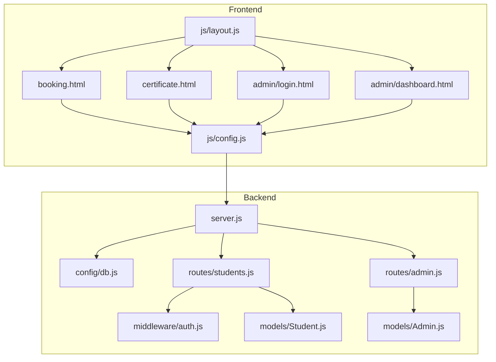
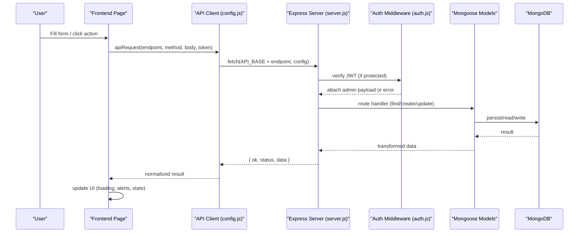
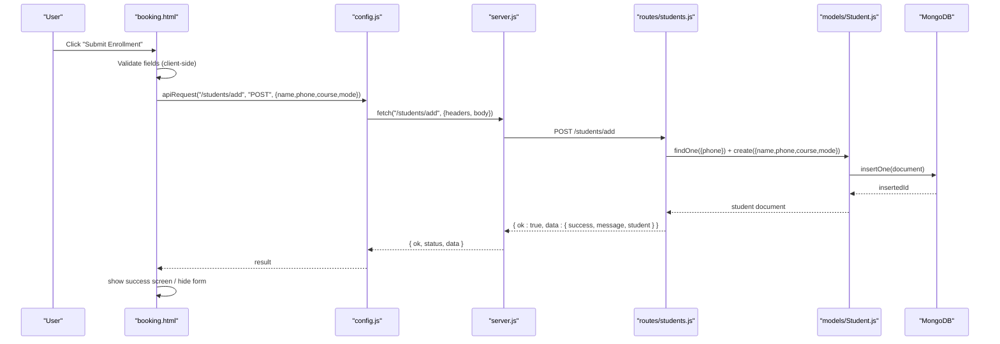
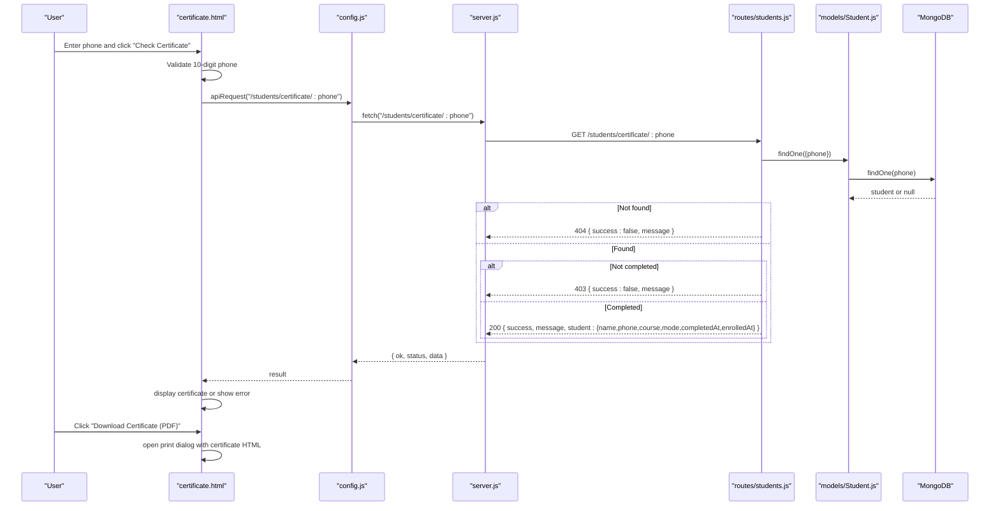
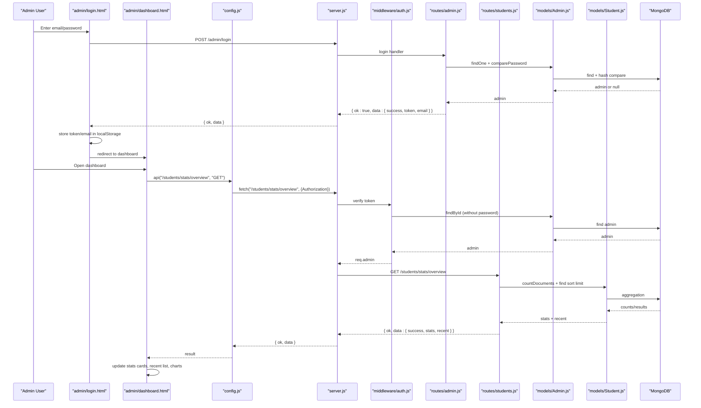
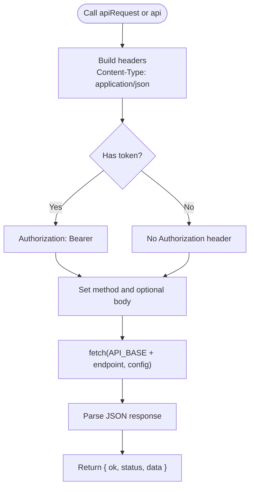
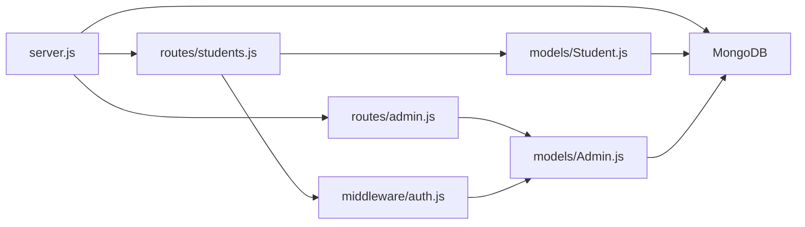

# Data Flow

<cite>
**Referenced Files in This Document**
- [server.js](file://jk-mobiles/backend/server.js)
- [db.js](file://jk-mobiles/backend/config/db.js)
- [auth.js](file://jk-mobiles/backend/middleware/auth.js)
- [Student.js](file://jk-mobiles/backend/models/Student.js)
- [Admin.js](file://jk-mobiles/backend/models/Admin.js)
- [students.js](file://jk-mobiles/backend/routes/students.js)
- [admin.js](file://jk-mobiles/backend/routes/admin.js)
- [config.js](file://jk-mobiles/frontend/js/config.js)
- [layout.js](file://jk-mobiles/frontend/js/layout.js)
- [booking.html](file://jk-mobiles/frontend/booking.html)
- [certificate.html](file://jk-mobiles/frontend/certificate.html)
- [login.html](file://jk-mobiles/frontend/admin/login.html)
- [dashboard.html](file://jk-mobiles/frontend/admin/dashboard.html)
- [README.md](file://jk-mobiles/README.md)
</cite>

## Table of Contents
1. [Introduction](#introduction)
2. [Project Structure](#project-structure)
3. [Core Components](#core-components)
4. [Architecture Overview](#architecture-overview)
5. [Detailed Component Analysis](#detailed-component-analysis)
6. [Dependency Analysis](#dependency-analysis)
7. [Performance Considerations](#performance-considerations)
8. [Troubleshooting Guide](#troubleshooting-guide)
9. [Conclusion](#conclusion)

## Introduction
This document explains the complete data flow for JK Mobiles system interactions across frontend forms, API endpoints, database persistence, and frontend responses. It covers:
- Student enrollment flow from form submission to database persistence and success feedback
- Certificate verification process from phone lookup to certificate rendering and PDF download
- Administrative dashboard data handling, including JWT-protected requests, asynchronous loading, and state updates
- Frontend API client implementation, request/response transformations, error propagation, and user feedback mechanisms

## Project Structure
The system comprises:
- Backend: Express server, Mongoose models, JWT-protected routes, and authentication middleware
- Frontend: Static pages with shared layout injection, API clients, and interactive UI flows

**Diagram sources**
- [server.js:1-52](file://jk-mobiles/backend/server.js#L1-L52)
- [db.js:1-17](file://jk-mobiles/backend/config/db.js#L1-L17)
- [auth.js:1-34](file://jk-mobiles/backend/middleware/auth.js#L1-L34)
- [Student.js:1-39](file://jk-mobiles/backend/models/Student.js#L1-L39)
- [Admin.js:1-34](file://jk-mobiles/backend/models/Admin.js#L1-L34)
- [students.js:1-100](file://jk-mobiles/backend/routes/students.js#L1-L100)
- [admin.js:1-55](file://jk-mobiles/backend/routes/admin.js#L1-L55)
- [config.js:1-34](file://jk-mobiles/frontend/js/config.js#L1-L34)
- [layout.js:1-69](file://jk-mobiles/frontend/js/layout.js#L1-L69)
- [booking.html:266-326](file://jk-mobiles/frontend/booking.html#L266-L326)
- [certificate.html:267-375](file://jk-mobiles/frontend/certificate.html#L267-L375)
- [login.html:312-377](file://jk-mobiles/frontend/admin/login.html#L312-L377)
- [dashboard.html:954-1246](file://jk-mobiles/frontend/admin/dashboard.html#L954-L1246)

**Section sources**
- [README.md:1-200](file://jk-mobiles/README.md#L1-L200)
- [server.js:1-52](file://jk-mobiles/backend/server.js#L1-L52)

## Core Components
- Frontend API client: Centralized fetch wrapper with token support and standardized response shape
- Authentication middleware: JWT verification for protected routes
- Models: Student and Admin schemas with validation and hashing
- Routes: Public and protected endpoints for enrollment, certificate lookup, admin login, and dashboard stats
- Frontend pages: Booking form, certificate portal, admin login, and admin dashboard with state management and user feedback

**Section sources**
- [config.js:1-34](file://jk-mobiles/frontend/js/config.js#L1-L34)
- [auth.js:1-34](file://jk-mobiles/backend/middleware/auth.js#L1-L34)
- [Student.js:1-39](file://jk-mobiles/backend/models/Student.js#L1-L39)
- [Admin.js:1-34](file://jk-mobiles/backend/models/Admin.js#L1-L34)
- [students.js:1-100](file://jk-mobiles/backend/routes/students.js#L1-L100)
- [admin.js:1-55](file://jk-mobiles/backend/routes/admin.js#L1-L55)

## Architecture Overview
The system follows a RESTful pattern with JWT-based admin authentication. Requests flow from frontend pages through the API client to Express routes, validated by middleware, persisted via Mongoose models, and returned to the UI with consistent response envelopes.

**Diagram sources**
- [config.js:10-20](file://jk-mobiles/frontend/js/config.js#L10-L20)
- [server.js:20-46](file://jk-mobiles/backend/server.js#L20-L46)
- [auth.js:4-31](file://jk-mobiles/backend/middleware/auth.js#L4-L31)
- [Student.js:1-39](file://jk-mobiles/backend/models/Student.js#L1-L39)
- [Admin.js:1-34](file://jk-mobiles/backend/models/Admin.js#L1-L34)

## Detailed Component Analysis

### Student Enrollment Flow
End-to-end data journey from form submission to success screen and backend persistence.

Key behaviors:
- Client-side validation ensures required fields and phone format
- Loading states disabled button and spinner during request
- Success toggles form visibility and shows success screen
- Error messages are surfaced via alerts

**Diagram sources**
- [booking.html:286-322](file://jk-mobiles/frontend/booking.html#L286-L322)
- [config.js:10-20](file://jk-mobiles/frontend/js/config.js#L10-L20)
- [students.js:6-25](file://jk-mobiles/backend/routes/students.js#L6-L25)
- [Student.js:3-36](file://jk-mobiles/backend/models/Student.js#L3-L36)

**Section sources**
- [booking.html:286-322](file://jk-mobiles/frontend/booking.html#L286-L322)
- [config.js:10-20](file://jk-mobiles/frontend/js/config.js#L10-L20)
- [students.js:6-25](file://jk-mobiles/backend/routes/students.js#L6-L25)
- [Student.js:3-36](file://jk-mobiles/backend/models/Student.js#L3-L36)

### Certificate Verification Process
Phone-based lookup and certificate rendering with gated access until completion.

User feedback:
- Alerts for validation errors and lookup failures
- Smooth scroll to certificate card upon success
- Print dialog opens for PDF generation

**Diagram sources**
- [certificate.html:280-310](file://jk-mobiles/frontend/certificate.html#L280-L310)
- [config.js:10-20](file://jk-mobiles/frontend/js/config.js#L10-L20)
- [students.js:56-84](file://jk-mobiles/backend/routes/students.js#L56-L84)
- [Student.js:3-36](file://jk-mobiles/backend/models/Student.js#L3-L36)

**Section sources**
- [certificate.html:280-310](file://jk-mobiles/frontend/certificate.html#L280-L310)
- [config.js:10-20](file://jk-mobiles/frontend/js/config.js#L10-L20)
- [students.js:56-84](file://jk-mobiles/backend/routes/students.js#L56-L84)

### Administrative Dashboard Data Handling
Protected routes, JWT authentication, asynchronous loading, and state updates.

Asynchronous patterns:
- Parallel loading of stats and student lists
- Token-based auth guard with automatic logout on 401
- Toast notifications for user feedback
- Search/filter applied client-side against loaded dataset

**Diagram sources**
- [login.html:336-373](file://jk-mobiles/frontend/admin/login.html#L336-L373)
- [dashboard.html:985-1035](file://jk-mobiles/frontend/admin/dashboard.html#L985-L1035)
- [config.js:10-20](file://jk-mobiles/frontend/js/config.js#L10-L20)
- [server.js:20-46](file://jk-mobiles/backend/server.js#L20-L46)
- [auth.js:4-31](file://jk-mobiles/backend/middleware/auth.js#L4-L31)
- [admin.js:28-52](file://jk-mobiles/backend/routes/admin.js#L28-L52)
- [students.js:86-97](file://jk-mobiles/backend/routes/students.js#L86-L97)
- [Admin.js:21-31](file://jk-mobiles/backend/models/Admin.js#L21-L31)
- [Student.js:3-36](file://jk-mobiles/backend/models/Student.js#L3-L36)

**Section sources**
- [login.html:336-373](file://jk-mobiles/frontend/admin/login.html#L336-L373)
- [dashboard.html:985-1035](file://jk-mobiles/frontend/admin/dashboard.html#L985-L1035)
- [auth.js:4-31](file://jk-mobiles/backend/middleware/auth.js#L4-L31)
- [admin.js:28-52](file://jk-mobiles/backend/routes/admin.js#L28-L52)
- [students.js:86-97](file://jk-mobiles/backend/routes/students.js#L86-L97)

### Frontend API Client Implementation
Centralized request helper with token injection and standardized response parsing.

Response formatting and error propagation:
- Consistent envelope with ok/status/data
- 401 triggers token removal and redirect in dashboard
- UI surfaces errors via alerts and toasts

**Diagram sources**
- [config.js:10-20](file://jk-mobiles/frontend/js/config.js#L10-L20)
- [dashboard.html:985-996](file://jk-mobiles/frontend/admin/dashboard.html#L985-L996)

**Section sources**
- [config.js:10-20](file://jk-mobiles/frontend/js/config.js#L10-L20)
- [dashboard.html:985-996](file://jk-mobiles/frontend/admin/dashboard.html#L985-L996)

### Data Validation Flows
Client-side and server-side validation ensure data integrity.

- Client-side (booking):
  - Required fields presence
  - Phone format validation (10 digits)
- Server-side (students):
  - Presence checks for required fields
  - Unique phone constraint enforced by model and route logic
- Server-side (admin login):
  - Email/password presence
  - Admin existence and password comparison via bcrypt

**Section sources**
- [booking.html:292-297](file://jk-mobiles/frontend/booking.html#L292-L297)
- [students.js:11-18](file://jk-mobiles/backend/routes/students.js#L11-L18)
- [Student.js:4-14](file://jk-mobiles/backend/models/Student.js#L4-L14)
- [admin.js:33-40](file://jk-mobiles/backend/routes/admin.js#L33-L40)
- [Admin.js:21-31](file://jk-mobiles/backend/models/Admin.js#L21-L31)

### Frontend State Management and User Feedback
- Booking page: toggles success screen, shows alerts, manages loading states
- Certificate page: displays certificate card, prints to PDF via browser print dialog
- Admin dashboard: maintains local state (allStudents), renders tables, shows toasts, and handles token-based auth

**Section sources**
- [booking.html:170-322](file://jk-mobiles/frontend/booking.html#L170-L322)
- [certificate.html:280-310](file://jk-mobiles/frontend/certificate.html#L280-L310)
- [dashboard.html:975-1035](file://jk-mobiles/frontend/admin/dashboard.html#L975-L1035)

## Dependency Analysis
Backend dependencies and relationships:

Frontend dependencies:
- Shared layout injection via [layout.js:63-68](file://jk-mobiles/frontend/js/layout.js#L63-L68)
- API client used across pages

**Diagram sources**
- [server.js:1-52](file://jk-mobiles/backend/server.js#L1-L52)
- [db.js:1-17](file://jk-mobiles/backend/config/db.js#L1-L17)
- [auth.js:1-34](file://jk-mobiles/backend/middleware/auth.js#L1-L34)
- [Student.js:1-39](file://jk-mobiles/backend/models/Student.js#L1-L39)
- [Admin.js:1-34](file://jk-mobiles/backend/models/Admin.js#L1-L34)
- [students.js:1-100](file://jk-mobiles/backend/routes/students.js#L1-L100)
- [admin.js:1-55](file://jk-mobiles/backend/routes/admin.js#L1-L55)
- [layout.js:63-68](file://jk-mobiles/frontend/js/layout.js#L63-L68)

**Section sources**
- [server.js:1-52](file://jk-mobiles/backend/server.js#L1-L52)
- [auth.js:1-34](file://jk-mobiles/backend/middleware/auth.js#L1-L34)
- [students.js:1-100](file://jk-mobiles/backend/routes/students.js#L1-L100)
- [admin.js:1-55](file://jk-mobiles/backend/routes/admin.js#L1-L55)
- [layout.js:63-68](file://jk-mobiles/frontend/js/layout.js#L63-L68)

## Performance Considerations
- Asynchronous loading: Dashboard uses Promise.all for concurrent stats and student list loads
- Client-side filtering: Search and filters operate on loaded datasets to reduce server requests
- Minimal DOM updates: Batched rendering for tables and charts
- Token reuse: Local storage avoids repeated logins during session

[No sources needed since this section provides general guidance]

## Troubleshooting Guide
Common issues and resolutions:
- Network errors: Check API base URL and CORS configuration; ensure backend is reachable
- 401 Unauthorized: Verify JWT token presence and validity; dashboard auto-redirects on 401
- Duplicate phone number: Enrollment route prevents duplicates; inform user to use another number
- Certificate not available: Ensure admin marks student as completed; otherwise certificate endpoint denies access
- Admin initialization: Run setup endpoint once to create admin credentials

**Section sources**
- [config.js:10-20](file://jk-mobiles/frontend/js/config.js#L10-L20)
- [dashboard.html:985-996](file://jk-mobiles/frontend/admin/dashboard.html#L985-L996)
- [students.js:11-18](file://jk-mobiles/backend/routes/students.js#L11-L18)
- [students.js:65-67](file://jk-mobiles/backend/routes/students.js#L65-L67)
- [admin.js:12-26](file://jk-mobiles/backend/routes/admin.js#L12-L26)

## Conclusion
JK Mobiles implements a clean separation of concerns with a straightforward data flow:
- Frontend pages use a centralized API client to communicate with Express routes
- Admin authentication is handled via JWT with middleware protection
- Data validation occurs both client-side and server-side
- Asynchronous patterns and user feedback mechanisms provide a smooth UX
- The dashboard aggregates data efficiently and enables administrative actions

[No sources needed since this section summarizes without analyzing specific files]