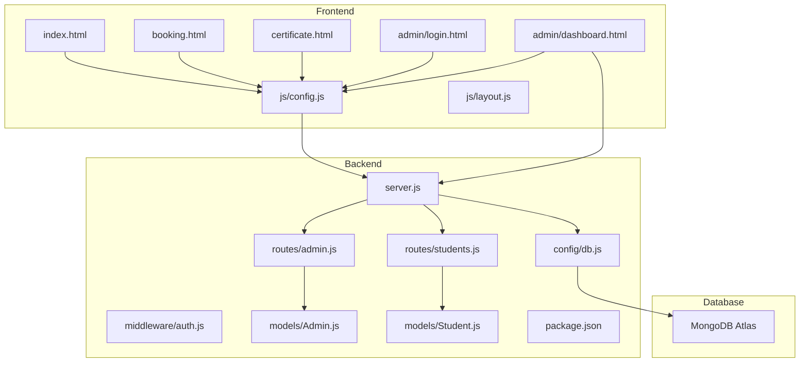
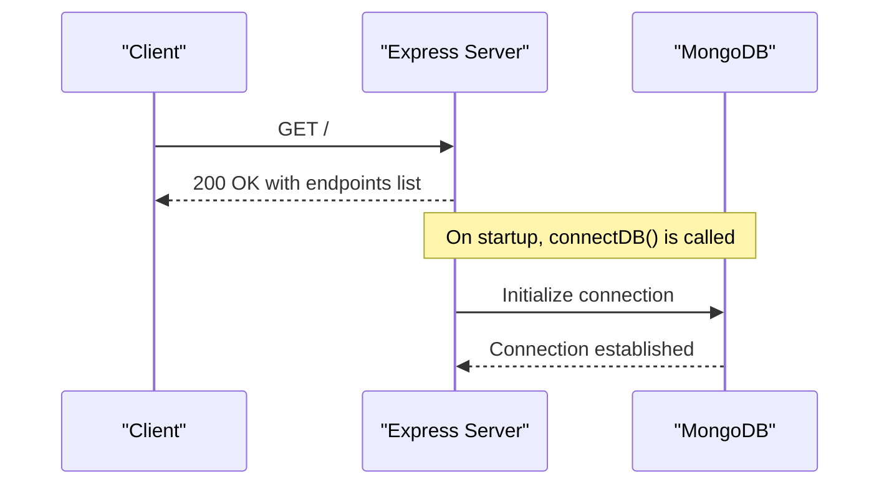
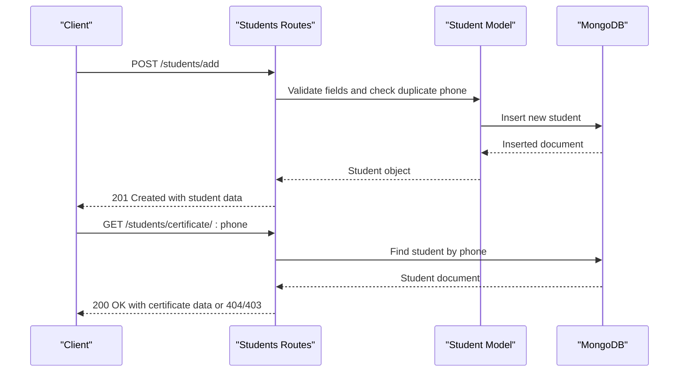
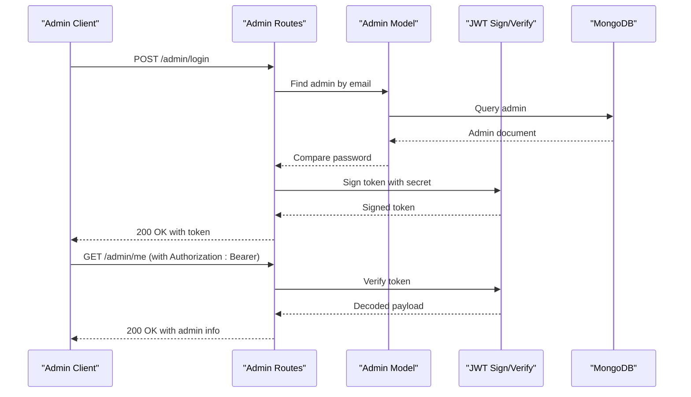
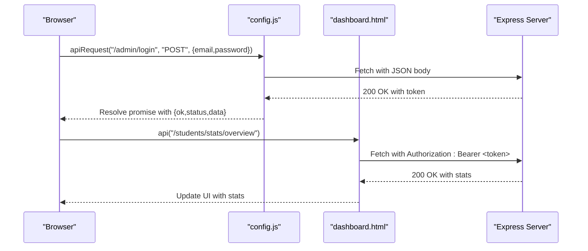
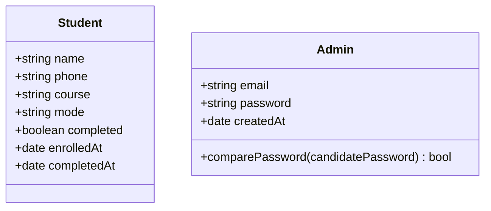
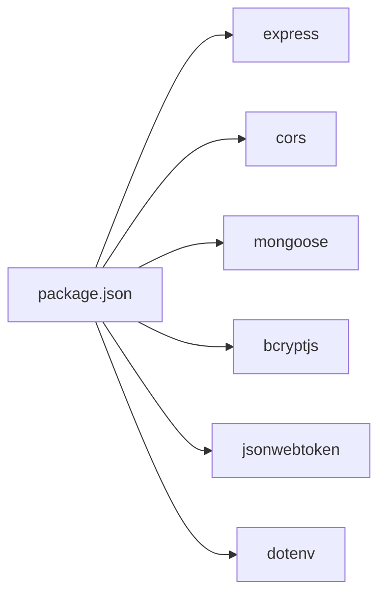
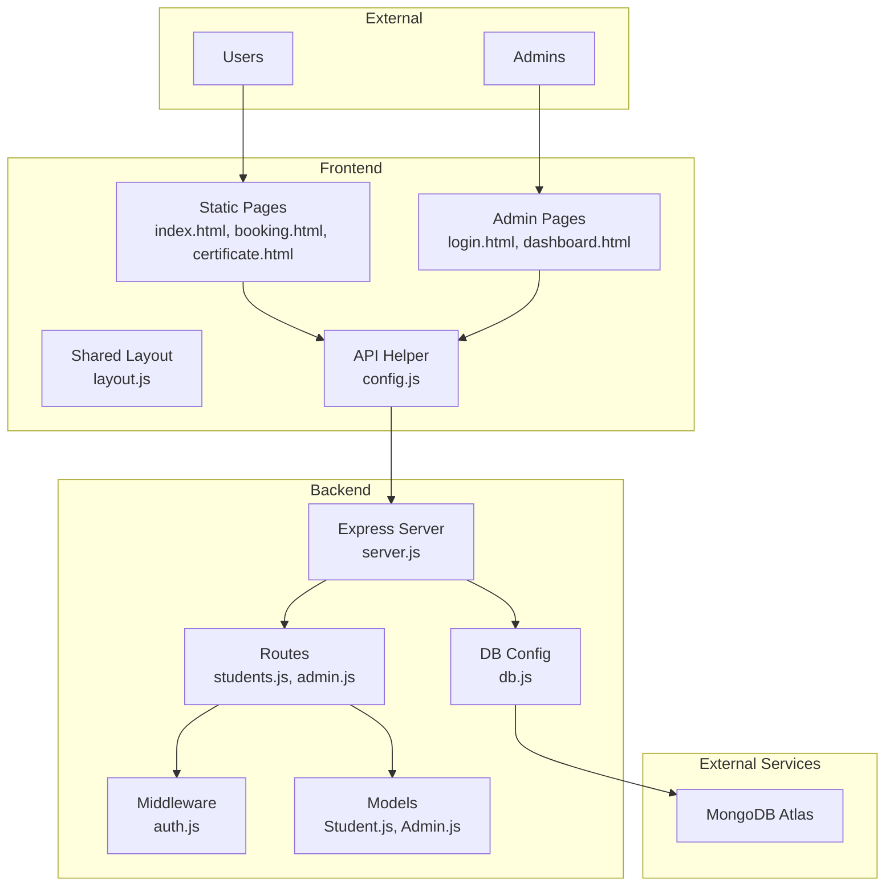

# System Design

<cite>
**Referenced Files in This Document**
- [server.js](file://jk-mobiles/backend/server.js)
- [package.json](file://jk-mobiles/backend/package.json)
- [db.js](file://jk-mobiles/backend/config/db.js)
- [auth.js](file://jk-mobiles/backend/middleware/auth.js)
- [Admin.js](file://jk-mobiles/backend/models/Admin.js)
- [Student.js](file://jk-mobiles/backend/models/Student.js)
- [students.js](file://jk-mobiles/backend/routes/students.js)
- [admin.js](file://jk-mobiles/backend/routes/admin.js)
- [config.js](file://jk-mobiles/frontend/js/config.js)
- [layout.js](file://jk-mobiles/frontend/js/layout.js)
- [login.html](file://jk-mobiles/frontend/admin/login.html)
- [dashboard.html](file://jk-mobiles/frontend/admin/dashboard.html)
- [index.html](file://jk-mobiles/frontend/index.html)
- [booking.html](file://jk-mobiles/frontend/booking.html)
- [certificate.html](file://jk-mobiles/frontend/certificate.html)
- [README.md](file://jk-mobiles/README.md)
</cite>

## Table of Contents
1. [Introduction](#introduction)
2. [Project Structure](#project-structure)
3. [Core Components](#core-components)
4. [Architecture Overview](#architecture-overview)
5. [Detailed Component Analysis](#detailed-component-analysis)
6. [Dependency Analysis](#dependency-analysis)
7. [Performance Considerations](#performance-considerations)
8. [Troubleshooting Guide](#troubleshooting-guide)
9. [Conclusion](#conclusion)
10. [Appendices](#appendices)

## Introduction
This document describes the system design for JK Mobiles, a full-stack web application for a training institute. The system follows a three-tier architecture:
- Frontend: Static HTML/CSS/JavaScript (Vanilla JS) pages served by a static hosting platform.
- Backend: Node.js/Express API providing REST endpoints for student enrollment, certificates, and admin management.
- Database: MongoDB Atlas (Mongoose ODM) storing student and admin records.

The system emphasizes simplicity, scalability, and maintainability. It uses JWT-based authentication for admin access, CORS for cross-origin requests, and environment-driven configuration for deployment flexibility.

## Project Structure
The repository is organized into two primary folders:
- backend: Express server, routes, middleware, models, and configuration.
- frontend: Static pages (HTML/CSS/JS), shared layout injection, and admin portal.

**Diagram sources**
- [server.js:1-52](file://jk-mobiles/backend/server.js#L1-L52)
- [students.js:1-100](file://jk-mobiles/backend/routes/students.js#L1-L100)
- [admin.js:1-55](file://jk-mobiles/backend/routes/admin.js#L1-L55)
- [auth.js:1-34](file://jk-mobiles/backend/middleware/auth.js#L1-L34)
- [Admin.js:1-34](file://jk-mobiles/backend/models/Admin.js#L1-L34)
- [Student.js:1-39](file://jk-mobiles/backend/models/Student.js#L1-L39)
- [db.js:1-17](file://jk-mobiles/backend/config/db.js#L1-L17)
- [config.js:1-33](file://jk-mobiles/frontend/js/config.js#L1-L33)
- [layout.js:1-69](file://jk-mobiles/frontend/js/layout.js#L1-L69)
- [login.html:1-376](file://jk-mobiles/frontend/admin/login.html#L1-L376)
- [dashboard.html:1-1233](file://jk-mobiles/frontend/admin/dashboard.html#L1-L1233)
- [index.html:1-642](file://jk-mobiles/frontend/index.html#L1-L642)
- [booking.html:1-326](file://jk-mobiles/frontend/booking.html#L1-L326)
- [certificate.html:1-375](file://jk-mobiles/frontend/certificate.html#L1-L375)

**Section sources**
- [README.md:7-42](file://jk-mobiles/README.md#L7-L42)
- [server.js:1-52](file://jk-mobiles/backend/server.js#L1-L52)
- [package.json:1-22](file://jk-mobiles/backend/package.json#L1-L22)

## Core Components
- Express server: Initializes middleware, connects to MongoDB, registers routes, and exposes health and error handlers.
- Routes:
  - Students: Enrollment, listing, completion marking, certificate retrieval, and dashboard statistics.
  - Admin: Setup, login, and protected profile verification.
- Middleware:
  - Authentication: Validates JWT tokens for admin-protected endpoints.
- Models:
  - Student: Schema with required fields, enums, and timestamps.
  - Admin: Schema with hashed passwords and pre-save hashing hook.
- Frontend:
  - Shared layout injection for navigation and footer.
  - API helper to centralize HTTP requests and token handling.
  - Admin portal with JWT-based authentication and protected navigation.

Key implementation references:
- Server bootstrap and middleware: [server.js:1-52](file://jk-mobiles/backend/server.js#L1-L52)
- CORS configuration: [server.js:12-16](file://jk-mobiles/backend/server.js#L12-L16)
- MongoDB connection: [db.js:1-17](file://jk-mobiles/backend/config/db.js#L1-L17)
- Admin auth middleware: [auth.js:1-34](file://jk-mobiles/backend/middleware/auth.js#L1-L34)
- Student model: [Student.js:1-39](file://jk-mobiles/backend/models/Student.js#L1-L39)
- Admin model: [Admin.js:1-34](file://jk-mobiles/backend/models/Admin.js#L1-L34)
- Students routes: [students.js:1-100](file://jk-mobiles/backend/routes/students.js#L1-L100)
- Admin routes: [admin.js:1-55](file://jk-mobiles/backend/routes/admin.js#L1-L55)
- Frontend API helper: [config.js:1-33](file://jk-mobiles/frontend/js/config.js#L1-L33)
- Admin login page: [login.html:1-376](file://jk-mobiles/frontend/admin/login.html#L1-L376)
- Admin dashboard: [dashboard.html:1-1233](file://jk-mobiles/frontend/admin/dashboard.html#L1-L1233)

**Section sources**
- [server.js:1-52](file://jk-mobiles/backend/server.js#L1-L52)
- [db.js:1-17](file://jk-mobiles/backend/config/db.js#L1-L17)
- [auth.js:1-34](file://jk-mobiles/backend/middleware/auth.js#L1-L34)
- [Student.js:1-39](file://jk-mobiles/backend/models/Student.js#L1-L39)
- [Admin.js:1-34](file://jk-mobiles/backend/models/Admin.js#L1-L34)
- [students.js:1-100](file://jk-mobiles/backend/routes/students.js#L1-L100)
- [admin.js:1-55](file://jk-mobiles/backend/routes/admin.js#L1-L55)
- [config.js:1-33](file://jk-mobiles/frontend/js/config.js#L1-L33)
- [login.html:1-376](file://jk-mobiles/frontend/admin/login.html#L1-L376)
- [dashboard.html:1-1233](file://jk-mobiles/frontend/admin/dashboard.html#L1-L1233)

## Architecture Overview
JK Mobiles follows a classic three-tier architecture with clear separation of concerns:
- Presentation tier (Frontend): Static HTML/CSS/JS pages with shared layout injection and centralized API helper.
- Application tier (Backend): Express server with modular routes, middleware, and models.
- Data tier (Database): MongoDB Atlas accessed via Mongoose ODM.

```mermaid
graph TB
Client["Browser (Admin/User)"]
FE_API["Frontend API Helper<br/>config.js"]
BE_Server["Express Server<br/>server.js"]
BE_Route_Students["Routes: Students<br/>students.js"]
BE_Route_Admin["Routes: Admin<br/>admin.js"]
BE_MW_Auth["Middleware: Auth<br/>auth.js"]
BE_Model_Student["Model: Student<br/>Student.js"]
BE_Model_Admin["Model: Admin<br/>Admin.js"]
BE_DB["DB Connection<br/>db.js"]
MongoDB["MongoDB Atlas"]
Client --> FE_API
FE_API --> BE_Server
BE_Server --> BE_Route_Students
BE_Server --> BE_Route_Admin
BE_Route_Students --> BE_MW_Auth
BE_Route_Admin --> BE_MW_Auth
BE_Route_Students --> BE_Model_Student
BE_Route_Admin --> BE_Model_Admin
BE_Server --> BE_DB
BE_DB --> MongoDB
```

**Diagram sources**
- [server.js:1-52](file://jk-mobiles/backend/server.js#L1-L52)
- [students.js:1-100](file://jk-mobiles/backend/routes/students.js#L1-L100)
- [admin.js:1-55](file://jk-mobiles/backend/routes/admin.js#L1-L55)
- [auth.js:1-34](file://jk-mobiles/backend/middleware/auth.js#L1-L34)
- [Student.js:1-39](file://jk-mobiles/backend/models/Student.js#L1-L39)
- [Admin.js:1-34](file://jk-mobiles/backend/models/Admin.js#L1-L34)
- [db.js:1-17](file://jk-mobiles/backend/config/db.js#L1-L17)
- [config.js:1-33](file://jk-mobiles/frontend/js/config.js#L1-L33)

## Detailed Component Analysis

### Backend Entry Point and Middleware
- Initializes environment, connects to MongoDB, enables CORS, and parses JSON/URL-encoded bodies.
- Registers routes under /students and /admin.
- Provides a health check endpoint and global 404/error handlers.

**Diagram sources**
- [server.js:1-52](file://jk-mobiles/backend/server.js#L1-L52)
- [db.js:1-17](file://jk-mobiles/backend/config/db.js#L1-L17)

**Section sources**
- [server.js:1-52](file://jk-mobiles/backend/server.js#L1-L52)

### Students Module (Public and Admin-Protected)
- Public endpoints:
  - POST /students/add: Enrolls a new student with validation and duplicate phone check.
  - GET /students/certificate/:phone: Retrieves certificate data if course is completed.
- Admin-protected endpoints:
  - GET /students: Lists all students (sorted by enrollment date).
  - PUT /students/complete/:id: Marks a student as completed.
  - GET /students/stats/overview: Returns dashboard statistics and recent enrollments.

**Diagram sources**
- [students.js:1-100](file://jk-mobiles/backend/routes/students.js#L1-L100)
- [Student.js:1-39](file://jk-mobiles/backend/models/Student.js#L1-L39)

**Section sources**
- [students.js:1-100](file://jk-mobiles/backend/routes/students.js#L1-L100)
- [Student.js:1-39](file://jk-mobiles/backend/models/Student.js#L1-L39)

### Admin Module (Authentication and Management)
- Admin setup (one-time):
  - POST /admin/setup: Creates the first admin if none exists.
- Admin login:
  - POST /admin/login: Verifies credentials and returns a signed JWT.
- Protected endpoints:
  - GET /admin/me: Returns admin info after validating JWT.
  - All student admin endpoints require a valid JWT.

**Diagram sources**
- [admin.js:1-55](file://jk-mobiles/backend/routes/admin.js#L1-L55)
- [Admin.js:1-34](file://jk-mobiles/backend/models/Admin.js#L1-L34)
- [auth.js:1-34](file://jk-mobiles/backend/middleware/auth.js#L1-L34)

**Section sources**
- [admin.js:1-55](file://jk-mobiles/backend/routes/admin.js#L1-L55)
- [Admin.js:1-34](file://jk-mobiles/backend/models/Admin.js#L1-L34)
- [auth.js:1-34](file://jk-mobiles/backend/middleware/auth.js#L1-L34)

### Frontend API and Admin Portal
- Centralized API helper:
  - Sets Content-Type and optional Authorization header.
  - Handles token presence and response parsing.
- Admin portal:
  - Login page posts credentials and stores JWT in localStorage.
  - Dashboard page uses the helper to fetch stats, students, and perform updates.
  - Navigation guards redirect unauthenticated users to login.

**Diagram sources**
- [config.js:1-33](file://jk-mobiles/frontend/js/config.js#L1-L33)
- [dashboard.html:954-1023](file://jk-mobiles/frontend/admin/dashboard.html#L954-L1023)
- [login.html:312-373](file://jk-mobiles/frontend/admin/login.html#L312-L373)
- [server.js:1-52](file://jk-mobiles/backend/server.js#L1-L52)

**Section sources**
- [config.js:1-33](file://jk-mobiles/frontend/js/config.js#L1-L33)
- [login.html:1-376](file://jk-mobiles/frontend/admin/login.html#L1-L376)
- [dashboard.html:954-1023](file://jk-mobiles/frontend/admin/dashboard.html#L954-L1023)

### Data Models

**Diagram sources**
- [Student.js:1-39](file://jk-mobiles/backend/models/Student.js#L1-L39)
- [Admin.js:1-34](file://jk-mobiles/backend/models/Admin.js#L1-L34)

**Section sources**
- [Student.js:1-39](file://jk-mobiles/backend/models/Student.js#L1-L39)
- [Admin.js:1-34](file://jk-mobiles/backend/models/Admin.js#L1-L34)

### API Endpoint Structure
- Public endpoints:
  - POST /students/add: Enroll a student.
  - GET /students/certificate/:phone: Retrieve certificate data.
  - POST /admin/login: Admin login.
  - POST /admin/setup: Initialize admin (run once).
- Protected endpoints:
  - GET /students: List all students.
  - GET /students/stats/overview: Dashboard stats.
  - PUT /students/complete/:id: Mark student as completed.
  - GET /admin/me: Verify token and get admin info.

**Section sources**
- [README.md:106-127](file://jk-mobiles/README.md#L106-L127)
- [students.js:1-100](file://jk-mobiles/backend/routes/students.js#L1-L100)
- [admin.js:1-55](file://jk-mobiles/backend/routes/admin.js#L1-L55)

## Dependency Analysis
- Backend dependencies:
  - Express, CORS, Mongoose, bcryptjs, jsonwebtoken, dotenv.
- Frontend depends on shared JS modules for layout and API calls.
- Admin portal depends on JWT tokens stored in localStorage.

**Diagram sources**
- [package.json:1-22](file://jk-mobiles/backend/package.json#L1-L22)

**Section sources**
- [package.json:1-22](file://jk-mobiles/backend/package.json#L1-L22)

## Performance Considerations
- Database queries:
  - Use indexes on frequently queried fields (e.g., phone) to speed up lookups.
  - Limit projections in admin endpoints to avoid transferring unnecessary fields.
- Caching:
  - Consider caching dashboard stats for short TTLs to reduce DB load.
- Frontend:
  - Debounce search/filter operations in admin tables to minimize network calls.
- Middleware:
  - Keep CORS minimal to production domains in production environments.
- Error handling:
  - Centralized error handling prevents unhandled exceptions from crashing the server.

## Troubleshooting Guide
Common issues and resolutions:
- MongoDB connection errors:
  - Verify MONGODB_URI environment variable and network access.
  - Confirm cluster allows connections from all IPs during development.
- JWT token invalid or missing:
  - Ensure Authorization header is set in admin requests.
  - Regenerate token by logging in again if expired.
- CORS blocked requests:
  - Confirm CORS configuration allows the frontend origin.
- Route not found:
  - Check endpoint paths and HTTP methods.
- Admin setup already exists:
  - Remove existing admin document from MongoDB before rerunning setup.

**Section sources**
- [db.js:1-17](file://jk-mobiles/backend/config/db.js#L1-L17)
- [auth.js:1-34](file://jk-mobiles/backend/middleware/auth.js#L1-L34)
- [server.js:12-16](file://jk-mobiles/backend/server.js#L12-L16)
- [admin.js:1-55](file://jk-mobiles/backend/routes/admin.js#L1-L55)

## Conclusion
JK Mobiles employs a clean, layered architecture that separates presentation, application logic, and data concerns. The system leverages modern tools (Express, Mongoose, JWT) to deliver a responsive, secure, and scalable solution. With clear API boundaries, centralized authentication, and modular components, the system is maintainable and extensible.

## Appendices

### System Boundary Diagram

**Diagram sources**
- [server.js:1-52](file://jk-mobiles/backend/server.js#L1-L52)
- [students.js:1-100](file://jk-mobiles/backend/routes/students.js#L1-L100)
- [admin.js:1-55](file://jk-mobiles/backend/routes/admin.js#L1-L55)
- [auth.js:1-34](file://jk-mobiles/backend/middleware/auth.js#L1-L34)
- [Student.js:1-39](file://jk-mobiles/backend/models/Student.js#L1-L39)
- [Admin.js:1-34](file://jk-mobiles/backend/models/Admin.js#L1-L34)
- [db.js:1-17](file://jk-mobiles/backend/config/db.js#L1-L17)
- [config.js:1-33](file://jk-mobiles/frontend/js/config.js#L1-L33)
- [layout.js:1-69](file://jk-mobiles/frontend/js/layout.js#L1-L69)
- [login.html:1-376](file://jk-mobiles/frontend/admin/login.html#L1-L376)
- [dashboard.html:1-1233](file://jk-mobiles/frontend/admin/dashboard.html#L1-L1233)
- [index.html:1-642](file://jk-mobiles/frontend/index.html#L1-L642)
- [booking.html:1-326](file://jk-mobiles/frontend/booking.html#L1-L326)
- [certificate.html:1-375](file://jk-mobiles/frontend/certificate.html#L1-L375)

### Technology Stack Rationale
- Frontend: HTML5/CSS3/Bootstrap 5/Vanilla JS for simplicity and broad compatibility.
- Backend: Node.js/Express for fast, scalable APIs with minimal boilerplate.
- Database: MongoDB Atlas with Mongoose for flexible schema design and easy deployment.
- Authentication: JWT with bcrypt for secure admin sessions and password hashing.
- Deployment: Render for backend and Netlify for frontend for straightforward CI/CD.

**Section sources**
- [README.md:162-171](file://jk-mobiles/README.md#L162-L171)