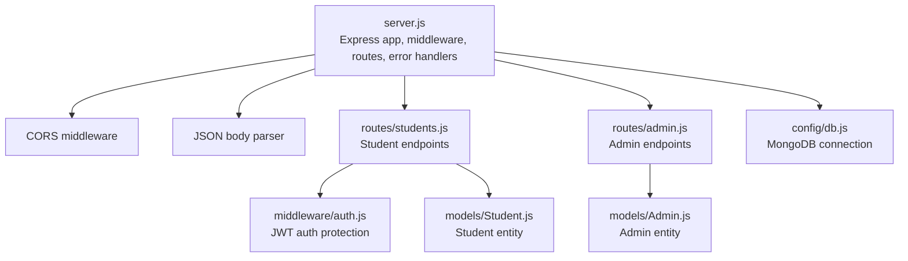
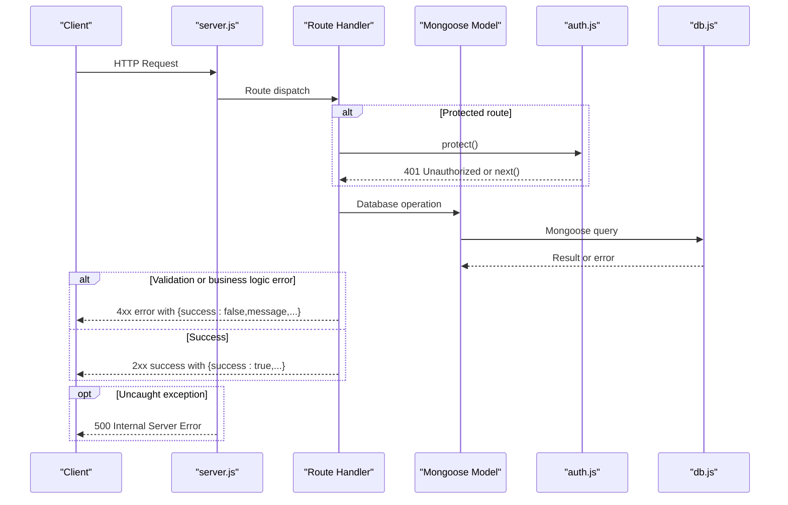
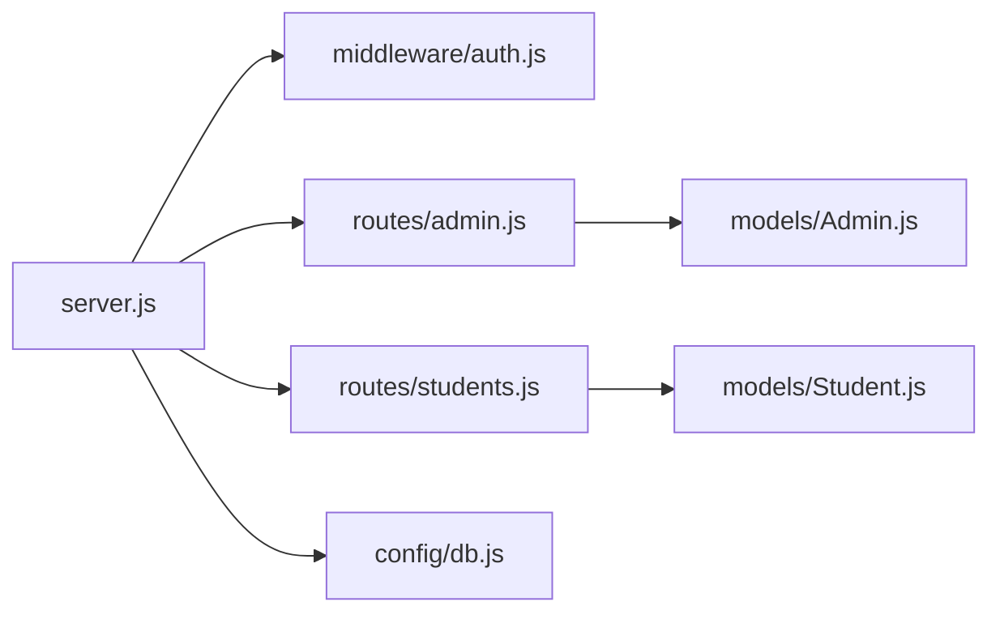

# API Error Handling & Response Standards

<cite>
**Referenced Files in This Document**
- [server.js](file://jk-mobiles/backend/server.js)
- [auth.js](file://jk-mobiles/backend/middleware/auth.js)
- [admin.js](file://jk-mobiles/backend/routes/admin.js)
- [students.js](file://jk-mobiles/backend/routes/students.js)
- [Admin.js](file://jk-mobiles/backend/models/Admin.js)
- [Student.js](file://jk-mobiles/backend/models/Student.js)
- [db.js](file://jk-mobiles/backend/config/db.js)
- [package.json](file://jk-mobiles/backend/package.json)
</cite>

## Table of Contents
1. [Introduction](#introduction)
2. [Project Structure](#project-structure)
3. [Core Components](#core-components)
4. [Architecture Overview](#architecture-overview)
5. [Detailed Component Analysis](#detailed-component-analysis)
6. [Dependency Analysis](#dependency-analysis)
7. [Performance Considerations](#performance-considerations)
8. [Troubleshooting Guide](#troubleshooting-guide)
9. [Conclusion](#conclusion)
10. [Appendices](#appendices)

## Introduction
This document defines the standardized API error handling patterns and response formats used in the JK Mobiles backend. It covers the consistent JSON response structure, HTTP status code usage, validation and business logic error handling, authentication failures, and operational error management. It also provides client-side handling recommendations, debugging strategies, and guidelines for extending error handling patterns.

## Project Structure
The backend follows a modular Express architecture with clear separation of concerns:
- Server bootstrap and middleware registration
- Route handlers for admin and student domains
- Authentication middleware for protected routes
- Mongoose models for Admin and Student entities
- Database connection module
- Environment and dependency configuration

**Diagram sources**
- [server.js:1-52](file://jk-mobiles/backend/server.js#L1-L52)
- [students.js:1-100](file://jk-mobiles/backend/routes/students.js#L1-L100)
- [admin.js:1-55](file://jk-mobiles/backend/routes/admin.js#L1-L55)
- [auth.js:1-34](file://jk-mobiles/backend/middleware/auth.js#L1-L34)
- [Admin.js:1-34](file://jk-mobiles/backend/models/Admin.js#L1-L34)
- [Student.js:1-39](file://jk-mobiles/backend/models/Student.js#L1-L39)
- [db.js:1-17](file://jk-mobiles/backend/config/db.js#L1-L17)

**Section sources**
- [server.js:1-52](file://jk-mobiles/backend/server.js#L1-L52)
- [package.json:1-22](file://jk-mobiles/backend/package.json#L1-L22)

## Core Components
- Standardized response envelope: Each API response includes a success boolean flag and a human-readable message. Some endpoints include additional data payloads (e.g., token, admin profile, student records).
- Global error handling: Centralized 404 and 500 error handlers ensure consistent error responses across all routes.
- Authentication middleware: Protects admin-only routes and returns 401 for missing or invalid tokens.
- Domain-specific error handling: Routes implement explicit validation and business logic checks with appropriate HTTP status codes.

**Section sources**
- [server.js:25-46](file://jk-mobiles/backend/server.js#L25-L46)
- [auth.js:4-31](file://jk-mobiles/backend/middleware/auth.js#L4-L31)
- [admin.js:11-52](file://jk-mobiles/backend/routes/admin.js#L11-L52)
- [students.js:6-97](file://jk-mobiles/backend/routes/students.js#L6-L97)

## Architecture Overview
The error handling architecture centers around a consistent response envelope and centralized error handlers. Routes implement domain-specific validations and business logic checks, while the global middleware ensures uniformity.

**Diagram sources**
- [server.js:11-46](file://jk-mobiles/backend/server.js#L11-L46)
- [auth.js:4-31](file://jk-mobiles/backend/middleware/auth.js#L4-L31)
- [admin.js:11-52](file://jk-mobiles/backend/routes/admin.js#L11-L52)
- [students.js:6-97](file://jk-mobiles/backend/routes/students.js#L6-L97)
- [db.js:3-14](file://jk-mobiles/backend/config/db.js#L3-L14)

## Detailed Component Analysis

### Standardized Response Envelope
- Structure: All responses include success (boolean) and message (string). Some endpoints include additional data payloads (e.g., token, admin, student).
- Purpose: Enables client-side logic to branch on success and display meaningful messages without parsing status codes.

Examples of response envelopes:
- Success: { success: true, message: "...", ... }
- Error: { success: false, message: "..." }

**Section sources**
- [server.js:25-46](file://jk-mobiles/backend/server.js#L25-L46)
- [admin.js:20-43](file://jk-mobiles/backend/routes/admin.js#L20-L43)
- [students.js:20-50](file://jk-mobiles/backend/routes/students.js#L20-L50)

### HTTP Status Code Usage Patterns
- 200 OK: General success responses (e.g., fetching lists, certificate retrieval).
- 201 Created: Resource creation success (e.g., admin setup).
- 400 Bad Request: Missing required fields or invalid input.
- 401 Unauthorized: Missing or invalid authentication token; unauthorized access.
- 403 Forbidden: Access denied when resource is not available (e.g., certificate not ready).
- 404 Not Found: Resource not found (e.g., student record).
- 409 Conflict: Duplicate resource detected (e.g., existing student phone).
- 500 Internal Server Error: Unexpected server errors; logged centrally.

**Section sources**
- [admin.js:15-17](file://jk-mobiles/backend/routes/admin.js#L15-L17)
- [admin.js:33-39](file://jk-mobiles/backend/routes/admin.js#L33-L39)
- [students.js:11-13](file://jk-mobiles/backend/routes/students.js#L11-L13)
- [students.js:16-18](file://jk-mobiles/backend/routes/students.js#L16-L18)
- [students.js:46-48](file://jk-mobiles/backend/routes/students.js#L46-L48)
- [students.js:61-67](file://jk-mobiles/backend/routes/students.js#L61-L67)
- [server.js:38-46](file://jk-mobiles/backend/server.js#L38-L46)

### Validation Error Responses
Validation is performed at the route level for required fields and uniqueness constraints:
- Missing required fields: Respond with 400 and a clear message indicating which fields are required.
- Duplicate resource: Respond with 409 and a message indicating duplication conflict.

Examples:
- Missing fields: 400 with message indicating required fields.
- Duplicate phone: 409 with message indicating existing enrollment.

**Section sources**
- [students.js:11-13](file://jk-mobiles/backend/routes/students.js#L11-L13)
- [students.js:16-18](file://jk-mobiles/backend/routes/students.js#L16-L18)
- [admin.js:33-35](file://jk-mobiles/backend/routes/admin.js#L33-L35)

### Authentication Failure Responses
Authentication middleware enforces bearer token validation:
- Missing token: 401 with message indicating no token provided.
- Token verification fails: 401 with message indicating invalid token.
- Admin not found: 401 with message indicating admin not found.

Protected routes:
- Admin self-service endpoint requires a valid token.

**Section sources**
- [auth.js:14-19](file://jk-mobiles/backend/middleware/auth.js#L14-L19)
- [auth.js:21-30](file://jk-mobiles/backend/middleware/auth.js#L21-L30)
- [admin.js:49-52](file://jk-mobiles/backend/routes/admin.js#L49-L52)

### Business Logic Error Handling
Business logic checks are implemented per endpoint:
- Admin setup: Prevents duplicate initial setup; responds with 400 if admin already exists.
- Login: Validates credentials; responds with 401 for invalid email/password.
- Certificate retrieval: Requires completion; responds with 403 if course not completed; 404 if no student found.
- Marking completion: Responds with 404 if student ID not found.

**Section sources**
- [admin.js:14-17](file://jk-mobiles/backend/routes/admin.js#L14-L17)
- [admin.js:37-40](file://jk-mobiles/backend/routes/admin.js#L37-L40)
- [students.js:56-84](file://jk-mobiles/backend/routes/students.js#L56-L84)
- [students.js:38-54](file://jk-mobiles/backend/routes/students.js#L38-L54)

### Operational Error Handling
- Centralized 404 handler: Catches undefined routes and returns a consistent error response.
- Centralized 500 handler: Catches unhandled exceptions, logs stack traces, and returns a generic internal server error response.
- Database connection errors: Logged and cause process exit to prevent inconsistent state.

**Section sources**
- [server.js:37-46](file://jk-mobiles/backend/server.js#L37-L46)
- [db.js:10-13](file://jk-mobiles/backend/config/db.js#L10-L13)

### Endpoint Categories and Example Responses
Below are typical response patterns for each endpoint category. Replace the ellipsis with the actual data payload as applicable.

- Admin Setup (POST /admin/setup)
  - Success: 201 with { success: true, message: "...", email }
  - Duplicate admin: 400 with { success: false, message: "..." }
  - Server error: 500 with { success: false, message: "..." }

- Admin Login (POST /admin/login)
  - Success: 200 with { success: true, message: "...", token, email }
  - Missing fields: 400 with { success: false, message: "..." }
  - Invalid credentials: 401 with { success: false, message: "..." }
  - Server error: 500 with { success: false, message: "..." }

- Admin Self (GET /admin/me)
  - Success: 200 with { success: true, admin: { ... } }
  - Missing/invalid token: 401 with { success: false, message: "..." }

- Student Enrollment (POST /students/add)
  - Success: 201 with { success: true, message: "...", student }
  - Missing fields: 400 with { success: false, message: "..." }
  - Duplicate phone: 409 with { success: false, message: "..." }
  - Server error: 500 with { success: false, message: "..." }

- List Students (GET /students)
  - Success: 200 with { success: true, count, students: [...] }
  - Server error: 500 with { success: false, message: "..." }

- Mark Completed (PUT /students/complete/:id)
  - Success: 200 with { success: true, message: "...", student }
  - Not found: 404 with { success: false, message: "..." }
  - Server error: 500 with { success: false, message: "..." }

- Certificate by Phone (GET /students/certificate/:phone)
  - Success: 200 with { success: true, message: "...", student: { ... } }
  - Not found: 404 with { success: false, message: "..." }
  - Not completed: 403 with { success: false, message: "..." }
  - Server error: 500 with { success: false, message: "..." }

- Dashboard Stats (GET /students/stats/overview)
  - Success: 200 with { success: true, stats: { total, completed, pending }, recent: [...] }
  - Server error: 500 with { success: false, message: "..." }

**Section sources**
- [admin.js:12-52](file://jk-mobiles/backend/routes/admin.js#L12-L52)
- [students.js:6-97](file://jk-mobiles/backend/routes/students.js#L6-L97)
- [server.js:37-46](file://jk-mobiles/backend/server.js#L37-L46)

### Data Models and Validation Behavior
- Admin model enforces email uniqueness and password hashing before save.
- Student model enforces required fields and enum constraints for course and mode.

These constraints influence error responses:
- Unique constraint violations surface as 409 conflicts during enrollment.
- Enum violations surface as 400 bad requests during enrollment.

**Section sources**
- [Admin.js:4-31](file://jk-mobiles/backend/models/Admin.js#L4-L31)
- [Student.js:3-36](file://jk-mobiles/backend/models/Student.js#L3-L36)

## Dependency Analysis
The error handling patterns depend on consistent middleware and route-level logic. The authentication middleware depends on JWT and the Admin model. Routes depend on Mongoose models and the database connection.

**Diagram sources**
- [server.js:1-52](file://jk-mobiles/backend/server.js#L1-L52)
- [auth.js:1-34](file://jk-mobiles/backend/middleware/auth.js#L1-L34)
- [admin.js:1-55](file://jk-mobiles/backend/routes/admin.js#L1-L55)
- [students.js:1-100](file://jk-mobiles/backend/routes/students.js#L1-L100)
- [Admin.js:1-34](file://jk-mobiles/backend/models/Admin.js#L1-L34)
- [Student.js:1-39](file://jk-mobiles/backend/models/Student.js#L1-L39)
- [db.js:1-17](file://jk-mobiles/backend/config/db.js#L1-L17)

**Section sources**
- [package.json:10-16](file://jk-mobiles/backend/package.json#L10-L16)

## Performance Considerations
- Centralized error handlers reduce route-level boilerplate and ensure consistent logging.
- Avoid returning sensitive data in error messages to prevent information leakage.
- Prefer 400 for client-side validation errors and 409 for resource conflicts to aid client-side branching.
- Keep server error messages generic; log detailed stack traces securely.

## Troubleshooting Guide
Common issues and resolutions:
- Missing Authorization header: Ensure Bearer token is included in the Authorization header for protected routes.
- Invalid or expired token: Re-authenticate to obtain a new token.
- Duplicate enrollment: Use a unique phone number; the system returns 409 on duplicates.
- Course not completed: Certificate endpoint returns 403 until completion is marked.
- Route not found: The global 404 handler returns a consistent error message.
- Internal server error: The global 500 handler indicates a server issue; check logs for stack traces.

Debugging strategies:
- Enable development mode to use nodemon for automatic restarts.
- Inspect server logs for error stack traces and database connection messages.
- Validate request payloads against required fields and enums.

**Section sources**
- [server.js:37-46](file://jk-mobiles/backend/server.js#L37-L46)
- [auth.js:14-30](file://jk-mobiles/backend/middleware/auth.js#L14-L30)
- [db.js:10-13](file://jk-mobiles/backend/config/db.js#L10-L13)
- [package.json:6-9](file://jk-mobiles/backend/package.json#L6-L9)

## Conclusion
The JK Mobiles backend implements a consistent, predictable error handling framework centered on a standardized response envelope and centralized error handlers. Domain-specific validations and business logic checks ensure appropriate HTTP status codes and clear messages. Following these patterns improves client-side handling, simplifies debugging, and maintains a robust API contract.

## Appendices

### Guidelines for Extending Error Handling Patterns
- Always wrap route logic in try/catch blocks to centralize 500 error handling.
- Use explicit validation at the route level and return 400 for missing or invalid inputs.
- Return 409 for resource conflicts (e.g., duplicates).
- Return 404 for missing resources and 403 for forbidden access.
- Keep error messages user-friendly and generic; log detailed errors securely.
- Add domain-specific payloads (e.g., token, admin, student) only when success is true.

[No sources needed since this section provides general guidance]