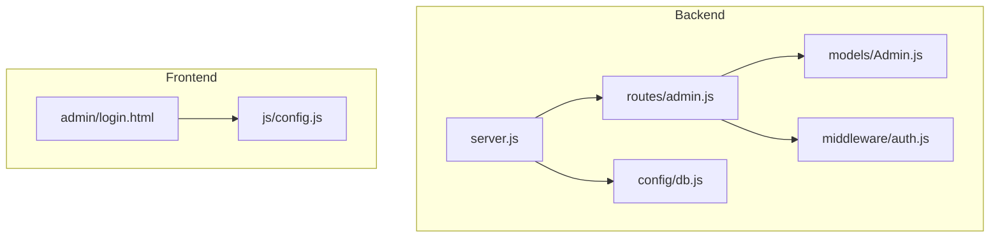
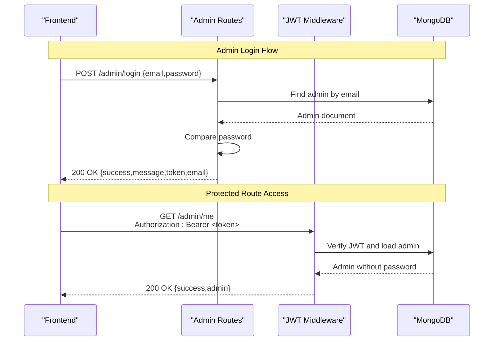
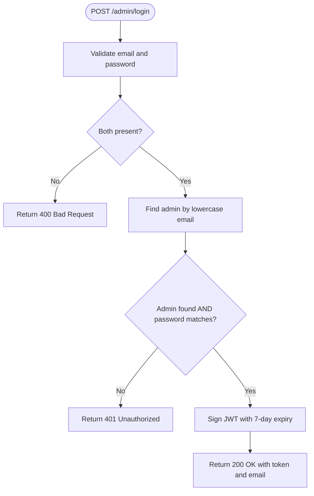
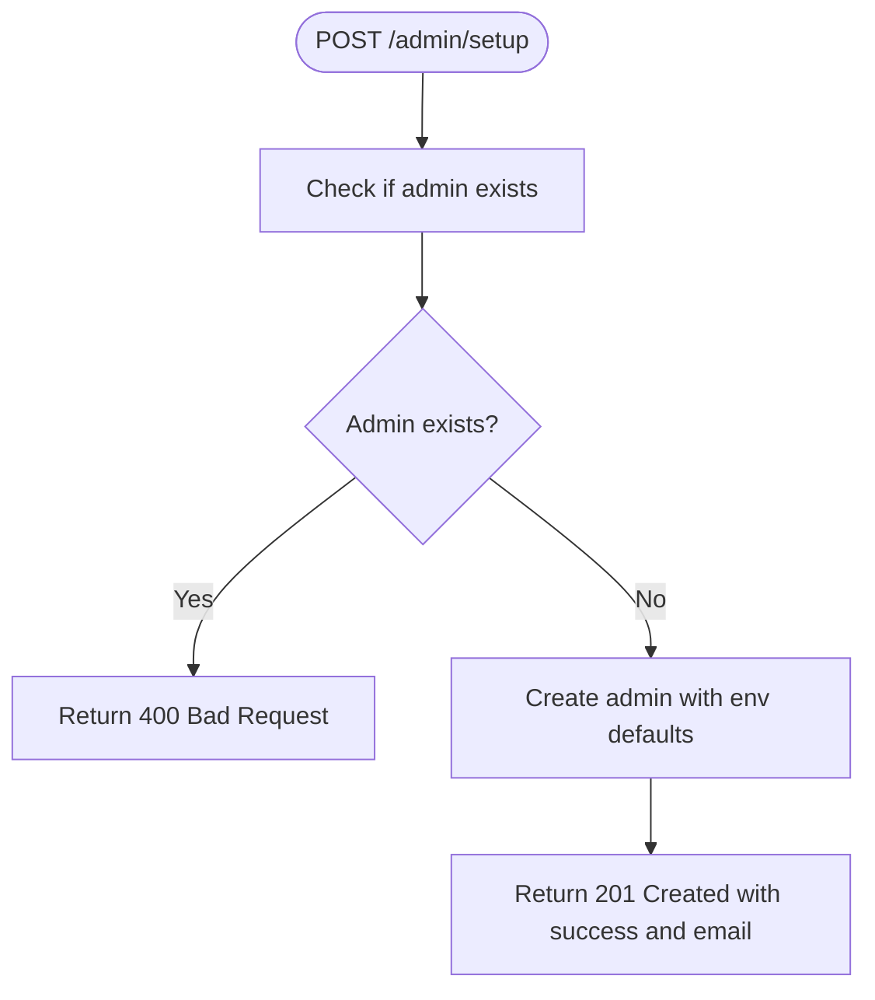
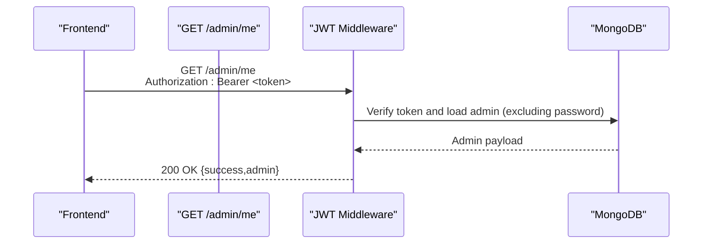
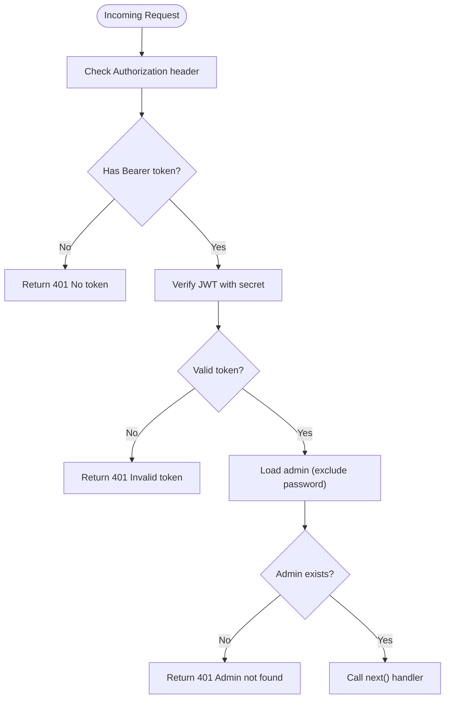
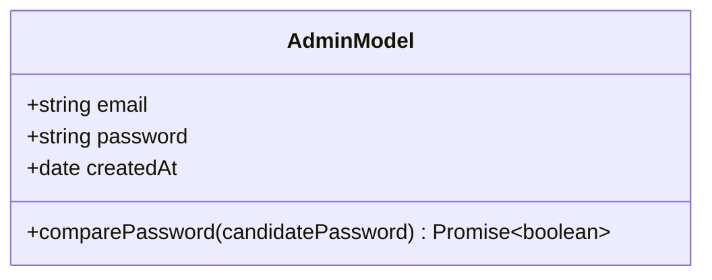
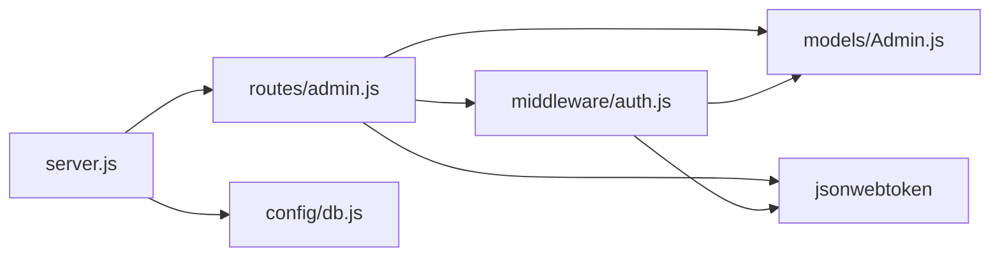
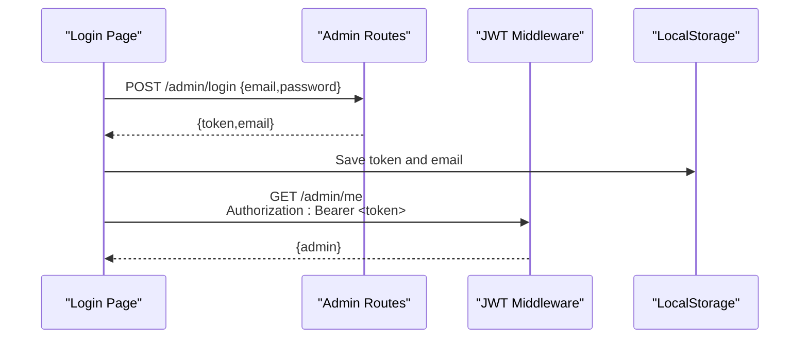

# Admin Authentication API

<cite>
**Referenced Files in This Document**
- [admin.js](file://backend/routes/admin.js)
- [auth.js](file://backend/middleware/auth.js)
- [Admin.js](file://backend/models/Admin.js)
- [server.js](file://backend/server.js)
- [db.js](file://backend/config/db.js)
- [login.html](file://frontend/admin/login.html)
- [config.js](file://frontend/js/config.js)
- [README.md](file://README.md)
- [render.yaml](file://backend/render.yaml)
</cite>

## Table of Contents
1. [Introduction](#introduction)
2. [Project Structure](#project-structure)
3. [Core Components](#core-components)
4. [Architecture Overview](#architecture-overview)
5. [Detailed Component Analysis](#detailed-component-analysis)
6. [Dependency Analysis](#dependency-analysis)
7. [Performance Considerations](#performance-considerations)
8. [Security Considerations](#security-considerations)
9. [Troubleshooting Guide](#troubleshooting-guide)
10. [Integration Examples](#integration-examples)
11. [Conclusion](#conclusion)

## Introduction
This document provides comprehensive API documentation for admin authentication endpoints in the JK Mobiles Training Institute system. It covers:
- Admin login endpoint for JWT token generation
- Admin setup endpoint for initial admin account creation
- Admin profile endpoint for retrieving authenticated admin information
- JWT authentication middleware and protected route access patterns
- Security considerations, token expiration handling, and error responses
- Frontend integration examples and token management workflows

## Project Structure
The authentication system spans backend routes, middleware, and models, along with frontend pages that demonstrate client-side integration.

**Diagram sources**
- [server.js:1-52](file://backend/server.js#L1-L52)
- [admin.js:1-55](file://backend/routes/admin.js#L1-L55)
- [auth.js:1-34](file://backend/middleware/auth.js#L1-L34)
- [Admin.js:1-34](file://backend/models/Admin.js#L1-L34)
- [db.js:1-17](file://backend/config/db.js#L1-L17)
- [login.html:1-376](file://frontend/admin/login.html#L1-L376)
- [config.js:1-33](file://frontend/js/config.js#L1-L33)

**Section sources**
- [server.js:1-52](file://backend/server.js#L1-L52)
- [admin.js:1-55](file://backend/routes/admin.js#L1-L55)
- [auth.js:1-34](file://backend/middleware/auth.js#L1-L34)
- [Admin.js:1-34](file://backend/models/Admin.js#L1-L34)
- [db.js:1-17](file://backend/config/db.js#L1-L17)
- [login.html:1-376](file://frontend/admin/login.html#L1-L376)
- [config.js:1-33](file://frontend/js/config.js#L1-L33)

## Core Components
- Admin routes module: Implements admin login, setup, and profile endpoints.
- JWT middleware: Validates Authorization Bearer tokens and attaches admin payload to requests.
- Admin model: Defines admin schema, password hashing, and password comparison.
- Server bootstrap: Initializes Express, CORS, JSON parsing, and mounts routes.
- Frontend pages: Demonstrate login flow and token storage.

Key implementation references:
- Admin routes: [admin.js:11-52](file://backend/routes/admin.js#L11-L52)
- JWT middleware: [auth.js:4-31](file://backend/middleware/auth.js#L4-L31)
- Admin model: [Admin.js:21-31](file://backend/models/Admin.js#L21-L31)
- Server initialization: [server.js:11-22](file://backend/server.js#L11-L22)

**Section sources**
- [admin.js:11-52](file://backend/routes/admin.js#L11-L52)
- [auth.js:4-31](file://backend/middleware/auth.js#L4-L31)
- [Admin.js:21-31](file://backend/models/Admin.js#L21-L31)
- [server.js:11-22](file://backend/server.js#L11-L22)

## Architecture Overview
The authentication architecture follows a layered pattern:
- Routes define endpoints and orchestrate request handling.
- Middleware enforces JWT validation and protects routes.
- Model handles data persistence and password operations.
- Frontend consumes endpoints and manages tokens locally.

**Diagram sources**
- [admin.js:28-52](file://backend/routes/admin.js#L28-L52)
- [auth.js:4-31](file://backend/middleware/auth.js#L4-L31)
- [Admin.js:28-31](file://backend/models/Admin.js#L28-L31)

## Detailed Component Analysis

### Admin Login Endpoint
- Endpoint: POST /admin/login
- Purpose: Authenticate admin and issue JWT token
- Request body:
  - email: string (required)
  - password: string (required)
- Response:
  - success: boolean
  - message: string
  - token: string (JWT)
  - email: string
- Processing logic:
  - Validates presence of email and password
  - Finds admin by lowercase email
  - Compares password using bcrypt
  - Generates signed JWT with 7-day expiry
  - Returns token and admin email

**Diagram sources**
- [admin.js:28-47](file://backend/routes/admin.js#L28-L47)
- [Admin.js:28-31](file://backend/models/Admin.js#L28-L31)

**Section sources**
- [admin.js:28-47](file://backend/routes/admin.js#L28-L47)
- [Admin.js:28-31](file://backend/models/Admin.js#L28-L31)

### Admin Setup Endpoint
- Endpoint: POST /admin/setup
- Purpose: Create initial admin account (run once)
- Behavior:
  - Checks if admin already exists
  - Creates admin with default email/password from environment variables
  - Returns success message and email
- Notes:
  - Should be executed once after deployment
  - Subsequent runs return 400 indicating admin already exists

**Diagram sources**
- [admin.js:11-26](file://backend/routes/admin.js#L11-L26)

**Section sources**
- [admin.js:11-26](file://backend/routes/admin.js#L11-L26)

### Admin Profile Endpoint
- Endpoint: GET /admin/me
- Purpose: Verify token and return authenticated admin info
- Protection: Requires valid JWT in Authorization header
- Response:
  - success: boolean
  - admin: object (without password field)

**Diagram sources**
- [admin.js:49-52](file://backend/routes/admin.js#L49-L52)
- [auth.js:21-30](file://backend/middleware/auth.js#L21-L30)

**Section sources**
- [admin.js:49-52](file://backend/routes/admin.js#L49-L52)
- [auth.js:21-30](file://backend/middleware/auth.js#L21-L30)

### JWT Authentication Middleware
- Validates Authorization header for Bearer token
- Extracts token and verifies with JWT secret
- Loads admin from database excluding password field
- Attaches admin object to request for downstream handlers
- Returns 401 for missing/invalid tokens or admin not found

**Diagram sources**
- [auth.js:4-31](file://backend/middleware/auth.js#L4-L31)

**Section sources**
- [auth.js:4-31](file://backend/middleware/auth.js#L4-L31)

### Admin Model: Password Hashing and Validation
- Schema fields: email (unique, lowercase), password, createdAt
- Pre-save hook: Hashes password with bcrypt before saving
- Instance method: comparePassword using bcrypt for validation

**Diagram sources**
- [Admin.js:4-31](file://backend/models/Admin.js#L4-L31)

**Section sources**
- [Admin.js:4-31](file://backend/models/Admin.js#L4-L31)

## Dependency Analysis
- Routes depend on:
  - Admin model for database operations
  - JWT library for token signing and verification
  - Auth middleware for protection
- Middleware depends on:
  - JWT library for verification
  - Admin model for loading admin by ID
- Server depends on:
  - Config module for database connection
  - Routes for endpoint registration

**Diagram sources**
- [admin.js:1-9](file://backend/routes/admin.js#L1-L9)
- [auth.js:1-2](file://backend/middleware/auth.js#L1-L2)
- [server.js:11-22](file://backend/server.js#L11-L22)

**Section sources**
- [admin.js:1-9](file://backend/routes/admin.js#L1-L9)
- [auth.js:1-2](file://backend/middleware/auth.js#L1-L2)
- [server.js:11-22](file://backend/server.js#L11-L22)

## Performance Considerations
- Token expiry: 7 days; consider shorter expiry with refresh token strategy for enhanced security.
- Password hashing cost: bcrypt cost factor is handled automatically; ensure adequate server resources for hash computation.
- Middleware overhead: Single JWT verification and one DB lookup per protected request.
- Frontend caching: Store token in secure storage and reuse until expiry.

[No sources needed since this section provides general guidance]

## Security Considerations
- Token transmission: Always send Authorization: Bearer <token> headers.
- Token storage: Frontend stores token in local storage; consider HttpOnly cookies for production.
- Secret management: JWT_SECRET must be strong and kept confidential.
- Environment variables: ADMIN_EMAIL and ADMIN_PASSWORD are used for initial setup.
- CORS policy: Allows Authorization header for cross-origin requests.
- Password handling: Never log or expose passwords; model excludes password in profile response.

**Section sources**
- [auth.js:7-19](file://backend/middleware/auth.js#L7-L19)
- [render.yaml:10-17](file://backend/render.yaml#L10-L17)
- [login.html:313](file://frontend/admin/login.html#L313)
- [config.js:9-11](file://frontend/js/config.js#L9-L11)

## Troubleshooting Guide
Common errors and resolutions:
- 400 Bad Request on login:
  - Cause: Missing email or password in request body.
  - Resolution: Ensure both fields are provided.
  - Reference: [admin.js:33-35](file://backend/routes/admin.js#L33-L35)
- 401 Unauthorized on login:
  - Cause: Invalid email or password.
  - Resolution: Verify credentials; ensure admin exists and password matches.
  - Reference: [admin.js:37-40](file://backend/routes/admin.js#L37-L40)
- 401 Unauthorized on protected routes:
  - Cause: Missing or invalid Authorization header; token expired; admin deleted.
  - Resolution: Re-authenticate; ensure token is present and valid; confirm admin exists.
  - References: [auth.js:14-19](file://backend/middleware/auth.js#L14-L19), [auth.js:21-30](file://backend/middleware/auth.js#L21-L30)
- 400 Bad Request on setup:
  - Cause: Admin already exists.
  - Resolution: Do not run setup again; proceed to login.
  - Reference: [admin.js:15-17](file://backend/routes/admin.js#L15-L17)
- 500 Internal Server Error:
  - Cause: Unexpected server errors during login or setup.
  - Resolution: Check server logs; verify database connectivity and secrets.
  - References: [admin.js:23-25](file://backend/routes/admin.js#L23-L25), [admin.js:44-46](file://backend/routes/admin.js#L44-L46)

**Section sources**
- [admin.js:15-17](file://backend/routes/admin.js#L15-L17)
- [admin.js:23-25](file://backend/routes/admin.js#L23-L25)
- [admin.js:33-40](file://backend/routes/admin.js#L33-L40)
- [admin.js:44-46](file://backend/routes/admin.js#L44-L46)
- [auth.js:14-19](file://backend/middleware/auth.js#L14-L19)
- [auth.js:21-30](file://backend/middleware/auth.js#L21-L30)

## Integration Examples

### Frontend Authentication Workflow
- Login page flow:
  - Collects email and password
  - Sends POST /admin/login with JSON body
  - On success, stores token and email in localStorage
  - Redirects to dashboard
  - References: [login.html:335-372](file://frontend/admin/login.html#L335-L372)

- Protected route access:
  - Uses shared API helper to attach Authorization header
  - Fetches /admin/me to verify token and retrieve admin info
  - References: [config.js:9-19](file://frontend/js/config.js#L9-L19)

**Diagram sources**
- [login.html:335-372](file://frontend/admin/login.html#L335-L372)
- [config.js:9-19](file://frontend/js/config.js#L9-L19)
- [admin.js:49-52](file://backend/routes/admin.js#L49-L52)
- [auth.js:21-30](file://backend/middleware/auth.js#L21-L30)

### Token Management Best Practices
- Store token securely (consider HttpOnly cookies in production).
- Refresh token strategy: Implement short-lived access tokens with refresh tokens.
- Auto-retry: Intercept 401 responses and trigger re-login flow.
- Expiry handling: Prompt user to re-authenticate before token expires.

[No sources needed since this section provides general guidance]

## Conclusion
The admin authentication system provides a concise and secure foundation for admin access:
- JWT-based authentication with 7-day expiry
- Robust password hashing and validation
- Clear error responses and middleware protection
- Practical frontend integration demonstrating token lifecycle

For production deployments, consider enhancing security with shorter token expirations, refresh token rotation, and improved token storage mechanisms.