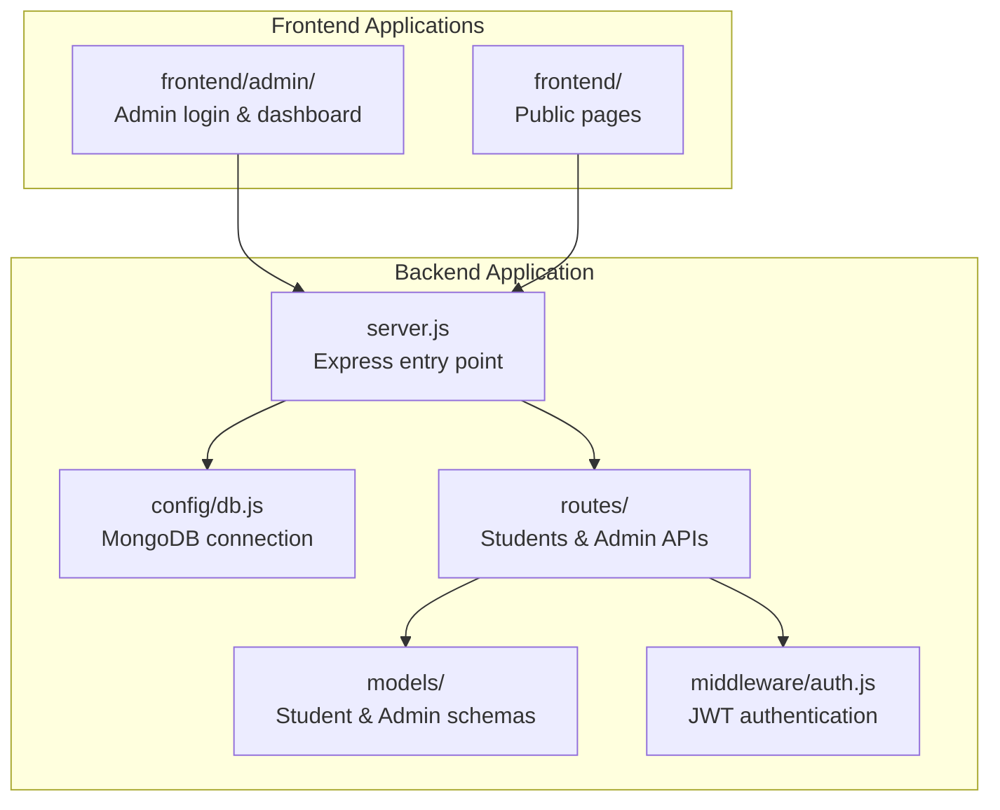
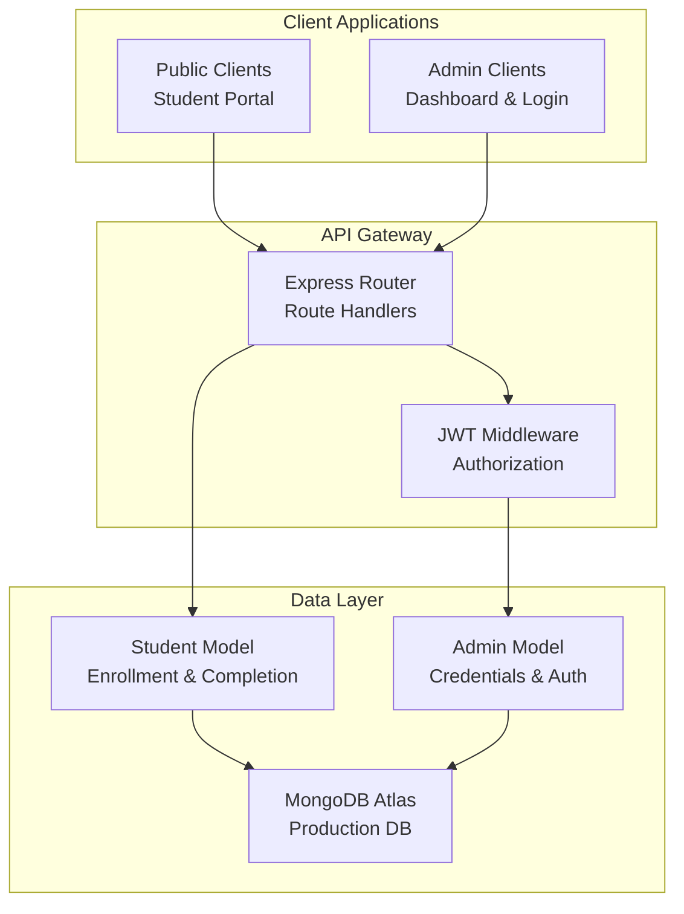
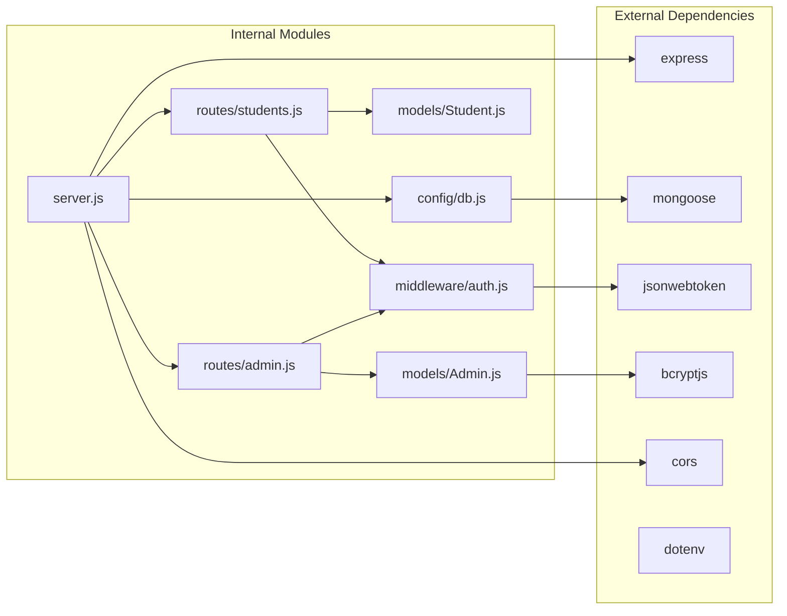

# Backend API Documentation

<cite>
**Referenced Files in This Document**
- [server.js](file://jk-mobiles/backend/server.js)
- [db.js](file://jk-mobiles/backend/config/db.js)
- [auth.js](file://jk-mobiles/backend/middleware/auth.js)
- [students.js](file://jk-mobiles/backend/routes/students.js)
- [admin.js](file://jk-mobiles/backend/routes/admin.js)
- [Admin.js](file://jk-mobiles/backend/models/Admin.js)
- [Student.js](file://jk-mobiles/backend/models/Student.js)
- [package.json](file://jk-mobiles/backend/package.json)
- [README.md](file://jk-mobiles/README.md)
- [config.js](file://jk-mobiles/frontend/js/config.js)
- [login.html](file://jk-mobiles/frontend/admin/login.html)
- [dashboard.html](file://jk-mobiles/frontend/admin/dashboard.html)
</cite>

## Table of Contents
1. [Introduction](#introduction)
2. [Project Structure](#project-structure)
3. [Core Components](#core-components)
4. [Architecture Overview](#architecture-overview)
5. [Detailed Component Analysis](#detailed-component-analysis)
6. [Dependency Analysis](#dependency-analysis)
7. [Performance Considerations](#performance-considerations)
8. [Troubleshooting Guide](#troubleshooting-guide)
9. [Conclusion](#conclusion)
10. [Appendices](#appendices)

## Introduction
This document provides comprehensive API documentation for the JK Mobiles backend REST API. It covers all public and protected endpoints, authentication flow, request/response schemas, validation rules, error handling, and integration guidelines for frontend applications. The API serves a training institute management system with student enrollment, certificate generation, and admin dashboard functionality.

## Project Structure
The backend follows a modular Express.js architecture with clear separation of concerns:



**Diagram sources**
- [server.js:1-52](file://jk-mobiles/backend/server.js#L1-L52)
- [db.js:1-17](file://jk-mobiles/backend/config/db.js#L1-L17)
- [auth.js:1-34](file://jk-mobiles/backend/middleware/auth.js#L1-L34)

**Section sources**
- [server.js:1-52](file://jk-mobiles/backend/server.js#L1-L52)
- [README.md:106-127](file://jk-mobiles/README.md#L106-L127)

## Core Components
The API consists of two primary route groups with distinct authentication requirements:

### Authentication System
- **JWT-based authentication** with 7-day expiration
- **Protected routes middleware** validates bearer tokens
- **Admin-only endpoints** require authenticated admin access
- **Public endpoints** are accessible without authentication

### Data Models
- **Student model** with enrollment tracking and completion status
- **Admin model** with hashed passwords and email uniqueness
- **MongoDB Atlas** as production database with Mongoose ODM

**Section sources**
- [auth.js:1-34](file://jk-mobiles/backend/middleware/auth.js#L1-L34)
- [Admin.js:1-34](file://jk-mobiles/backend/models/Admin.js#L1-L34)
- [Student.js:1-39](file://jk-mobiles/backend/models/Student.js#L1-L39)

## Architecture Overview
The API follows RESTful principles with clear endpoint organization:



**Diagram sources**
- [server.js:20-22](file://jk-mobiles/backend/server.js#L20-L22)
- [auth.js:4-31](file://jk-mobiles/backend/middleware/auth.js#L4-L31)
- [db.js:3-14](file://jk-mobiles/backend/config/db.js#L3-L14)

## Detailed Component Analysis

### Public Endpoints

#### Student Enrollment
**Endpoint**: POST `/students/add`
**Description**: Enroll a new student with required details

**Authentication**: Not required

**Request Schema**:
```json
{
  "name": "string",
  "phone": "string",
  "course": "enum: Basic|Advanced|Chip Level",
  "mode": "enum: Online|Offline"
}
```

**Response Schemas**:
- Success: 201 Created
- Validation Error: 400 Bad Request
- Conflict: 409 Conflict
- Server Error: 500 Internal Server Error

**Validation Rules**:
- All fields required
- Phone number must be unique
- Course must be one of predefined values
- Mode must be one of predefined values

**Example Request**:
```javascript
fetch('https://your-api-url.com/students/add', {
  method: 'POST',
  headers: {'Content-Type': 'application/json'},
  body: JSON.stringify({
    name: "John Doe",
    phone: "9876543210",
    course: "Basic",
    mode: "Online"
  })
})
```

**Section sources**
- [students.js:6-25](file://jk-mobiles/backend/routes/students.js#L6-L25)

#### Certificate Lookup
**Endpoint**: GET `/students/certificate/:phone`
**Description**: Retrieve certificate data for completed students

**Authentication**: Not required

**Path Parameters**:
- `phone`: Student's phone number (string)

**Response Schemas**:
- Success: 200 OK with certificate data
- Not Found: 404 Not Found (no student found)
- Forbidden: 403 Forbidden (course not completed)

**Certificate Response Fields**:
- name, phone, course, mode
- completedAt, enrolledAt timestamps

**Section sources**
- [students.js:56-84](file://jk-mobiles/backend/routes/students.js#L56-L84)

#### Admin Login
**Endpoint**: POST `/admin/login`
**Description**: Authenticate admin and receive JWT token

**Authentication**: Not required

**Request Schema**:
```json
{
  "email": "string",
  "password": "string"
}
```

**Response Schema**:
```json
{
  "success": true,
  "message": "string",
  "token": "string",
  "email": "string"
}
```

**Validation Rules**:
- Email and password required
- Case-insensitive email comparison
- Password verification using bcrypt

**Section sources**
- [admin.js:28-47](file://jk-mobiles/backend/routes/admin.js#L28-L47)

#### Admin Setup
**Endpoint**: POST `/admin/setup`
**Description**: Initialize admin account (run once)

**Authentication**: Not required

**Request Schema**: None
**Response Schema**: Success response with admin email

**Important Notes**:
- Can only be executed when no admin exists
- Creates admin with environment-provided credentials
- Should be run immediately after deployment

**Section sources**
- [admin.js:11-26](file://jk-mobiles/backend/routes/admin.js#L11-L26)

### Protected Endpoints

#### Get All Students
**Endpoint**: GET `/students`
**Description**: Retrieve complete student enrollment list

**Authentication**: JWT required (Authorization: Bearer <token>)

**Response Schema**:
```json
{
  "success": true,
  "count": "number",
  "students": [
    {
      "name": "string",
      "phone": "string",
      "course": "string",
      "mode": "string",
      "completed": "boolean",
      "enrolledAt": "date",
      "completedAt": "date"
    }
  ]
}
```

**Authorization**: Admin access required

**Section sources**
- [students.js:27-35](file://jk-mobiles/backend/routes/students.js#L27-L35)

#### Mark Student as Completed
**Endpoint**: PUT `/students/complete/:id`
**Description**: Update student completion status

**Authentication**: JWT required

**Path Parameters**:
- `id`: Student ObjectId (string)

**Response Schema**:
```json
{
  "success": true,
  "message": "string",
  "student": {
    "completed": true,
    "completedAt": "date"
  }
}
```

**Authorization**: Admin access required

**Section sources**
- [students.js:37-54](file://jk-mobiles/backend/routes/students.js#L37-L54)

#### Dashboard Statistics
**Endpoint**: GET `/students/stats/overview`
**Description**: Get dashboard analytics and recent enrollments

**Authentication**: JWT required

**Response Schema**:
```json
{
  "success": true,
  "stats": {
    "total": "number",
    "completed": "number",
    "pending": "number"
  },
  "recent": [
    {
      "name": "string",
      "phone": "string",
      "course": "string",
      "mode": "string",
      "enrolledAt": "date"
    }
  ]
}
```

**Authorization**: Admin access required

**Section sources**
- [students.js:86-97](file://jk-mobiles/backend/routes/students.js#L86-L97)

#### Admin Profile
**Endpoint**: GET `/admin/me`
**Description**: Verify JWT token and retrieve admin information

**Authentication**: JWT required

**Response Schema**:
```json
{
  "success": true,
  "admin": {
    "email": "string",
    "createdAt": "date"
  }
}
```

**Authorization**: Admin access required

**Section sources**
- [admin.js:49-52](file://jk-mobiles/backend/routes/admin.js#L49-L52)

## Dependency Analysis



**Diagram sources**
- [package.json:10-16](file://jk-mobiles/backend/package.json#L10-L16)
- [server.js:1-18](file://jk-mobiles/backend/server.js#L1-L18)
- [auth.js:1](file://jk-mobiles/backend/middleware/auth.js#L1)

**Section sources**
- [package.json:1-22](file://jk-mobiles/backend/package.json#L1-L22)
- [server.js:1-52](file://jk-mobiles/backend/server.js#L1-L52)

## Performance Considerations
- **Database Indexing**: Consider adding indexes on frequently queried fields (phone, course, mode, completed)
- **Pagination**: Implement pagination for `/students` endpoint with large datasets
- **Caching**: Add Redis caching for `/students/stats/overview` endpoint
- **Connection Pooling**: Configure MongoDB connection pool settings for production
- **Response Size**: Limit student records to essential fields in list views

## Troubleshooting Guide

### Common Authentication Issues
**Problem**: 401 Unauthorized on protected endpoints
**Solution**: Ensure Authorization header includes valid JWT token
- Header format: `Authorization: Bearer <token>`
- Token expires in 7 days

**Problem**: 403 Forbidden on certificate endpoint
**Solution**: Student must have completed course status set to true

### Database Connection Issues
**Problem**: MongoDB connection failures
**Solution**: Verify MONGODB_URI environment variable and network connectivity

### Environment Configuration
**Problem**: Admin setup fails
**Solution**: Ensure no admin exists in database before running setup

**Section sources**
- [auth.js:14-30](file://jk-mobiles/backend/middleware/auth.js#L14-L30)
- [db.js:3-14](file://jk-mobiles/backend/config/db.js#L3-L14)

## Conclusion
The JK Mobiles API provides a robust foundation for training institute management with clear separation between public and protected endpoints. The JWT-based authentication system ensures secure access to administrative features while maintaining simplicity for public-facing operations. The modular architecture supports easy maintenance and future enhancements.

## Appendices

### API Usage Examples

#### Frontend Integration Pattern
```javascript
// Base configuration
const API_BASE = 'https://your-api-url.com';

// Generic API request helper
async function apiRequest(endpoint, method = 'GET', body = null, token = null) {
  const headers = { 'Content-Type': 'application/json' };
  if (token) headers['Authorization'] = `Bearer ${token}`;
  
  const config = { method, headers };
  if (body) config.body = JSON.stringify(body);
  
  const response = await fetch(`${API_BASE}${endpoint}`, config);
  return response.json();
}

// Usage examples
const studentData = await apiRequest('/students/add', 'POST', {
  name: "Jane Smith",
  phone: "9876501234",
  course: "Advanced",
  mode: "Offline"
});

const adminToken = await apiRequest('/admin/login', 'POST', {
  email: "admin@jkmobiles.com",
  password: "Admin@123"
}).then(res => res.token);

const students = await apiRequest('/students', 'GET', null, adminToken);
```

### Security Best Practices
- **Environment Variables**: Store JWT_SECRET, ADMIN_EMAIL, ADMIN_PASSWORD securely
- **HTTPS**: Deploy with SSL certificates in production
- **Rate Limiting**: Implement rate limiting for login attempts
- **Input Validation**: Extend validation rules for production use
- **Audit Logging**: Add logging for admin actions

### Deployment Configuration
- **MongoDB Atlas**: Use replica sets for production
- **Render Deployment**: Configure environment variables in dashboard
- **Frontend Integration**: Update API_BASE URLs after deployment

**Section sources**
- [README.md:60-84](file://jk-mobiles/README.md#L60-L84)
- [config.js:5-19](file://jk-mobiles/frontend/js/config.js#L5-L19)