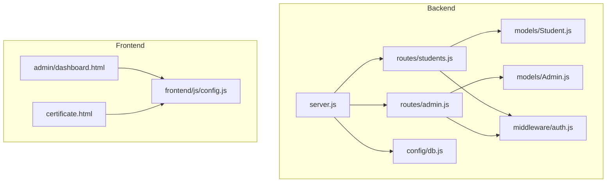
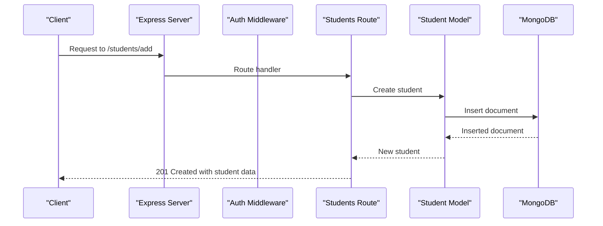
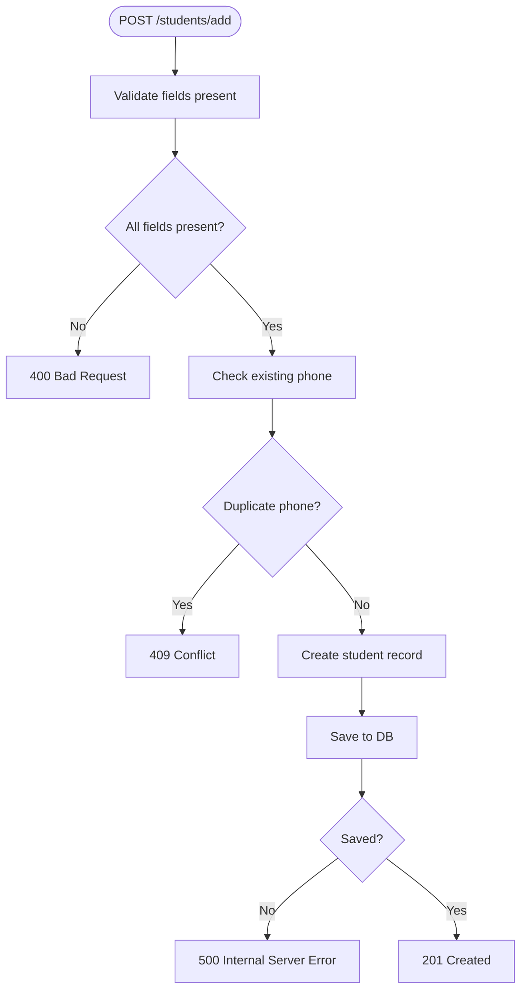
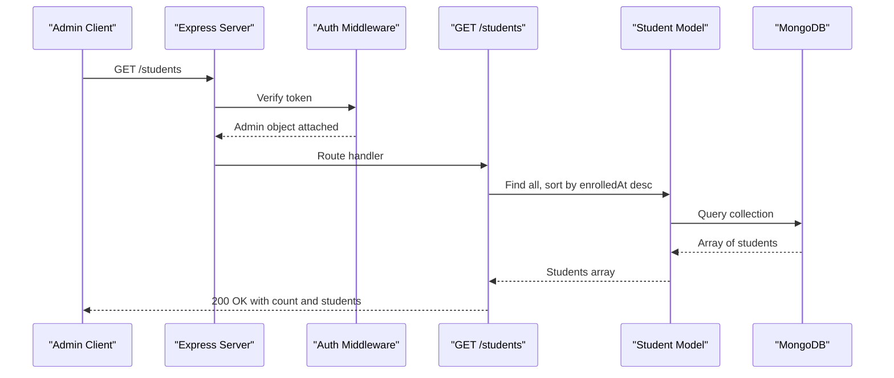
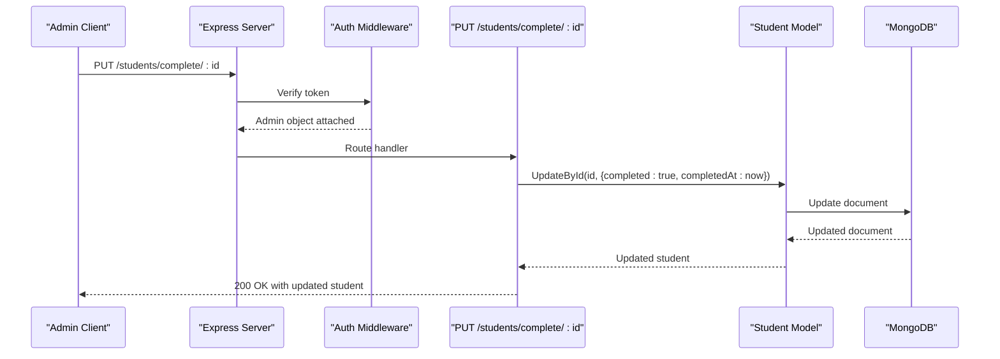
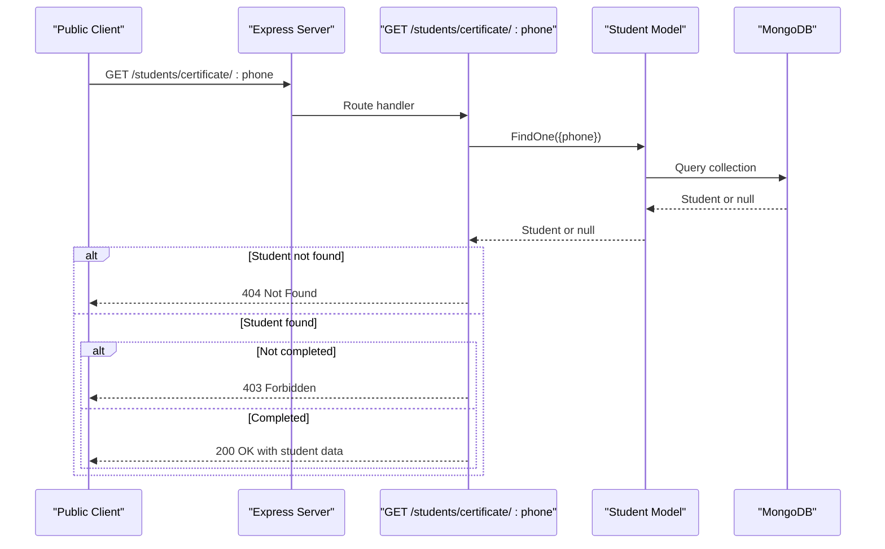
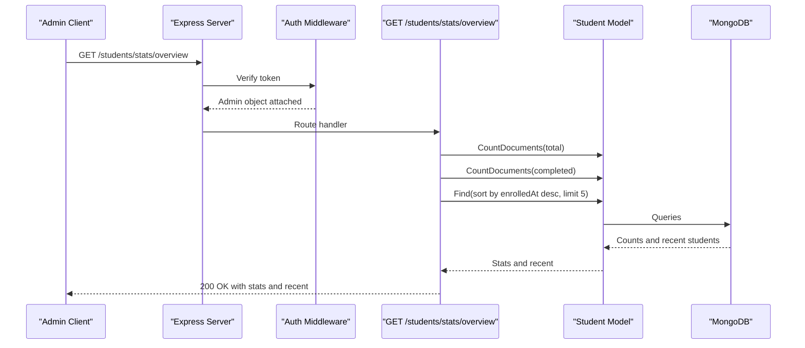
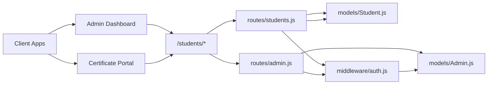

# Student Management API

<cite>
**Referenced Files in This Document**
- [server.js](file://jk-mobiles/backend/server.js)
- [db.js](file://jk-mobiles/backend/config/db.js)
- [auth.js](file://jk-mobiles/backend/middleware/auth.js)
- [Admin.js](file://jk-mobiles/backend/models/Admin.js)
- [Student.js](file://jk-mobiles/backend/models/Student.js)
- [students.js](file://jk-mobiles/backend/routes/students.js)
- [admin.js](file://jk-mobiles/backend/routes/admin.js)
- [config.js](file://jk-mobiles/frontend/js/config.js)
- [dashboard.html](file://jk-mobiles/frontend/admin/dashboard.html)
- [certificate.html](file://jk-mobiles/frontend/certificate.html)
</cite>

## Table of Contents
1. [Introduction](#introduction)
2. [Project Structure](#project-structure)
3. [Core Components](#core-components)
4. [Architecture Overview](#architecture-overview)
5. [Detailed Component Analysis](#detailed-component-analysis)
6. [Dependency Analysis](#dependency-analysis)
7. [Performance Considerations](#performance-considerations)
8. [Troubleshooting Guide](#troubleshooting-guide)
9. [Conclusion](#conclusion)
10. [Appendices](#appendices)

## Introduction
This document provides comprehensive API documentation for the student management endpoints used by the JK Mobiles training institute. It covers enrollment, listing, completion marking, certificate lookup, and statistics endpoints. Each endpoint includes request/response schemas, HTTP status codes, error handling, and practical usage examples. Admin-only endpoints require a valid JWT bearer token.

## Project Structure
The backend is an Express server with Mongoose for MongoDB integration. Routes are organized under `/students` and `/admin`. Authentication middleware enforces admin-only access for protected routes. Frontend dashboards consume these APIs for admin operations and public certificate verification.

**Diagram sources**
- [server.js:1-52](file://jk-mobiles/backend/server.js#L1-L52)
- [students.js:1-100](file://jk-mobiles/backend/routes/students.js#L1-L100)
- [admin.js:1-55](file://jk-mobiles/backend/routes/admin.js#L1-L55)
- [Student.js:1-39](file://jk-mobiles/backend/models/Student.js#L1-L39)
- [Admin.js:1-34](file://jk-mobiles/backend/models/Admin.js#L1-L34)
- [auth.js:1-34](file://jk-mobiles/backend/middleware/auth.js#L1-L34)
- [db.js:1-17](file://jk-mobiles/backend/config/db.js#L1-L17)
- [dashboard.html:954-1233](file://jk-mobiles/frontend/admin/dashboard.html#L954-L1233)
- [certificate.html:270-375](file://jk-mobiles/frontend/certificate.html#L270-L375)
- [config.js:1-33](file://jk-mobiles/frontend/js/config.js#L1-L33)

**Section sources**
- [server.js:1-52](file://jk-mobiles/backend/server.js#L1-L52)
- [db.js:1-17](file://jk-mobiles/backend/config/db.js#L1-L17)

## Core Components
- Express server with CORS and JSON parsing middleware.
- MongoDB connection via Mongoose.
- JWT-based admin authentication middleware.
- Student and Admin models with validation constraints.
- Protected routes for admin-only operations.

**Section sources**
- [server.js:11-18](file://jk-mobiles/backend/server.js#L11-L18)
- [db.js:3-14](file://jk-mobiles/backend/config/db.js#L3-L14)
- [auth.js:4-31](file://jk-mobiles/backend/middleware/auth.js#L4-L31)
- [Student.js:3-36](file://jk-mobiles/backend/models/Student.js#L3-L36)
- [Admin.js:4-31](file://jk-mobiles/backend/models/Admin.js#L4-L31)

## Architecture Overview
The API follows a layered architecture:
- Entry points: `/students` and `/admin`.
- Authentication: Bearer token validation for admin-only routes.
- Data persistence: Mongoose models for Student and Admin collections.
- Frontend integration: Admin dashboard and public certificate portal.

**Diagram sources**
- [server.js:20-22](file://jk-mobiles/backend/server.js#L20-L22)
- [students.js:6-25](file://jk-mobiles/backend/routes/students.js#L6-L25)
- [Student.js:1-39](file://jk-mobiles/backend/models/Student.js#L1-L39)

## Detailed Component Analysis

### Endpoint: POST /students/add (Enrollment)
- Purpose: Enroll a new student.
- Authentication: Not required.
- Request body fields:
  - name: string, required
  - phone: string, required, unique
  - course: string, required, must be one of Basic, Advanced, Chip Level
  - mode: string, required, must be Online or Offline
- Validation:
  - All fields required.
  - Duplicate phone number prevented at DB level (unique constraint).
- Responses:
  - 201 Created: success=true, message, student object.
  - 400 Bad Request: success=false, message when missing fields.
  - 409 Conflict: success=false, message when phone already exists.
  - 500 Internal Server Error: success=false, message on unexpected errors.
- Practical example:
  - POST https://your-domain.com/students/add
  - Headers: Content-Type: application/json
  - Body: { "name": "John Doe", "phone": "9876543210", "course": "Basic", "mode": "Online" }

**Diagram sources**
- [students.js:6-25](file://jk-mobiles/backend/routes/students.js#L6-L25)
- [Student.js:9-14](file://jk-mobiles/backend/models/Student.js#L9-L14)

**Section sources**
- [students.js:6-25](file://jk-mobiles/backend/routes/students.js#L6-L25)
- [Student.js:3-36](file://jk-mobiles/backend/models/Student.js#L3-L36)

### Endpoint: GET /students (Admin-only Student Listing)
- Purpose: Retrieve all students sorted by enrollment date (newest first).
- Authentication: Required (Bearer token).
- Authorization: Admin only.
- Response fields:
  - success: boolean
  - count: number of students
  - students: array of student objects
- Student object fields:
  - _id: string
  - name: string
  - phone: string
  - course: string (Basic, Advanced, Chip Level)
  - mode: string (Online, Offline)
  - completed: boolean
  - enrolledAt: date
  - completedAt: date (optional)
- Responses:
  - 200 OK: success=true, count, students.
  - 401 Unauthorized: success=false, message when token missing/invalid.
  - 500 Internal Server Error: success=false, message on unexpected errors.
- Practical example:
  - GET https://your-domain.com/students
  - Headers: Authorization: Bearer YOUR_ADMIN_TOKEN

**Diagram sources**
- [students.js:27-35](file://jk-mobiles/backend/routes/students.js#L27-L35)
- [auth.js:4-31](file://jk-mobiles/backend/middleware/auth.js#L4-L31)
- [Student.js:29-36](file://jk-mobiles/backend/models/Student.js#L29-L36)

**Section sources**
- [students.js:27-35](file://jk-mobiles/backend/routes/students.js#L27-L35)
- [auth.js:4-31](file://jk-mobiles/backend/middleware/auth.js#L4-L31)
- [Student.js:3-36](file://jk-mobiles/backend/models/Student.js#L3-L36)

### Endpoint: PUT /students/complete/:id (Admin-only Mark Completion)
- Purpose: Mark a student as completed and set completion date.
- Authentication: Required (Bearer token).
- Authorization: Admin only.
- Path parameters:
  - id: string, student ObjectId
- Responses:
  - 200 OK: success=true, message, student object.
  - 404 Not Found: success=false, message when student not found.
  - 401 Unauthorized: success=false, message when token missing/invalid.
  - 500 Internal Server Error: success=false, message on unexpected errors.
- Practical example:
  - PUT https://your-domain.com/students/complete/STUDENT_ID
  - Headers: Authorization: Bearer YOUR_ADMIN_TOKEN

**Diagram sources**
- [students.js:37-54](file://jk-mobiles/backend/routes/students.js#L37-L54)
- [auth.js:4-31](file://jk-mobiles/backend/middleware/auth.js#L4-L31)

**Section sources**
- [students.js:37-54](file://jk-mobiles/backend/routes/students.js#L37-L54)
- [auth.js:4-31](file://jk-mobiles/backend/middleware/auth.js#L4-L31)

### Endpoint: GET /students/certificate/:phone (Public Certificate Lookup)
- Purpose: Retrieve certificate data for a completed student by phone number.
- Authentication: Not required.
- Path parameters:
  - phone: string, 10-digit phone number
- Validation:
  - Student must exist.
  - Student must be marked completed.
- Response fields:
  - success: boolean
  - message: string
  - student: object with name, phone, course, mode, completedAt, enrolledAt
- Responses:
  - 200 OK: success=true, message, student object.
  - 404 Not Found: success=false, message when student not found.
  - 403 Forbidden: success=false, message when course not completed.
  - 500 Internal Server Error: success=false, message on unexpected errors.
- Practical example:
  - GET https://your-domain.com/students/certificate/9876543210

**Diagram sources**
- [students.js:56-84](file://jk-mobiles/backend/routes/students.js#L56-L84)
- [Student.js:25-36](file://jk-mobiles/backend/models/Student.js#L25-L36)

**Section sources**
- [students.js:56-84](file://jk-mobiles/backend/routes/students.js#L56-L84)
- [Student.js:25-36](file://jk-mobiles/backend/models/Student.js#L25-L36)

### Endpoint: GET /students/stats/overview (Admin-only Dashboard Analytics)
- Purpose: Provide dashboard overview statistics and recent enrollments.
- Authentication: Required (Bearer token).
- Authorization: Admin only.
- Response fields:
  - success: boolean
  - stats: object with total, completed, pending
  - recent: array of up to 5 newest students
- Responses:
  - 200 OK: success=true, stats, recent.
  - 401 Unauthorized: success=false, message when token missing/invalid.
  - 500 Internal Server Error: success=false, message on unexpected errors.
- Practical example:
  - GET https://your-domain.com/students/stats/overview
  - Headers: Authorization: Bearer YOUR_ADMIN_TOKEN

**Diagram sources**
- [students.js:86-97](file://jk-mobiles/backend/routes/students.js#L86-L97)
- [auth.js:4-31](file://jk-mobiles/backend/middleware/auth.js#L4-L31)

**Section sources**
- [students.js:86-97](file://jk-mobiles/backend/routes/students.js#L86-L97)
- [auth.js:4-31](file://jk-mobiles/backend/middleware/auth.js#L4-L31)

## Dependency Analysis
- Routes depend on models for data access.
- Admin-only routes depend on JWT middleware for authentication.
- Frontend dashboards call admin endpoints with Bearer tokens.
- Public certificate portal calls the certificate endpoint without admin credentials.

**Diagram sources**
- [students.js:1-100](file://jk-mobiles/backend/routes/students.js#L1-L100)
- [admin.js:1-55](file://jk-mobiles/backend/routes/admin.js#L1-L55)
- [Student.js:1-39](file://jk-mobiles/backend/models/Student.js#L1-L39)
- [Admin.js:1-34](file://jk-mobiles/backend/models/Admin.js#L1-L34)
- [auth.js:1-34](file://jk-mobiles/backend/middleware/auth.js#L1-L34)
- [dashboard.html:954-1233](file://jk-mobiles/frontend/admin/dashboard.html#L954-L1233)
- [certificate.html:270-375](file://jk-mobiles/frontend/certificate.html#L270-L375)

**Section sources**
- [students.js:1-100](file://jk-mobiles/backend/routes/students.js#L1-L100)
- [admin.js:1-55](file://jk-mobiles/backend/routes/admin.js#L1-L55)
- [auth.js:1-34](file://jk-mobiles/backend/middleware/auth.js#L1-L34)

## Performance Considerations
- Sorting by enrolledAt desc on the listing endpoint ensures recent entries appear first.
- Statistics endpoint limits recent enrollments to 5 to keep response lightweight.
- Consider adding indexes on phone (unique), enrolledAt, and completed for improved query performance.
- Pagination can be introduced for large datasets in future enhancements.

## Troubleshooting Guide
Common issues and resolutions:
- 401 Unauthorized on admin endpoints:
  - Ensure Authorization header includes a valid Bearer token.
  - Confirm token was issued by the admin login endpoint and is not expired.
- 403 Forbidden on certificate lookup:
  - The student must be marked completed by an admin.
- 409 Conflict on enrollment:
  - The phone number is already registered; use a different phone number.
- 404 Not Found:
  - Student ID not found for completion update.
  - Student not found or course not completed for certificate lookup.
- Network errors:
  - Verify API base URL and internet connectivity.
  - Check CORS configuration if calling from browser.

**Section sources**
- [auth.js:14-30](file://jk-mobiles/backend/middleware/auth.js#L14-L30)
- [students.js:15-18](file://jk-mobiles/backend/routes/students.js#L15-L18)
- [students.js:46-48](file://jk-mobiles/backend/routes/students.js#L46-L48)
- [students.js:61-67](file://jk-mobiles/backend/routes/students.js#L61-L67)
- [config.js:9-19](file://jk-mobiles/frontend/js/config.js#L9-L19)

## Conclusion
The student management API provides essential CRUD-like operations for enrollment, listing, completion marking, certificate lookup, and dashboard analytics. Admin-only endpoints enforce secure access via JWT. The frontend dashboards integrate seamlessly with these endpoints to support administrative workflows and public certificate verification.

## Appendices

### Request/Response Schemas

- Enrollment request body
  - name: string
  - phone: string
  - course: "Basic" | "Advanced" | "Chip Level"
  - mode: "Online" | "Offline"

- Enrollment response (201)
  - success: boolean
  - message: string
  - student: object with fields: name, phone, course, mode, completed, enrolledAt, completedAt

- Student listing response (200)
  - success: boolean
  - count: number
  - students: array of student objects

- Mark completion response (200)
  - success: boolean
  - message: string
  - student: object with updated completed and completedAt

- Certificate lookup response (200)
  - success: boolean
  - message: string
  - student: object with name, phone, course, mode, completedAt, enrolledAt

- Statistics response (200)
  - success: boolean
  - stats: { total: number, completed: number, pending: number }
  - recent: array of up to 5 student objects

### HTTP Status Codes
- 200 OK: Successful operation (when applicable)
- 201 Created: New resource created
- 400 Bad Request: Missing required fields
- 401 Unauthorized: Missing or invalid token
- 403 Forbidden: Certificate not yet available
- 404 Not Found: Resource not found
- 409 Conflict: Duplicate phone number
- 500 Internal Server Error: Unexpected server error

### Practical Usage Examples

- Enroll a student
  - Method: POST
  - URL: /students/add
  - Headers: Content-Type: application/json
  - Body: { "name": "Alice Smith", "phone": "1234567890", "course": "Advanced", "mode": "Offline" }

- List all students
  - Method: GET
  - URL: /students
  - Headers: Authorization: Bearer YOUR_ADMIN_TOKEN

- Mark a student as completed
  - Method: PUT
  - URL: /students/complete/STUDENT_ID
  - Headers: Authorization: Bearer YOUR_ADMIN_TOKEN

- Lookup certificate by phone
  - Method: GET
  - URL: /students/certificate/1234567890

- Get dashboard statistics
  - Method: GET
  - URL: /students/stats/overview
  - Headers: Authorization: Bearer YOUR_ADMIN_TOKEN