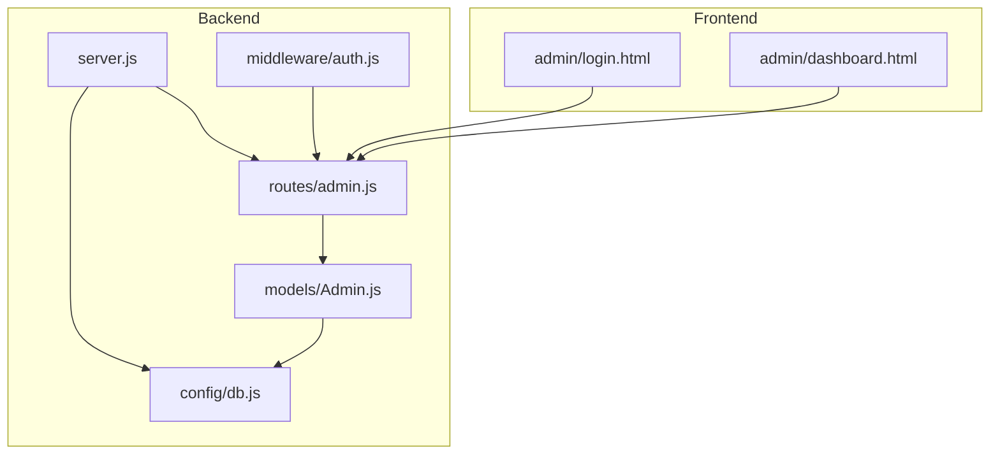
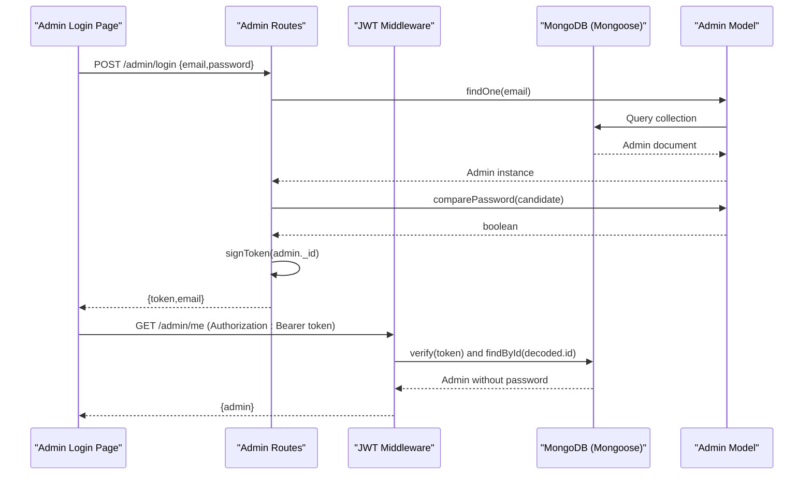
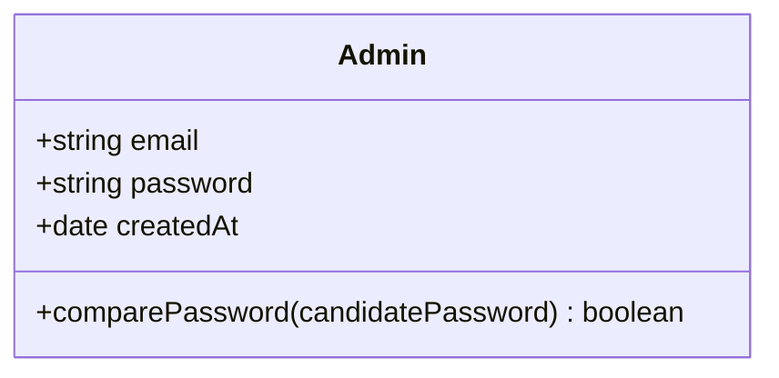
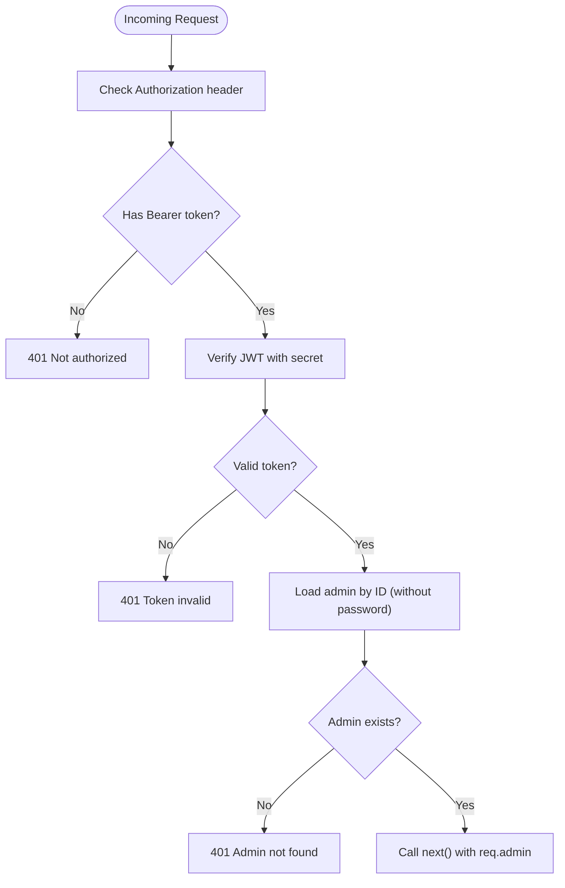
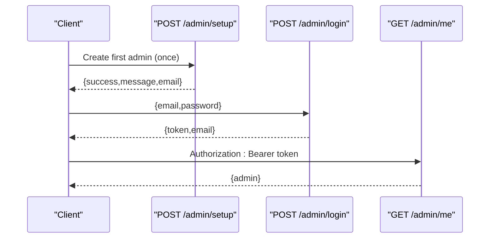
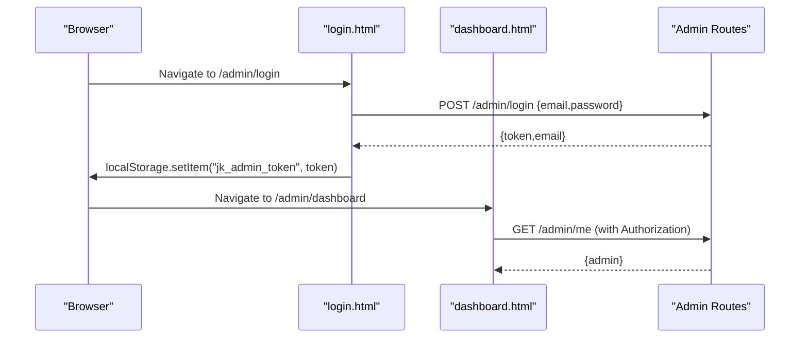
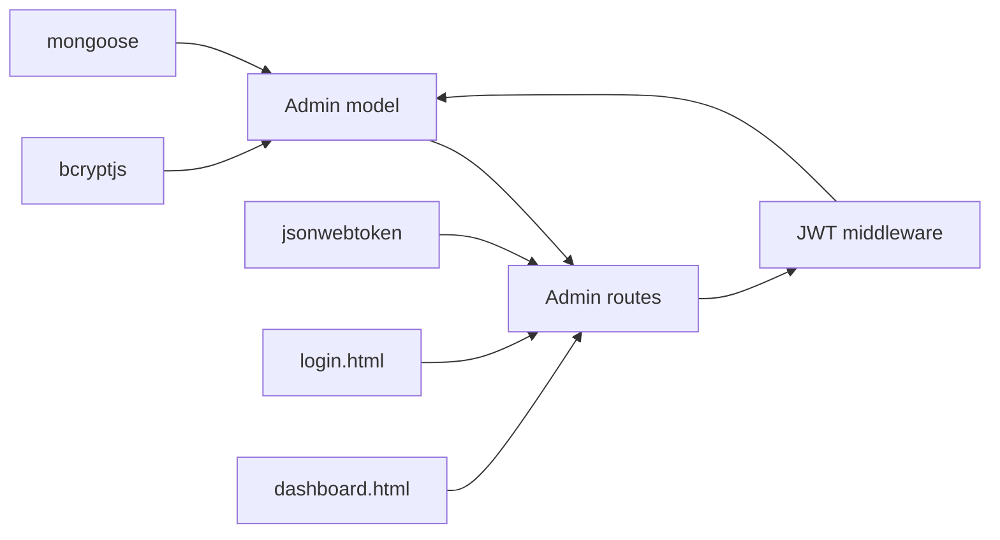

# Admin Model

<cite>
**Referenced Files in This Document**
- [Admin.js](file://jk-mobiles/backend/models/Admin.js)
- [auth.js](file://jk-mobiles/backend/middleware/auth.js)
- [admin.js](file://jk-mobiles/backend/routes/admin.js)
- [db.js](file://jk-mobiles/backend/config/db.js)
- [server.js](file://jk-mobiles/backend/server.js)
- [login.html](file://jk-mobiles/frontend/admin/login.html)
- [dashboard.html](file://jk-mobiles/frontend/admin/dashboard.html)
- [README.md](file://jk-mobiles/README.md)
</cite>

## Table of Contents
1. [Introduction](#introduction)
2. [Project Structure](#project-structure)
3. [Core Components](#core-components)
4. [Architecture Overview](#architecture-overview)
5. [Detailed Component Analysis](#detailed-component-analysis)
6. [Dependency Analysis](#dependency-analysis)
7. [Performance Considerations](#performance-considerations)
8. [Troubleshooting Guide](#troubleshooting-guide)
9. [Conclusion](#conclusion)
10. [Appendices](#appendices)

## Introduction
This document provides comprehensive data model documentation for the Admin schema used for administrative authentication in JK Mobiles. It covers the Admin model’s fields and constraints, password hashing with bcrypt, automatic timestamp creation, and the integration with the authentication system. It also explains JWT token generation, admin session management, and the admin setup process. Security measures such as password encryption, email normalization, and admin privilege management are detailed, along with best practices and access control patterns.

## Project Structure
The Admin model resides in the backend under the models directory and integrates with Express routes, JWT middleware, and MongoDB via Mongoose. The frontend admin pages handle login and session management using local storage and JWT tokens.

**Diagram sources**
- [server.js:1-52](file://jk-mobiles/backend/server.js#L1-L52)
- [admin.js:1-55](file://jk-mobiles/backend/routes/admin.js#L1-L55)
- [Admin.js:1-34](file://jk-mobiles/backend/models/Admin.js#L1-L34)
- [auth.js:1-34](file://jk-mobiles/backend/middleware/auth.js#L1-L34)
- [db.js:1-17](file://jk-mobiles/backend/config/db.js#L1-L17)
- [login.html:1-376](file://jk-mobiles/frontend/admin/login.html#L1-L376)
- [dashboard.html:1-1233](file://jk-mobiles/frontend/admin/dashboard.html#L1-L1233)

**Section sources**
- [server.js:1-52](file://jk-mobiles/backend/server.js#L1-L52)
- [admin.js:1-55](file://jk-mobiles/backend/routes/admin.js#L1-L55)
- [Admin.js:1-34](file://jk-mobiles/backend/models/Admin.js#L1-L34)
- [auth.js:1-34](file://jk-mobiles/backend/middleware/auth.js#L1-L34)
- [db.js:1-17](file://jk-mobiles/backend/config/db.js#L1-L17)
- [login.html:1-376](file://jk-mobiles/frontend/admin/login.html#L1-L376)
- [dashboard.html:1-1233](file://jk-mobiles/frontend/admin/dashboard.html#L1-L1233)

## Core Components
- Admin model: Defines email and password fields with required and unique constraints, and an automatic createdAt timestamp. Implements pre-save hook to hash passwords and a comparePassword method for verification.
- Authentication middleware: Validates JWT tokens from Authorization headers and attaches admin info to requests.
- Admin routes: Provides admin setup (one-time), login (JWT issuance), and protected route to verify token and return admin info.
- Frontend admin pages: Handles login submission, stores JWT in local storage, and enforces token presence for dashboard access.

Key implementation references:
- Admin schema and hooks: [Admin.js:4-31](file://jk-mobiles/backend/models/Admin.js#L4-L31)
- JWT middleware: [auth.js:4-31](file://jk-mobiles/backend/middleware/auth.js#L4-L31)
- Admin routes: [admin.js:7-52](file://jk-mobiles/backend/routes/admin.js#L7-L52)
- Frontend login and dashboard: [login.html:312-373](file://jk-mobiles/frontend/admin/login.html#L312-L373), [dashboard.html:954-1016](file://jk-mobiles/frontend/admin/dashboard.html#L954-L1016)

**Section sources**
- [Admin.js:1-34](file://jk-mobiles/backend/models/Admin.js#L1-L34)
- [auth.js:1-34](file://jk-mobiles/backend/middleware/auth.js#L1-L34)
- [admin.js:1-55](file://jk-mobiles/backend/routes/admin.js#L1-L55)
- [login.html:312-373](file://jk-mobiles/frontend/admin/login.html#L312-L373)
- [dashboard.html:954-1016](file://jk-mobiles/frontend/admin/dashboard.html#L954-L1016)

## Architecture Overview
The Admin authentication flow spans frontend and backend:
- Frontend login posts credentials to backend.
- Backend verifies credentials and issues a JWT.
- Frontend stores the JWT and sends it with subsequent protected requests.
- Middleware validates the JWT and attaches admin context to requests.

**Diagram sources**
- [admin.js:28-52](file://jk-mobiles/backend/routes/admin.js#L28-L52)
- [auth.js:4-31](file://jk-mobiles/backend/middleware/auth.js#L4-L31)
- [Admin.js:28-31](file://jk-mobiles/backend/models/Admin.js#L28-L31)

**Section sources**
- [admin.js:28-52](file://jk-mobiles/backend/routes/admin.js#L28-L52)
- [auth.js:4-31](file://jk-mobiles/backend/middleware/auth.js#L4-L31)
- [Admin.js:28-31](file://jk-mobiles/backend/models/Admin.js#L28-L31)

## Detailed Component Analysis

### Admin Model
The Admin model defines the schema and implements password hashing and verification:
- email: required, unique, stored lowercase for normalization.
- password: required; hashed before save using bcrypt with a salt factor.
- createdAt: automatically set to current timestamp.
- comparePassword: bcrypt-based verification method.

**Diagram sources**
- [Admin.js:4-31](file://jk-mobiles/backend/models/Admin.js#L4-L31)

Security and data integrity:
- Uniqueness constraint on email prevents duplicates.
- Lowercase normalization ensures consistent lookups.
- Pre-save hook guarantees password hashing on create/update.
- comparePassword uses bcrypt to securely verify credentials.

**Section sources**
- [Admin.js:4-31](file://jk-mobiles/backend/models/Admin.js#L4-L31)

### Authentication Middleware
The JWT middleware enforces admin session protection:
- Extracts Bearer token from Authorization header.
- Verifies token against JWT_SECRET.
- Loads admin from DB by decoded ID and excludes password from response.
- Returns 401 for missing or invalid tokens.

**Diagram sources**
- [auth.js:4-31](file://jk-mobiles/backend/middleware/auth.js#L4-L31)

**Section sources**
- [auth.js:1-34](file://jk-mobiles/backend/middleware/auth.js#L1-L34)

### Admin Routes
Endpoints and behaviors:
- POST /admin/setup: Creates the first admin using environment variables ADMIN_EMAIL and ADMIN_PASSWORD if no admin exists yet.
- POST /admin/login: Validates credentials, returns JWT token and admin email.
- GET /admin/me: Protected endpoint that returns admin info using JWT middleware.

**Diagram sources**
- [admin.js:11-52](file://jk-mobiles/backend/routes/admin.js#L11-L52)

**Section sources**
- [admin.js:11-52](file://jk-mobiles/backend/routes/admin.js#L11-L52)

### Frontend Admin Pages
- Login page:
  - Submits credentials to backend.
  - Stores JWT in localStorage and navigates to dashboard on success.
  - Shows errors and network issues.
- Dashboard:
  - Requires JWT presence; redirects to login if absent.
  - Sends Authorization: Bearer token with all protected API calls.
  - Handles token expiration by clearing local storage and redirecting.

**Diagram sources**
- [login.html:335-373](file://jk-mobiles/frontend/admin/login.html#L335-L373)
- [dashboard.html:954-1016](file://jk-mobiles/frontend/admin/dashboard.html#L954-L1016)
- [admin.js:28-52](file://jk-mobiles/backend/routes/admin.js#L28-L52)

**Section sources**
- [login.html:312-373](file://jk-mobiles/frontend/admin/login.html#L312-L373)
- [dashboard.html:954-1016](file://jk-mobiles/frontend/admin/dashboard.html#L954-L1016)
- [admin.js:28-52](file://jk-mobiles/backend/routes/admin.js#L28-L52)

## Dependency Analysis
- Admin model depends on Mongoose and bcryptjs.
- Admin routes depend on Admin model, JWT signing, and auth middleware.
- JWT middleware depends on jsonwebtoken and Admin model.
- Frontend pages depend on backend endpoints and local storage.

**Diagram sources**
- [Admin.js:1-34](file://jk-mobiles/backend/models/Admin.js#L1-L34)
- [admin.js:1-55](file://jk-mobiles/backend/routes/admin.js#L1-L55)
- [auth.js:1-34](file://jk-mobiles/backend/middleware/auth.js#L1-L34)
- [login.html:312-373](file://jk-mobiles/frontend/admin/login.html#L312-L373)
- [dashboard.html:954-1016](file://jk-mobiles/frontend/admin/dashboard.html#L954-L1016)

**Section sources**
- [Admin.js:1-34](file://jk-mobiles/backend/models/Admin.js#L1-L34)
- [admin.js:1-55](file://jk-mobiles/backend/routes/admin.js#L1-L55)
- [auth.js:1-34](file://jk-mobiles/backend/middleware/auth.js#L1-L34)
- [login.html:312-373](file://jk-mobiles/frontend/admin/login.html#L312-L373)
- [dashboard.html:954-1016](file://jk-mobiles/frontend/admin/dashboard.html#L954-L1016)

## Performance Considerations
- Password hashing uses a moderate cost factor; adjust bcrypt salt factor if scaling is anticipated.
- Unique index on email improves lookup performance; ensure MongoDB has appropriate indexes.
- JWT verification is lightweight; keep token payload minimal.
- Frontend caching of admin info in localStorage reduces repeated requests.

[No sources needed since this section provides general guidance]

## Troubleshooting Guide
Common issues and resolutions:
- Admin already exists during setup:
  - The setup endpoint checks for existing admins and returns an error if one exists. Remove the existing admin document from the database to reset.
  - Reference: [admin.js:14-17](file://jk-mobiles/backend/routes/admin.js#L14-L17)
- Invalid email or password:
  - Login endpoint validates both fields and compares password using bcrypt; ensure email is lowercase and credentials match.
  - Reference: [admin.js:33-40](file://jk-mobiles/backend/routes/admin.js#L33-L40)
- Token invalid or missing:
  - Middleware returns 401 for missing or invalid tokens; confirm Authorization header format and JWT_SECRET correctness.
  - Reference: [auth.js:14-30](file://jk-mobiles/backend/middleware/auth.js#L14-L30)
- Token expiration:
  - Frontend clears local storage on 401 responses and redirects to login.
  - Reference: [dashboard.html:978-982](file://jk-mobiles/frontend/admin/dashboard.html#L978-L982)

**Section sources**
- [admin.js:14-17](file://jk-mobiles/backend/routes/admin.js#L14-L17)
- [admin.js:33-40](file://jk-mobiles/backend/routes/admin.js#L33-L40)
- [auth.js:14-30](file://jk-mobiles/backend/middleware/auth.js#L14-L30)
- [dashboard.html:978-982](file://jk-mobiles/frontend/admin/dashboard.html#L978-L982)

## Conclusion
The Admin model and authentication system in JK Mobiles implement secure, standardized patterns:
- Email normalization and uniqueness prevent conflicts and improve reliability.
- bcrypt-based password hashing ensures robust credential protection.
- JWT-based session management enables secure, stateless admin access.
- Frontend pages enforce token presence and handle token lifecycle gracefully.

[No sources needed since this section summarizes without analyzing specific files]

## Appendices

### Admin Setup Process and Initial Account Creation
- Run the setup endpoint once to create the first admin using environment variables for email and password.
- After successful setup, log in with the provided credentials and immediately change the password via environment variables and rerun setup.

References:
- Setup endpoint: [admin.js:11-26](file://jk-mobiles/backend/routes/admin.js#L11-L26)
- Default credentials and instructions: [README.md:70-83](file://jk-mobiles/README.md#L70-L83), [README.md:144-150](file://jk-mobiles/README.md#L144-L150)

**Section sources**
- [admin.js:11-26](file://jk-mobiles/backend/routes/admin.js#L11-L26)
- [README.md:70-83](file://jk-mobiles/README.md#L70-L83)
- [README.md:144-150](file://jk-mobiles/README.md#L144-L150)

### Authentication Flow Examples
- Admin creation:
  - Call POST /admin/setup to create the first admin.
  - Reference: [admin.js:11-26](file://jk-mobiles/backend/routes/admin.js#L11-L26)
- Password verification:
  - Use comparePassword on the Admin instance to verify candidate passwords.
  - Reference: [Admin.js:28-31](file://jk-mobiles/backend/models/Admin.js#L28-L31)
- Authentication flow:
  - Login with email/password to receive a JWT.
  - Use Authorization: Bearer token for protected routes.
  - Reference: [admin.js:28-52](file://jk-mobiles/backend/routes/admin.js#L28-L52), [auth.js:4-31](file://jk-mobiles/backend/middleware/auth.js#L4-L31)

**Section sources**
- [admin.js:11-26](file://jk-mobiles/backend/routes/admin.js#L11-L26)
- [Admin.js:28-31](file://jk-mobiles/backend/models/Admin.js#L28-L31)
- [admin.js:28-52](file://jk-mobiles/backend/routes/admin.js#L28-L52)
- [auth.js:4-31](file://jk-mobiles/backend/middleware/auth.js#L4-L31)

### Security Best Practices and Access Control Patterns
- Password encryption:
  - bcrypt hashing is enforced via pre-save hook; ensure adequate salt factor and periodic updates.
  - Reference: [Admin.js:21-26](file://jk-mobiles/backend/models/Admin.js#L21-L26)
- Email validation and normalization:
  - Store emails in lowercase and rely on unique index to prevent duplicates.
  - Reference: [Admin.js:5-10](file://jk-mobiles/backend/models/Admin.js#L5-L10)
- Admin privilege management:
  - Single Admin role with full access; no granular permissions implemented.
  - Reference: [auth.js:22-26](file://jk-mobiles/backend/middleware/auth.js#L22-L26)
- Session management:
  - JWT tokens stored in localStorage; middleware strips password from admin payload.
  - Reference: [auth.js:22-26](file://jk-mobiles/backend/middleware/auth.js#L22-L26), [login.html:358-361](file://jk-mobiles/frontend/admin/login.html#L358-L361), [dashboard.html:974](file://jk-mobiles/frontend/admin/dashboard.html#L974)

**Section sources**
- [Admin.js:21-26](file://jk-mobiles/backend/models/Admin.js#L21-L26)
- [Admin.js:5-10](file://jk-mobiles/backend/models/Admin.js#L5-L10)
- [auth.js:22-26](file://jk-mobiles/backend/middleware/auth.js#L22-L26)
- [login.html:358-361](file://jk-mobiles/frontend/admin/login.html#L358-L361)
- [dashboard.html:974](file://jk-mobiles/frontend/admin/dashboard.html#L974)