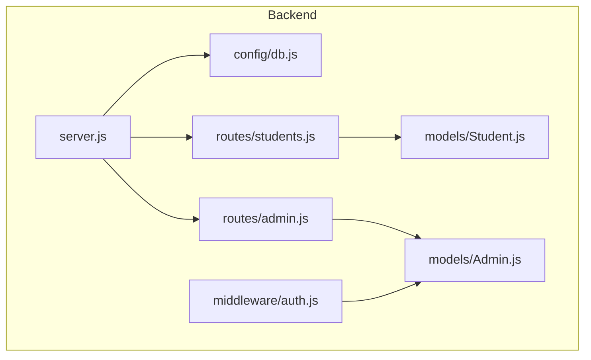
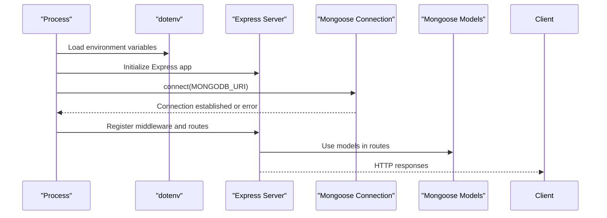
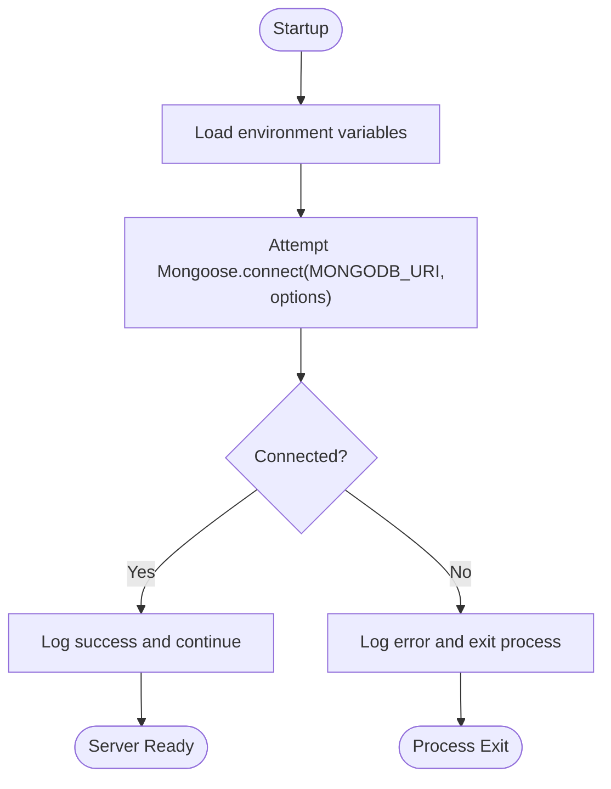
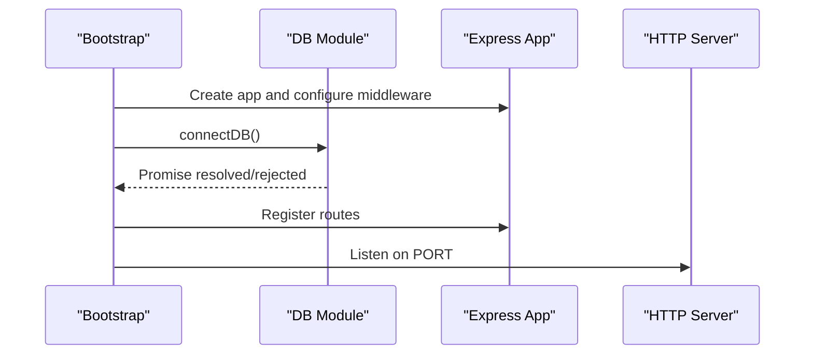
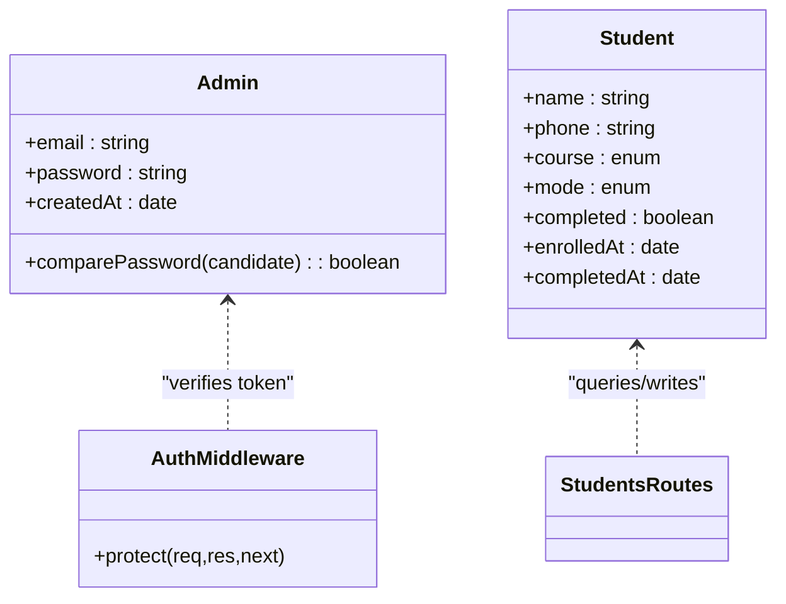
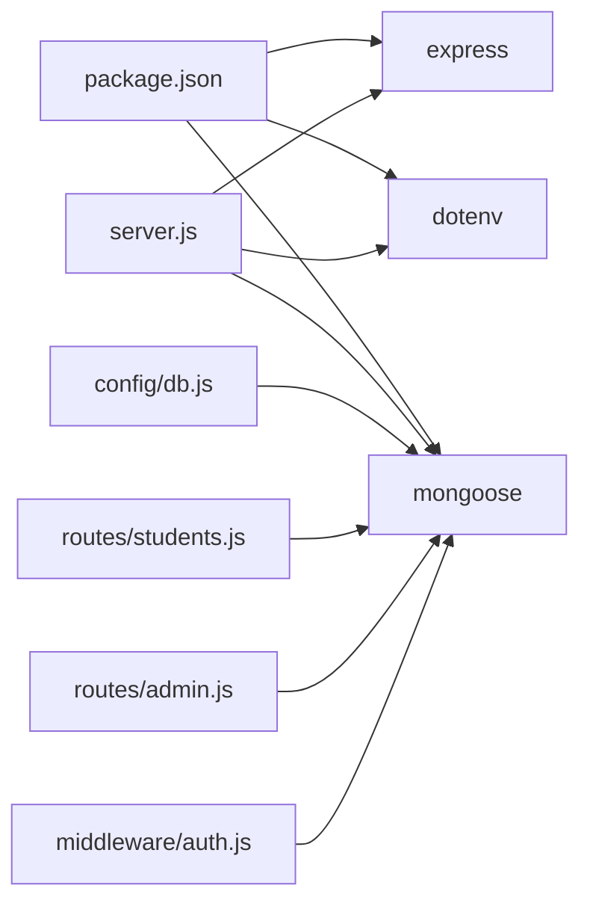

# Database Configuration

<cite>
**Referenced Files in This Document**
- [db.js](file://jk-mobiles/backend/config/db.js)
- [server.js](file://jk-mobiles/backend/server.js)
- [package.json](file://jk-mobiles/backend/package.json)
- [students.js](file://jk-mobiles/backend/routes/students.js)
- [admin.js](file://jk-mobiles/backend/routes/admin.js)
- [auth.js](file://jk-mobiles/backend/middleware/auth.js)
- [Admin.js](file://jk-mobiles/backend/models/Admin.js)
- [Student.js](file://jk-mobiles/backend/models/Student.js)
</cite>

## Table of Contents
1. [Introduction](#introduction)
2. [Project Structure](#project-structure)
3. [Core Components](#core-components)
4. [Architecture Overview](#architecture-overview)
5. [Detailed Component Analysis](#detailed-component-analysis)
6. [Dependency Analysis](#dependency-analysis)
7. [Performance Considerations](#performance-considerations)
8. [Troubleshooting Guide](#troubleshooting-guide)
9. [Conclusion](#conclusion)
10. [Appendices](#appendices)

## Introduction
This document explains how the backend connects to MongoDB using Mongoose and outlines the current configuration, environment variable usage, and operational behavior. It focuses on the MongoDB Atlas connection setup, connection string configuration, environment variable usage, connection pooling defaults, retry mechanisms, error handling strategies, and the database connection lifecycle. It also provides guidance for development and production environments, SSL/TLS considerations, timeouts, best practices, monitoring, failure handling, security, and troubleshooting.

## Project Structure
The backend uses a minimal but effective setup:
- Environment configuration via dotenv
- Centralized database connection in a dedicated module
- Express server initialization and route registration
- Mongoose models for Admin and Student collections
- Route handlers that perform database operations

**Diagram sources**
- [server.js:1-52](file://jk-mobiles/backend/server.js#L1-L52)
- [db.js:1-17](file://jk-mobiles/backend/config/db.js#L1-L17)
- [students.js:1-100](file://jk-mobiles/backend/routes/students.js#L1-L100)
- [admin.js:1-55](file://jk-mobiles/backend/routes/admin.js#L1-L55)
- [Admin.js:1-34](file://jk-mobiles/backend/models/Admin.js#L1-L34)
- [Student.js:1-39](file://jk-mobiles/backend/models/Student.js#L1-L39)
- [auth.js:1-34](file://jk-mobiles/backend/middleware/auth.js#L1-L34)

**Section sources**
- [server.js:1-52](file://jk-mobiles/backend/server.js#L1-L52)
- [db.js:1-17](file://jk-mobiles/backend/config/db.js#L1-L17)
- [package.json:1-22](file://jk-mobiles/backend/package.json#L1-L22)

## Core Components
- Database connection module: Establishes a single Mongoose connection at startup and logs success or failure.
- Server bootstrap: Loads environment variables, initializes the Express app, connects to MongoDB, registers middleware and routes, and starts the HTTP server.
- Models: Define Admin and Student schemas and include pre-save hooks for password hashing and comparison methods.
- Routes: Use models to perform CRUD operations and expose endpoints for student enrollment, listing, completion marking, certificate retrieval, statistics, and admin operations.
- Authentication middleware: Validates JWT tokens against the Admin collection.

Key environment variables used:
- MONGODB_URI: MongoDB connection string
- PORT: Server port
- JWT_SECRET: Secret for signing JWT tokens
- ADMIN_EMAIL and ADMIN_PASSWORD: Defaults for initial admin setup

**Section sources**
- [db.js:1-17](file://jk-mobiles/backend/config/db.js#L1-L17)
- [server.js:1-52](file://jk-mobiles/backend/server.js#L1-L52)
- [admin.js:11-26](file://jk-mobiles/backend/routes/admin.js#L11-L26)
- [auth.js:22](file://jk-mobiles/backend/middleware/auth.js#L22)
- [Admin.js:22-31](file://jk-mobiles/backend/models/Admin.js#L22-L31)
- [Student.js:1-39](file://jk-mobiles/backend/models/Student.js#L1-L39)
- [students.js:1-100](file://jk-mobiles/backend/routes/students.js#L1-L100)

## Architecture Overview
The backend initializes the database connection during server startup and relies on Mongoose’s default connection pool. Routes and middleware operate on top of this connection. Authentication middleware verifies tokens against the Admin collection.

**Diagram sources**
- [server.js:1-52](file://jk-mobiles/backend/server.js#L1-L52)
- [db.js:3-14](file://jk-mobiles/backend/config/db.js#L3-L14)
- [Admin.js:1-34](file://jk-mobiles/backend/models/Admin.js#L1-L34)
- [Student.js:1-39](file://jk-mobiles/backend/models/Student.js#L1-L39)

## Detailed Component Analysis

### Database Connection Module
Responsibilities:
- Accepts the MongoDB connection string from the environment
- Uses Mongoose to establish a connection with legacy compatibility flags
- Logs success or failure and exits the process on connection errors

Operational behavior:
- Connection is attempted once at server startup
- No explicit retry loop is implemented in code
- Default Mongoose connection pool settings apply

**Diagram sources**
- [db.js:3-14](file://jk-mobiles/backend/config/db.js#L3-L14)
- [server.js:8-9](file://jk-mobiles/backend/server.js#L8-L9)

**Section sources**
- [db.js:1-17](file://jk-mobiles/backend/config/db.js#L1-L17)
- [server.js:8-9](file://jk-mobiles/backend/server.js#L8-L9)

### Server Bootstrap and Lifecycle
Responsibilities:
- Loads environment variables
- Initializes Express app
- Registers CORS, JSON, and URL-encoded middleware
- Connects to MongoDB
- Registers routes for students and admin
- Starts the HTTP server on the configured port

Lifecycle:
- On startup: load env → connect DB → register middleware and routes → listen
- On shutdown: no explicit disconnect is performed in code

**Diagram sources**
- [server.js:1-52](file://jk-mobiles/backend/server.js#L1-L52)
- [db.js:3-14](file://jk-mobiles/backend/config/db.js#L3-L14)

**Section sources**
- [server.js:1-52](file://jk-mobiles/backend/server.js#L1-L52)

### Models and Collections
- Admin model: Defines email/password fields, hashes passwords before save, and exposes a password comparison method.
- Student model: Defines enrollment fields, computed completion status, and timestamps.

Usage:
- Routes import models and perform queries and writes
- Authentication middleware queries the Admin collection to validate tokens

**Diagram sources**
- [Admin.js:1-34](file://jk-mobiles/backend/models/Admin.js#L1-L34)
- [Student.js:1-39](file://jk-mobiles/backend/models/Student.js#L1-L39)
- [auth.js:4-31](file://jk-mobiles/backend/middleware/auth.js#L4-L31)
- [students.js:3-4](file://jk-mobiles/backend/routes/students.js#L3)

**Section sources**
- [Admin.js:1-34](file://jk-mobiles/backend/models/Admin.js#L1-L34)
- [Student.js:1-39](file://jk-mobiles/backend/models/Student.js#L1-L39)
- [students.js:3-4](file://jk-mobiles/backend/routes/students.js#L3)
- [auth.js:4-31](file://jk-mobiles/backend/middleware/auth.js#L4-L31)

### Routes and Database Operations
- Students routes: Add enrollments, list students, mark completion, fetch certificate by phone, and compute dashboard statistics.
- Admin routes: Setup admin account (first-run), login, and profile verification protected by JWT.

Operational notes:
- Routes perform database operations using Mongoose models
- Authentication middleware enforces token-based access for admin-protected endpoints

**Section sources**
- [students.js:6-97](file://jk-mobiles/backend/routes/students.js#L6-L97)
- [admin.js:11-52](file://jk-mobiles/backend/routes/admin.js#L11-L52)
- [auth.js:4-31](file://jk-mobiles/backend/middleware/auth.js#L4-L31)

## Dependency Analysis
Direct dependencies relevant to database configuration:
- Mongoose is used for connecting to MongoDB and modeling documents
- dotenv is used to load environment variables at startup
- Express serves as the HTTP framework and integrates with the database through routes and middleware

**Diagram sources**
- [package.json:10-16](file://jk-mobiles/backend/package.json#L10-L16)
- [server.js:1](file://jk-mobiles/backend/server.js#L1)
- [db.js:1](file://jk-mobiles/backend/config/db.js#L1)
- [students.js:3](file://jk-mobiles/backend/routes/students.js#L3)
- [admin.js:4](file://jk-mobiles/backend/routes/admin.js#L4)
- [auth.js:2](file://jk-mobiles/backend/middleware/auth.js#L2)

**Section sources**
- [package.json:10-16](file://jk-mobiles/backend/package.json#L10-L16)
- [server.js:1](file://jk-mobiles/backend/server.js#L1)

## Performance Considerations
Current state:
- Default Mongoose connection pool settings are used; no explicit pool configuration is present in the code
- No retry mechanism is implemented in the connection module
- No connection timeout configuration is set in the code

Recommendations (general guidance):
- Configure connection pool size and lifetime based on expected concurrency and resource limits
- Add retry logic around connection attempts with exponential backoff
- Set connection and socket timeouts appropriate for your deployment environment
- Monitor connection pool utilization and adjust poolMaxIdleTime and similar options if needed
- Consider enabling connection compression and TLS for production deployments

[No sources needed since this section provides general guidance]

## Troubleshooting Guide
Common issues and resolutions aligned with the current implementation:

- Connection fails immediately at startup
  - Verify MONGODB_URI is set and correct
  - Check network access to the MongoDB host
  - Review error logs emitted on connection failure

- Authentication failures
  - Ensure JWT_SECRET is set and consistent
  - Confirm the Admin record exists and credentials are correct
  - Validate token issuance and header format (Bearer)

- Route errors returning internal server errors
  - Inspect route handlers for unhandled exceptions
  - Ensure models are imported and used consistently

- Port binding issues
  - Change PORT environment variable if the default port is in use

**Section sources**
- [db.js:10-12](file://jk-mobiles/backend/config/db.js#L10-L12)
- [server.js:43-46](file://jk-mobiles/backend/server.js#L43-L46)
- [admin.js:37-40](file://jk-mobiles/backend/routes/admin.js#L37-L40)
- [auth.js:21-30](file://jk-mobiles/backend/middleware/auth.js#L21-L30)

## Conclusion
The backend establishes a single Mongoose connection at startup using the MONGODB_URI environment variable and proceeds with server initialization. Models and routes rely on this connection for database operations. While the setup is straightforward, it currently lacks explicit connection pooling configuration, retry logic, and timeout settings. Production deployments should consider adding these configurations, robust error handling, and monitoring to ensure reliability and performance.

[No sources needed since this section summarizes without analyzing specific files]

## Appendices

### Environment Variables Reference
- MONGODB_URI: MongoDB connection string used by Mongoose
- PORT: Server port (default 5000)
- JWT_SECRET: Secret used to sign JWT tokens
- ADMIN_EMAIL: Default admin email for first-run setup
- ADMIN_PASSWORD: Default admin password for first-run setup

**Section sources**
- [server.js:48](file://jk-mobiles/backend/server.js#L48)
- [admin.js:19-20](file://jk-mobiles/backend/routes/admin.js#L19-L20)
- [auth.js:22](file://jk-mobiles/backend/middleware/auth.js#L22)

### MongoDB Atlas Connection Setup
- Use the MongoDB connection string provided by MongoDB Atlas
- Ensure the connection string includes the required authentication credentials and cluster details
- For production, enable TLS and consider network-level security (VPC peering, private endpoints)

[No sources needed since this section provides general guidance]

### SSL/TLS and Network Security
- Enable TLS in the MongoDB connection string for encrypted connections
- Restrict network access to the database cluster using VPC peering or private endpoints
- Store secrets (connection strings, JWT secret) securely using platform-managed secret stores

[No sources needed since this section provides general guidance]