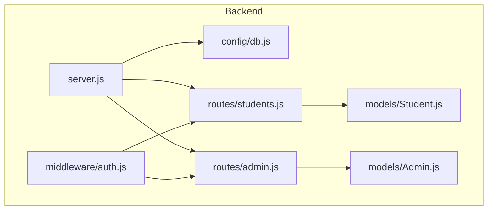
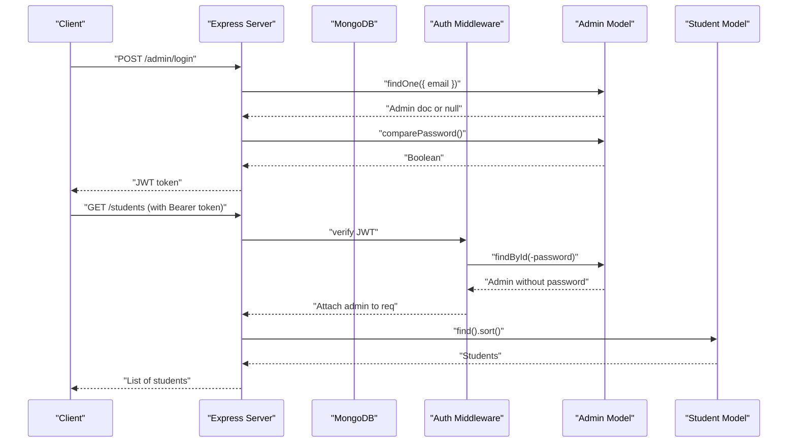
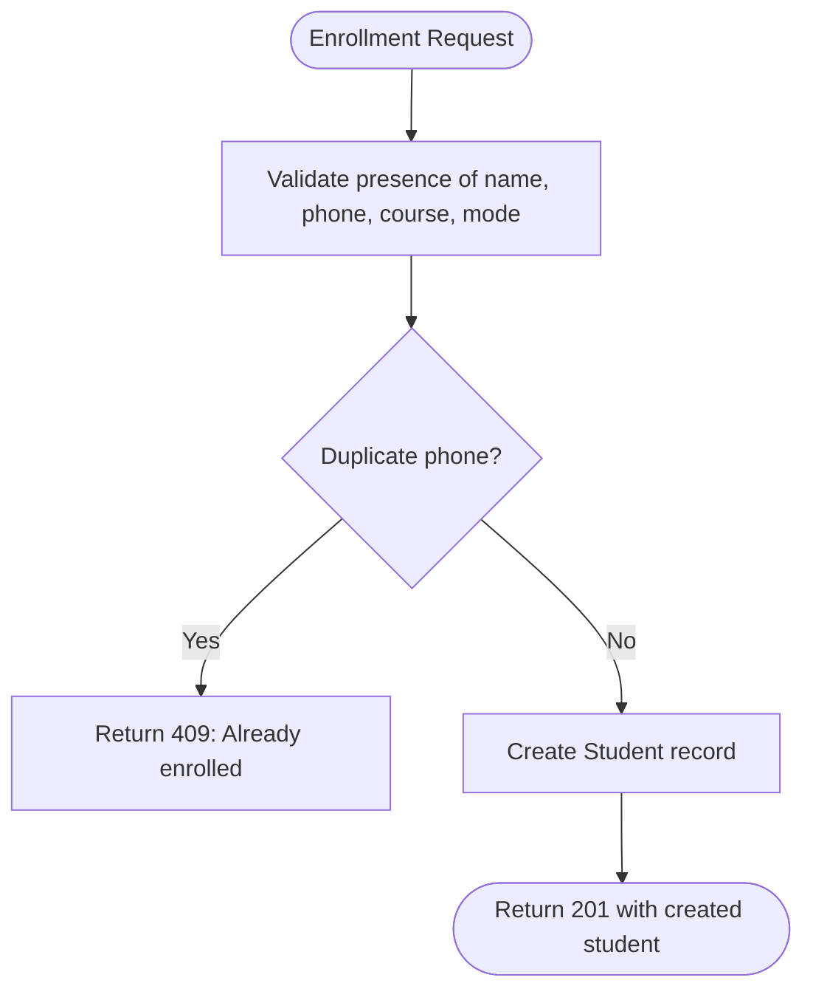
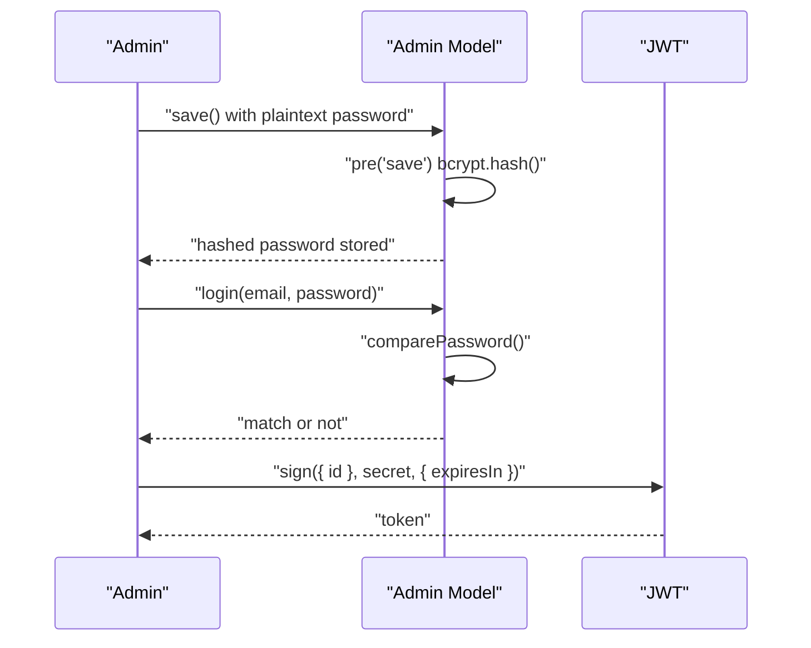
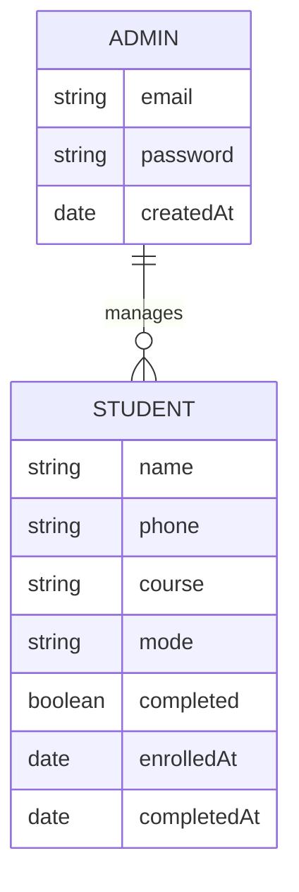
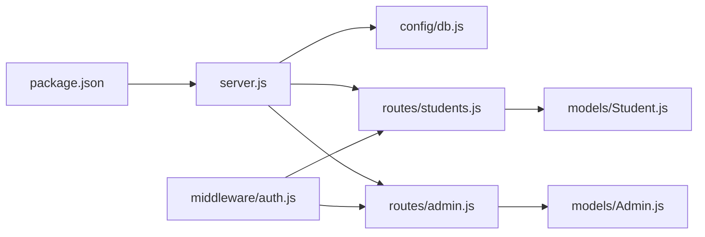

# Database Design

<cite>
**Referenced Files in This Document**
- [Student.js](file://jk-mobiles/backend/models/Student.js)
- [Admin.js](file://jk-mobiles/backend/models/Admin.js)
- [db.js](file://jk-mobiles/backend/config/db.js)
- [server.js](file://jk-mobiles/backend/server.js)
- [students.js](file://jk-mobiles/backend/routes/students.js)
- [admin.js](file://jk-mobiles/backend/routes/admin.js)
- [auth.js](file://jk-mobiles/backend/middleware/auth.js)
- [package.json](file://jk-mobiles/backend/package.json)
- [README.md](file://jk-mobiles/README.md)
</cite>

## Table of Contents
1. [Introduction](#introduction)
2. [Project Structure](#project-structure)
3. [Core Components](#core-components)
4. [Architecture Overview](#architecture-overview)
5. [Detailed Component Analysis](#detailed-component-analysis)
6. [Dependency Analysis](#dependency-analysis)
7. [Performance Considerations](#performance-considerations)
8. [Troubleshooting Guide](#troubleshooting-guide)
9. [Conclusion](#conclusion)
10. [Appendices](#appendices)

## Introduction
This document provides comprehensive data model documentation for the JK Mobiles training institute application. It focuses on the Student and Admin models, their Mongoose schema definitions, validation rules, business constraints, and operational patterns. It also covers authentication, middleware usage, data relationships, indexing strategy, and performance optimization recommendations. The goal is to enable developers and stakeholders to understand how data is modeled, validated, stored, and accessed within the backend.

## Project Structure
The backend is organized around a clear separation of concerns:
- Models define the data schemas and business rules.
- Routes expose REST endpoints for CRUD operations and admin authentication.
- Middleware enforces JWT-based authorization.
- Config initializes the database connection.
- Server orchestrates middleware, routes, and error handling.

**Diagram sources**
- [server.js:1-52](file://jk-mobiles/backend/server.js#L1-L52)
- [db.js:1-17](file://jk-mobiles/backend/config/db.js#L1-L17)
- [auth.js:1-34](file://jk-mobiles/backend/middleware/auth.js#L1-L34)
- [students.js:1-100](file://jk-mobiles/backend/routes/students.js#L1-L100)
- [admin.js:1-55](file://jk-mobiles/backend/routes/admin.js#L1-L55)
- [Student.js:1-39](file://jk-mobiles/backend/models/Student.js#L1-L39)
- [Admin.js:1-34](file://jk-mobiles/backend/models/Admin.js#L1-L34)

**Section sources**
- [server.js:1-52](file://jk-mobiles/backend/server.js#L1-L52)
- [README.md:7-42](file://jk-mobiles/README.md#L7-L42)

## Core Components
This section documents the two primary data models and their associated constraints and behaviors.

### Student Model
- Purpose: Represents enrolled students with enrollment metadata and completion tracking.
- Fields and constraints:
  - name: String, required, trimmed.
  - phone: String, required, unique, trimmed.
  - course: String, required, restricted to predefined values.
  - mode: String, required, restricted to predefined values.
  - completed: Boolean, defaults to false.
  - enrolledAt: Date, defaults to current timestamp.
  - completedAt: Date, optional.
- Business constraints:
  - Unique phone number ensures no duplicate enrollments.
  - Completion status is managed via a dedicated endpoint.
  - Certificate retrieval is gated by completion status.
- Validation patterns:
  - Schema-level required and enum validations.
  - Route-level checks for missing fields during enrollment.
  - Duplicate phone detection before creation.

**Section sources**
- [Student.js:3-36](file://jk-mobiles/backend/models/Student.js#L3-L36)
- [students.js:6-25](file://jk-mobiles/backend/routes/students.js#L6-L25)

### Admin Model
- Purpose: Stores administrative credentials and provides secure authentication.
- Fields and constraints:
  - email: String, required, unique, lowercased.
  - password: String, required.
  - createdAt: Date, defaults to current timestamp.
- Security:
  - Password hashing is enforced via pre-save middleware using bcrypt.
  - A comparePassword instance method enables secure credential verification.
- Authentication flow:
  - Admin login validates credentials and issues a JWT.
  - Authorization middleware verifies tokens and attaches admin context.

**Section sources**
- [Admin.js:4-19](file://jk-mobiles/backend/models/Admin.js#L4-L19)
- [Admin.js:21-31](file://jk-mobiles/backend/models/Admin.js#L21-L31)
- [admin.js:28-47](file://jk-mobiles/backend/routes/admin.js#L28-L47)
- [auth.js:4-31](file://jk-mobiles/backend/middleware/auth.js#L4-L31)

## Architecture Overview
The backend connects to MongoDB via Mongoose, exposes REST endpoints, and enforces JWT-based authorization for protected routes.

**Diagram sources**
- [admin.js:28-47](file://jk-mobiles/backend/routes/admin.js#L28-L47)
- [auth.js:4-31](file://jk-mobiles/backend/middleware/auth.js#L4-L31)
- [students.js:27-35](file://jk-mobiles/backend/routes/students.js#L27-L35)
- [Admin.js:21-31](file://jk-mobiles/backend/models/Admin.js#L21-L31)
- [Student.js:1-39](file://jk-mobiles/backend/models/Student.js#L1-L39)

## Detailed Component Analysis

### Student Model Analysis
- Schema definition: Defines required fields, enums, defaults, and timestamps.
- Validation rules:
  - Required fields enforced at schema level.
  - Enum constraints ensure valid course and mode values.
  - Unique constraint on phone prevents duplicates.
- Business constraints:
  - Completion status toggled via a dedicated endpoint.
  - Certificate availability depends on completion flag.
- Query patterns:
  - Sorting by enrollment date for recent activity.
  - Counting total and completed students for dashboards.
  - Lookup by phone for certificate retrieval.

**Diagram sources**
- [students.js:6-25](file://jk-mobiles/backend/routes/students.js#L6-L25)
- [Student.js:3-36](file://jk-mobiles/backend/models/Student.js#L3-L36)

**Section sources**
- [Student.js:3-36](file://jk-mobiles/backend/models/Student.js#L3-L36)
- [students.js:6-25](file://jk-mobiles/backend/routes/students.js#L6-L25)
- [students.js:56-84](file://jk-mobiles/backend/routes/students.js#L56-L84)
- [students.js:86-97](file://jk-mobiles/backend/routes/students.js#L86-L97)

### Admin Model Analysis
- Schema definition: Basic fields with createdAt timestamp.
- Middleware:
  - Pre-save hook hashes passwords with bcrypt before saving.
  - Instance method compares candidate passwords against stored hash.
- Authentication:
  - Login endpoint finds admin by email, verifies password, and issues JWT.
  - Authorization middleware decodes token and attaches admin to request.

**Diagram sources**
- [Admin.js:21-31](file://jk-mobiles/backend/models/Admin.js#L21-L31)
- [admin.js:28-47](file://jk-mobiles/backend/routes/admin.js#L28-L47)
- [auth.js:4-31](file://jk-mobiles/backend/middleware/auth.js#L4-L31)

**Section sources**
- [Admin.js:4-19](file://jk-mobiles/backend/models/Admin.js#L4-L19)
- [Admin.js:21-31](file://jk-mobiles/backend/models/Admin.js#L21-L31)
- [admin.js:11-26](file://jk-mobiles/backend/routes/admin.js#L11-L26)
- [admin.js:28-47](file://jk-mobiles/backend/routes/admin.js#L28-L47)
- [auth.js:4-31](file://jk-mobiles/backend/middleware/auth.js#L4-L31)

### Data Relationships
- One-to-many relationship: Admin can manage many Students.
- No explicit foreign keys are defined in the schema; however, Admin is the sole entity that can access protected endpoints to manage Students.
- The Admin model does not reference Student; the relationship is enforced at the route and middleware level.

**Diagram sources**
- [Admin.js:4-19](file://jk-mobiles/backend/models/Admin.js#L4-L19)
- [Student.js:3-36](file://jk-mobiles/backend/models/Student.js#L3-L36)

**Section sources**
- [students.js:27-35](file://jk-mobiles/backend/routes/students.js#L27-L35)
- [auth.js:4-31](file://jk-mobiles/backend/middleware/auth.js#L4-L31)

### Indexing Strategy for Performance Optimization
Current schema-level indexes:
- Unique index on phone for Student.
- Unique index on email for Admin.

Recommended additional indexes (based on observed query patterns):
- Compound index on Student(enrolledAt, completed) to optimize sorting and filtering for dashboards.
- Text index on Student(name) to support name-based searches if needed.
- Sparse index on Student(completedAt) to reduce storage for incomplete records.

These recommendations align with:
- Sorting by enrollment date for recent activity.
- Filtering by completion status for dashboards.
- Certificate lookup by phone.

**Section sources**
- [Student.js:12](file://jk-mobiles/backend/models/Student.js#L12)
- [Admin.js:8](file://jk-mobiles/backend/models/Admin.js#L8)
- [students.js:27-35](file://jk-mobiles/backend/routes/students.js#L27-L35)
- [students.js:86-97](file://jk-mobiles/backend/routes/students.js#L86-L97)

### Data Validation Patterns
- Schema-level validation:
  - Required fields and enums enforce data integrity at persistence time.
  - Unique constraints prevent duplicates.
- Route-level validation:
  - Explicit checks for missing fields during enrollment.
  - Duplicate phone detection before creation.
- Business-level validation:
  - Certificate retrieval gated by completion flag.
  - Admin-only endpoints enforced by JWT middleware.

**Section sources**
- [Student.js:3-36](file://jk-mobiles/backend/models/Student.js#L3-L36)
- [students.js:6-25](file://jk-mobiles/backend/routes/students.js#L6-L25)
- [students.js:56-84](file://jk-mobiles/backend/routes/students.js#L56-L84)
- [auth.js:4-31](file://jk-mobiles/backend/middleware/auth.js#L4-L31)

### Sample Data Examples
- Student example:
  - name: "John Doe"
  - phone: "+919876543210"
  - course: "Basic"
  - mode: "Online"
  - completed: false
  - enrolledAt: "2025-04-01T10:00:00Z"
  - completedAt: null
- Admin example:
  - email: "admin@jkmobiles.com"
  - password: "<bcrypt_hash>"
  - createdAt: "2025-04-01T10:00:00Z"

Note: Passwords are hashed; do not store plaintext.

**Section sources**
- [Student.js:3-36](file://jk-mobiles/backend/models/Student.js#L3-L36)
- [Admin.js:4-19](file://jk-mobiles/backend/models/Admin.js#L4-L19)

### Query Patterns
- Retrieve all students ordered by enrollment date:
  - Endpoint: GET /students
  - Sort: enrolledAt descending
- Mark a student as completed:
  - Endpoint: PUT /students/complete/:id
  - Behavior: set completed to true and completedAt to now
- Certificate lookup:
  - Endpoint: GET /students/certificate/:phone
  - Behavior: return certificate fields if completed
- Dashboard statistics:
  - Endpoint: GET /students/stats/overview
  - Behavior: counts, pending, and recent enrollments

**Section sources**
- [students.js:27-35](file://jk-mobiles/backend/routes/students.js#L27-L35)
- [students.js:37-54](file://jk-mobiles/backend/routes/students.js#L37-L54)
- [students.js:56-84](file://jk-mobiles/backend/routes/students.js#L56-L84)
- [students.js:86-97](file://jk-mobiles/backend/routes/students.js#L86-L97)

### Virtual Properties and Middleware
- Virtual properties: None defined in the current schema.
- Middleware:
  - Admin pre-save hook hashes passwords.
  - Admin instance method compares passwords.
  - Auth middleware verifies JWT and attaches admin context.

**Section sources**
- [Admin.js:21-31](file://jk-mobiles/backend/models/Admin.js#L21-L31)
- [auth.js:4-31](file://jk-mobiles/backend/middleware/auth.js#L4-L31)

### Data Lifecycle
- Creation:
  - Student enrollment requires all fields and uniqueness check.
  - Admin creation via setup endpoint (run once).
- Updates:
  - Marking completion updates completion flag and timestamp.
- Deletion:
  - No explicit deletion endpoints are exposed in the current routes.

**Section sources**
- [students.js:6-25](file://jk-mobiles/backend/routes/students.js#L6-L25)
- [admin.js:11-26](file://jk-mobiles/backend/routes/admin.js#L11-L26)
- [students.js:37-54](file://jk-mobiles/backend/routes/students.js#L37-L54)

### Backup Considerations
- Use MongoDB Atlas automated backups or manual snapshots.
- Maintain separate environments (dev, staging, prod) with distinct collections or databases.
- Export schema and seed data periodically for disaster recovery.

[No sources needed since this section provides general guidance]

### Migration Strategies
- Schema migrations:
  - Use a migration tool or manual scripts to add indexes and new fields.
  - Back up before applying changes.
- Data migrations:
  - Batch update completion flags or timestamps if schema evolves.
  - Validate data integrity post-migration.

[No sources needed since this section provides general guidance]

## Dependency Analysis
The backend relies on Express, Mongoose, bcryptjs, jsonwebtoken, and dotenv. The server initializes the database connection and mounts routes and middleware.

**Diagram sources**
- [package.json:10-16](file://jk-mobiles/backend/package.json#L10-L16)
- [server.js:1-52](file://jk-mobiles/backend/server.js#L1-L52)
- [db.js:1-17](file://jk-mobiles/backend/config/db.js#L1-L17)
- [auth.js:1-34](file://jk-mobiles/backend/middleware/auth.js#L1-L34)
- [students.js:1-100](file://jk-mobiles/backend/routes/students.js#L1-L100)
- [admin.js:1-55](file://jk-mobiles/backend/routes/admin.js#L1-L55)
- [Student.js:1-39](file://jk-mobiles/backend/models/Student.js#L1-L39)
- [Admin.js:1-34](file://jk-mobiles/backend/models/Admin.js#L1-L34)

**Section sources**
- [package.json:10-16](file://jk-mobiles/backend/package.json#L10-L16)
- [server.js:1-52](file://jk-mobiles/backend/server.js#L1-L52)

## Performance Considerations
- Indexes:
  - Ensure unique indexes on phone and email.
  - Add compound index on Student(enrolledAt, completed) for dashboard queries.
  - Consider sparse index on completedAt to save space for incomplete records.
- Queries:
  - Use projection to limit fields when listing students.
  - Paginate results for large datasets.
- Caching:
  - Cache frequently accessed dashboard metrics.
- Network:
  - Use HTTPS and limit CORS origins in production.
- Storage:
  - Monitor collection sizes and archive old records if needed.

[No sources needed since this section provides general guidance]

## Troubleshooting Guide
- Authentication failures:
  - Verify JWT_SECRET environment variable.
  - Ensure token is present and valid.
- Duplicate enrollment:
  - Check phone uniqueness before creating a new student.
- Certificate errors:
  - Confirm completion flag and timestamp.
- Database connectivity:
  - Confirm MONGODB_URI and network access to Atlas.

**Section sources**
- [auth.js:4-31](file://jk-mobiles/backend/middleware/auth.js#L4-L31)
- [students.js:6-25](file://jk-mobiles/backend/routes/students.js#L6-L25)
- [students.js:56-84](file://jk-mobiles/backend/routes/students.js#L56-L84)
- [db.js:3-14](file://jk-mobiles/backend/config/db.js#L3-L14)

## Conclusion
The JK Mobiles backend employs clean, focused data models with strong validation and security measures. The Student model captures enrollment and completion data, while the Admin model secures access via JWT and bcrypt. Current indexes on unique fields support core operations, and recommended compound indexes can further enhance dashboard performance. Adhering to the outlined migration and backup strategies will ensure reliable data lifecycle management.

[No sources needed since this section summarizes without analyzing specific files]

## Appendices

### API Endpoints Summary
- Public:
  - POST /students/add
  - GET /students/certificate/:phone
  - POST /admin/login
  - POST /admin/setup
- Protected (Authorization: Bearer <token>):
  - GET /students
  - GET /students/stats/overview
  - PUT /students/complete/:id
  - GET /admin/me

**Section sources**
- [README.md:106-127](file://jk-mobiles/README.md#L106-L127)