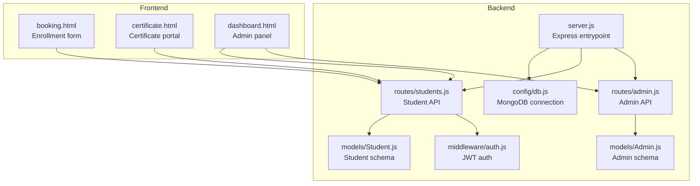
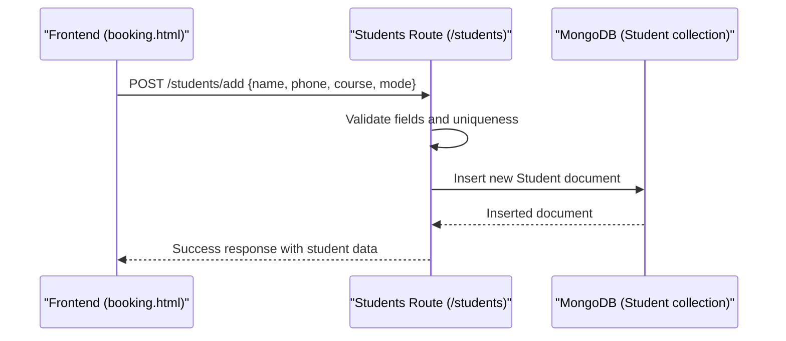
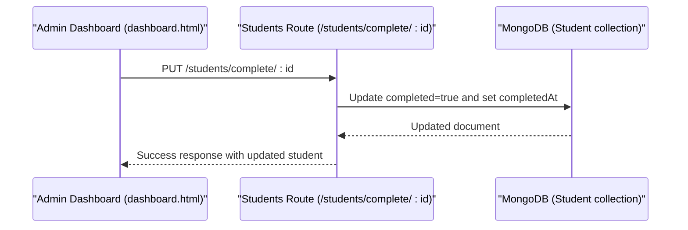
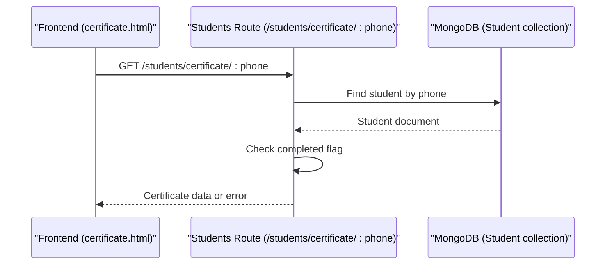
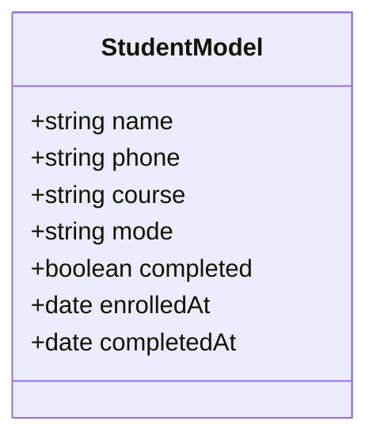
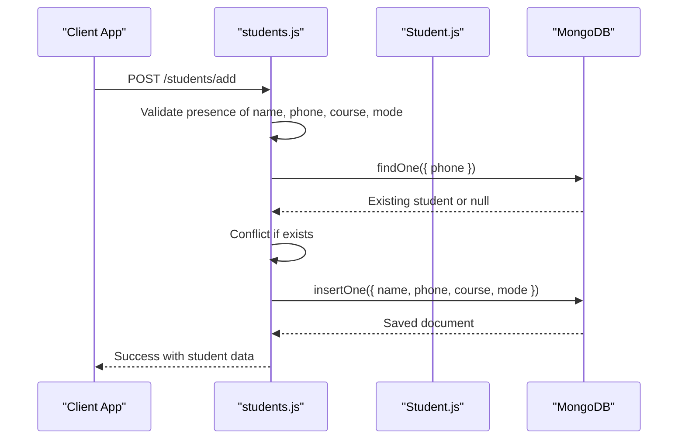
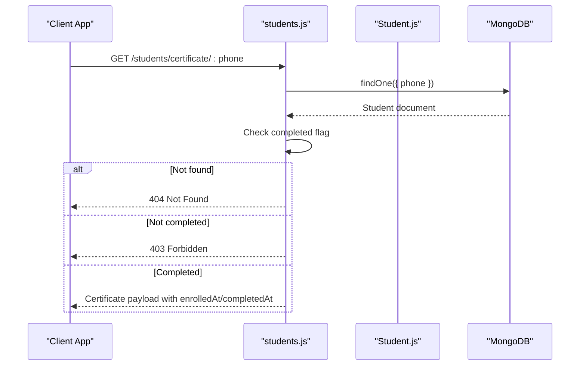
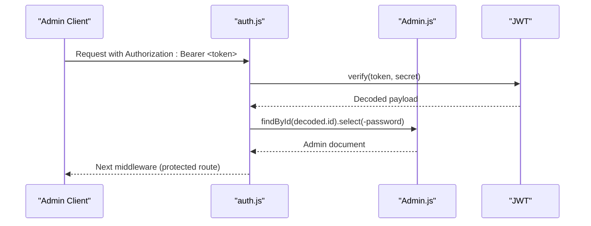
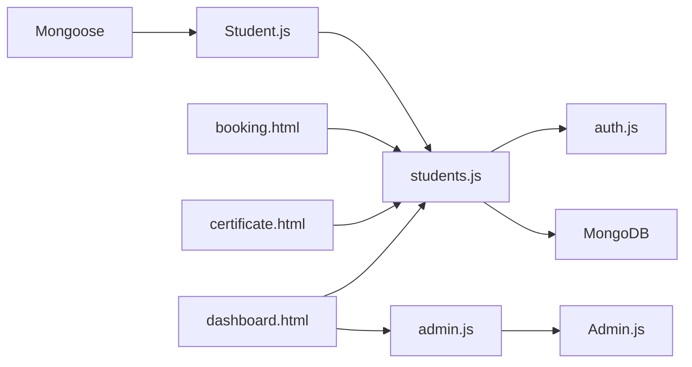

# Student Model

<cite>
**Referenced Files in This Document**
- [Student.js](file://jk-mobiles/backend/models/Student.js)
- [students.js](file://jk-mobiles/backend/routes/students.js)
- [db.js](file://jk-mobiles/backend/config/db.js)
- [server.js](file://jk-mobiles/backend/server.js)
- [auth.js](file://jk-mobiles/backend/middleware/auth.js)
- [admin.js](file://jk-mobiles/backend/routes/admin.js)
- [Admin.js](file://jk-mobiles/backend/models/Admin.js)
- [booking.html](file://jk-mobiles/frontend/booking.html)
- [certificate.html](file://jk-mobiles/frontend/certificate.html)
- [dashboard.html](file://jk-mobiles/frontend/admin/dashboard.html)
- [README.md](file://jk-mobiles/README.md)
</cite>

## Table of Contents
1. [Introduction](#introduction)
2. [Project Structure](#project-structure)
3. [Core Components](#core-components)
4. [Architecture Overview](#architecture-overview)
5. [Detailed Component Analysis](#detailed-component-analysis)
6. [Dependency Analysis](#dependency-analysis)
7. [Performance Considerations](#performance-considerations)
8. [Troubleshooting Guide](#troubleshooting-guide)
9. [Conclusion](#conclusion)
10. [Appendices](#appendices)

## Introduction
This document provides comprehensive data model documentation for the Student schema used in the JK Mobiles training institute management system. It defines all fields, validation rules, business constraints, and usage patterns within the enrollment and completion workflow. It also covers Mongoose schema options, validation messages, data transformation patterns, and practical query examples for common operations.

## Project Structure
The Student model resides in the backend under the models directory and is consumed by the students route handlers. Authentication for admin endpoints is handled by a JWT middleware. The frontend pages integrate with the backend via API calls for enrollment and certificate lookup.

**Diagram sources**
- [server.js:1-52](file://jk-mobiles/backend/server.js#L1-L52)
- [db.js:1-17](file://jk-mobiles/backend/config/db.js#L1-L17)
- [Student.js:1-39](file://jk-mobiles/backend/models/Student.js#L1-L39)
- [students.js:1-100](file://jk-mobiles/backend/routes/students.js#L1-L100)
- [auth.js:1-34](file://jk-mobiles/backend/middleware/auth.js#L1-L34)
- [Admin.js:1-34](file://jk-mobiles/backend/models/Admin.js#L1-L34)
- [admin.js:1-55](file://jk-mobiles/backend/routes/admin.js#L1-L55)
- [booking.html:286-322](file://jk-mobiles/frontend/booking.html#L286-L322)
- [certificate.html:280-310](file://jk-mobiles/frontend/certificate.html#L280-L310)
- [dashboard.html:1080-1089](file://jk-mobiles/frontend/admin/dashboard.html#L1080-L1089)

**Section sources**
- [README.md:7-42](file://jk-mobiles/README.md#L7-L42)
- [server.js:1-52](file://jk-mobiles/backend/server.js#L1-L52)
- [Student.js:1-39](file://jk-mobiles/backend/models/Student.js#L1-L39)
- [students.js:1-100](file://jk-mobiles/backend/routes/students.js#L1-L100)

## Core Components
The Student schema defines the enrollment record structure and constraints. Below are the field definitions, validation rules, and business constraints.

- name
  - Type: String
  - Required: Yes (validation message provided)
  - Trimmed: Yes
  - Purpose: Full legal or preferred name of the student
  - Notes: Used in certificates and admin dashboards

- phone
  - Type: String
  - Required: Yes (validation message provided)
  - Unique: Yes (unique index enforced)
  - Trimmed: Yes
  - Purpose: Primary contact identifier for enrollment and certificate lookup
  - Constraints: Frontend enforces 10-digit numeric format; backend enforces uniqueness

- course
  - Type: String
  - Required: Yes (validation message provided)
  - Enum: Basic, Advanced, Chip Level
  - Purpose: Tracks the selected training program
  - Business constraint: Must be one of the predefined values

- mode
  - Type: String
  - Required: Yes (validation message provided)
  - Enum: Online, Offline
  - Purpose: Indicates learning delivery mode
  - Business constraint: Must be one of the predefined values

- completed
  - Type: Boolean
  - Default: false
  - Purpose: Marks whether the student has finished the course
  - Workflow: Admin sets to true; certificate endpoint checks this flag

- enrolledAt
  - Type: Date
  - Default: current timestamp (Date.now)
  - Purpose: Timestamp of enrollment
  - Sorting: Admin dashboard sorts by this field descending

- completedAt
  - Type: Date
  - Optional: Yes
  - Purpose: Timestamp when the student was marked as completed
  - Workflow: Set when admin marks a student as completed

Validation rules and constraints:
- All required fields are validated at both frontend and backend layers
- Phone number must be unique; attempting duplicate enrollment returns a conflict response
- Course and mode values are restricted to predefined enums
- completedAt is populated only when a student is marked as completed

Data transformation patterns:
- Input values are trimmed on save
- Default timestamps are set automatically
- completedAt is set upon completion action

**Section sources**
- [Student.js:3-36](file://jk-mobiles/backend/models/Student.js#L3-L36)
- [students.js:7-25](file://jk-mobiles/backend/routes/students.js#L7-L25)
- [students.js:37-54](file://jk-mobiles/backend/routes/students.js#L37-L54)
- [booking.html:286-322](file://jk-mobiles/frontend/booking.html#L286-L322)
- [certificate.html:280-310](file://jk-mobiles/frontend/certificate.html#L280-L310)

## Architecture Overview
The Student model participates in three primary workflows:
- Enrollment: Frontend submits name, phone, course, mode; backend validates and persists
- Completion tracking: Admin marks a student as completed; backend updates flags and timestamps
- Certificate retrieval: Public lookup by phone; backend verifies completion status

**Diagram sources**
- [booking.html:286-322](file://jk-mobiles/frontend/booking.html#L286-L322)
- [students.js:7-25](file://jk-mobiles/backend/routes/students.js#L7-L25)
- [Student.js:3-36](file://jk-mobiles/backend/models/Student.js#L3-L36)

**Diagram sources**
- [dashboard.html:1208-1223](file://jk-mobiles/frontend/admin/dashboard.html#L1208-L1223)
- [students.js:37-54](file://jk-mobiles/backend/routes/students.js#L37-L54)
- [Student.js:25-35](file://jk-mobiles/backend/models/Student.js#L25-L35)

**Diagram sources**
- [certificate.html:280-310](file://jk-mobiles/frontend/certificate.html#L280-L310)
- [students.js:56-84](file://jk-mobiles/backend/routes/students.js#L56-L84)
- [Student.js:25-35](file://jk-mobiles/backend/models/Student.js#L25-L35)

## Detailed Component Analysis

### Student Schema Definition
The schema defines the shape of documents stored in the Student collection, including field types, defaults, and validation constraints.

**Diagram sources**
- [Student.js:3-36](file://jk-mobiles/backend/models/Student.js#L3-L36)

Key schema options and behaviors:
- Defaults:
  - completed: false
  - enrolledAt: Date.now (timestamp)
- Validation:
  - Required fields with custom messages
  - Enum constraints for course and mode
  - Unique constraint on phone enforced at schema level
- Data transformation:
  - Trimming for name and phone
  - Automatic timestamp population

**Section sources**
- [Student.js:3-36](file://jk-mobiles/backend/models/Student.js#L3-L36)

### Enrollment Workflow
End-to-end enrollment flow from frontend to backend and database persistence.

**Diagram sources**
- [students.js:7-25](file://jk-mobiles/backend/routes/students.js#L7-L25)
- [Student.js:3-36](file://jk-mobiles/backend/models/Student.js#L3-L36)

Common operations and query patterns:
- Finding enrolled students
  - Sort by newest: [students.js:30](file://jk-mobiles/backend/routes/students.js#L30)
  - Filter by phone: [students.js:59](file://jk-mobiles/backend/routes/students.js#L59)
- Course filtering
  - Admin dashboard filters by course and mode in memory: [dashboard.html:1192-1205](file://jk-mobiles/frontend/admin/dashboard.html#L1192-L1205)
- Completion tracking
  - Mark as completed: [students.js:40-44](file://jk-mobiles/backend/routes/students.js#L40-L44)
  - Certificate availability check: [students.js:65-67](file://jk-mobiles/backend/routes/students.js#L65-L67)

**Section sources**
- [students.js:27-97](file://jk-mobiles/backend/routes/students.js#L27-L97)
- [dashboard.html:1192-1205](file://jk-mobiles/frontend/admin/dashboard.html#L1192-L1205)

### Certificate Retrieval Workflow
Public certificate lookup by phone number with completion gating.

**Diagram sources**
- [students.js:56-84](file://jk-mobiles/backend/routes/students.js#L56-L84)
- [Student.js:25-35](file://jk-mobiles/backend/models/Student.js#L25-L35)

**Section sources**
- [students.js:56-84](file://jk-mobiles/backend/routes/students.js#L56-L84)
- [certificate.html:280-310](file://jk-mobiles/frontend/certificate.html#L280-L310)

### Admin Authentication and Authorization
Admin endpoints are protected by JWT middleware. The Admin model handles password hashing and verification.

**Diagram sources**
- [auth.js:4-31](file://jk-mobiles/backend/middleware/auth.js#L4-L31)
- [Admin.js:22-31](file://jk-mobiles/backend/models/Admin.js#L22-L31)

**Section sources**
- [auth.js:1-34](file://jk-mobiles/backend/middleware/auth.js#L1-L34)
- [admin.js:28-52](file://jk-mobiles/backend/routes/admin.js#L28-L52)
- [Admin.js:1-34](file://jk-mobiles/backend/models/Admin.js#L1-L34)

## Dependency Analysis
The Student model depends on Mongoose for schema definition and persistence. The students route depends on the model and authentication middleware. The frontend pages depend on the students API.

**Diagram sources**
- [Student.js:1](file://jk-mobiles/backend/models/Student.js#L1)
- [students.js:1-4](file://jk-mobiles/backend/routes/students.js#L1-L4)
- [auth.js:1](file://jk-mobiles/backend/middleware/auth.js#L1)
- [admin.js:1-5](file://jk-mobiles/backend/routes/admin.js#L1-L5)
- [Admin.js:1](file://jk-mobiles/backend/models/Admin.js#L1)
- [booking.html:286-322](file://jk-mobiles/frontend/booking.html#L286-L322)
- [certificate.html:280-310](file://jk-mobiles/frontend/certificate.html#L280-L310)
- [dashboard.html:1080-1089](file://jk-mobiles/frontend/admin/dashboard.html#L1080-L1089)

**Section sources**
- [Student.js:1-39](file://jk-mobiles/backend/models/Student.js#L1-L39)
- [students.js:1-100](file://jk-mobiles/backend/routes/students.js#L1-L100)
- [auth.js:1-34](file://jk-mobiles/backend/middleware/auth.js#L1-L34)
- [admin.js:1-55](file://jk-mobiles/backend/routes/admin.js#L1-L55)
- [Admin.js:1-34](file://jk-mobiles/backend/models/Admin.js#L1-L34)

## Performance Considerations
Indexing recommendations:
- Phone: Unique index is defined at schema level; ensure it is created in the database to enforce uniqueness and speed up lookups
- Course: Index for frequent filtering by course in admin dashboards
- Mode: Index for filtering by learning mode
- enrolledAt: Compound index with status for efficient sorting and pagination of recent enrollments

Query patterns:
- Use projection to limit fields returned in admin listings
- Paginate results for large datasets
- Consider TTL index for temporary enrollment records if applicable

[No sources needed since this section provides general guidance]

## Troubleshooting Guide
Common issues and resolutions:
- Duplicate phone number during enrollment
  - Symptom: 409 Conflict response
  - Cause: Unique constraint violation
  - Resolution: Use a different phone number

- Missing required fields
  - Symptom: 400 Bad Request with field-specific message
  - Cause: Missing name, phone, course, or mode
  - Resolution: Ensure all fields are present and valid

- Certificate not available
  - Symptom: 403 Forbidden
  - Cause: Student exists but completed flag is false
  - Resolution: Admin must mark the student as completed

- Token errors
  - Symptom: 401 Unauthorized
  - Cause: Missing or invalid JWT
  - Resolution: Re-authenticate and retry with a valid token

**Section sources**
- [students.js:11-18](file://jk-mobiles/backend/routes/students.js#L11-L18)
- [students.js:11-13](file://jk-mobiles/backend/routes/students.js#L11-L13)
- [students.js:65-67](file://jk-mobiles/backend/routes/students.js#L65-L67)
- [auth.js:14-19](file://jk-mobiles/backend/middleware/auth.js#L14-L19)
- [auth.js:21-30](file://jk-mobiles/backend/middleware/auth.js#L21-L30)

## Conclusion
The Student schema provides a robust foundation for managing enrollment, completion tracking, and certificate issuance at JK Mobiles. Its constraints and defaults ensure data integrity, while the accompanying routes and middleware support secure admin workflows and public certificate access. Proper indexing and query optimization will maintain performance as the dataset grows.

[No sources needed since this section summarizes without analyzing specific files]

## Appendices

### Field Reference and Usage
- name: Required, trimmed; used in certificates and admin tables
- phone: Required, unique, trimmed; used for enrollment and certificate lookup
- course: Required, enum; used for reporting and filtering
- mode: Required, enum; used for reporting and filtering
- completed: Boolean default false; toggled by admin
- enrolledAt: Date default now; used for sorting and reporting
- completedAt: Date; set when marking a student as completed

**Section sources**
- [Student.js:3-36](file://jk-mobiles/backend/models/Student.js#L3-L36)
- [students.js:30](file://jk-mobiles/backend/routes/students.js#L30)
- [students.js:40-44](file://jk-mobiles/backend/routes/students.js#L40-L44)

### Sample Data Examples
Representative documents illustrating typical states:
- Enrolled student:
  - name: "John Doe"
  - phone: "9876543210"
  - course: "Advanced"
  - mode: "Online"
  - completed: false
  - enrolledAt: 2025-06-01T10:00:00Z
  - completedAt: null

- Completed student:
  - name: "Jane Smith"
  - phone: "9876501234"
  - course: "Basic"
  - mode: "Offline"
  - completed: true
  - enrolledAt: 2025-05-15T09:30:00Z
  - completedAt: 2025-06-10T15:45:00Z

[No sources needed since this section provides conceptual examples]

### Query Patterns
- Find all students ordered by newest enrollment:
  - [students.js:30](file://jk-mobiles/backend/routes/students.js#L30)
- Find a student by phone:
  - [students.js:59](file://jk-mobiles/backend/routes/students.js#L59)
- Count total and completed students:
  - [students.js:89-91](file://jk-mobiles/backend/routes/students.js#L89-L91)
- Mark a student as completed:
  - [students.js:40-44](file://jk-mobiles/backend/routes/students.js#L40-L44)

**Section sources**
- [students.js:27-97](file://jk-mobiles/backend/routes/students.js#L27-L97)

### Indexing Recommendations
- Ensure unique index on phone for fast lookup and uniqueness
- Consider compound indexes for course and mode for filtering
- Consider a compound index on completed and enrolledAt for efficient reporting

[No sources needed since this section provides general guidance]