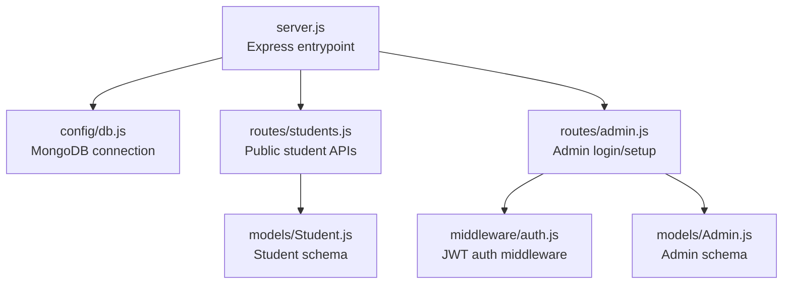
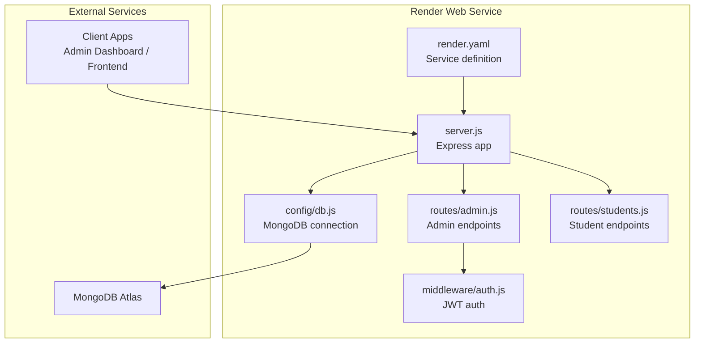
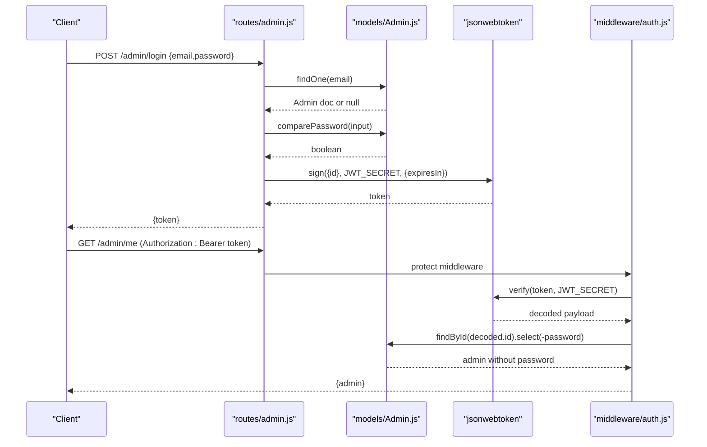
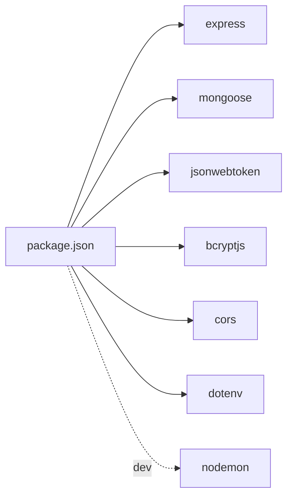

# Backend Deployment

<cite>
**Referenced Files in This Document**
- [package.json](file://jk-mobiles/backend/package.json)
- [render.yaml](file://jk-mobiles/backend/render.yaml)
- [server.js](file://jk-mobiles/backend/server.js)
- [db.js](file://jk-mobiles/backend/config/db.js)
- [auth.js](file://jk-mobiles/backend/middleware/auth.js)
- [Admin.js](file://jk-mobiles/backend/models/Admin.js)
- [Student.js](file://jk-mobiles/backend/models/Student.js)
- [admin.js](file://jk-mobiles/backend/routes/admin.js)
- [students.js](file://jk-mobiles/backend/routes/students.js)
- [README.md](file://jk-mobiles/README.md)
</cite>

## Table of Contents
1. [Introduction](#introduction)
2. [Project Structure](#project-structure)
3. [Core Components](#core-components)
4. [Architecture Overview](#architecture-overview)
5. [Detailed Component Analysis](#detailed-component-analysis)
6. [Dependency Analysis](#dependency-analysis)
7. [Performance Considerations](#performance-considerations)
8. [Troubleshooting Guide](#troubleshooting-guide)
9. [Conclusion](#conclusion)
10. [Appendices](#appendices)

## Introduction
This document provides end-to-end backend deployment instructions for the JK Mobiles API on Render.com. It covers service configuration, environment variables, MongoDB Atlas connectivity, JWT secret setup, admin credentials management, health checks, scaling, monitoring, SSL and domain mapping, and verification steps. The guide references the actual repository files to ensure accuracy.

## Project Structure
The backend is a Node.js + Express application with:
- A single entry point that initializes Express, connects to MongoDB, applies CORS and JSON middleware, mounts routes, and starts the server.
- A dedicated configuration module for MongoDB connection.
- Authentication middleware enforcing JWT-based protection for admin-only routes.
- Two primary models: Admin and Student.
- Two route groups: public student endpoints and protected admin endpoints.

**Diagram sources**
- [server.js:1-52](file://jk-mobiles/backend/server.js#L1-L52)
- [db.js:1-17](file://jk-mobiles/backend/config/db.js#L1-L17)
- [students.js:1-100](file://jk-mobiles/backend/routes/students.js#L1-L100)
- [admin.js:1-55](file://jk-mobiles/backend/routes/admin.js#L1-L55)
- [auth.js:1-34](file://jk-mobiles/backend/middleware/auth.js#L1-L34)
- [Admin.js:1-34](file://jk-mobiles/backend/models/Admin.js#L1-L34)
- [Student.js:1-39](file://jk-mobiles/backend/models/Student.js#L1-L39)

**Section sources**
- [server.js:1-52](file://jk-mobiles/backend/server.js#L1-L52)
- [README.md:7-42](file://jk-mobiles/README.md#L7-L42)

## Core Components
- Express server initialization and middleware stack
- MongoDB connection via Mongoose
- CORS configuration allowing cross-origin requests
- Route mounting for student and admin endpoints
- Health check endpoint returning service metadata
- Centralized error and 404 handlers

Key runtime behavior:
- Port selection defaults to an environment variable with a fallback.
- CORS allows GET, POST, PUT, DELETE and selected headers.
- Routes are mounted under /students and /admin.

**Section sources**
- [server.js:1-52](file://jk-mobiles/backend/server.js#L1-L52)
- [db.js:1-17](file://jk-mobiles/backend/config/db.js#L1-L17)
- [package.json:6-9](file://jk-mobiles/backend/package.json#L6-L9)

## Architecture Overview
Render deploys the backend as a web service configured via render.yaml. The service runs the Express server, connects to MongoDB Atlas, and exposes admin and student endpoints.

**Diagram sources**
- [render.yaml:1-18](file://jk-mobiles/backend/render.yaml#L1-L18)
- [server.js:1-52](file://jk-mobiles/backend/server.js#L1-L52)
- [db.js:1-17](file://jk-mobiles/backend/config/db.js#L1-L17)
- [auth.js:1-34](file://jk-mobiles/backend/middleware/auth.js#L1-L34)
- [admin.js:1-55](file://jk-mobiles/backend/routes/admin.js#L1-L55)
- [students.js:1-100](file://jk-mobiles/backend/routes/students.js#L1-L100)

## Detailed Component Analysis

### Render Service Configuration (render.yaml)
- Type: web service
- Runtime: Node.js
- Build command: installs dependencies
- Start command: runs the Express server
- Environment variables:
  - PORT: runtime port
  - MONGODB_URI: MongoDB Atlas connection string
  - JWT_SECRET: signing secret for JWT tokens
  - ADMIN_EMAIL: initial admin email
  - ADMIN_PASSWORD: initial admin password

Operational notes:
- Some variables are marked as non-sync to prevent sensitive values from being exposed in logs.
- The service listens on the port defined by the PORT environment variable.

**Section sources**
- [render.yaml:1-18](file://jk-mobiles/backend/render.yaml#L1-L18)
- [package.json:6-9](file://jk-mobiles/backend/package.json#L6-L9)

### Express Server and Routing (server.js)
- Loads environment variables via dotenv
- Initializes Express app
- Connects to MongoDB using the dedicated module
- Applies CORS and JSON middleware
- Mounts routes for students and admin
- Defines a health check at the root path
- Implements centralized 404 and error handlers
- Starts the server on the configured port

Health check response includes service status, version, and available endpoints.

**Section sources**
- [server.js:1-52](file://jk-mobiles/backend/server.js#L1-L52)

### MongoDB Connection (config/db.js)
- Uses Mongoose to connect to the URI from environment variables
- Enables legacy URL parser and unified topology
- Logs successful connection host
- Exits the process on connection failure

**Section sources**
- [db.js:1-17](file://jk-mobiles/backend/config/db.js#L1-L17)

### Authentication Middleware (middleware/auth.js)
- Extracts Bearer token from Authorization header
- Verifies JWT using the JWT_SECRET environment variable
- Resolves admin profile and attaches to request
- Returns 401 for missing or invalid tokens

**Section sources**
- [auth.js:1-34](file://jk-mobiles/backend/middleware/auth.js#L1-L34)

### Admin Model and Routes (models/Admin.js, routes/admin.js)
- Admin model enforces unique email, hashes passwords before save, and provides password comparison
- Admin routes:
  - POST /admin/setup: creates the first admin using environment-provided credentials (fallback values included)
  - POST /admin/login: authenticates admin and returns a signed JWT
  - GET /admin/me: protected route to verify token and return admin info

Security considerations:
- Password hashing is enforced via pre-save hooks.
- Token signing uses JWT_SECRET from environment variables.

**Section sources**
- [Admin.js:1-34](file://jk-mobiles/backend/models/Admin.js#L1-L34)
- [admin.js:1-55](file://jk-mobiles/backend/routes/admin.js#L1-L55)
- [auth.js:1-34](file://jk-mobiles/backend/middleware/auth.js#L1-L34)

### Student Model and Routes (models/Student.js, routes/students.js)
- Student schema defines required fields, enums for course and mode, and timestamps
- Student routes:
  - POST /students/add: enrolls a new student with validation and uniqueness checks
  - GET /students: lists all students (protected)
  - PUT /students/complete/:id: marks a student as completed (protected)
  - GET /students/certificate/:phone: retrieves certificate data for a completed student
  - GET /students/stats/overview: dashboard statistics (protected)

**Section sources**
- [Student.js:1-39](file://jk-mobiles/backend/models/Student.js#L1-L39)
- [students.js:1-100](file://jk-mobiles/backend/routes/students.js#L1-L100)

### API Workflow: Admin Login and Token Verification

**Diagram sources**
- [admin.js:28-52](file://jk-mobiles/backend/routes/admin.js#L28-L52)
- [auth.js:4-31](file://jk-mobiles/backend/middleware/auth.js#L4-L31)
- [Admin.js:28-31](file://jk-mobiles/backend/models/Admin.js#L28-L31)

## Dependency Analysis
Runtime dependencies include Express, Mongoose, jsonwebtoken, bcryptjs, cors, and dotenv. Development dependencies include nodemon for local development.

**Diagram sources**
- [package.json:10-20](file://jk-mobiles/backend/package.json#L10-L20)

**Section sources**
- [package.json:10-20](file://jk-mobiles/backend/package.json#L10-L20)

## Performance Considerations
- Use production-grade Node.js runtime on Render for optimal performance.
- Keep environment variables secure and avoid logging sensitive values.
- Enable connection pooling and reuse connections via Mongoose configuration if needed.
- Monitor memory and CPU usage through Render’s built-in metrics.
- Consider enabling gzip compression at the CDN or proxy level if fronted by a reverse proxy.

## Troubleshooting Guide
Common issues and resolutions:
- MongoDB connection failures:
  - Verify MONGODB_URI correctness and network access from Render.
  - Confirm Atlas IP whitelist allows Render’s outbound IPs.
- JWT errors:
  - Ensure JWT_SECRET is set consistently across deployments.
  - Check token expiration and client-side storage.
- Admin setup conflicts:
  - Run /admin/setup only once; subsequent attempts will fail if an admin exists.
  - To reset, remove the admin document in Atlas and rerun setup.
- CORS errors:
  - Confirm client origin is allowed by CORS configuration.
- 404 or 500 errors:
  - Review centralized error handler logs.
  - Validate route paths and body parameters.

Verification steps:
- Health check: GET the root endpoint to confirm service availability.
- Admin login: POST /admin/login with provided credentials to receive a token.
- Protected route: GET /admin/me with Authorization header to verify token.
- Student endpoints: POST /students/add and GET /students to validate CRUD operations.

**Section sources**
- [server.js:24-46](file://jk-mobiles/backend/server.js#L24-L46)
- [admin.js:11-26](file://jk-mobiles/backend/routes/admin.js#L11-L26)
- [admin.js:28-52](file://jk-mobiles/backend/routes/admin.js#L28-L52)
- [students.js:6-25](file://jk-mobiles/backend/routes/students.js#L6-L25)
- [students.js:27-35](file://jk-mobiles/backend/routes/students.js#L27-L35)

## Conclusion
The backend is designed for straightforward deployment on Render.com with minimal configuration. By setting environment variables, connecting to MongoDB Atlas, initializing admin credentials, and verifying endpoints, you can achieve a reliable production API serving the JK Mobiles admin and student management features.

## Appendices

### Step-by-Step Deployment on Render.com
- Prepare the backend repository:
  - Push the backend folder to a GitHub repository.
- Create a Render Web Service:
  - Connect your GitHub repository.
  - Select the backend folder as the source.
  - Configure Build Command: npm install
  - Configure Start Command: node server.js
- Environment Variables:
  - Add the following keys in Render’s dashboard:
    - MONGODB_URI: your MongoDB Atlas connection string
    - JWT_SECRET: a strong random secret
    - ADMIN_EMAIL: desired admin email
    - ADMIN_PASSWORD: desired admin password
    - PORT: 5000
  - Mark sensitive variables as non-sync to avoid logs.
- Automatic Deployment:
  - Enable automatic deploys from the chosen branch.
- Initialize Admin:
  - Visit your deployed URL once to run /admin/setup.
- Health Checks:
  - Use the root GET endpoint to verify service health.
- Scaling and Monitoring:
  - Use Render’s dashboard to scale dynos and review logs and metrics.
- SSL and Domain Mapping:
  - Render provides automatic HTTPS termination.
  - Map a custom domain in Render’s domain settings if needed.
- Frontend Integration:
  - Update the frontend API base URL to point to your Render service URL.

**Section sources**
- [README.md:60-84](file://jk-mobiles/README.md#L60-L84)
- [render.yaml:1-18](file://jk-mobiles/backend/render.yaml#L1-L18)
- [server.js:24-35](file://jk-mobiles/backend/server.js#L24-L35)
- [admin.js:11-26](file://jk-mobiles/backend/routes/admin.js#L11-L26)