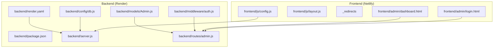
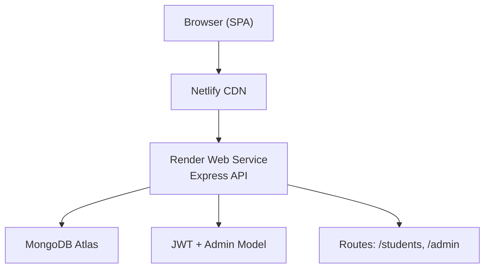
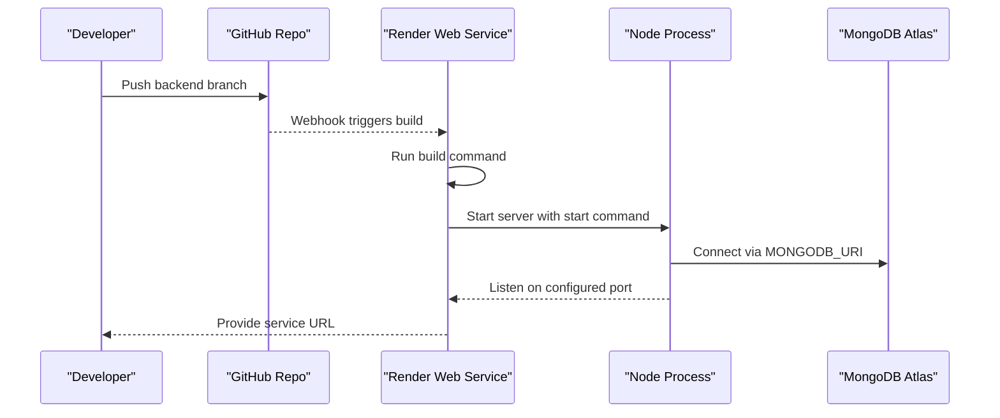
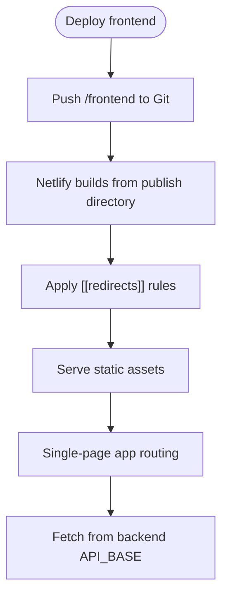
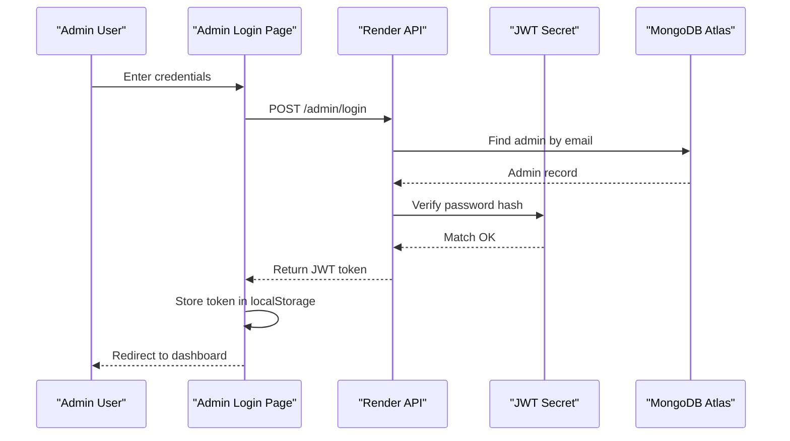
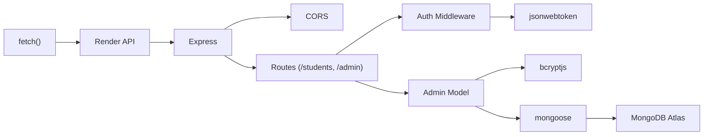

# Deployment Guide

<cite>
**Referenced Files in This Document**
- [README.md](file://README.md)
- [backend/package.json](file://backend/package.json)
- [backend/render.yaml](file://backend/render.yaml)
- [backend/server.js](file://backend/server.js)
- [backend/config/db.js](file://backend/config/db.js)
- [backend/middleware/auth.js](file://backend/middleware/auth.js)
- [backend/models/Admin.js](file://backend/models/Admin.js)
- [backend/routes/admin.js](file://backend/routes/admin.js)
- [frontend/_redirects](file://frontend/_redirects)
- [frontend/js/config.js](file://frontend/js/config.js)
- [frontend/js/layout.js](file://frontend/js/layout.js)
- [frontend/admin/login.html](file://frontend/admin/login.html)
- [frontend/admin/dashboard.html](file://frontend/admin/dashboard.html)
</cite>

## Table of Contents
1. [Introduction](#introduction)
2. [Project Structure](#project-structure)
3. [Core Components](#core-components)
4. [Architecture Overview](#architecture-overview)
5. [Detailed Component Analysis](#detailed-component-analysis)
6. [Dependency Analysis](#dependency-analysis)
7. [Performance Considerations](#performance-considerations)
8. [Troubleshooting Guide](#troubleshooting-guide)
9. [Conclusion](#conclusion)
10. [Appendices](#appendices)

## Introduction
This guide documents the complete deployment process for the JK Mobiles application across two environments:
- Backend: Node.js + Express API hosted on Render.com
- Frontend: Static HTML/CSS/JS site hosted on Netlify

It covers MongoDB Atlas setup, environment variables, Render and Netlify configuration, build and start commands, production optimizations, frontend routing and redirects, environment-specific configurations, SSL and domain setup, monitoring, troubleshooting, rollback procedures, and verification steps.

## Project Structure
The repository is organized into two primary areas:
- backend: Express server, routes, middleware, database connection, and deployment configuration for Render
- frontend: Static pages, shared layout injection, admin login and dashboard, and Netlify redirects

**Diagram sources**
- [backend/server.js:1-52](file://backend/server.js#L1-L52)
- [backend/config/db.js:1-17](file://backend/config/db.js#L1-L17)
- [backend/middleware/auth.js:1-34](file://backend/middleware/auth.js#L1-L34)
- [backend/models/Admin.js:1-34](file://backend/models/Admin.js#L1-L34)
- [backend/routes/admin.js:1-55](file://backend/routes/admin.js#L1-L55)
- [backend/render.yaml:1-18](file://backend/render.yaml#L1-L18)
- [frontend/js/config.js:1-33](file://frontend/js/config.js#L1-L33)
- [frontend/js/layout.js:1-69](file://frontend/js/layout.js#L1-L69)
- [frontend/_redirects:1-5](file://frontend/_redirects#L1-L5)
- [frontend/admin/login.html:1-376](file://frontend/admin/login.html#L1-L376)
- [frontend/admin/dashboard.html:1-800](file://frontend/admin/dashboard.html#L1-L800)

**Section sources**
- [README.md:7-42](file://README.md#L7-L42)
- [backend/package.json:1-22](file://backend/package.json#L1-L22)
- [backend/render.yaml:1-18](file://backend/render.yaml#L1-L18)
- [frontend/_redirects:1-5](file://frontend/_redirects#L1-L5)

## Core Components
- Backend API
  - Express server with CORS and JSON parsing middleware
  - Routes for students and admin
  - MongoDB connection via Mongoose
  - JWT-based admin authentication middleware and routes
- Frontend
  - Static pages with shared navbar/footer injected via JavaScript
  - Admin login and dashboard pages
  - Netlify redirects for SPA routing

Key deployment-related files:
- Backend: [server.js:1-52](file://backend/server.js#L1-L52), [db.js:1-17](file://backend/config/db.js#L1-L17), [auth.js:1-34](file://backend/middleware/auth.js#L1-L34), [Admin.js:1-34](file://backend/models/Admin.js#L1-L34), [admin.js:1-55](file://backend/routes/admin.js#L1-L55), [render.yaml:1-18](file://backend/render.yaml#L1-L18), [package.json:1-22](file://backend/package.json#L1-L22)
- Frontend: [config.js:1-33](file://frontend/js/config.js#L1-L33), [_redirects:1-5](file://frontend/_redirects#L1-L5), [layout.js:1-69](file://frontend/js/layout.js#L1-L69), [login.html:1-376](file://frontend/admin/login.html#L1-L376), [dashboard.html:1-800](file://frontend/admin/dashboard.html#L1-L800)

**Section sources**
- [backend/server.js:1-52](file://backend/server.js#L1-L52)
- [backend/config/db.js:1-17](file://backend/config/db.js#L1-L17)
- [backend/middleware/auth.js:1-34](file://backend/middleware/auth.js#L1-L34)
- [backend/models/Admin.js:1-34](file://backend/models/Admin.js#L1-L34)
- [backend/routes/admin.js:1-55](file://backend/routes/admin.js#L1-L55)
- [backend/render.yaml:1-18](file://backend/render.yaml#L1-L18)
- [backend/package.json:1-22](file://backend/package.json#L1-L22)
- [frontend/js/config.js:1-33](file://frontend/js/config.js#L1-L33)
- [frontend/_redirects:1-5](file://frontend/_redirects#L1-L5)
- [frontend/js/layout.js:1-69](file://frontend/js/layout.js#L1-L69)
- [frontend/admin/login.html:1-376](file://frontend/admin/login.html#L1-L376)
- [frontend/admin/dashboard.html:1-800](file://frontend/admin/dashboard.html#L1-L800)

## Architecture Overview
The application follows a classic full-stack pattern:
- Frontend (Netlify): Static SPA with client-side routing handled by Netlify’s redirect rules
- Backend (Render): Node/Express API serving REST endpoints for student enrollment, certificates, and admin authentication
- Database: MongoDB Atlas via Mongoose connection string

**Diagram sources**
- [frontend/_redirects:1-5](file://frontend/_redirects#L1-L5)
- [backend/server.js:1-52](file://backend/server.js#L1-L52)
- [backend/config/db.js:1-17](file://backend/config/db.js#L1-L17)
- [backend/routes/admin.js:1-55](file://backend/routes/admin.js#L1-L55)
- [backend/models/Admin.js:1-34](file://backend/models/Admin.js#L1-L34)

## Detailed Component Analysis

### Backend Deployment on Render.com
- Build command: Install dependencies
- Start command: Launch the Express server
- Environment variables managed by Render
- Port binding and health endpoint included

**Diagram sources**
- [backend/render.yaml:1-18](file://backend/render.yaml#L1-L18)
- [backend/package.json:6-9](file://backend/package.json#L6-L9)
- [backend/server.js:48-52](file://backend/server.js#L48-L52)
- [backend/config/db.js:3-14](file://backend/config/db.js#L3-L14)

**Section sources**
- [backend/render.yaml:1-18](file://backend/render.yaml#L1-L18)
- [backend/package.json:6-9](file://backend/package.json#L6-L9)
- [backend/server.js:1-52](file://backend/server.js#L1-L52)
- [backend/config/db.js:1-17](file://backend/config/db.js#L1-L17)

### Frontend Deployment on Netlify
- Publish directory: frontend
- SPA routing: Netlify redirects all unmatched paths to index.html
- API base URL configured in frontend JavaScript and embedded in admin pages

**Diagram sources**
- [frontend/_redirects:1-5](file://frontend/_redirects#L1-L5)
- [frontend/js/config.js:5-6](file://frontend/js/config.js#L5-L6)
- [frontend/admin/login.html:313-313](file://frontend/admin/login.html#L313-L313)

**Section sources**
- [frontend/_redirects:1-5](file://frontend/_redirects#L1-L5)
- [frontend/js/config.js:1-33](file://frontend/js/config.js#L1-L33)
- [frontend/admin/login.html:312-318](file://frontend/admin/login.html#L312-L318)

### MongoDB Atlas Setup
- Create a free cluster and database user
- Whitelist IP address for development
- Obtain the connection string and configure the backend environment variable

**Section sources**
- [README.md:48-57](file://README.md#L48-L57)
- [backend/config/db.js:5-8](file://backend/config/db.js#L5-L8)

### Environment Variables and Configuration
- Backend variables managed by Render:
  - MONGODB_URI
  - JWT_SECRET
  - ADMIN_EMAIL
  - ADMIN_PASSWORD
  - PORT
- Frontend API base URL must be updated to match the deployed backend URL

**Section sources**
- [backend/render.yaml:7-17](file://backend/render.yaml#L7-L17)
- [frontend/js/config.js:5-6](file://frontend/js/config.js#L5-L6)
- [frontend/admin/login.html:313-313](file://frontend/admin/login.html#L313-L313)

### Admin Authentication Flow

**Diagram sources**
- [frontend/admin/login.html:335-372](file://frontend/admin/login.html#L335-L372)
- [backend/routes/admin.js:28-47](file://backend/routes/admin.js#L28-L47)
- [backend/middleware/auth.js:4-31](file://backend/middleware/auth.js#L4-L31)
- [backend/models/Admin.js:21-31](file://backend/models/Admin.js#L21-L31)

**Section sources**
- [backend/routes/admin.js:1-55](file://backend/routes/admin.js#L1-L55)
- [backend/middleware/auth.js:1-34](file://backend/middleware/auth.js#L1-L34)
- [backend/models/Admin.js:1-34](file://backend/models/Admin.js#L1-L34)
- [frontend/admin/login.html:312-372](file://frontend/admin/login.html#L312-L372)

### Frontend Routing and Redirect Rules
- Netlify redirect rule ensures SPA routes resolve to index.html
- Admin pages also embed the API base URL for immediate operation post-deploy

**Section sources**
- [frontend/_redirects:1-5](file://frontend/_redirects#L1-L5)
- [frontend/admin/login.html:312-318](file://frontend/admin/login.html#L312-L318)

## Dependency Analysis
- Backend depends on Express, Mongoose, JWT, bcrypt, CORS, dotenv
- Frontend depends on Bootstrap CDN and Google Fonts; API requests are made via fetch to the backend
- Admin authentication relies on JWT secret and Admin model hashing

**Diagram sources**
- [backend/package.json:10-16](file://backend/package.json#L10-L16)
- [backend/server.js:1-52](file://backend/server.js#L1-L52)
- [backend/middleware/auth.js:1-34](file://backend/middleware/auth.js#L1-L34)
- [backend/models/Admin.js:1-34](file://backend/models/Admin.js#L1-L34)
- [backend/routes/admin.js:1-55](file://backend/routes/admin.js#L1-L55)
- [frontend/js/config.js:9-19](file://frontend/js/config.js#L9-L19)

**Section sources**
- [backend/package.json:10-16](file://backend/package.json#L10-L16)
- [backend/server.js:1-52](file://backend/server.js#L1-L52)
- [frontend/js/config.js:1-33](file://frontend/js/config.js#L1-L33)

## Performance Considerations
- Keep MongoDB Atlas connection string secure and avoid exposing it in client-side code
- Use HTTPS for both frontend and backend to prevent mixed content issues
- Minimize frontend asset sizes; current project uses vanilla HTML/CSS/JS with CDN-hosted libraries
- Monitor Render logs for memory spikes and cold starts; consider enabling autoscaling if traffic increases
- Enable Netlify caching for static assets where appropriate

## Troubleshooting Guide
Common deployment issues and resolutions:
- Backend fails to connect to MongoDB
  - Verify MONGODB_URI is set in Render environment variables
  - Confirm IP whitelist allows connections from Render
- Admin login fails
  - Ensure JWT_SECRET is set and consistent
  - Initialize admin once using the setup endpoint
- Frontend cannot reach backend
  - Update API_BASE in frontend config and admin pages to the deployed backend URL
- SPA routes show 404 on refresh
  - Confirm Netlify redirect rule is present and applied
- CORS errors in browser console
  - Review CORS configuration in server middleware and ensure origins are correctly set

Rollback and maintenance:
- Rollback backend: redeploy previous commit or revert Render service settings
- Maintenance: update environment variables via Render dashboard; redeploy to apply changes

Verification checklist:
- Backend responds to root health endpoint
- Admin setup endpoint runs successfully
- Admin login returns a token
- Frontend loads and navigates SPA routes
- Netlify redirects are applied for deep links
- API requests succeed from frontend

**Section sources**
- [backend/config/db.js:10-13](file://backend/config/db.js#L10-L13)
- [backend/routes/admin.js:11-26](file://backend/routes/admin.js#L11-L26)
- [frontend/js/config.js:5-6](file://frontend/js/config.js#L5-L6)
- [frontend/_redirects:1-5](file://frontend/_redirects#L1-L5)
- [backend/server.js:24-46](file://backend/server.js#L24-L46)

## Conclusion
This guide provides a complete, step-by-step deployment plan for the JK Mobiles application on Render and Netlify. By following the outlined steps for MongoDB Atlas setup, environment configuration, build/start commands, routing rules, and verification, you can reliably deploy and operate the application in production.

## Appendices

### A. Backend Deployment Steps
- Prepare backend repository and push to GitHub
- Create a new Web Service on Render
- Connect GitHub repository and set build and start commands
- Add environment variables in Render dashboard
- Deploy and note the service URL
- Initialize admin once using the setup endpoint

**Section sources**
- [README.md:60-84](file://README.md#L60-L84)
- [backend/render.yaml:5-6](file://backend/render.yaml#L5-L6)
- [backend/render.yaml:7-17](file://backend/render.yaml#L7-L17)

### B. Frontend Deployment Steps
- Prepare frontend repository and push to GitHub
- Create a new site on Netlify from the repository
- Set publish directory to frontend
- Deploy and note the site URL
- Update API base URL in frontend config and admin pages

**Section sources**
- [README.md:97-102](file://README.md#L97-L102)
- [frontend/js/config.js:5-6](file://frontend/js/config.js#L5-L6)
- [frontend/admin/login.html:312-318](file://frontend/admin/login.html#L312-L318)

### C. Environment Variable Reference
- Backend (Render)
  - MONGODB_URI: MongoDB Atlas connection string
  - JWT_SECRET: Secret for signing JWT tokens
  - ADMIN_EMAIL: Default admin email
  - ADMIN_PASSWORD: Default admin password
  - PORT: Listening port (default 5000)
- Frontend
  - API_BASE: Base URL of the deployed backend

**Section sources**
- [backend/render.yaml:7-17](file://backend/render.yaml#L7-L17)
- [frontend/js/config.js:5-6](file://frontend/js/config.js#L5-L6)

### D. Monitoring and SSL
- SSL: Render and Netlify provide automatic HTTPS; ensure all requests use HTTPS
- Domain configuration: Point custom domains at Render and Netlify dashboards
- Logs: Monitor backend logs on Render and frontend build logs on Netlify

**Section sources**
- [backend/server.js:48-52](file://backend/server.js#L48-L52)
- [frontend/_redirects:1-5](file://frontend/_redirects#L1-L5)