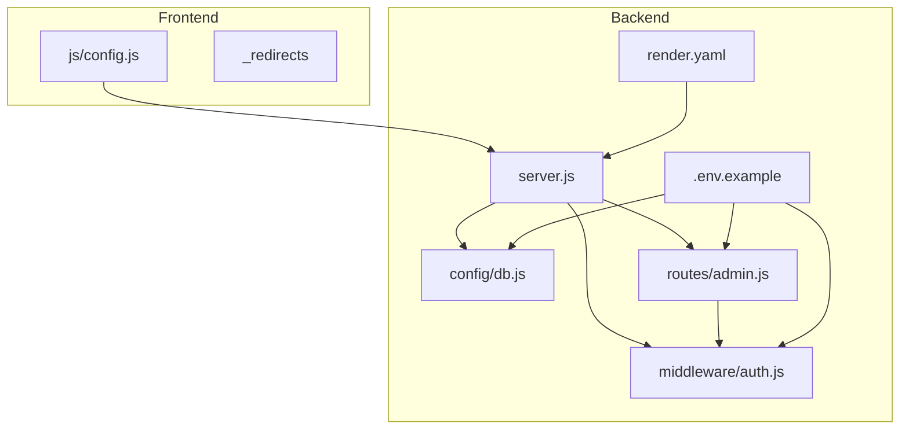
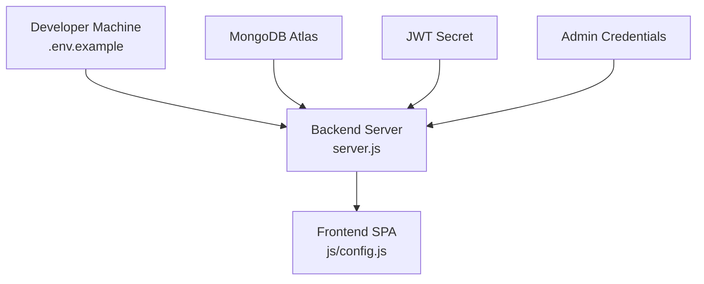
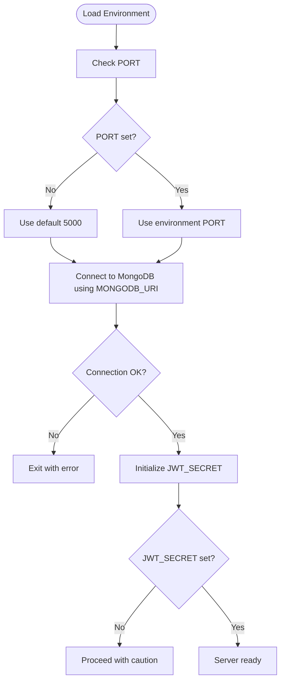
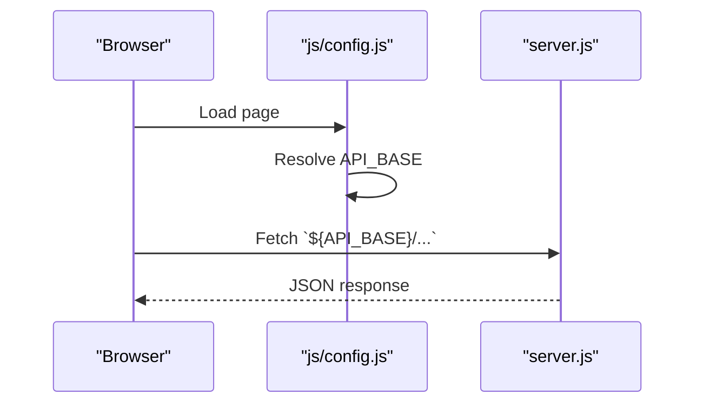
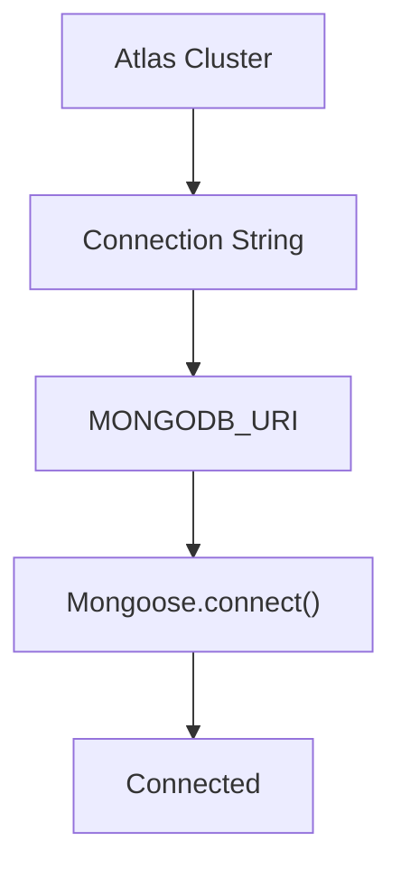
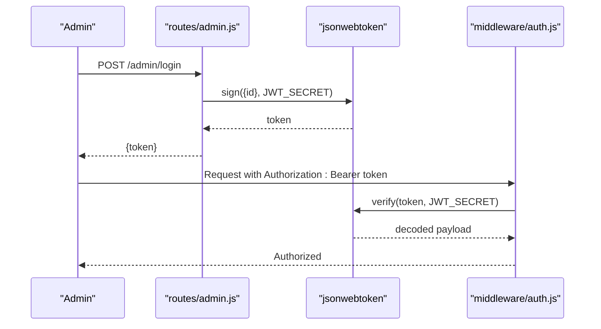
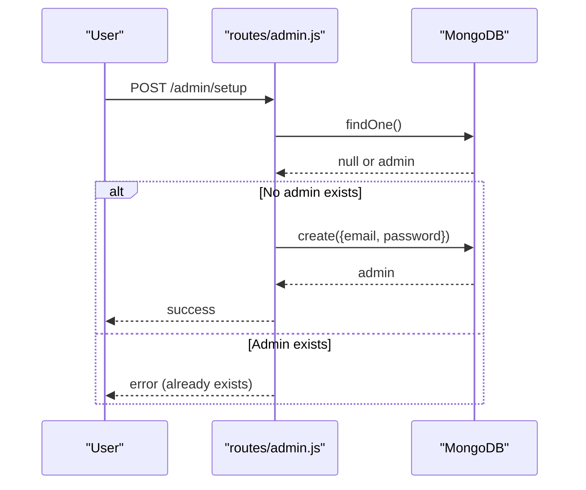
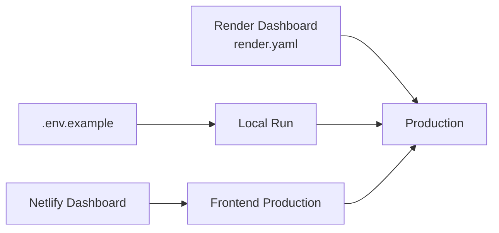
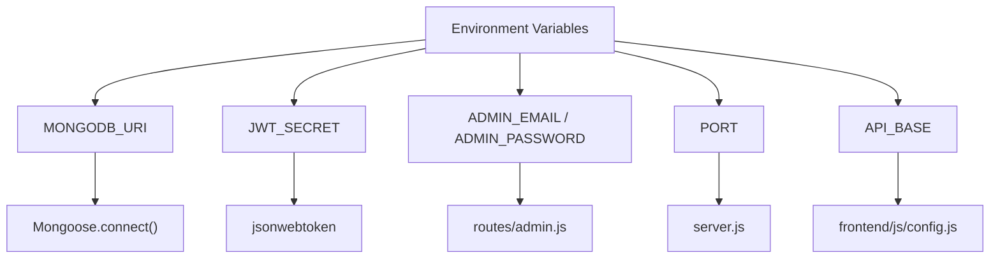

# Environment Configuration

<cite>
**Referenced Files in This Document**
- [backend/package.json](file://backend/package.json)
- [backend/server.js](file://backend/server.js)
- [backend/config/db.js](file://backend/config/db.js)
- [backend/middleware/auth.js](file://backend/middleware/auth.js)
- [backend/routes/admin.js](file://backend/routes/admin.js)
- [backend/render.yaml](file://backend/render.yaml)
- [backend/.env.example](file://backend/.env.example)
- [frontend/js/config.js](file://frontend/js/config.js)
- [frontend/_redirects](file://frontend/_redirects)
- [README.md](file://README.md)
</cite>

## Table of Contents
1. [Introduction](#introduction)
2. [Project Structure](#project-structure)
3. [Core Components](#core-components)
4. [Architecture Overview](#architecture-overview)
5. [Detailed Component Analysis](#detailed-component-analysis)
6. [Dependency Analysis](#dependency-analysis)
7. [Performance Considerations](#performance-considerations)
8. [Troubleshooting Guide](#troubleshooting-guide)
9. [Conclusion](#conclusion)
10. [Appendices](#appendices)

## Introduction
This document provides a complete guide to configuring the environment for JK Mobiles deployment. It covers backend and frontend environment variables, MongoDB Atlas connection configuration, JWT secret generation, admin account setup, frontend API base URL configuration, environment-specific settings, and differences between local development and production. It also includes security best practices for managing secrets, environment variable encryption, access control, configuration validation, debugging techniques, troubleshooting, and templates for staging, production, and development environments.

## Project Structure
The repository is organized into two primary parts:
- Backend: Node.js + Express API with MongoDB Atlas connectivity, JWT authentication, and admin management.
- Frontend: Static HTML/CSS/JS pages with a shared configuration module for API base URLs and routing.

**Diagram sources**
- [backend/server.js:1-52](file://backend/server.js#L1-L52)
- [backend/config/db.js:1-17](file://backend/config/db.js#L1-L17)
- [backend/middleware/auth.js:1-34](file://backend/middleware/auth.js#L1-L34)
- [backend/routes/admin.js:1-55](file://backend/routes/admin.js#L1-L55)
- [backend/render.yaml:1-18](file://backend/render.yaml#L1-L18)
- [backend/.env.example:1-6](file://backend/.env.example#L1-L6)
- [frontend/js/config.js:1-34](file://frontend/js/config.js#L1-L34)
- [frontend/_redirects:1-5](file://frontend/_redirects#L1-L5)

**Section sources**
- [README.md:7-42](file://README.md#L7-L42)
- [backend/server.js:1-52](file://backend/server.js#L1-L52)
- [frontend/js/config.js:1-34](file://frontend/js/config.js#L1-L34)

## Core Components
This section outlines the environment variables used across the backend and frontend and their roles.

- Backend environment variables:
  - PORT: Server port (default fallback present in server.js)
  - MONGODB_URI: MongoDB Atlas connection string
  - JWT_SECRET: Secret key for signing JWT tokens
  - ADMIN_EMAIL: Default admin email used during initial setup
  - ADMIN_PASSWORD: Default admin password used during initial setup

- Frontend environment variables:
  - API_BASE: Base URL for the backend API (used in config.js)
  - Routing: Netlify redirects to single-page application behavior

- Deployment configuration:
  - render.yaml defines environment variables for Render deployment and marks them as unsynced for manual management.

**Section sources**
- [backend/server.js:47-51](file://backend/server.js#L47-L51)
- [backend/config/db.js:4-8](file://backend/config/db.js#L4-L8)
- [backend/middleware/auth.js:21-22](file://backend/middleware/auth.js#L21-L22)
- [backend/routes/admin.js:18-21](file://backend/routes/admin.js#L18-L21)
- [backend/render.yaml:7-17](file://backend/render.yaml#L7-L17)
- [frontend/js/config.js:5-7](file://frontend/js/config.js#L5-L7)
- [frontend/_redirects:1-5](file://frontend/_redirects#L1-L5)

## Architecture Overview
The environment configuration spans three layers:
- Local development: Uses .env.example and runs locally with default fallbacks.
- Platform deployment: Render manages backend environment variables; frontend is deployed separately.
- Runtime usage: Backend reads environment variables for database, JWT, and admin credentials; frontend uses API_BASE to route requests.

**Diagram sources**
- [backend/.env.example:1-6](file://backend/.env.example#L1-L6)
- [backend/config/db.js:4-8](file://backend/config/db.js#L4-L8)
- [backend/middleware/auth.js:21-22](file://backend/middleware/auth.js#L21-L22)
- [backend/routes/admin.js:18-21](file://backend/routes/admin.js#L18-L21)
- [backend/server.js:47-51](file://backend/server.js#L47-L51)
- [frontend/js/config.js:5-7](file://frontend/js/config.js#L5-L7)

## Detailed Component Analysis

### Backend Environment Variables
- PORT: The server listens on the configured port or defaults to 5000.
- MONGODB_URI: Used by Mongoose to connect to MongoDB Atlas.
- JWT_SECRET: Required by JWT middleware to sign and verify tokens.
- ADMIN_EMAIL and ADMIN_PASSWORD: Used during first-time admin setup.

**Diagram sources**
- [backend/server.js:47-51](file://backend/server.js#L47-L51)
- [backend/config/db.js:4-14](file://backend/config/db.js#L4-L14)
- [backend/middleware/auth.js:21-22](file://backend/middleware/auth.js#L21-L22)

**Section sources**
- [backend/server.js:47-51](file://backend/server.js#L47-L51)
- [backend/config/db.js:4-14](file://backend/config/db.js#L4-L14)
- [backend/middleware/auth.js:21-22](file://backend/middleware/auth.js#L21-L22)
- [backend/routes/admin.js:18-21](file://backend/routes/admin.js#L18-L21)

### Frontend Environment Variables and API Base URL
- API_BASE: Determines the backend endpoint used by frontend API calls.
- Netlify redirects: Ensures client-side routing works for static hosting.

**Diagram sources**
- [frontend/js/config.js:10-20](file://frontend/js/config.js#L10-L20)
- [backend/server.js:20-22](file://backend/server.js#L20-L22)

**Section sources**
- [frontend/js/config.js:5-7](file://frontend/js/config.js#L5-L7)
- [frontend/js/config.js:10-20](file://frontend/js/config.js#L10-L20)
- [frontend/_redirects:1-5](file://frontend/_redirects#L1-5)

### MongoDB Atlas Connection String Configuration
- Obtain the connection string from MongoDB Atlas and set it as MONGODB_URI.
- Ensure network access allows connections from your deployment platform.

**Diagram sources**
- [backend/config/db.js:4-8](file://backend/config/db.js#L4-L8)

**Section sources**
- [backend/config/db.js:4-8](file://backend/config/db.js#L4-L8)
- [README.md:48-56](file://README.md#L48-L56)

### JWT Secret Generation and Usage
- Generate a strong, random JWT_SECRET and store it securely.
- The secret is used to sign tokens during admin login and to verify tokens in protected routes.

**Diagram sources**
- [backend/routes/admin.js:7-9](file://backend/routes/admin.js#L7-L9)
- [backend/middleware/auth.js:21-22](file://backend/middleware/auth.js#L21-L22)

**Section sources**
- [backend/routes/admin.js:7-9](file://backend/routes/admin.js#L7-L9)
- [backend/middleware/auth.js:21-22](file://backend/middleware/auth.js#L21-L22)
- [README.md:68-76](file://README.md#L68-L76)

### Admin Account Setup
- Run the admin setup endpoint once to create the initial admin.
- The setup uses ADMIN_EMAIL and ADMIN_PASSWORD if provided; otherwise, defaults are applied.

**Diagram sources**
- [backend/routes/admin.js:11-26](file://backend/routes/admin.js#L11-L26)

**Section sources**
- [backend/routes/admin.js:11-26](file://backend/routes/admin.js#L11-L26)
- [README.md:80-83](file://README.md#L80-L83)

### Environment-Specific Settings and Differences
- Local development: Use .env.example to define variables locally.
- Production (Render): Define variables in render.yaml and the Render dashboard.
- Frontend (Netlify): Update API_BASE to the production backend URL.

**Diagram sources**
- [backend/.env.example:1-6](file://backend/.env.example#L1-L6)
- [backend/render.yaml:7-17](file://backend/render.yaml#L7-L17)
- [frontend/js/config.js:5-7](file://frontend/js/config.js#L5-L7)

**Section sources**
- [backend/.env.example:1-6](file://backend/.env.example#L1-L6)
- [backend/render.yaml:7-17](file://backend/render.yaml#L7-L17)
- [README.md:87-93](file://README.md#L87-L93)

## Dependency Analysis
The backend depends on environment variables for runtime configuration. The frontend depends on API_BASE for routing API calls.

**Diagram sources**
- [backend/config/db.js:4-8](file://backend/config/db.js#L4-L8)
- [backend/middleware/auth.js:21-22](file://backend/middleware/auth.js#L21-L22)
- [backend/routes/admin.js:18-21](file://backend/routes/admin.js#L18-L21)
- [backend/server.js:47-51](file://backend/server.js#L47-L51)
- [frontend/js/config.js:5-7](file://frontend/js/config.js#L5-L7)

**Section sources**
- [backend/package.json:10-17](file://backend/package.json#L10-L17)
- [backend/server.js:1-18](file://backend/server.js#L1-L18)
- [frontend/js/config.js:10-20](file://frontend/js/config.js#L10-L20)

## Performance Considerations
- Keep environment variables minimal and only include required keys to reduce misconfiguration risk.
- Avoid logging sensitive values; environment variables are printed in logs only during connection errors.
- Use separate secrets for different environments to limit blast radius.

## Troubleshooting Guide
Common configuration issues and resolutions:
- MongoDB connection fails:
  - Verify MONGODB_URI correctness and network access.
  - Check for typos and ensure the database name matches your cluster setup.
- JWT verification errors:
  - Confirm JWT_SECRET matches between frontend and backend.
  - Regenerate JWT_SECRET and redeploy if compromised.
- Admin setup errors:
  - Ensure no admin exists before running setup; delete the admin document in Atlas if resetting.
  - Provide ADMIN_EMAIL and ADMIN_PASSWORD or update them via environment variables.
- Frontend API calls fail:
  - Update API_BASE to the production backend URL after deployment.
  - Confirm CORS settings allow frontend origin.
- Port conflicts:
  - Ensure PORT is set appropriately for the deployment platform.

Validation steps:
- Confirm environment variables are loaded by checking server logs for connection messages.
- Test admin login to validate JWT_SECRET and admin credentials.
- Verify frontend API_BASE resolves to the deployed backend URL.

**Section sources**
- [backend/config/db.js:9-12](file://backend/config/db.js#L9-L12)
- [backend/middleware/auth.js:28-30](file://backend/middleware/auth.js#L28-L30)
- [backend/routes/admin.js:14-17](file://backend/routes/admin.js#L14-L17)
- [README.md:144-151](file://README.md#L144-L151)
- [frontend/js/config.js:5-7](file://frontend/js/config.js#L5-L7)

## Conclusion
Proper environment configuration is critical for secure and reliable operation of JK Mobiles. Use strong, environment-specific secrets, validate configuration at startup, and maintain clear separation between local and production settings. Follow the deployment steps and troubleshooting guidance to minimize downtime and security risks.

## Appendices

### Environment Variable Templates and Examples
- Backend template (.env.example):
  - PORT
  - MONGODB_URI
  - JWT_SECRET
  - ADMIN_EMAIL
  - ADMIN_PASSWORD

- Render environment variables:
  - PORT
  - MONGODB_URI
  - JWT_SECRET
  - ADMIN_EMAIL
  - ADMIN_PASSWORD

- Frontend API base URL:
  - API_BASE pointing to the deployed backend URL

**Section sources**
- [backend/.env.example:1-6](file://backend/.env.example#L1-L6)
- [backend/render.yaml:7-17](file://backend/render.yaml#L7-L17)
- [frontend/js/config.js:5-7](file://frontend/js/config.js#L5-L7)
- [README.md:68-76](file://README.md#L68-L76)
- [README.md:87-93](file://README.md#L87-L93)

### Security Best Practices
- Store secrets in platform-managed secret stores (Render, Netlify).
- Rotate JWT_SECRET periodically and invalidate active sessions.
- Limit admin privileges and change default credentials immediately.
- Restrict MongoDB network access to trusted IPs.
- Use HTTPS in production and enforce secure cookies if applicable.

### Environment-Specific Scenarios
- Development:
  - Use .env.example locally with localhost backend.
  - Keep API_BASE as http://localhost:5000 for local testing.

- Staging:
  - Mirror production secrets but with a separate database.
  - Use a dedicated domain for staging and test admin workflows.

- Production:
  - Configure Render with environment variables and deploy backend.
  - Configure Netlify with API_BASE pointing to the production backend.
  - Run admin setup once and change default credentials.

**Section sources**
- [README.md:48-56](file://README.md#L48-L56)
- [README.md:60-83](file://README.md#L60-L83)
- [README.md:97-102](file://README.md#L97-L102)
- [README.md:144-151](file://README.md#L144-L151)