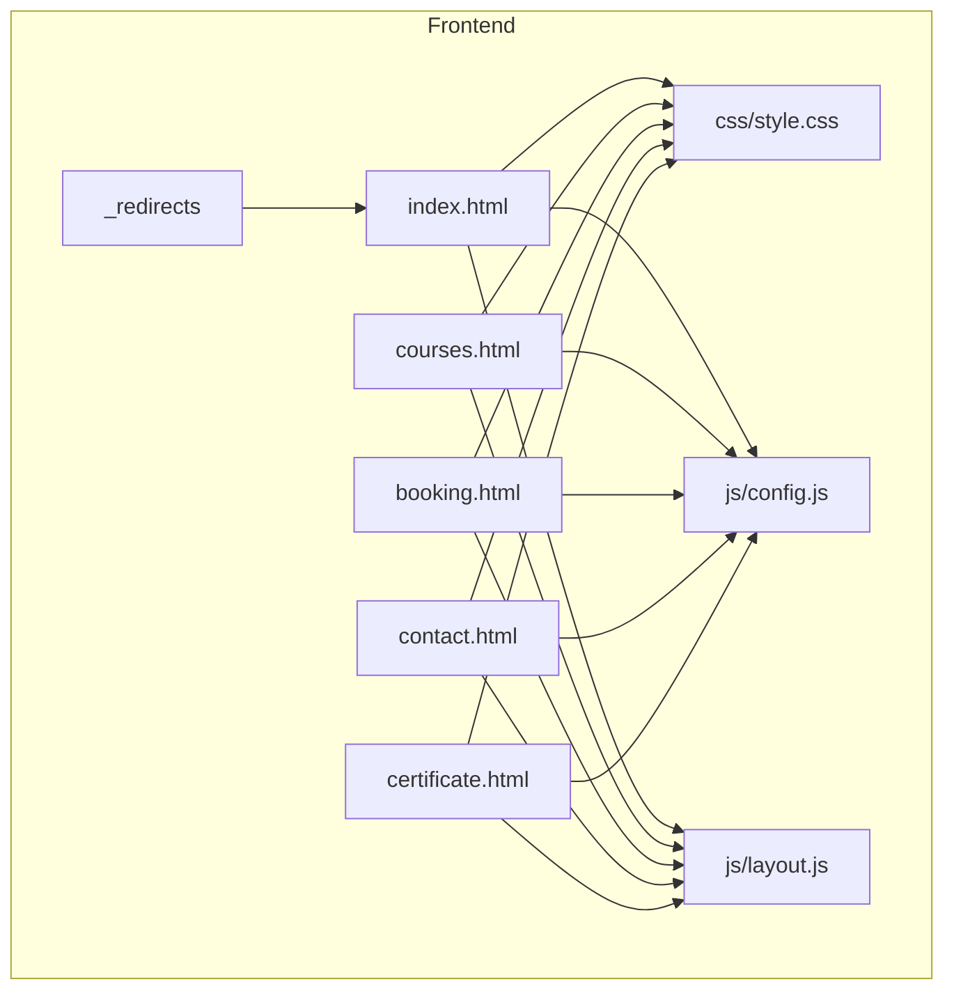
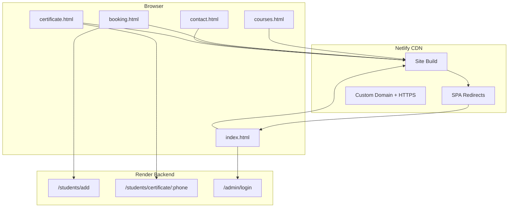
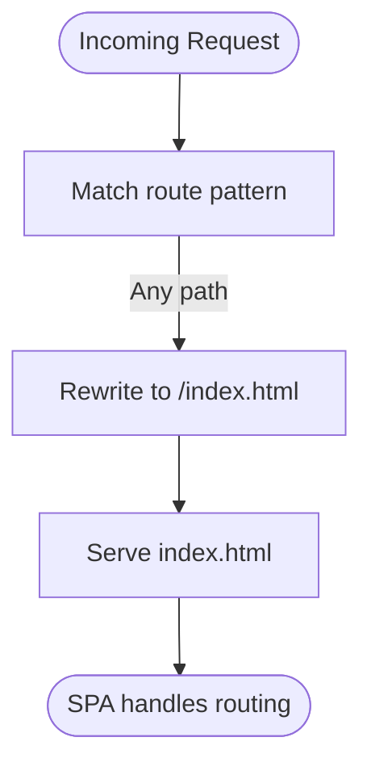
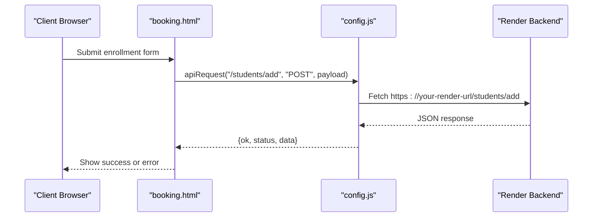
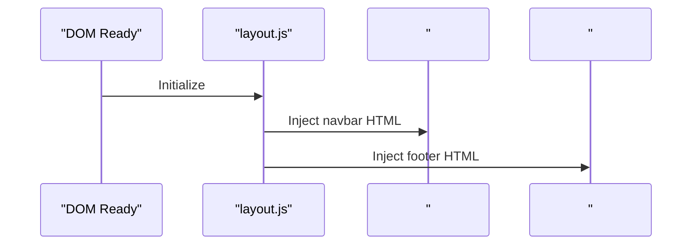
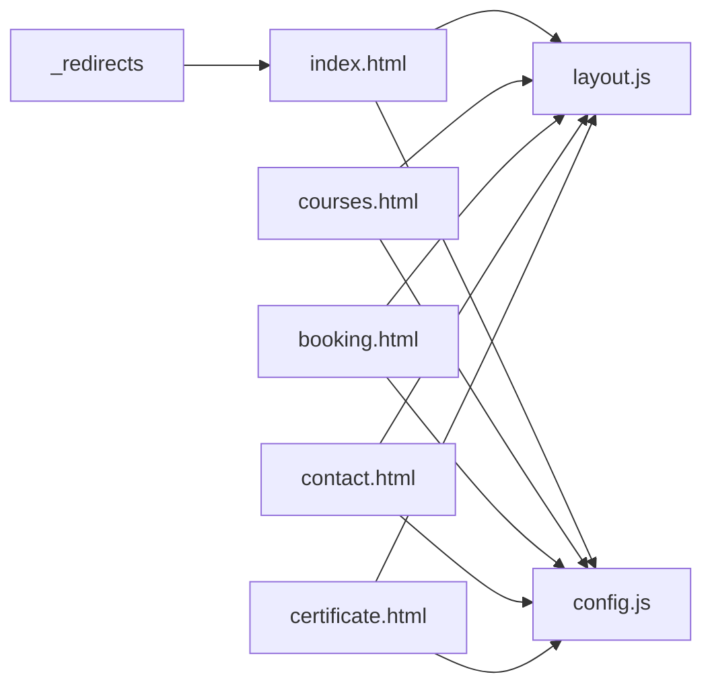

# Frontend Deployment

<cite>
**Referenced Files in This Document**
- [index.html](file://jk-mobiles/frontend/index.html)
- [courses.html](file://jk-mobiles/frontend/courses.html)
- [booking.html](file://jk-mobiles/frontend/booking.html)
- [contact.html](file://jk-mobiles/frontend/contact.html)
- [certificate.html](file://jk-mobiles/frontend/certificate.html)
- [_redirects](file://jk-mobiles/frontend/_redirects)
- [style.css](file://jk-mobiles/frontend/css/style.css)
- [config.js](file://jk-mobiles/frontend/js/config.js)
- [layout.js](file://jk-mobiles/frontend/js/layout.js)
- [README.md](file://jk-mobiles/README.md)
</cite>

## Table of Contents
1. [Introduction](#introduction)
2. [Project Structure](#project-structure)
3. [Core Components](#core-components)
4. [Architecture Overview](#architecture-overview)
5. [Detailed Component Analysis](#detailed-component-analysis)
6. [Dependency Analysis](#dependency-analysis)
7. [Performance Considerations](#performance-considerations)
8. [Troubleshooting Guide](#troubleshooting-guide)
9. [Conclusion](#conclusion)
10. [Appendices](#appendices)

## Introduction
This document provides end-to-end guidance for deploying the JK Mobiles static frontend on Netlify. It covers site setup, build configuration, production optimization, SPA routing via Netlify redirects, custom domain and HTTPS configuration, CDN usage, and performance best practices. It also includes step-by-step instructions for connecting a GitHub repository, configuring builds, enabling automatic deployments, and managing redirects for clean URLs. Finally, it addresses troubleshooting, preview deployments, and rollback procedures.

## Project Structure
The frontend is a static site composed of:
- HTML pages for Home, Courses, Booking, Contact, and Certificate
- Shared navigation and footer injected via JavaScript
- Global CSS and responsive styles
- Minimal client-side logic for API calls and DOM manipulation

**Diagram sources**
- [index.html](file://jk-mobiles/frontend/index.html)
- [courses.html](file://jk-mobiles/frontend/courses.html)
- [booking.html](file://jk-mobiles/frontend/booking.html)
- [contact.html](file://jk-mobiles/frontend/contact.html)
- [certificate.html](file://jk-mobiles/frontend/certificate.html)
- [_redirects](file://jk-mobiles/frontend/_redirects)
- [style.css](file://jk-mobiles/frontend/css/style.css)
- [config.js](file://jk-mobiles/frontend/js/config.js)
- [layout.js](file://jk-mobiles/frontend/js/layout.js)

**Section sources**
- [README.md](file://jk-mobiles/README.md)

## Core Components
- HTML pages: index, courses, booking, contact, certificate
- Shared layout: navigation and footer injected via JavaScript
- Styling: global CSS with responsive breakpoints and design tokens
- API configuration: centralized base URL and helper for requests
- SPA routing: Netlify redirects configured for single-page app behavior

Key implementation references:
- Navigation and footer injection: [layout.js](file://jk-mobiles/frontend/js/layout.js)
- API base URL and helper: [config.js](file://jk-mobiles/frontend/js/config.js)
- SPA routing rules: [_redirects](file://jk-mobiles/frontend/_redirects)
- Global styles and responsive design: [style.css](file://jk-mobiles/frontend/css/style.css)

**Section sources**
- [layout.js](file://jk-mobiles/frontend/js/layout.js)
- [config.js](file://jk-mobiles/frontend/js/config.js)
- [_redirects](file://jk-mobiles/frontend/_redirects)
- [style.css](file://jk-mobiles/frontend/css/style.css)

## Architecture Overview
The frontend is a static site served by Netlify. It dynamically injects shared navigation and footer and communicates with a backend hosted on Render. SPA routing is handled by Netlify’s redirect rules so deep links resolve to index.html while preserving the URL.

**Diagram sources**
- [_redirects](file://jk-mobiles/frontend/_redirects)
- [booking.html](file://jk-mobiles/frontend/booking.html)
- [certificate.html](file://jk-mobiles/frontend/certificate.html)
- [config.js](file://jk-mobiles/frontend/js/config.js)

## Detailed Component Analysis

### SPA Routing with Netlify Redirects
The frontend uses Netlify’s redirect rules to support SPA-style navigation. All routes fall back to index.html with a 200 status, enabling deep linking without a server.

- Redirect rule: [from = "/*" to = "/index.html" status = 200](file://jk-mobiles/frontend/_redirects)
- Behavior: Ensures deep links resolve to index.html while preserving the URL in the browser.

**Diagram sources**
- [_redirects](file://jk-mobiles/frontend/_redirects)

**Section sources**
- [_redirects](file://jk-mobiles/frontend/_redirects)

### API Integration and Base URL
The frontend centralizes API calls and base URL configuration. Replace the placeholder with your deployed backend URL.

- Base URL and helper: [config.js](file://jk-mobiles/frontend/js/config.js)
- Pages using API:
  - Enrollment form submission: [booking.html](file://jk-mobiles/frontend/booking.html)
  - Certificate lookup: [certificate.html](file://jk-mobiles/frontend/certificate.html)

**Diagram sources**
- [booking.html](file://jk-mobiles/frontend/booking.html)
- [config.js](file://jk-mobiles/frontend/js/config.js)

**Section sources**
- [config.js](file://jk-mobiles/frontend/js/config.js)
- [booking.html](file://jk-mobiles/frontend/booking.html)
- [certificate.html](file://jk-mobiles/frontend/certificate.html)

### Shared Layout Injection
The navigation and footer are injected via JavaScript to keep pages DRY and consistent.

- Navigation and footer HTML: [layout.js](file://jk-mobiles/frontend/js/layout.js)
- Placeholder elements in pages: [index.html](file://jk-mobiles/frontend/index.html), [courses.html](file://jk-mobiles/frontend/courses.html), [booking.html](file://jk-mobiles/frontend/booking.html), [contact.html](file://jk-mobiles/frontend/contact.html), [certificate.html](file://jk-mobiles/frontend/certificate.html)

**Diagram sources**
- [layout.js](file://jk-mobiles/frontend/js/layout.js)
- [index.html](file://jk-mobiles/frontend/index.html)

**Section sources**
- [layout.js](file://jk-mobiles/frontend/js/layout.js)
- [index.html](file://jk-mobiles/frontend/index.html)

### Global Styles and Responsive Design
Global styles define typography, colors, buttons, cards, and animations. Responsive breakpoints adapt layouts for mobile and tablet.

- Global design tokens and utilities: [style.css](file://jk-mobiles/frontend/css/style.css)
- Responsive media queries and component styles are embedded in each page’s head.

**Section sources**
- [style.css](file://jk-mobiles/frontend/css/style.css)

## Dependency Analysis
- External resources:
  - Bootstrap 5 via CDN in pages
  - Google Fonts via CDN in pages
- Internal dependencies:
  - Shared layout injection via layout.js
  - API helper via config.js
  - SPA fallback via _redirects

**Diagram sources**
- [layout.js](file://jk-mobiles/frontend/js/layout.js)
- [config.js](file://jk-mobiles/frontend/js/config.js)
- [_redirects](file://jk-mobiles/frontend/_redirects)

**Section sources**
- [layout.js](file://jk-mobiles/frontend/js/layout.js)
- [config.js](file://jk-mobiles/frontend/js/config.js)
- [_redirects](file://jk-mobiles/frontend/_redirects)

## Performance Considerations
- Minimize external dependencies:
  - Bootstrap and fonts are loaded from CDNs; ensure reliable availability and consider self-hosting for strict environments.
- Optimize assets:
  - Compress images and serve modern formats (WebP) if hosting images locally.
  - Use CSS minification and consider bundling tools if extending the project.
- Reduce render-blocking resources:
  - Keep styles in a single stylesheet and defer non-critical scripts.
- Enable browser caching:
  - Netlify caches static assets by default; configure cache headers via Netlify headers if needed.
- Monitor bundle size:
  - Since this is vanilla HTML/CSS/JS, keep scripts minimal and remove unused code.

[No sources needed since this section provides general guidance]

## Troubleshooting Guide
- SPA routing issues:
  - Ensure the redirect rule exists and is valid: [from = "/*" to = "/index.html" status = 200](file://jk-mobiles/frontend/_redirects)
  - After changing redirects, redeploy to apply changes.
- API errors:
  - Confirm API_BASE points to your deployed backend: [config.js](file://jk-mobiles/frontend/js/config.js)
  - Verify CORS and origin policies on the backend.
- Mixed content warnings:
  - Ensure your backend URL uses HTTPS; update API_BASE accordingly.
- Layout not rendering:
  - Check that placeholders exist in pages: [index.html](file://jk-mobiles/frontend/index.html), [courses.html](file://jk-mobiles/frontend/courses.html), [booking.html](file://jk-mobiles/frontend/booking.html), [contact.html](file://jk-mobiles/frontend/contact.html), [certificate.html](file://jk-mobiles/frontend/certificate.html)
  - Confirm layout.js runs after DOMContentLoaded.
- Preview deployments:
  - Netlify previews are enabled automatically when connected to a GitHub branch; review logs for build errors.
- Rollback:
  - Use Netlify’s deploys history to roll back to a previous successful build.

**Section sources**
- [_redirects](file://jk-mobiles/frontend/_redirects)
- [config.js](file://jk-mobiles/frontend/js/config.js)
- [layout.js](file://jk-mobiles/frontend/js/layout.js)
- [index.html](file://jk-mobiles/frontend/index.html)

## Conclusion
Deploying the JK Mobiles frontend on Netlify is straightforward. Configure SPA routing with Netlify redirects, set the API base URL to your Render backend, connect your GitHub repository, and deploy. Enable HTTPS and custom domains through Netlify’s settings. Monitor performance and troubleshoot using Netlify’s logs and preview deployments.

[No sources needed since this section summarizes without analyzing specific files]

## Appendices

### Step-by-Step Netlify Deployment
- Prepare your repository:
  - Push the frontend folder to a GitHub repository.
- Connect to Netlify:
  - Sign in to Netlify and add a new site from Git.
  - Select your repository and branch.
- Configure build settings:
  - Publish directory: set to the frontend folder (e.g., /frontend) or root if only frontend is present.
  - No build command is required for a static site.
- Enable automatic deployments:
  - Enable “Deploy from a branch” and select your preferred branch.
- Configure redirects:
  - Add the SPA redirect rule to your site’s redirects: [from = "/*" to = "/index.html" status = 200](file://jk-mobiles/frontend/_redirects)
- HTTPS and custom domain:
  - Under Domain Management, add your domain and enable HTTPS.
  - Point DNS records to Netlify as instructed.
- Test:
  - Visit your site and verify deep links resolve to index.html and SPA navigation works.

**Section sources**
- [README.md](file://jk-mobiles/README.md)
- [_redirects](file://jk-mobiles/frontend/_redirects)