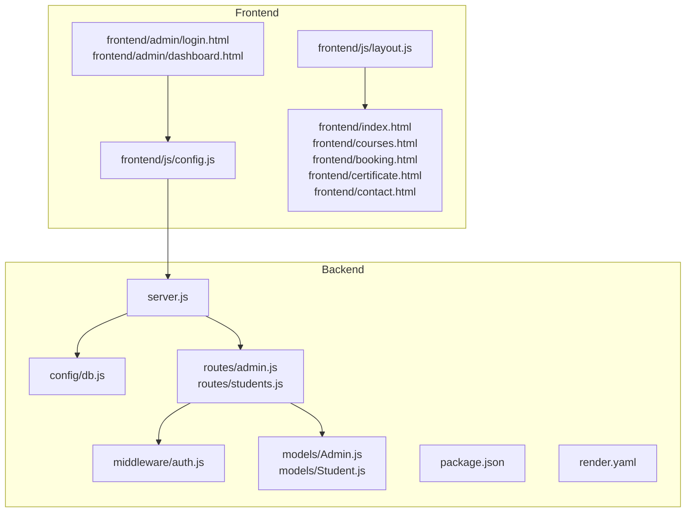
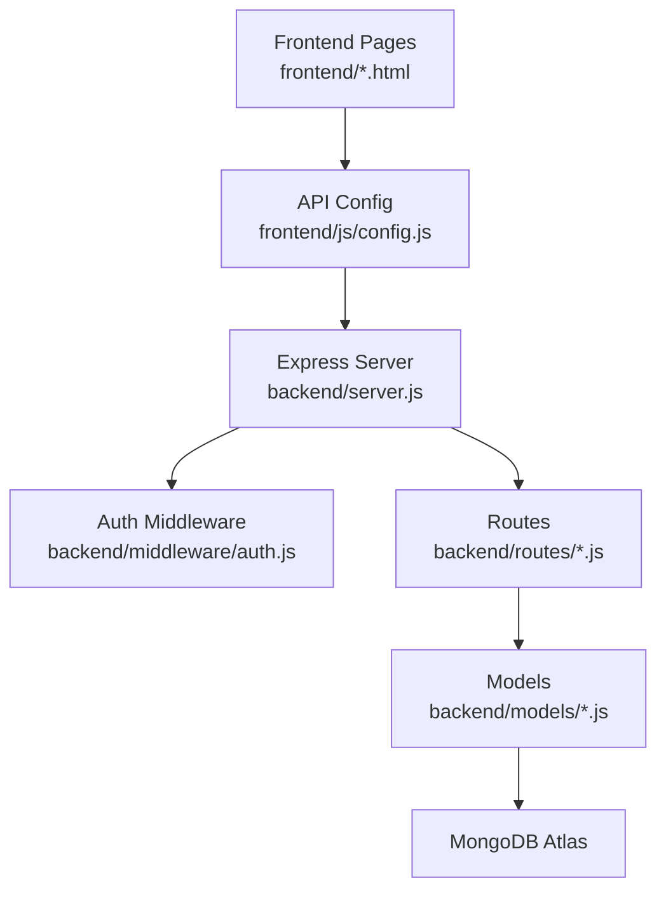
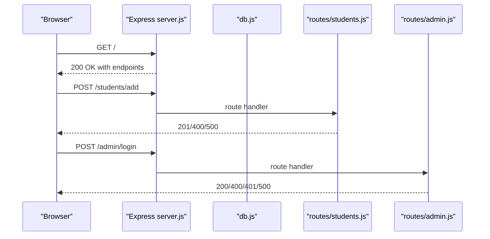
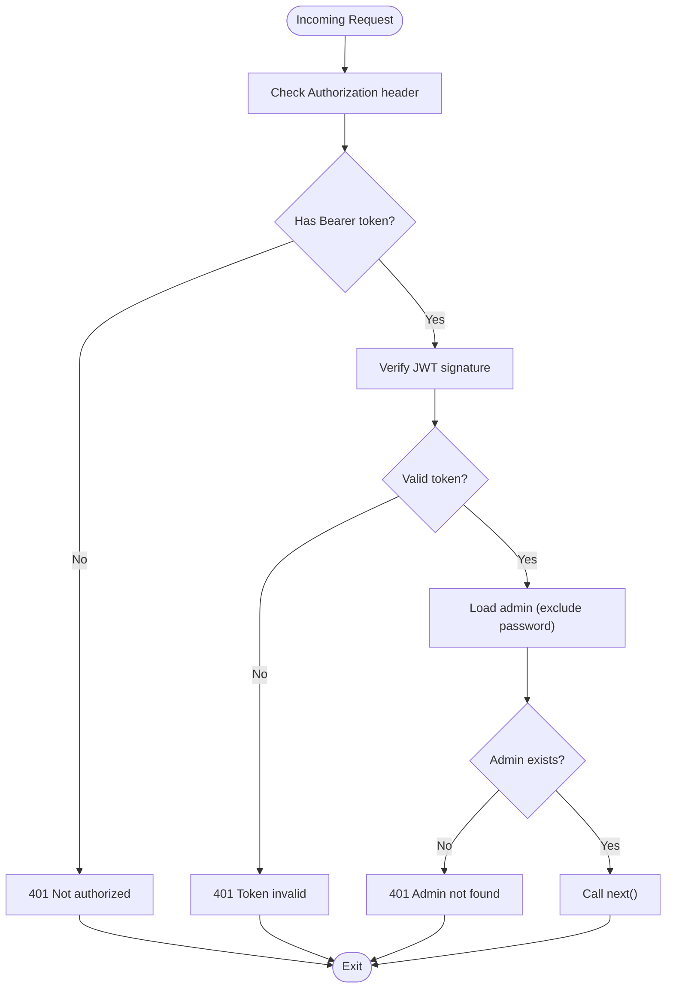
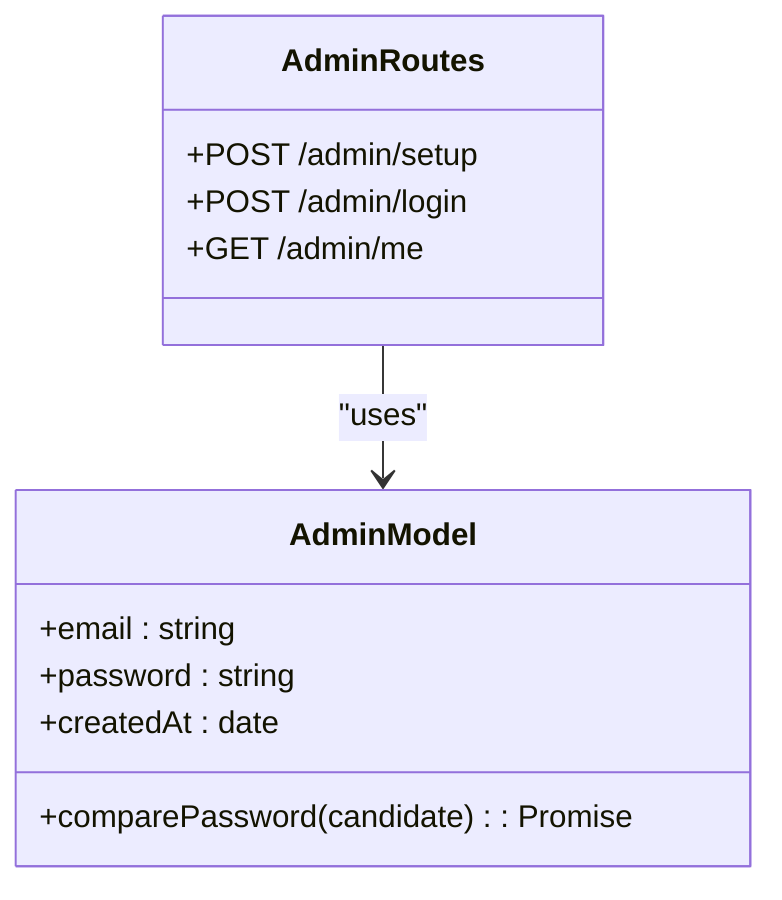
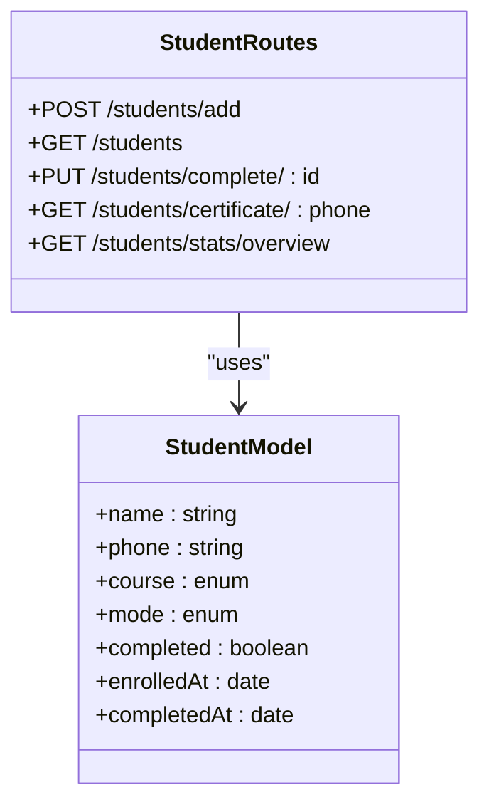
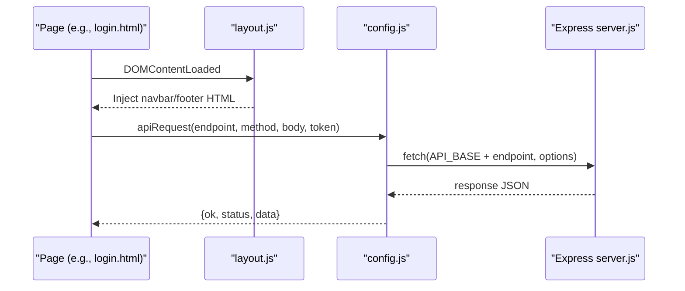
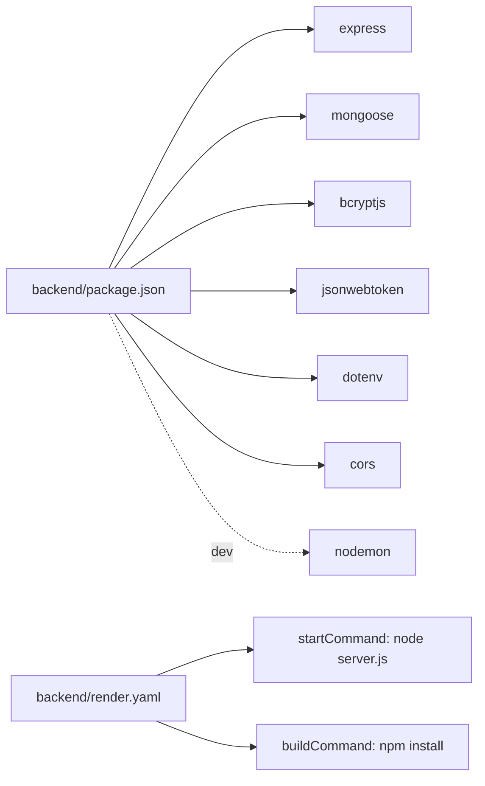

# Development Workflow

<cite>
**Referenced Files in This Document**
- [README.md](file://README.md)
- [backend/package.json](file://backend/package.json)
- [backend/server.js](file://backend/server.js)
- [backend/config/db.js](file://backend/config/db.js)
- [backend/middleware/auth.js](file://backend/middleware/auth.js)
- [backend/models/Admin.js](file://backend/models/Admin.js)
- [backend/models/Student.js](file://backend/models/Student.js)
- [backend/routes/admin.js](file://backend/routes/admin.js)
- [backend/routes/students.js](file://backend/routes/students.js)
- [backend/render.yaml](file://backend/render.yaml)
- [frontend/js/config.js](file://frontend/js/config.js)
- [frontend/js/layout.js](file://frontend/js/layout.js)
- [frontend/admin/login.html](file://frontend/admin/login.html)
- [frontend/admin/dashboard.html](file://frontend/admin/dashboard.html)
</cite>

## Table of Contents
1. [Introduction](#introduction)
2. [Project Structure](#project-structure)
3. [Core Components](#core-components)
4. [Architecture Overview](#architecture-overview)
5. [Detailed Component Analysis](#detailed-component-analysis)
6. [Dependency Analysis](#dependency-analysis)
7. [Performance Considerations](#performance-considerations)
8. [Troubleshooting Guide](#troubleshooting-guide)
9. [Contribution Guidelines](#contribution-guidelines)
10. [Conclusion](#conclusion)

## Introduction
This document describes the development workflow for the JK Mobiles project. It covers local setup, code organization, development best practices, environment configuration, running development servers, testing, build and dependency management, debugging, error handling, and contribution guidelines. The project is a full-stack website for a training institute with a static frontend and a Node.js + Express backend.

## Project Structure
The repository is organized into two primary areas:
- backend: Node.js + Express API with models, routes, middleware, and configuration
- frontend: Static HTML/CSS/JS pages and admin panel

**Diagram sources**
- [backend/server.js:1-52](file://backend/server.js#L1-L52)
- [backend/config/db.js:1-17](file://backend/config/db.js#L1-L17)
- [backend/middleware/auth.js:1-34](file://backend/middleware/auth.js#L1-L34)
- [backend/models/Admin.js:1-34](file://backend/models/Admin.js#L1-L34)
- [backend/models/Student.js:1-39](file://backend/models/Student.js#L1-L39)
- [backend/routes/admin.js:1-55](file://backend/routes/admin.js#L1-L55)
- [backend/routes/students.js:1-100](file://backend/routes/students.js#L1-L100)
- [backend/package.json:1-22](file://backend/package.json#L1-L22)
- [backend/render.yaml:1-18](file://backend/render.yaml#L1-L18)
- [frontend/js/config.js:1-33](file://frontend/js/config.js#L1-L33)
- [frontend/js/layout.js:1-69](file://frontend/js/layout.js#L1-L69)
- [frontend/admin/login.html:1-376](file://frontend/admin/login.html#L1-L376)
- [frontend/admin/dashboard.html:1-800](file://frontend/admin/dashboard.html#L1-L800)

**Section sources**
- [README.md:7-42](file://README.md#L7-L42)
- [backend/package.json:1-22](file://backend/package.json#L1-L22)
- [backend/server.js:1-52](file://backend/server.js#L1-L52)

## Core Components
- Backend entry point initializes environment, connects to MongoDB, applies CORS and JSON middleware, mounts routes, and starts the server.
- Database connection module centralizes Mongoose setup and graceful exit on failure.
- Authentication middleware validates JWT tokens from Authorization headers and attaches admin context.
- Models define schemas for Admin and Student with pre-save hashing and password comparison helpers.
- Routes expose public and protected endpoints for student enrollment, certificates, and admin login/setup/me.
- Frontend configuration centralizes API base URL and provides a reusable fetch helper and navigation highlighting.
- Frontend layout injects shared navbar and footer into pages.

Key implementation references:
- Backend entry and middleware: [backend/server.js:1-52](file://backend/server.js#L1-L52)
- Database connection: [backend/config/db.js:1-17](file://backend/config/db.js#L1-L17)
- Auth middleware: [backend/middleware/auth.js:1-34](file://backend/middleware/auth.js#L1-L34)
- Admin model: [backend/models/Admin.js:1-34](file://backend/models/Admin.js#L1-L34)
- Student model: [backend/models/Student.js:1-39](file://backend/models/Student.js#L1-L39)
- Admin routes: [backend/routes/admin.js:1-55](file://backend/routes/admin.js#L1-L55)
- Student routes: [backend/routes/students.js:1-100](file://backend/routes/students.js#L1-L100)
- Frontend config: [frontend/js/config.js:1-33](file://frontend/js/config.js#L1-L33)
- Frontend layout: [frontend/js/layout.js:1-69](file://frontend/js/layout.js#L1-L69)

**Section sources**
- [backend/server.js:1-52](file://backend/server.js#L1-L52)
- [backend/config/db.js:1-17](file://backend/config/db.js#L1-L17)
- [backend/middleware/auth.js:1-34](file://backend/middleware/auth.js#L1-L34)
- [backend/models/Admin.js:1-34](file://backend/models/Admin.js#L1-L34)
- [backend/models/Student.js:1-39](file://backend/models/Student.js#L1-L39)
- [backend/routes/admin.js:1-55](file://backend/routes/admin.js#L1-L55)
- [backend/routes/students.js:1-100](file://backend/routes/students.js#L1-L100)
- [frontend/js/config.js:1-33](file://frontend/js/config.js#L1-L33)
- [frontend/js/layout.js:1-69](file://frontend/js/layout.js#L1-L69)

## Architecture Overview
The system follows a thin-client architecture:
- Frontend static pages communicate with the backend via RESTful endpoints.
- Backend enforces JWT-based authentication for admin-protected routes.
- MongoDB Atlas stores student and admin records.

**Diagram sources**
- [frontend/js/config.js:1-33](file://frontend/js/config.js#L1-L33)
- [backend/server.js:1-52](file://backend/server.js#L1-L52)
- [backend/middleware/auth.js:1-34](file://backend/middleware/auth.js#L1-L34)
- [backend/routes/admin.js:1-55](file://backend/routes/admin.js#L1-L55)
- [backend/routes/students.js:1-100](file://backend/routes/students.js#L1-L100)
- [backend/models/Admin.js:1-34](file://backend/models/Admin.js#L1-L34)
- [backend/models/Student.js:1-39](file://backend/models/Student.js#L1-L39)

## Detailed Component Analysis

### Backend Entry Point and Routing
- Loads environment variables, connects to MongoDB, enables CORS, parses JSON, and mounts routes under /students and /admin.
- Provides a health check endpoint and centralized 404 and error handlers.

**Diagram sources**
- [backend/server.js:1-52](file://backend/server.js#L1-L52)
- [backend/routes/students.js:1-100](file://backend/routes/students.js#L1-L100)
- [backend/routes/admin.js:1-55](file://backend/routes/admin.js#L1-L55)

**Section sources**
- [backend/server.js:1-52](file://backend/server.js#L1-L52)
- [backend/routes/students.js:1-100](file://backend/routes/students.js#L1-L100)
- [backend/routes/admin.js:1-55](file://backend/routes/admin.js#L1-L55)

### Authentication Middleware
- Extracts Bearer token from Authorization header.
- Verifies token against JWT secret and loads admin without password.
- Returns 401 for missing/invalid tokens or missing admin.

**Diagram sources**
- [backend/middleware/auth.js:1-34](file://backend/middleware/auth.js#L1-L34)

**Section sources**
- [backend/middleware/auth.js:1-34](file://backend/middleware/auth.js#L1-L34)

### Admin Model and Routes
- Admin schema includes email, password, and timestamps; password hashed before save; includes comparePassword helper.
- Admin routes support setup (one-time), login, and profile verification.

**Diagram sources**
- [backend/models/Admin.js:1-34](file://backend/models/Admin.js#L1-L34)
- [backend/routes/admin.js:1-55](file://backend/routes/admin.js#L1-L55)

**Section sources**
- [backend/models/Admin.js:1-34](file://backend/models/Admin.js#L1-L34)
- [backend/routes/admin.js:1-55](file://backend/routes/admin.js#L1-L55)

### Student Model and Routes
- Student schema defines name, phone, course, mode, completion flags, and timestamps.
- Student routes handle enrollment, listing, marking complete, retrieving certificate data, and fetching dashboard stats.

**Diagram sources**
- [backend/models/Student.js:1-39](file://backend/models/Student.js#L1-L39)
- [backend/routes/students.js:1-100](file://backend/routes/students.js#L1-L100)

**Section sources**
- [backend/models/Student.js:1-39](file://backend/models/Student.js#L1-L39)
- [backend/routes/students.js:1-100](file://backend/routes/students.js#L1-L100)

### Frontend API Configuration and Layout
- API base URL is configurable and used by a unified fetch helper.
- Navigation highlighting is handled dynamically.
- Shared navbar and footer are injected via layout script.

**Diagram sources**
- [frontend/js/layout.js:1-69](file://frontend/js/layout.js#L1-L69)
- [frontend/js/config.js:1-33](file://frontend/js/config.js#L1-L33)
- [frontend/admin/login.html:312-373](file://frontend/admin/login.html#L312-L373)
- [backend/server.js:1-52](file://backend/server.js#L1-L52)

**Section sources**
- [frontend/js/config.js:1-33](file://frontend/js/config.js#L1-L33)
- [frontend/js/layout.js:1-69](file://frontend/js/layout.js#L1-L69)
- [frontend/admin/login.html:312-373](file://frontend/admin/login.html#L312-L373)

## Dependency Analysis
- Backend dependencies include Express, Mongoose, bcryptjs, jsonwebtoken, dotenv, cors, and nodemon (dev).
- Build and runtime commands are defined for Render deployment.
- Frontend depends on Bootstrap 5 and Google Fonts via CDN; API base URL is configured in JS and HTML.

**Diagram sources**
- [backend/package.json:1-22](file://backend/package.json#L1-L22)
- [backend/render.yaml:1-18](file://backend/render.yaml#L1-L18)

**Section sources**
- [backend/package.json:1-22](file://backend/package.json#L1-L22)
- [backend/render.yaml:1-18](file://backend/render.yaml#L1-L18)

## Performance Considerations
- Keep database queries efficient; use appropriate indexes on frequently queried fields (e.g., phone).
- Minimize payload sizes by selecting only required fields in admin routes.
- Cache static assets and leverage CDN for fonts and frameworks.
- Monitor API latency and consider pagination for large student lists.
- Use environment-specific logging and avoid verbose logs in production.

## Troubleshooting Guide
Common issues and resolutions:
- Backend fails to start due to missing environment variables:
  - Ensure MONGODB_URI, JWT_SECRET, ADMIN_EMAIL, ADMIN_PASSWORD, and PORT are set.
  - Reference: [backend/render.yaml:7-17](file://backend/render.yaml#L7-L17), [backend/server.js:48-51](file://backend/server.js#L48-L51)
- MongoDB connection errors:
  - Verify connection string and network access; confirm Atlas cluster is reachable.
  - Reference: [backend/config/db.js:1-17](file://backend/config/db.js#L1-L17)
- Admin setup already exists:
  - Run the setup endpoint only once; subsequent runs return an error.
  - Reference: [backend/routes/admin.js:11-26](file://backend/routes/admin.js#L11-L26)
- Invalid or missing JWT token:
  - Ensure Authorization header is present and formatted as Bearer <token>.
  - Reference: [backend/middleware/auth.js:1-34](file://backend/middleware/auth.js#L1-L34)
- Frontend API calls fail:
  - Confirm API_BASE matches deployed backend URL and CORS allows requests.
  - Reference: [frontend/js/config.js:5-6](file://frontend/js/config.js#L5-L6), [backend/server.js:12-18](file://backend/server.js#L12-L18)

**Section sources**
- [backend/render.yaml:7-17](file://backend/render.yaml#L7-L17)
- [backend/server.js:48-51](file://backend/server.js#L48-L51)
- [backend/config/db.js:1-17](file://backend/config/db.js#L1-L17)
- [backend/routes/admin.js:11-26](file://backend/routes/admin.js#L11-L26)
- [backend/middleware/auth.js:1-34](file://backend/middleware/auth.js#L1-L34)
- [frontend/js/config.js:5-6](file://frontend/js/config.js#L5-L6)

## Contribution Guidelines
- Branching and workflow:
  - Use feature branches for new features and bug fixes.
  - Open pull requests targeting develop/main with clear descriptions.
- Code standards:
  - Follow consistent naming conventions: PascalCase for models, camelCase for variables, kebab-case for filenames.
  - Keep route handlers concise; extract helpers into shared modules.
  - Validate inputs early; return structured JSON responses with success and message fields.
- Testing:
  - Test endpoints manually using the admin dashboard and certificate portal.
  - Verify JWT protected routes require Authorization headers.
- Documentation:
  - Update README.md for any configuration or deployment changes.
  - Add comments for complex logic in routes and middleware.
- Review checklist:
  - Lint and test locally before submitting PRs.
  - Ensure environment variables are documented and secure.

## Conclusion
This guide outlines the development workflow for the JK Mobiles project, covering setup, architecture, components, and operational practices. Adhering to the outlined conventions ensures maintainable, secure, and scalable enhancements to the platform.