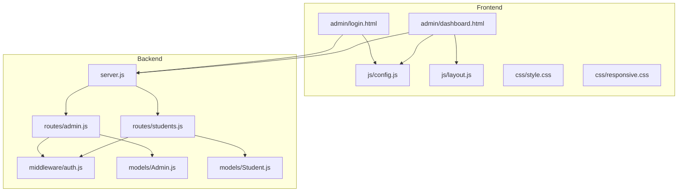
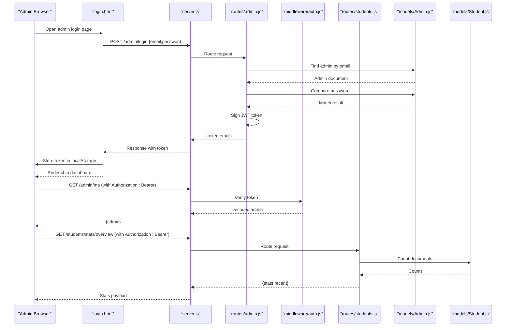
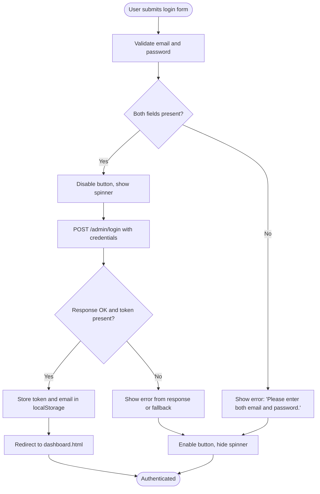
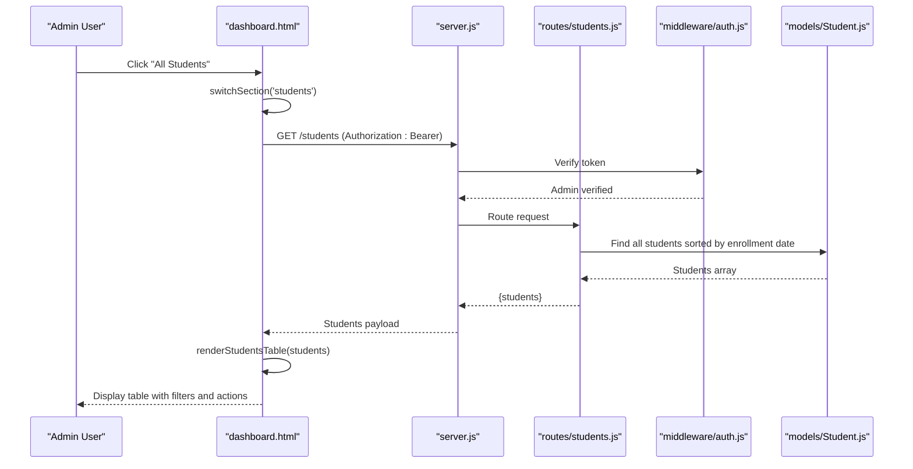
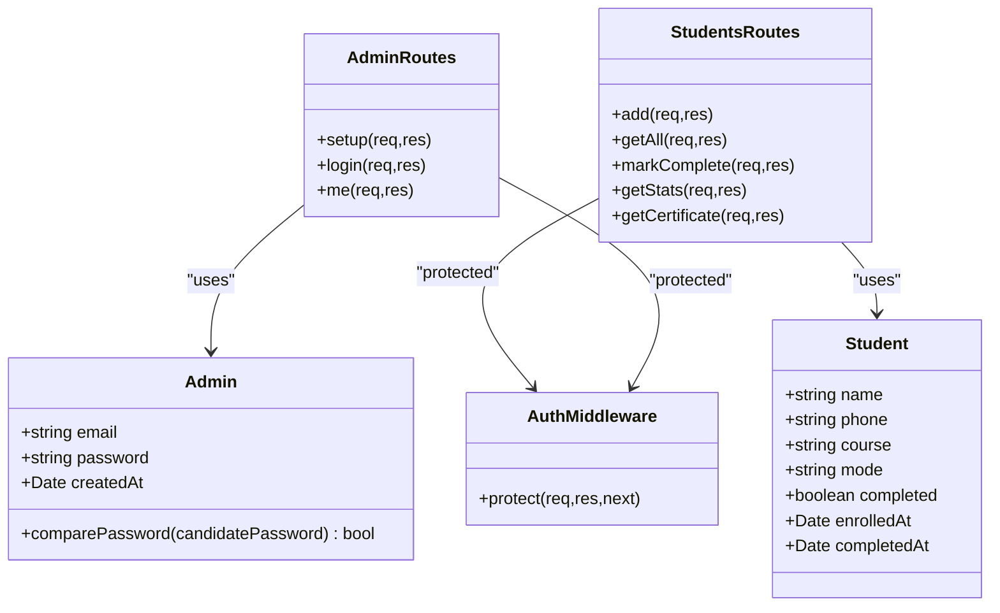
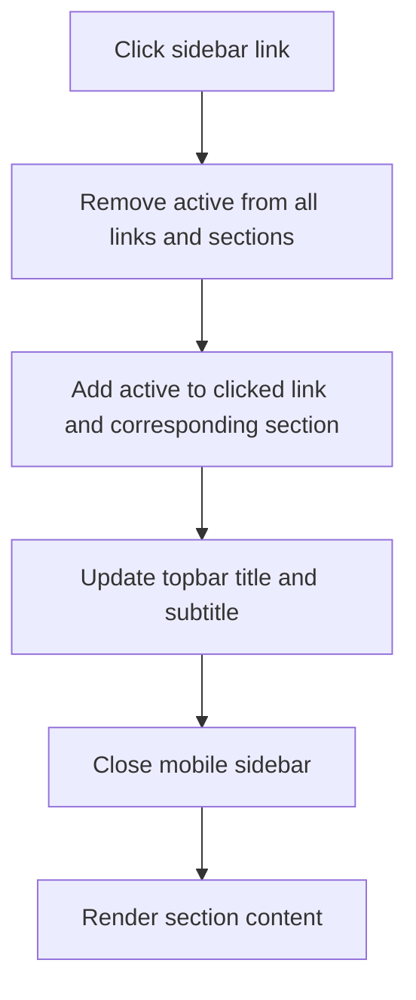
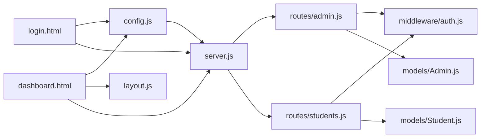

# Admin Portal

<cite>
**Referenced Files in This Document**
- [login.html](file://jk-mobiles/frontend/admin/login.html)
- [dashboard.html](file://jk-mobiles/frontend/admin/dashboard.html)
- [layout.js](file://jk-mobiles/frontend/js/layout.js)
- [config.js](file://jk-mobiles/frontend/js/config.js)
- [style.css](file://jk-mobiles/frontend/css/style.css)
- [responsive.css](file://jk-mobiles/frontend/css/responsive.css)
- [server.js](file://jk-mobiles/backend/server.js)
- [admin.js](file://jk-mobiles/backend/routes/admin.js)
- [students.js](file://jk-mobiles/backend/routes/students.js)
- [auth.js](file://jk-mobiles/backend/middleware/auth.js)
- [Admin.js](file://jk-mobiles/backend/models/Admin.js)
- [Student.js](file://jk-mobiles/backend/models/Student.js)
</cite>

## Table of Contents
1. [Introduction](#introduction)
2. [Project Structure](#project-structure)
3. [Core Components](#core-components)
4. [Architecture Overview](#architecture-overview)
5. [Detailed Component Analysis](#detailed-component-analysis)
6. [Dependency Analysis](#dependency-analysis)
7. [Performance Considerations](#performance-considerations)
8. [Troubleshooting Guide](#troubleshooting-guide)
9. [Conclusion](#conclusion)

## Introduction
This document provides comprehensive technical documentation for the administrative portal interface of JK Mobiles Training Institute. It covers the admin login page with authentication flow, JWT token management, the dashboard functionality including student management, analytics displays, and administrative controls. It also details the navigation structure, active state management, responsive design, form handling patterns, data presentation components, administrative workflow optimization, and integration with backend admin endpoints and token-based authentication.

## Project Structure
The admin portal consists of two primary frontend pages and a robust backend API with authentication middleware and data models.

**Diagram sources**
- [login.html:1-377](file://jk-mobiles/frontend/admin/login.html#L1-L377)
- [dashboard.html:1-1234](file://jk-mobiles/frontend/admin/dashboard.html#L1-L1234)
- [config.js:1-34](file://jk-mobiles/frontend/js/config.js#L1-L34)
- [layout.js:1-69](file://jk-mobiles/frontend/js/layout.js#L1-L69)
- [server.js:1-52](file://jk-mobiles/backend/server.js#L1-L52)
- [admin.js:1-55](file://jk-mobiles/backend/routes/admin.js#L1-L55)
- [students.js:1-100](file://jk-mobiles/backend/routes/students.js#L1-L100)
- [auth.js:1-34](file://jk-mobiles/backend/middleware/auth.js#L1-L34)
- [Admin.js:1-34](file://jk-mobiles/backend/models/Admin.js#L1-L34)
- [Student.js:1-39](file://jk-mobiles/backend/models/Student.js#L1-L39)

**Section sources**
- [login.html:1-377](file://jk-mobiles/frontend/admin/login.html#L1-L377)
- [dashboard.html:1-1234](file://jk-mobiles/frontend/admin/dashboard.html#L1-L1234)
- [server.js:1-52](file://jk-mobiles/backend/server.js#L1-L52)

## Core Components
- Admin Login Page: Handles admin authentication, form validation, error messaging, and JWT token storage.
- Admin Dashboard: Provides navigation, statistics cards, student management tables, filtering, and completion actions.
- Shared Utilities: API request helper with token injection and navigation highlighting.
- Backend Authentication: JWT-based middleware protecting admin endpoints.
- Data Models: Admin and Student schemas with password hashing and validation.

**Section sources**
- [login.html:312-377](file://jk-mobiles/frontend/admin/login.html#L312-L377)
- [dashboard.html:954-1234](file://jk-mobiles/frontend/admin/dashboard.html#L954-L1234)
- [config.js:10-20](file://jk-mobiles/frontend/js/config.js#L10-L20)
- [auth.js:4-31](file://jk-mobiles/backend/middleware/auth.js#L4-L31)
- [Admin.js:4-31](file://jk-mobiles/backend/models/Admin.js#L4-L31)
- [Student.js:3-36](file://jk-mobiles/backend/models/Student.js#L3-L36)

## Architecture Overview
The admin portal follows a client-server architecture with JWT-based authentication.

**Diagram sources**
- [login.html:352-362](file://jk-mobiles/frontend/admin/login.html#L352-L362)
- [server.js:20-22](file://jk-mobiles/backend/server.js#L20-L22)
- [admin.js:28-47](file://jk-mobiles/backend/routes/admin.js#L28-L47)
- [auth.js:4-31](file://jk-mobiles/backend/middleware/auth.js#L4-L31)
- [students.js:86-97](file://jk-mobiles/backend/routes/students.js#L86-L97)
- [Admin.js:28-31](file://jk-mobiles/backend/models/Admin.js#L28-L31)
- [Student.js:25-36](file://jk-mobiles/backend/models/Student.js#L25-L36)

## Detailed Component Analysis

### Admin Login Page
- Purpose: Authenticate admin users and obtain a JWT token for subsequent requests.
- Authentication Flow:
  - Validates presence of email and password.
  - Sends credentials to backend login endpoint.
  - On success, stores token and admin email in localStorage and redirects to dashboard.
  - On failure, displays error messages and keeps the user on the login page.
- Error Handling:
  - Displays user-friendly error messages for missing fields, invalid credentials, network errors, and server failures.
  - Supports Enter key submission.
- Token Management:
  - Uses localStorage to persist the JWT token and admin email.
  - Redirects to dashboard if a token is already present.
- UI/UX:
  - Clean card-based layout with gradient accents.
  - Password visibility toggle.
  - Responsive design for mobile devices.
  - Demo credentials display.

**Diagram sources**
- [login.html:336-373](file://jk-mobiles/frontend/admin/login.html#L336-L373)

**Section sources**
- [login.html:312-377](file://jk-mobiles/frontend/admin/login.html#L312-L377)

### Admin Dashboard
- Navigation:
  - Fixed sidebar with navigation links for Dashboard, All Students, Completed, Pending.
  - Active state management via JavaScript toggling of active classes.
  - Mobile hamburger menu with overlay for small screens.
  - Logout and refresh actions in topbar.
- Data Presentation:
  - Statistics cards for total students, completed, pending, and completion rate.
  - Recent enrollments list with avatars and status badges.
  - Course breakdown visualization using text-based bar charts.
- Student Management:
  - All Students table with search, course filter, and mode filter.
  - Completed Students table with certificate action.
  - Pending Students table with "Mark as Completed" action.
  - Filtering and sorting handled client-side.
- Administrative Controls:
  - Mark student as completed triggers a protected PUT endpoint.
  - Toast notifications for feedback.
  - Refresh button to reload data.
- Token-Based Authentication:
  - Requires Authorization header with Bearer token.
  - Automatic logout on 401 responses.
- Responsive Design:
  - Mobile-first CSS with media queries for tablet and desktop.
  - Collapsible sidebar on small screens with overlay.

**Diagram sources**
- [dashboard.html:987-1090](file://jk-mobiles/frontend/admin/dashboard.html#L987-L1090)
- [students.js:27-35](file://jk-mobiles/backend/routes/students.js#L27-L35)
- [auth.js:4-31](file://jk-mobiles/backend/middleware/auth.js#L4-L31)
- [Student.js:3-36](file://jk-mobiles/backend/models/Student.js#L3-L36)

**Section sources**
- [dashboard.html:704-951](file://jk-mobiles/frontend/admin/dashboard.html#L704-L951)
- [dashboard.html:954-1234](file://jk-mobiles/frontend/admin/dashboard.html#L954-L1234)

### Backend Authentication and Admin Endpoints
- JWT Setup:
  - Admin model hashes passwords before saving and provides a comparePassword method.
  - Admin login signs a JWT with a 7-day expiration using a secret from environment variables.
- Protected Routes:
  - Admin-only endpoints require a valid Bearer token.
  - Token verification middleware decodes the token and attaches admin to the request.
- Admin Routes:
  - POST /admin/setup: Creates the first admin account with default credentials.
  - POST /admin/login: Authenticates admin and returns a JWT token.
  - GET /admin/me: Returns the authenticated admin profile.
- Students Routes:
  - GET /students: Returns all students for admin dashboard.
  - PUT /students/complete/:id: Marks a student as completed.
  - GET /students/stats/overview: Returns dashboard statistics and recent enrollments.
  - GET /students/certificate/:phone: Retrieves certificate data for a completed student.

**Diagram sources**
- [Admin.js:4-31](file://jk-mobiles/backend/models/Admin.js#L4-L31)
- [Student.js:3-36](file://jk-mobiles/backend/models/Student.js#L3-L36)
- [auth.js:4-31](file://jk-mobiles/backend/middleware/auth.js#L4-L31)
- [admin.js:11-52](file://jk-mobiles/backend/routes/admin.js#L11-L52)
- [students.js:6-97](file://jk-mobiles/backend/routes/students.js#L6-L97)

**Section sources**
- [admin.js:11-52](file://jk-mobiles/backend/routes/admin.js#L11-L52)
- [auth.js:4-31](file://jk-mobiles/backend/middleware/auth.js#L4-L31)
- [Admin.js:28-31](file://jk-mobiles/backend/models/Admin.js#L28-L31)
- [students.js:27-97](file://jk-mobiles/backend/routes/students.js#L27-L97)
- [Student.js:25-36](file://jk-mobiles/backend/models/Student.js#L25-L36)

### Navigation Structure and Active State Management
- Sidebar Navigation:
  - Links trigger switchSection to activate the corresponding page section and update the topbar title.
  - Active class is managed dynamically on both page sections and sidebar links.
- Mobile Navigation:
  - Hamburger menu toggles sidebar visibility and overlay.
  - Overlay click closes the sidebar.
- Topbar:
  - Title reflects the active section.
  - Subtitle shows formatted current date.
- Navigation Highlighting (shared):
  - Utility script highlights the active navigation link on website pages.

**Diagram sources**
- [dashboard.html:987-998](file://jk-mobiles/frontend/admin/dashboard.html#L987-L998)
- [layout.js:23-31](file://jk-mobiles/frontend/js/layout.js#L23-L31)

**Section sources**
- [dashboard.html:704-755](file://jk-mobiles/frontend/admin/dashboard.html#L704-L755)
- [dashboard.html:987-1000](file://jk-mobiles/frontend/admin/dashboard.html#L987-L1000)
- [layout.js:23-31](file://jk-mobiles/frontend/js/layout.js#L23-L31)

### Form Handling Patterns and Data Presentation
- Login Form:
  - Controlled inputs for email and password.
  - Toggle password visibility.
  - Enter key submission support.
  - Loading state with spinner during API call.
- Dashboard Filters:
  - Real-time filtering of the students table by name/phone, course, and mode.
  - Client-side rendering updates.
- Action Buttons:
  - "Mark as Completed" button triggers a protected API call and updates UI state.
  - Toast notifications provide immediate feedback.
- Data Presentation:
  - Statistics cards with gradient icons.
  - Status badges for course modes and completion status.
  - Skeleton loaders during data fetching.
  - Empty states for tables and lists.

**Section sources**
- [login.html:321-373](file://jk-mobiles/frontend/admin/login.html#L321-L373)
- [dashboard.html:1192-1206](file://jk-mobiles/frontend/admin/dashboard.html#L1192-L1206)
- [dashboard.html:1208-1224](file://jk-mobiles/frontend/admin/dashboard.html#L1208-L1224)

### Administrative Workflow Optimization
- Token Management:
  - Centralized API helper injects Authorization header automatically.
  - Automatic logout on 401 responses prevents stale sessions.
- Parallel Data Loading:
  - Dashboard loads statistics and student lists concurrently.
- Client-Side Filtering:
  - Reduces server load by filtering locally after initial data fetch.
- Responsive Design:
  - Mobile-first approach ensures optimal usability across devices.
- Accessibility:
  - Focus-visible styles and reduced-motion support included in global styles.

**Section sources**
- [config.js:10-20](file://jk-mobiles/frontend/js/config.js#L10-L20)
- [dashboard.html:1043-1045](file://jk-mobiles/frontend/admin/dashboard.html#L1043-L1045)
- [responsive.css:379-396](file://jk-mobiles/frontend/css/responsive.css#L379-L396)

## Dependency Analysis
- Frontend Dependencies:
  - login.html depends on config.js for API base URL and on server.js endpoints.
  - dashboard.html depends on config.js for API requests, layout.js for shared navigation, and CSS for styling.
- Backend Dependencies:
  - server.js orchestrates CORS, JSON parsing, routing, and error handling.
  - routes/admin.js and routes/students.js depend on middleware/auth.js for protection.
  - models/Admin.js and models/Student.js define schemas and methods used by routes.
- Coupling and Cohesion:
  - Strong separation between frontend pages and backend routes.
  - Middleware enforces authentication policy consistently.
  - Models encapsulate data validation and business rules.

**Diagram sources**
- [login.html:312-314](file://jk-mobiles/frontend/admin/login.html#L312-L314)
- [dashboard.html:954-956](file://jk-mobiles/frontend/admin/dashboard.html#L954-L956)
- [config.js:5-7](file://jk-mobiles/frontend/js/config.js#L5-L7)
- [server.js:20-22](file://jk-mobiles/backend/server.js#L20-L22)
- [admin.js:1-5](file://jk-mobiles/backend/routes/admin.js#L1-L5)
- [students.js:1-4](file://jk-mobiles/backend/routes/students.js#L1-L4)
- [auth.js:1-2](file://jk-mobiles/backend/middleware/auth.js#L1-L2)
- [Admin.js:1-2](file://jk-mobiles/backend/models/Admin.js#L1-L2)
- [Student.js:1-2](file://jk-mobiles/backend/models/Student.js#L1-L2)

**Section sources**
- [server.js:1-52](file://jk-mobiles/backend/server.js#L1-L52)
- [admin.js:1-55](file://jk-mobiles/backend/routes/admin.js#L1-L55)
- [students.js:1-100](file://jk-mobiles/backend/routes/students.js#L1-L100)
- [auth.js:1-34](file://jk-mobiles/backend/middleware/auth.js#L1-L34)
- [Admin.js:1-34](file://jk-mobiles/backend/models/Admin.js#L1-L34)
- [Student.js:1-39](file://jk-mobiles/backend/models/Student.js#L1-L39)

## Performance Considerations
- Network Efficiency:
  - Use centralized API helper to avoid redundant headers and improve maintainability.
  - Batch related data fetching (e.g., stats and student list) to minimize round trips.
- Rendering Performance:
  - Client-side filtering reduces server load but consider pagination for large datasets.
  - Debounce search input to limit frequent re-renders.
- Storage:
  - LocalStorage is sufficient for short-lived admin sessions; consider secure HTTP-only cookies for production environments.
- Caching:
  - Implement cache headers on backend endpoints and consider client-side caching for static data.
- Bundle Size:
  - Minimize CSS and JS bundles; remove unused styles and scripts.

## Troubleshooting Guide
- Login Issues:
  - Ensure backend is running and accessible at the configured API base URL.
  - Verify environment variables for JWT secret and admin credentials are set.
  - Check browser console for network errors and CORS issues.
- Token Expiration:
  - Tokens expire in 7 days; regenerate tokens after expiration.
  - If receiving 401 Unauthorized, clear local storage and re-authenticate.
- Dashboard Not Loading:
  - Confirm Authorization header is present in requests.
  - Verify database connectivity and collection existence.
- Mobile Navigation Problems:
  - Ensure media queries are not overridden by custom styles.
  - Test touch targets meet accessibility guidelines.

**Section sources**
- [login.html:352-362](file://jk-mobiles/frontend/admin/login.html#L352-L362)
- [dashboard.html:974-984](file://jk-mobiles/frontend/admin/dashboard.html#L974-L984)
- [auth.js:14-30](file://jk-mobiles/backend/middleware/auth.js#L14-L30)
- [server.js:12-18](file://jk-mobiles/backend/server.js#L12-L18)

## Conclusion
The admin portal provides a secure, responsive, and efficient interface for managing student enrollments and viewing analytics. The JWT-based authentication flow, combined with protected backend routes and centralized API helpers, ensures consistent and secure access to administrative features. The dashboard’s modular design, real-time filtering, and toast notifications enhance the administrative workflow. Adhering to the outlined performance and troubleshooting recommendations will help maintain a reliable and scalable system.