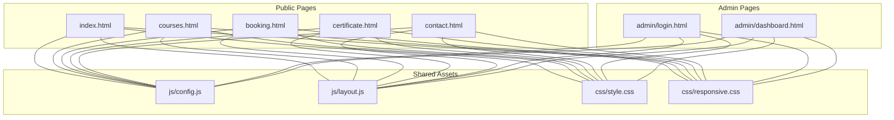
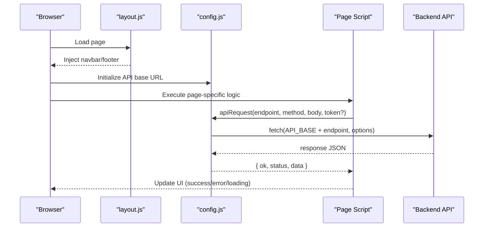
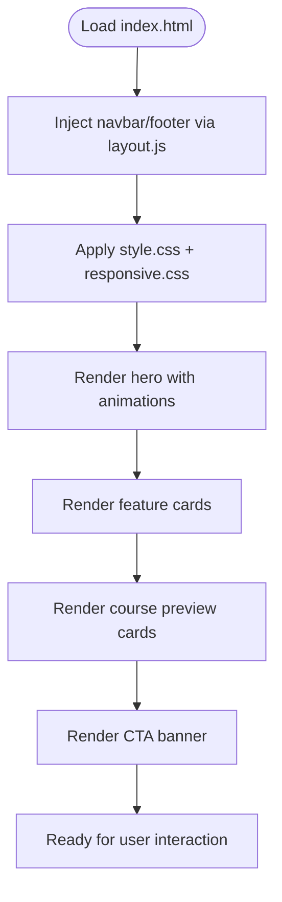
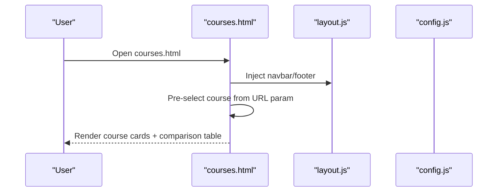
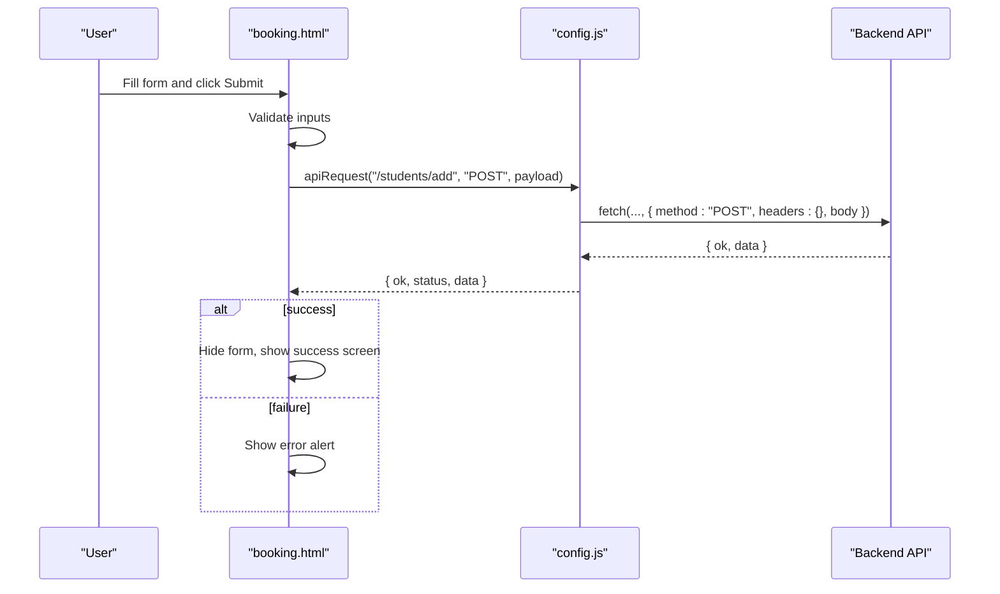
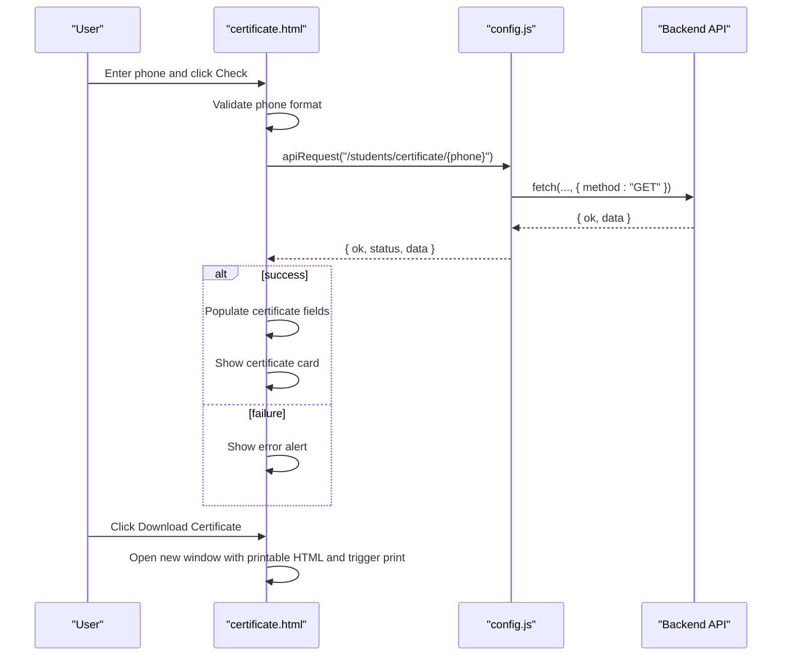
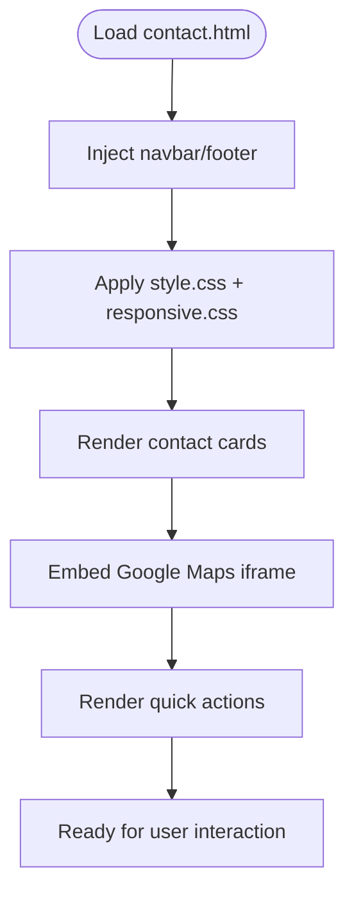
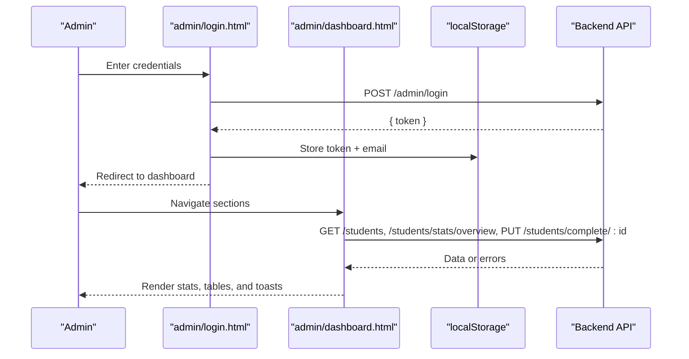
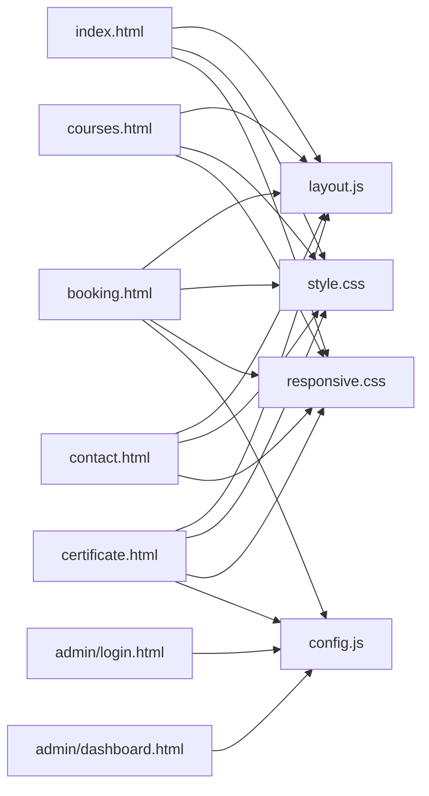

# Frontend Application

<cite>
**Referenced Files in This Document**
- [README.md](file://README.md)
- [index.html](file://frontend/index.html)
- [courses.html](file://frontend/courses.html)
- [booking.html](file://frontend/booking.html)
- [certificate.html](file://frontend/certificate.html)
- [contact.html](file://frontend/contact.html)
- [login.html](file://frontend/admin/login.html)
- [dashboard.html](file://frontend/admin/dashboard.html)
- [config.js](file://frontend/js/config.js)
- [layout.js](file://frontend/js/layout.js)
- [style.css](file://frontend/css/style.css)
- [responsive.css](file://frontend/css/responsive.css)
</cite>

## Table of Contents
1. [Introduction](#introduction)
2. [Project Structure](#project-structure)
3. [Core Components](#core-components)
4. [Architecture Overview](#architecture-overview)
5. [Detailed Component Analysis](#detailed-component-analysis)
6. [Dependency Analysis](#dependency-analysis)
7. [Performance Considerations](#performance-considerations)
8. [Troubleshooting Guide](#troubleshooting-guide)
9. [Conclusion](#conclusion)
10. [Appendices](#appendices)

## Introduction
This document describes the frontend architecture and implementation of JK Mobiles’ static web interface. It covers the HTML structure, CSS styling with Bootstrap 5 and a custom design system, and JavaScript functionality. It explains the responsive design system, shared layout components, navigation structure, and the behavior of each page: home, courses, booking, certificate verification, contact, and admin portal. It also documents the API client implementation, error handling, loading states, and user experience patterns, along with styling architecture and accessibility considerations.

## Project Structure
The frontend is organized as a set of static HTML pages with shared CSS and JavaScript modules. The admin area is separate under a dedicated directory. The project uses Bootstrap 5 for layout utilities and typography, complemented by a custom design system defined in CSS variables and reusable utility classes.

**Diagram sources**
- [index.html:1-642](file://frontend/index.html#L1-L642)
- [courses.html:1-387](file://frontend/courses.html#L1-L387)
- [booking.html:1-326](file://frontend/booking.html#L1-L326)
- [certificate.html:1-375](file://frontend/certificate.html#L1-L375)
- [contact.html:1-221](file://frontend/contact.html#L1-L221)
- [login.html:1-376](file://frontend/admin/login.html#L1-L376)
- [dashboard.html:1-1233](file://frontend/admin/dashboard.html#L1-L1233)
- [config.js:1-33](file://frontend/js/config.js#L1-L33)
- [layout.js:1-69](file://frontend/js/layout.js#L1-L69)
- [style.css:1-780](file://frontend/css/style.css#L1-L780)
- [responsive.css:1-468](file://frontend/css/responsive.css#L1-L468)

**Section sources**
- [README.md:7-42](file://README.md#L7-L42)
- [index.html:1-642](file://frontend/index.html#L1-L642)
- [courses.html:1-387](file://frontend/courses.html#L1-L387)
- [booking.html:1-326](file://frontend/booking.html#L1-L326)
- [certificate.html:1-375](file://frontend/certificate.html#L1-L375)
- [contact.html:1-221](file://frontend/contact.html#L1-L221)
- [login.html:1-376](file://frontend/admin/login.html#L1-L376)
- [dashboard.html:1-1233](file://frontend/admin/dashboard.html#L1-L1233)
- [config.js:1-33](file://frontend/js/config.js#L1-L33)
- [layout.js:1-69](file://frontend/js/layout.js#L1-L69)
- [style.css:1-780](file://frontend/css/style.css#L1-L780)
- [responsive.css:1-468](file://frontend/css/responsive.css#L1-L468)

## Core Components
- Shared layout injection: A single script injects the navbar and footer into each page via placeholders.
- Centralized API client: A small helper encapsulates fetch requests with JSON headers and optional Authorization.
- Design system: CSS variables define a blue/orange palette, consistent shadows and radii, and reusable utility classes for buttons, cards, badges, and animations.
- Responsive foundation: A layered responsive stylesheet adapts layouts from phones to large screens, with reduced motion and print-friendly styles.

Key implementation references:
- Layout injection: [layout.js:3-61](file://frontend/js/layout.js#L3-L61)
- API helper: [config.js:9-19](file://frontend/js/config.js#L9-L19)
- Design tokens and utilities: [style.css:8-26](file://frontend/css/style.css#L8-L26), [style.css:151-342](file://frontend/css/style.css#L151-L342)
- Responsive breakpoints and print styles: [responsive.css:6-288](file://frontend/css/responsive.css#L6-L288), [responsive.css:398-414](file://frontend/css/responsive.css#L398-L414)

**Section sources**
- [layout.js:1-69](file://frontend/js/layout.js#L1-L69)
- [config.js:1-33](file://frontend/js/config.js#L1-L33)
- [style.css:1-780](file://frontend/css/style.css#L1-L780)
- [responsive.css:1-468](file://frontend/css/responsive.css#L1-L468)

## Architecture Overview
The frontend is a static SPA-like experience composed of independent pages. Navigation is handled client-side via shared layout injection. Each page includes the shared CSS and JS, and uses the centralized API client to communicate with the backend.

**Diagram sources**
- [layout.js:63-68](file://frontend/js/layout.js#L63-L68)
- [config.js:9-19](file://frontend/js/config.js#L9-L19)
- [booking.html:286-322](file://frontend/booking.html#L286-L322)
- [certificate.html:280-298](file://frontend/certificate.html#L280-L298)
- [dashboard.html:972-983](file://frontend/admin/dashboard.html#L972-L983)

## Detailed Component Analysis

### Home Page (index.html)
- Hero section with animated gradient background, floating phone mockup, and animated stats counters.
- “Why Us” feature cards with hover effects and icons.
- Courses preview cards linking to the booking page.
- CTA banner with animated background.
- Scroll-reveal animations and counter animation for stats.
- Uses shared layout and global styles.

**Diagram sources**
- [index.html:355-642](file://frontend/index.html#L355-L642)
- [layout.js:63-68](file://frontend/js/layout.js#L63-L68)
- [style.css:1-780](file://frontend/css/style.css#L1-L780)
- [responsive.css:1-468](file://frontend/css/responsive.css#L1-L468)

**Section sources**
- [index.html:1-642](file://frontend/index.html#L1-L642)
- [layout.js:1-69](file://frontend/js/layout.js#L1-L69)
- [style.css:1-780](file://frontend/css/style.css#L1-L780)
- [responsive.css:1-468](file://frontend/css/responsive.css#L1-L468)

### Courses Page (courses.html)
- Hero section for the courses page.
- Three course cards with curriculum lists and badges.
- A responsive comparison table highlighting differences across courses.
- URL parameter pre-selection for the booking page.

**Diagram sources**
- [courses.html:175-387](file://frontend/courses.html#L175-L387)
- [layout.js:63-68](file://frontend/js/layout.js#L63-L68)
- [courses.html:375-384](file://frontend/courses.html#L375-L384)

**Section sources**
- [courses.html:1-387](file://frontend/courses.html#L1-L387)
- [layout.js:1-69](file://frontend/js/layout.js#L1-L69)

### Booking Page (booking.html)
- Hero section for the booking page.
- Enrollment form with validation and submission handling.
- Success screen after successful submission.
- Spinner during network requests and error alerts.
- Pre-fills course selection from URL parameter.

**Diagram sources**
- [booking.html:286-322](file://frontend/booking.html#L286-L322)
- [config.js:9-19](file://frontend/js/config.js#L9-L19)

**Section sources**
- [booking.html:1-326](file://frontend/booking.html#L1-L326)
- [config.js:1-33](file://frontend/js/config.js#L1-L33)

### Certificate Verification (certificate.html)
- Hero section for the certificate portal.
- Phone-number lookup with validation.
- Displays a styled certificate card upon success.
- Generates a printable PDF via a new window and print dialog.

**Diagram sources**
- [certificate.html:280-310](file://frontend/certificate.html#L280-L310)
- [certificate.html:312-371](file://frontend/certificate.html#L312-L371)
- [config.js:9-19](file://frontend/js/config.js#L9-L19)

**Section sources**
- [certificate.html:1-375](file://frontend/certificate.html#L1-L375)
- [config.js:1-33](file://frontend/js/config.js#L1-L33)

### Contact Page (contact.html)
- Hero section for the contact page.
- Contact cards with quick actions and links.
- Embedded Google Maps iframe.
- Quick contact buttons and office hours.

**Diagram sources**
- [contact.html:102-221](file://frontend/contact.html#L102-L221)
- [layout.js:63-68](file://frontend/js/layout.js#L63-L68)
- [style.css:1-780](file://frontend/css/style.css#L1-L780)
- [responsive.css:1-468](file://frontend/css/responsive.css#L1-L468)

**Section sources**
- [contact.html:1-221](file://frontend/contact.html#L1-L221)
- [layout.js:1-69](file://frontend/js/layout.js#L1-L69)

### Admin Portal Pages
- Admin Login (admin/login.html): JWT-based login with local storage persistence, password toggle, and spinner during submission.
- Admin Dashboard (admin/dashboard.html): Multi-section SPA with sidebar navigation, stats cards, recent enrollments feed, course breakdown, and student tables with search/filter and action buttons.

**Diagram sources**
- [login.html:335-372](file://frontend/admin/login.html#L335-L372)
- [dashboard.html:972-1022](file://frontend/admin/dashboard.html#L972-L1022)
- [dashboard.html:1207-1223](file://frontend/admin/dashboard.html#L1207-L1223)

**Section sources**
- [login.html:1-376](file://frontend/admin/login.html#L1-L376)
- [dashboard.html:1-1233](file://frontend/admin/dashboard.html#L1-L1233)

## Dependency Analysis
- Pages depend on shared layout and CSS:
  - All public pages include the shared navbar/footer via [layout.js:63-68](file://frontend/js/layout.js#L63-L68).
  - All pages import [style.css:5-6](file://frontend/css/style.css#L5-L6) and [responsive.css:1-3](file://frontend/css/responsive.css#L1-L3).
- API communication:
  - Public pages use [config.js:9-19](file://frontend/js/config.js#L9-L19) for all fetch calls.
  - Admin pages use a local-token-aware helper in [dashboard.html:972-983](file://frontend/admin/dashboard.html#L972-L983) and [login.html:350-372](file://frontend/admin/login.html#L350-L372).
- Bootstrap integration:
  - Pages import Bootstrap 5 CSS/JS from CDN in each HTML head/body.

**Diagram sources**
- [index.html:570-573](file://frontend/index.html#L570-L573)
- [courses.html:371-374](file://frontend/courses.html#L371-L374)
- [booking.html:263-266](file://frontend/booking.html#L263-L266)
- [certificate.html:267-270](file://frontend/certificate.html#L267-L270)
- [contact.html:216-219](file://frontend/contact.html#L216-L219)
- [layout.js:63-68](file://frontend/js/layout.js#L63-L68)
- [style.css:5-6](file://frontend/css/style.css#L5-L6)
- [responsive.css:1-3](file://frontend/css/responsive.css#L1-L3)
- [config.js:1-33](file://frontend/js/config.js#L1-L33)
- [login.html:312-372](file://frontend/admin/login.html#L312-L372)
- [dashboard.html:954-1022](file://frontend/admin/dashboard.html#L954-L1022)

**Section sources**
- [index.html:570-573](file://frontend/index.html#L570-L573)
- [courses.html:371-374](file://frontend/courses.html#L371-L374)
- [booking.html:263-266](file://frontend/booking.html#L263-L266)
- [certificate.html:267-270](file://frontend/certificate.html#L267-L270)
- [contact.html:216-219](file://frontend/contact.html#L216-L219)
- [layout.js:1-69](file://frontend/js/layout.js#L1-L69)
- [style.css:1-780](file://frontend/css/style.css#L1-L780)
- [responsive.css:1-468](file://frontend/css/responsive.css#L1-L468)
- [config.js:1-33](file://frontend/js/config.js#L1-L33)
- [login.html:1-376](file://frontend/admin/login.html#L1-L376)
- [dashboard.html:1-1233](file://frontend/admin/dashboard.html#L1-L1233)

## Performance Considerations
- Minimize DOM updates: Batch UI updates after API responses (e.g., rendering tables and charts).
- Debounce filters: Consider debouncing search input to reduce frequent filtering.
- Lazy-load images: Not applicable for static pages, but keep in mind for future enhancements.
- Reduce repaints: Prefer transform/opacity changes for animations; already used in design system.
- Network efficiency: Use a single API client to centralize headers and error handling.

[No sources needed since this section provides general guidance]

## Troubleshooting Guide
- API base URL mismatch:
  - Ensure the API base URL is updated to your deployed backend in [config.js](file://frontend/js/config.js#L6) and admin pages [login.html](file://frontend/admin/login.html#L313), [dashboard.html](file://frontend/admin/dashboard.html#L955).
- CORS/network errors:
  - Confirm backend CORS and origin allowlist. Check browser console for fetch errors.
- Admin session expired:
  - Admin pages automatically redirect to login on 401 responses [dashboard.html:978-982](file://frontend/admin/dashboard.html#L978-L982).
- Form validation failures:
  - Booking and certificate pages show alerts for invalid inputs [booking.html:292-297](file://frontend/booking.html#L292-L297), [certificate.html:282-284](file://frontend/certificate.html#L282-L284).
- Loading states:
  - Booking uses a spinner and disables the submit button while fetching [booking.html:299-321](file://frontend/booking.html#L299-L321).
  - Admin dashboard uses loader dots for tables and toasts for feedback [dashboard.html:829-830](file://frontend/admin/dashboard.html#L829-L830), [dashboard.html:962-970](file://frontend/admin/dashboard.html#L962-L970).

**Section sources**
- [config.js:1-33](file://frontend/js/config.js#L1-L33)
- [login.html:312-372](file://frontend/admin/login.html#L312-L372)
- [dashboard.html:954-1022](file://frontend/admin/dashboard.html#L954-L1022)
- [booking.html:286-322](file://frontend/booking.html#L286-L322)
- [certificate.html:280-298](file://frontend/certificate.html#L280-L298)

## Conclusion
The frontend implements a cohesive, mobile-first, Bootstrap-enhanced design with a shared layout and a centralized API client. Each page delivers focused functionality: home hero and previews, course comparison, enrollment with API integration, certificate lookup and print-to-PDF, contact with embedded map, and a full admin portal with stats, tables, and actions. The design system and responsive styles ensure consistent UX across devices, while error handling and loading states improve reliability and user confidence.

[No sources needed since this section summarizes without analyzing specific files]

## Appendices

### API Client Implementation
- Public pages: [config.js:9-19](file://frontend/js/config.js#L9-L19) exports an async function that performs fetch with JSON headers and optional Authorization.
- Admin pages: [login.html:350-372](file://frontend/admin/login.html#L350-L372) and [dashboard.html:972-983](file://frontend/admin/dashboard.html#L972-L983) demonstrate token-based requests and 401 handling.

**Section sources**
- [config.js:1-33](file://frontend/js/config.js#L1-L33)
- [login.html:312-372](file://frontend/admin/login.html#L312-L372)
- [dashboard.html:954-1022](file://frontend/admin/dashboard.html#L954-L1022)

### Styling Architecture and Accessibility
- Design tokens: CSS variables define a blue/orange palette, spacing, radii, and shadows [style.css:8-26](file://frontend/css/style.css#L8-L26).
- Reusable utilities: Buttons, cards, badges, tooltips, animations, and hover effects [style.css:151-780](file://frontend/css/style.css#L151-L780).
- Responsive system: Mobile-first breakpoints, tablet adjustments, large-screen tweaks, reduced motion support, and print styles [responsive.css:6-468](file://frontend/css/responsive.css#L6-L468).
- Accessibility: Focus-visible outlines, smooth scrolling, selection colors, and scrollbar styling [responsive.css:433-468](file://frontend/css/responsive.css#L433-L468).

**Section sources**
- [style.css:1-780](file://frontend/css/style.css#L1-L780)
- [responsive.css:1-468](file://frontend/css/responsive.css#L1-L468)