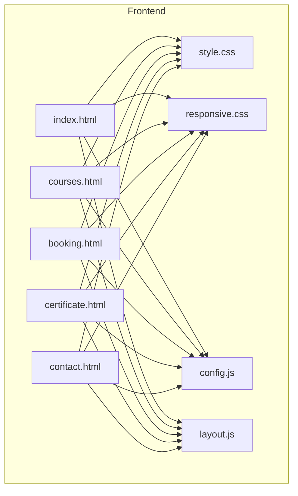
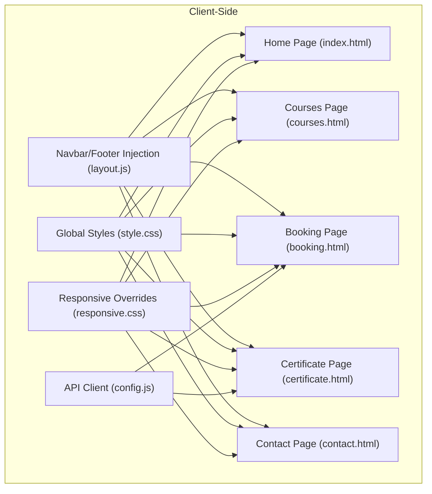
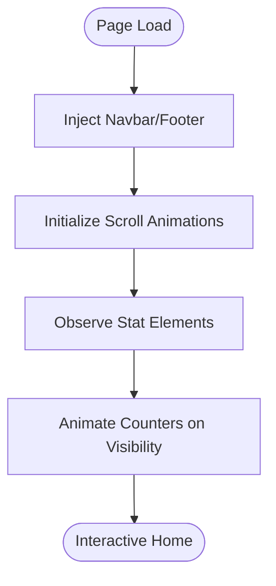
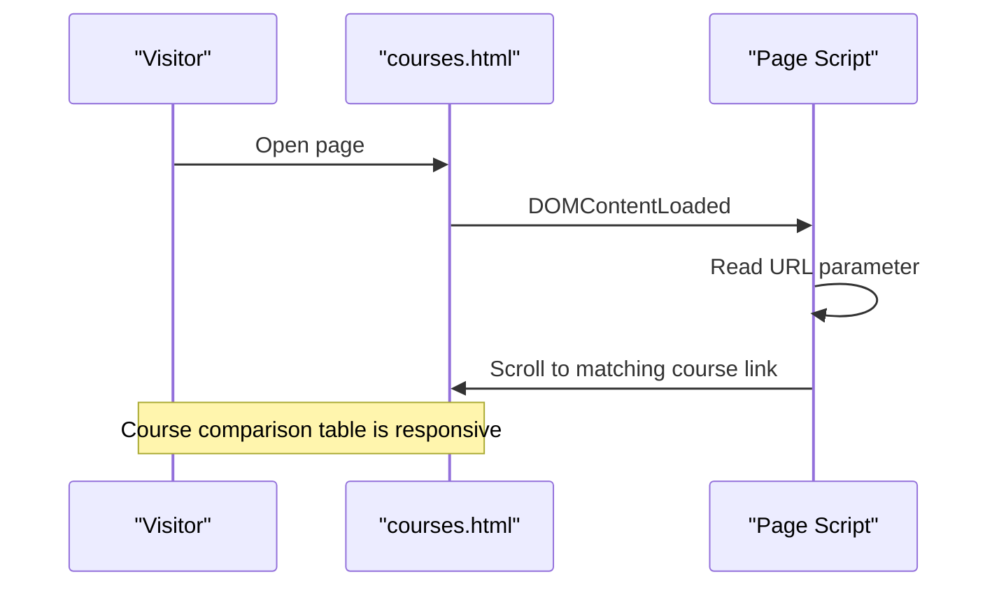
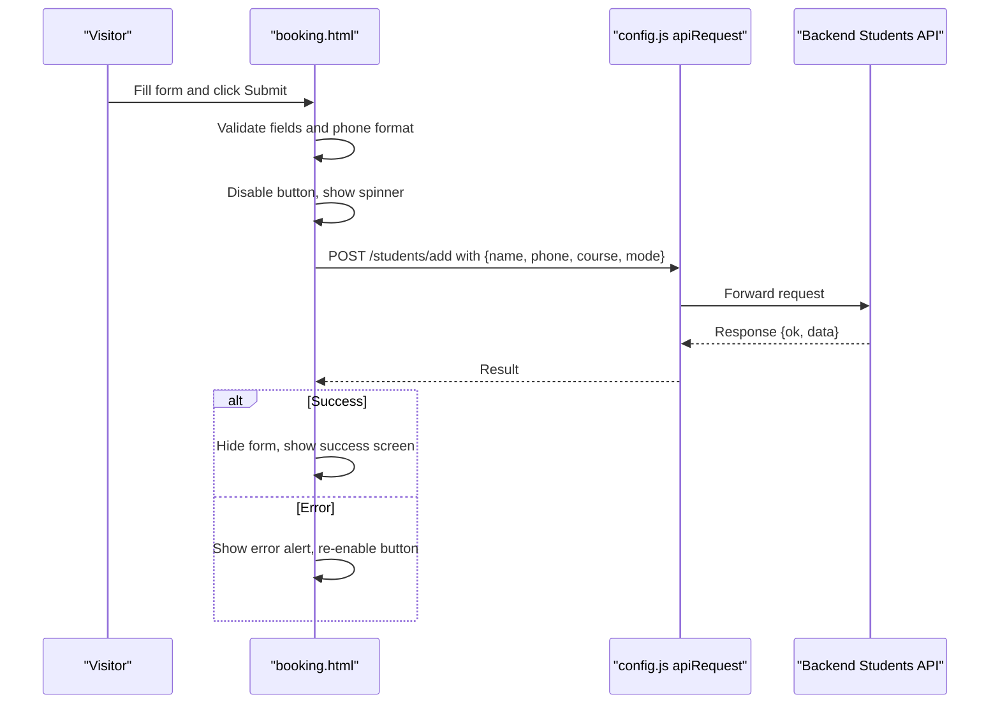
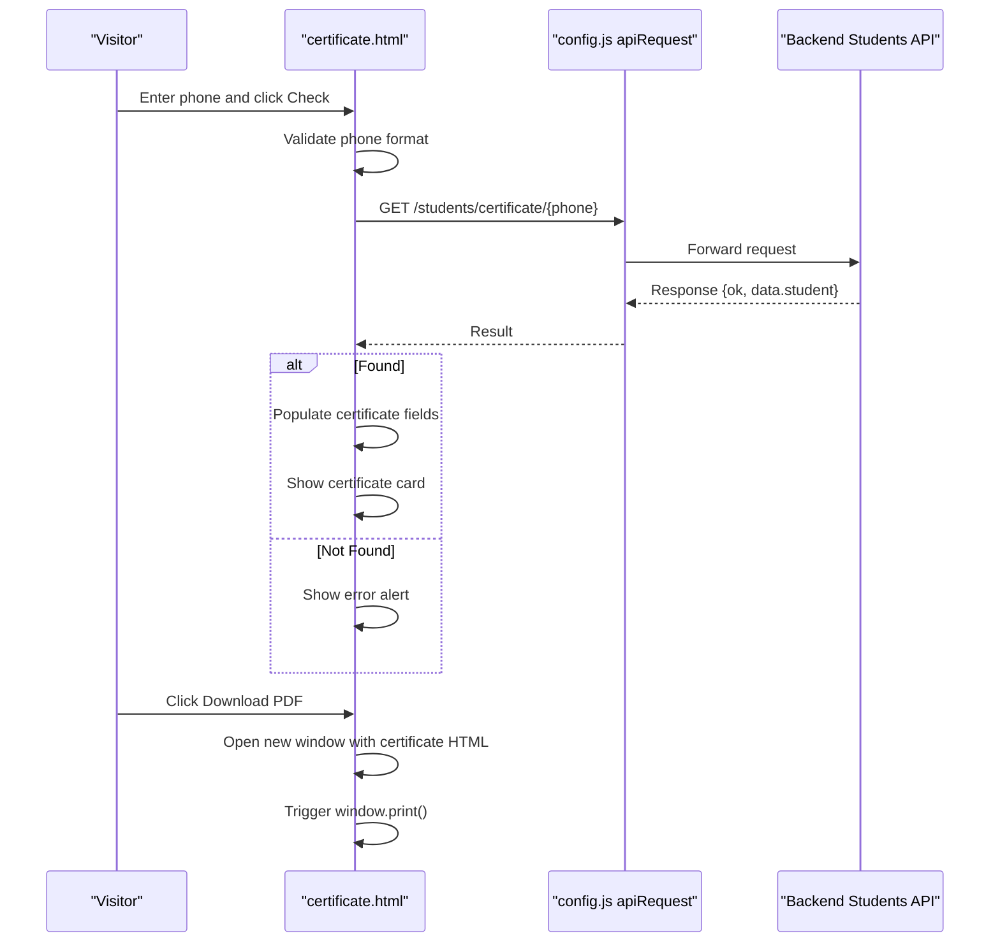
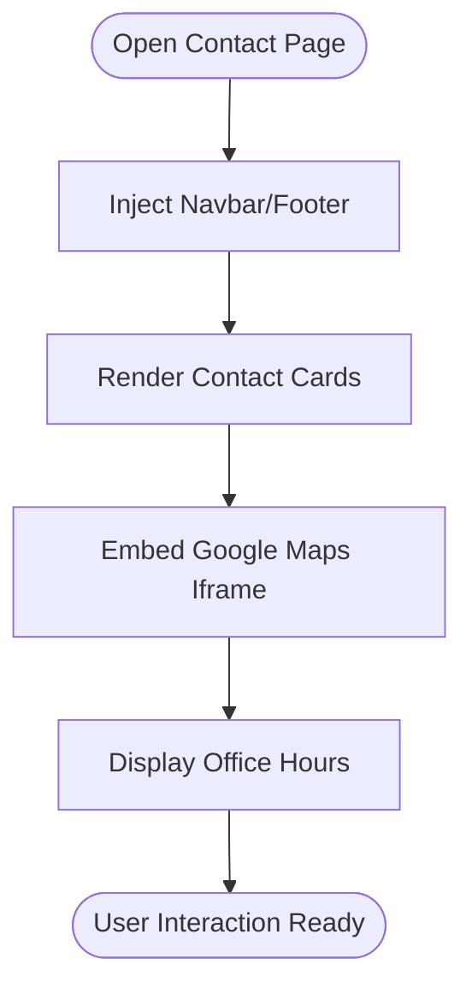
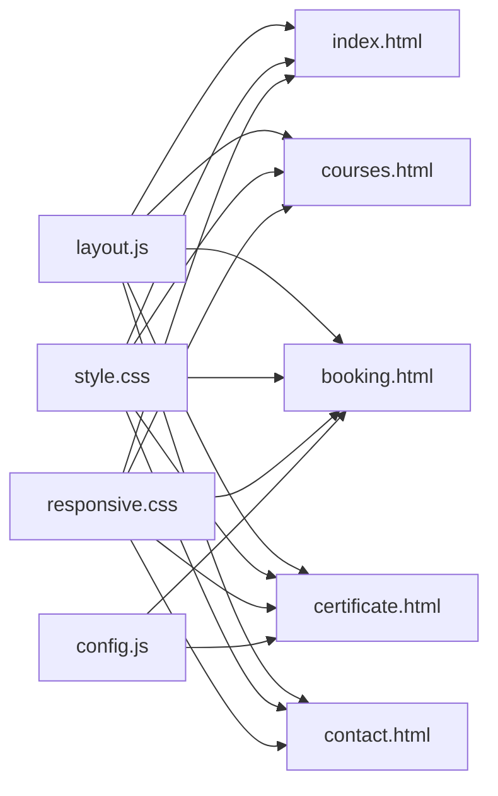

# Public Website Pages

<cite>
**Referenced Files in This Document**
- [index.html](file://jk-mobiles/frontend/index.html)
- [courses.html](file://jk-mobiles/frontend/courses.html)
- [booking.html](file://jk-mobiles/frontend/booking.html)
- [certificate.html](file://jk-mobiles/frontend/certificate.html)
- [contact.html](file://jk-mobiles/frontend/contact.html)
- [style.css](file://jk-mobiles/frontend/css/style.css)
- [responsive.css](file://jk-mobiles/frontend/css/responsive.css)
- [config.js](file://jk-mobiles/frontend/js/config.js)
- [layout.js](file://jk-mobiles/frontend/js/layout.js)
</cite>

## Table of Contents
1. [Introduction](#introduction)
2. [Project Structure](#project-structure)
3. [Core Components](#core-components)
4. [Architecture Overview](#architecture-overview)
5. [Detailed Component Analysis](#detailed-component-analysis)
6. [Dependency Analysis](#dependency-analysis)
7. [Performance Considerations](#performance-considerations)
8. [Troubleshooting Guide](#troubleshooting-guide)
9. [Conclusion](#conclusion)

## Introduction
This document provides comprehensive documentation for the public-facing website pages of JK Mobiles Training Institute. It covers the home page with hero section, course previews, and call-to-action elements; the courses page with course comparison tables and enrollment links; the booking form with validation, API integration, and success/error handling; the certificate verification page with phone number input, search functionality, and PDF generation workflow; and the contact page with Google Maps integration, location information, and contact forms. It also includes responsive design patterns, form validation, and user experience optimizations for each page.

## Project Structure
The frontend is organized into static HTML pages, shared CSS styles, and JavaScript utilities:
- Pages: index.html, courses.html, booking.html, certificate.html, contact.html
- Styles: style.css (global styles), responsive.css (mobile-first responsive overrides)
- Scripts: config.js (API base URL and helpers), layout.js (shared navbar/footer injection)

**Diagram sources**
- [index.html](file://jk-mobiles/frontend/index.html)
- [courses.html](file://jk-mobiles/frontend/courses.html)
- [booking.html](file://jk-mobiles/frontend/booking.html)
- [certificate.html](file://jk-mobiles/frontend/certificate.html)
- [contact.html](file://jk-mobiles/frontend/contact.html)
- [style.css](file://jk-mobiles/frontend/css/style.css)
- [responsive.css](file://jk-mobiles/frontend/css/responsive.css)
- [config.js](file://jk-mobiles/frontend/js/config.js)
- [layout.js](file://jk-mobiles/frontend/js/layout.js)

**Section sources**
- [index.html](file://jk-mobiles/frontend/index.html)
- [courses.html](file://jk-mobiles/frontend/courses.html)
- [booking.html](file://jk-mobiles/frontend/booking.html)
- [certificate.html](file://jk-mobiles/frontend/certificate.html)
- [contact.html](file://jk-mobiles/frontend/contact.html)
- [style.css](file://jk-mobiles/frontend/css/style.css)
- [responsive.css](file://jk-mobiles/frontend/css/responsive.css)
- [config.js](file://jk-mobiles/frontend/js/config.js)
- [layout.js](file://jk-mobiles/frontend/js/layout.js)

## Core Components
- Shared navigation and footer: injected via layout.js into each page
- Global theming and animations: defined in style.css
- Responsive breakpoints and device-specific adjustments: defined in responsive.css
- API client: centralized in config.js with a helper function for requests
- Page-specific scripts: embedded in each HTML file for form handling and UX enhancements

Key implementation patterns:
- Mobile-first responsive design with media queries
- Shared layout injection for consistent navigation and footer
- Centralized API base URL for backend integration
- Form validation and user feedback via alert utilities
- Print-friendly certificate rendering

**Section sources**
- [layout.js](file://jk-mobiles/frontend/js/layout.js)
- [style.css](file://jk-mobiles/frontend/css/style.css)
- [responsive.css](file://jk-mobiles/frontend/css/responsive.css)
- [config.js](file://jk-mobiles/frontend/js/config.js)

## Architecture Overview
The public website pages follow a static HTML + client-side JavaScript architecture with a shared layout and centralized configuration. Each page includes:
- Shared header and footer via layout.js
- Global styles and responsive overrides
- Page-specific scripts for interactions and API calls

**Diagram sources**
- [layout.js](file://jk-mobiles/frontend/js/layout.js)
- [style.css](file://jk-mobiles/frontend/css/style.css)
- [responsive.css](file://jk-mobiles/frontend/css/responsive.css)
- [config.js](file://jk-mobiles/frontend/js/config.js)
- [index.html](file://jk-mobiles/frontend/index.html)
- [courses.html](file://jk-mobiles/frontend/courses.html)
- [booking.html](file://jk-mobiles/frontend/booking.html)
- [certificate.html](file://jk-mobiles/frontend/certificate.html)
- [contact.html](file://jk-mobiles/frontend/contact.html)

## Detailed Component Analysis

### Home Page (index.html)
The home page presents:
- Hero section with animated gradient background, floating phone mockup, and animated statistics counters
- “Why Choose Us” feature cards with hover effects
- Course preview cards with enrollment links
- Call-to-action banner with animated background

Key UX features:
- Scroll-triggered animations for feature cards, course cards, and stat counters
- Animated counters for statistics using IntersectionObserver
- Responsive hero layout with centered buttons and mobile-optimized typography

**Diagram sources**
- [index.html](file://jk-mobiles/frontend/index.html)
- [layout.js](file://jk-mobiles/frontend/js/layout.js)

**Section sources**
- [index.html](file://jk-mobiles/frontend/index.html)
- [layout.js](file://jk-mobiles/frontend/js/layout.js)

### Courses Page (courses.html)
The courses page includes:
- Hero section highlighting course offerings
- Three course cards with curriculum lists and enrollment links
- A responsive comparison table comparing features across courses

UX and accessibility:
- Responsive table with horizontal scrolling on small screens
- URL parameter pre-selection of course for smoother enrollment flow
- Mobile-optimized typography and spacing

**Diagram sources**
- [courses.html](file://jk-mobiles/frontend/courses.html)

**Section sources**
- [courses.html](file://jk-mobiles/frontend/courses.html)

### Booking Form (booking.html)
The booking form implements:
- Validation for required fields and 10-digit phone number
- Loading spinner during submission
- Success screen with navigation options
- Error alerts with automatic dismissal
- Pre-selected course from URL parameter

API integration:
- Uses centralized apiRequest helper to POST enrollment data
- Handles network errors and displays user-friendly messages

**Diagram sources**
- [booking.html](file://jk-mobiles/frontend/booking.html)
- [config.js](file://jk-mobiles/frontend/js/config.js)

**Section sources**
- [booking.html](file://jk-mobiles/frontend/booking.html)
- [config.js](file://jk-mobiles/frontend/js/config.js)

### Certificate Verification (certificate.html)
The certificate verification page provides:
- Phone number input with 10-digit validation
- Search functionality to fetch student certificate data
- Dynamic certificate display with formatted completion date
- PDF generation via browser print dialog

Workflow:
- Validate phone number format
- Fetch certificate data via GET request
- Populate certificate fields and display
- Generate printable PDF using a dynamically created HTML document

**Diagram sources**
- [certificate.html](file://jk-mobiles/frontend/certificate.html)
- [config.js](file://jk-mobiles/frontend/js/config.js)

**Section sources**
- [certificate.html](file://jk-mobiles/frontend/certificate.html)
- [config.js](file://jk-mobiles/frontend/js/config.js)

### Contact Page (contact.html)
The contact page features:
- Contact cards with phone numbers, WhatsApp link, and address
- Embedded Google Maps iframe for location
- Quick action buttons for calls and enrollment
- Office hours display

Integration:
- Google Maps embed with lazy loading and referrer policy
- Responsive map sizing and typography scaling

**Diagram sources**
- [contact.html](file://jk-mobiles/frontend/contact.html)

**Section sources**
- [contact.html](file://jk-mobiles/frontend/contact.html)

## Dependency Analysis
Shared dependencies across pages:
- layout.js injects navbar and footer into each page
- style.css defines global theming and animations
- responsive.css applies mobile-first responsive overrides
- config.js centralizes API base URL and request helper

**Diagram sources**
- [layout.js](file://jk-mobiles/frontend/js/layout.js)
- [style.css](file://jk-mobiles/frontend/css/style.css)
- [responsive.css](file://jk-mobiles/frontend/css/responsive.css)
- [config.js](file://jk-mobiles/frontend/js/config.js)
- [index.html](file://jk-mobiles/frontend/index.html)
- [courses.html](file://jk-mobiles/frontend/courses.html)
- [booking.html](file://jk-mobiles/frontend/booking.html)
- [certificate.html](file://jk-mobiles/frontend/certificate.html)
- [contact.html](file://jk-mobiles/frontend/contact.html)

**Section sources**
- [layout.js](file://jk-mobiles/frontend/js/layout.js)
- [style.css](file://jk-mobiles/frontend/css/style.css)
- [responsive.css](file://jk-mobiles/frontend/css/responsive.css)
- [config.js](file://jk-mobiles/frontend/js/config.js)

## Performance Considerations
- Lazy loading and reduced motion support: responsive.css includes lazy loading for iframes and reduced motion preferences to improve accessibility and performance.
- Minimal JavaScript: Each page loads only the necessary scripts; shared layout injection occurs once per page load.
- CSS animations: Animations are defined in CSS and controlled via classes, minimizing JavaScript overhead.
- Print optimization: Print styles hide non-essential UI elements and present a clean certificate layout.

[No sources needed since this section provides general guidance]

## Troubleshooting Guide
Common issues and resolutions:
- API connectivity failures: Ensure API_BASE in config.js points to a reachable backend endpoint. Verify CORS settings on the backend.
- Form validation errors: Confirm that required fields are filled and phone numbers match the 10-digit pattern.
- Certificate not found: Verify the phone number format and that the student’s course completion status is set in the backend.
- Responsive layout issues: Check that viewport meta tag is present and responsive.css is loaded after style.css.

**Section sources**
- [config.js](file://jk-mobiles/frontend/js/config.js)
- [booking.html](file://jk-mobiles/frontend/booking.html)
- [certificate.html](file://jk-mobiles/frontend/certificate.html)
- [responsive.css](file://jk-mobiles/frontend/css/responsive.css)

## Conclusion
The public website pages for JK Mobiles Training Institute are built with a clean, mobile-first approach using shared layouts, centralized styling, and a unified API client. The home page emphasizes engagement with animations and statistics, the courses page provides clear comparisons and enrollment links, the booking form offers robust validation and user feedback, the certificate page enables quick verification and PDF generation, and the contact page integrates maps and quick actions. Together, these components deliver a cohesive, accessible, and user-friendly experience across devices.