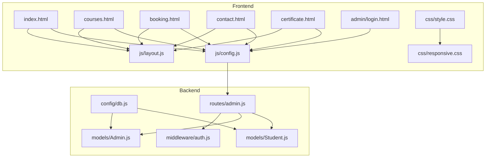
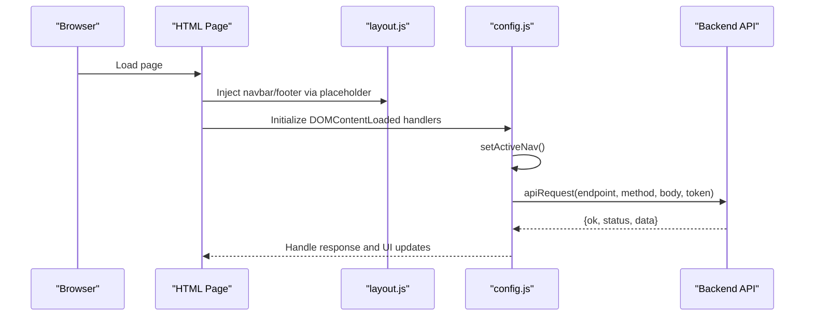
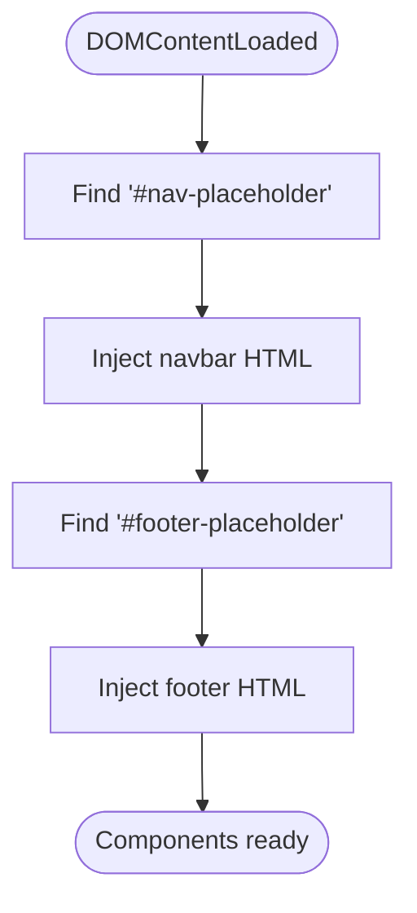
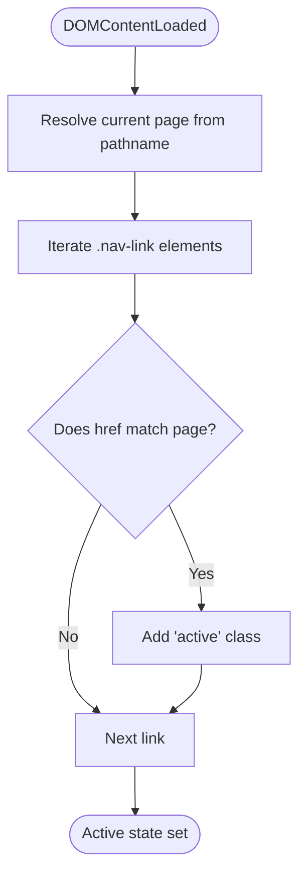
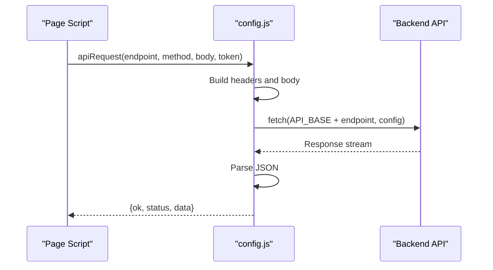
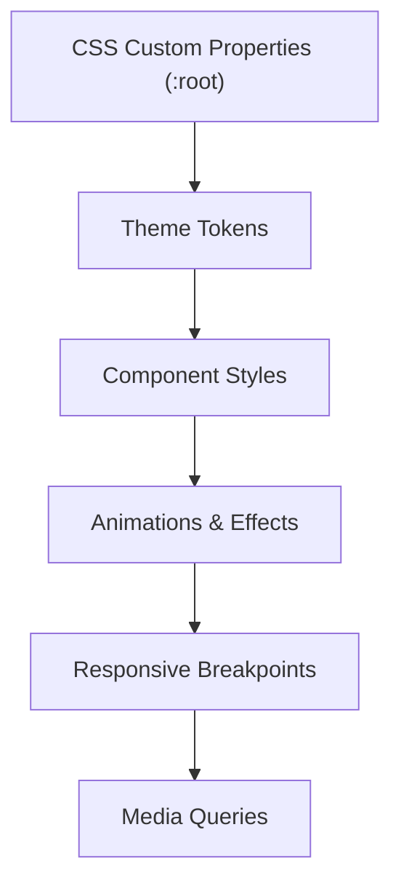
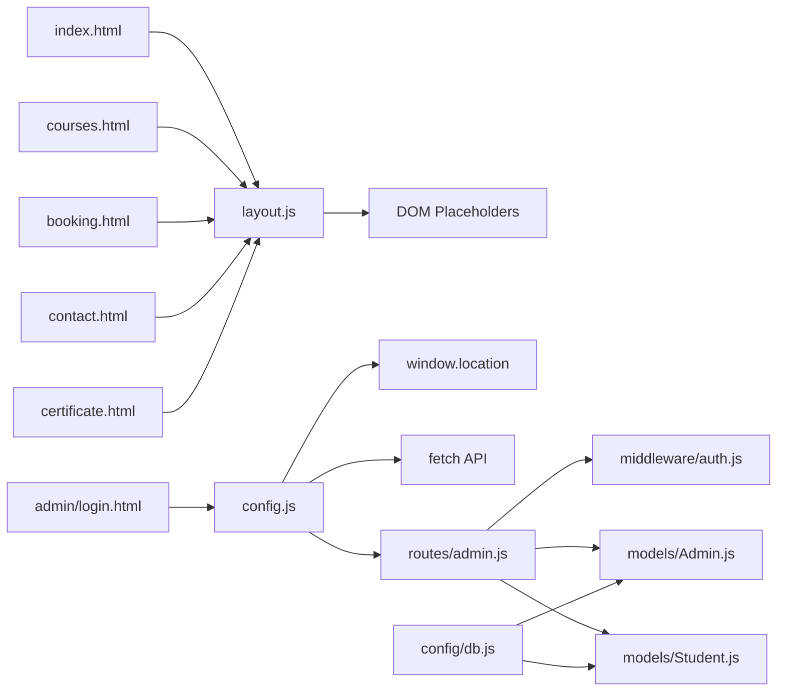

# Shared Components & Layout

<cite>
**Referenced Files in This Document**
- [layout.js](file://jk-mobiles/frontend/js/layout.js)
- [config.js](file://jk-mobiles/frontend/js/config.js)
- [style.css](file://jk-mobiles/frontend/css/style.css)
- [responsive.css](file://jk-mobiles/frontend/css/responsive.css)
- [index.html](file://jk-mobiles/frontend/index.html)
- [courses.html](file://jk-mobiles/frontend/courses.html)
- [booking.html](file://jk-mobiles/frontend/booking.html)
- [contact.html](file://jk-mobiles/frontend/contact.html)
- [certificate.html](file://jk-mobiles/frontend/certificate.html)
- [login.html](file://jk-mobiles/frontend/admin/login.html)
- [db.js](file://jk-mobiles/backend/config/db.js)
- [auth.js](file://jk-mobiles/backend/middleware/auth.js)
- [Admin.js](file://jk-mobiles/backend/models/Admin.js)
- [Student.js](file://jk-mobiles/backend/models/Student.js)
- [admin.js](file://jk-mobiles/backend/routes/admin.js)
</cite>

## Table of Contents
1. [Introduction](#introduction)
2. [Project Structure](#project-structure)
3. [Core Components](#core-components)
4. [Architecture Overview](#architecture-overview)
5. [Detailed Component Analysis](#detailed-component-analysis)
6. [Dependency Analysis](#dependency-analysis)
7. [Performance Considerations](#performance-considerations)
8. [Troubleshooting Guide](#troubleshooting-guide)
9. [Conclusion](#conclusion)

## Introduction
This document explains the shared frontend components and layout system used across the JK Mobiles website. It covers the responsive navigation structure, active link highlighting, shared styling architecture, Bootstrap 5 integration, CSS custom properties, and responsive breakpoints. It also documents the layout.js utility functions for DOM injection and the config.js API client implementation, including navigation patterns, active state management, and cross-page consistency mechanisms. Finally, it outlines the styling architecture, component-specific styles, and reusable patterns for maintainability.

## Project Structure
The frontend is organized into static HTML pages, shared CSS, and small JavaScript utilities. The backend provides a minimal Express/MongoDB stack with JWT-based admin authentication and student data models.

**Diagram sources**
- [index.html](file://jk-mobiles/frontend/index.html)
- [courses.html](file://jk-mobiles/frontend/courses.html)
- [booking.html](file://jk-mobiles/frontend/booking.html)
- [contact.html](file://jk-mobiles/frontend/contact.html)
- [certificate.html](file://jk-mobiles/frontend/certificate.html)
- [login.html](file://jk-mobiles/frontend/admin/login.html)
- [layout.js](file://jk-mobiles/frontend/js/layout.js)
- [config.js](file://jk-mobiles/frontend/js/config.js)
- [style.css](file://jk-mobiles/frontend/css/style.css)
- [responsive.css](file://jk-mobiles/frontend/css/responsive.css)
- [db.js](file://jk-mobiles/backend/config/db.js)
- [auth.js](file://jk-mobiles/backend/middleware/auth.js)
- [Admin.js](file://jk-mobiles/backend/models/Admin.js)
- [Student.js](file://jk-mobiles/backend/models/Student.js)
- [admin.js](file://jk-mobiles/backend/routes/admin.js)

**Section sources**
- [index.html](file://jk-mobiles/frontend/index.html)
- [courses.html](file://jk-mobiles/frontend/courses.html)
- [booking.html](file://jk-mobiles/frontend/booking.html)
- [contact.html](file://jk-mobiles/frontend/contact.html)
- [certificate.html](file://jk-mobiles/frontend/certificate.html)
- [login.html](file://jk-mobiles/frontend/admin/login.html)
- [layout.js](file://jk-mobiles/frontend/js/layout.js)
- [config.js](file://jk-mobiles/frontend/js/config.js)
- [style.css](file://jk-mobiles/frontend/css/style.css)
- [responsive.css](file://jk-mobiles/frontend/css/responsive.css)
- [db.js](file://jk-mobiles/backend/config/db.js)
- [auth.js](file://jk-mobiles/backend/middleware/auth.js)
- [Admin.js](file://jk-mobiles/backend/models/Admin.js)
- [Student.js](file://jk-mobiles/backend/models/Student.js)
- [admin.js](file://jk-mobiles/backend/routes/admin.js)

## Core Components
- Shared Navigation and Footer Injection: layout.js injects a consistent navbar and footer into pages via placeholders, ensuring cross-page branding and navigation.
- Active Link Highlighting: config.js detects the current page and adds an active class to the matching navigation link.
- API Client: config.js exposes a unified apiRequest helper for frontend-to-backend communication.
- Global Styling and Responsive Design: style.css defines CSS custom properties, typography, component styles, and animations. responsive.css handles breakpoints and device-specific adjustments.
- Bootstrap 5 Integration: Pages import Bootstrap CSS and JS to leverage grid, components, and responsive utilities.

Key implementation references:
- Navbar and footer injection: [layout.js](file://jk-mobiles/frontend/js/layout.js)
- Active nav highlighting: [config.js](file://jk-mobiles/frontend/js/config.js)
- API helper: [config.js](file://jk-mobiles/frontend/js/config.js)
- Global styles and custom properties: [style.css](file://jk-mobiles/frontend/css/style.css)
- Responsive breakpoints and utilities: [responsive.css](file://jk-mobiles/frontend/css/responsive.css)
- Bootstrap integration in pages: [index.html](file://jk-mobiles/frontend/index.html), [courses.html](file://jk-mobiles/frontend/courses.html), [booking.html](file://jk-mobiles/frontend/booking.html), [contact.html](file://jk-mobiles/frontend/contact.html), [certificate.html](file://jk-mobiles/frontend/certificate.html), [login.html](file://jk-mobiles/frontend/admin/login.html)

**Section sources**
- [layout.js](file://jk-mobiles/frontend/js/layout.js)
- [config.js](file://jk-mobiles/frontend/js/config.js)
- [style.css](file://jk-mobiles/frontend/css/style.css)
- [responsive.css](file://jk-mobiles/frontend/css/responsive.css)
- [index.html](file://jk-mobiles/frontend/index.html)
- [courses.html](file://jk-mobiles/frontend/courses.html)
- [booking.html](file://jk-mobiles/frontend/booking.html)
- [contact.html](file://jk-mobiles/frontend/contact.html)
- [certificate.html](file://jk-mobiles/frontend/certificate.html)
- [login.html](file://jk-mobiles/frontend/admin/login.html)

## Architecture Overview
The frontend follows a lightweight, static-site pattern with shared components injected at runtime. The backend provides a minimal API for admin login and student data operations. The frontend uses a centralized API client and a shared layout injection script to maintain consistency across pages.

**Diagram sources**
- [layout.js](file://jk-mobiles/frontend/js/layout.js)
- [config.js](file://jk-mobiles/frontend/js/config.js)
- [index.html](file://jk-mobiles/frontend/index.html)
- [courses.html](file://jk-mobiles/frontend/courses.html)
- [booking.html](file://jk-mobiles/frontend/booking.html)
- [contact.html](file://jk-mobiles/frontend/contact.html)
- [certificate.html](file://jk-mobiles/frontend/certificate.html)
- [login.html](file://jk-mobiles/frontend/admin/login.html)

## Detailed Component Analysis

### Shared Navigation and Footer (layout.js)
Responsibilities:
- Define reusable navbar and footer HTML templates.
- Inject these templates into page placeholders on DOMContentLoaded.
- Ensure Bootstrap’s data attributes are preserved for responsive toggling.

Implementation highlights:
- Navbar template includes brand, toggler, and collapsible links.
- Footer template includes brand, quick links, contact info, and floating WhatsApp.
- Placeholders: nav-placeholder and footer-placeholder in each page.

**Diagram sources**
- [layout.js](file://jk-mobiles/frontend/js/layout.js)
- [index.html](file://jk-mobiles/frontend/index.html)
- [courses.html](file://jk-mobiles/frontend/courses.html)
- [booking.html](file://jk-mobiles/frontend/booking.html)
- [contact.html](file://jk-mobiles/frontend/contact.html)
- [certificate.html](file://jk-mobiles/frontend/certificate.html)
- [login.html](file://jk-mobiles/frontend/admin/login.html)

**Section sources**
- [layout.js](file://jk-mobiles/frontend/js/layout.js)
- [index.html](file://jk-mobiles/frontend/index.html)
- [courses.html](file://jk-mobiles/frontend/courses.html)
- [booking.html](file://jk-mobiles/frontend/booking.html)
- [contact.html](file://jk-mobiles/frontend/contact.html)
- [certificate.html](file://jk-mobiles/frontend/certificate.html)
- [login.html](file://jk-mobiles/frontend/admin/login.html)

### Active Link Highlighting (config.js)
Responsibilities:
- Determine the current page from window.location.pathname.
- Compare each nav link’s href against the current page.
- Add an active class to the matching link.

Behavior:
- Handles both index.html and empty pathname edge case.
- Runs automatically on DOMContentLoaded.

**Diagram sources**
- [config.js](file://jk-mobiles/frontend/js/config.js)
- [layout.js](file://jk-mobiles/frontend/js/layout.js)

**Section sources**
- [config.js](file://jk-mobiles/frontend/js/config.js)
- [layout.js](file://jk-mobiles/frontend/js/layout.js)

### API Client (config.js)
Responsibilities:
- Centralized fetch wrapper for API requests.
- Optional Authorization header support.
- Unified response shape: { ok, status, data }.

Usage patterns:
- Used by booking and certificate pages to submit enrollments and fetch certificates.
- Admin login page uses a direct fetch call with the same base URL.

**Diagram sources**
- [config.js](file://jk-mobiles/frontend/js/config.js)
- [booking.html](file://jk-mobiles/frontend/booking.html)
- [certificate.html](file://jk-mobiles/frontend/certificate.html)
- [login.html](file://jk-mobiles/frontend/admin/login.html)

**Section sources**
- [config.js](file://jk-mobiles/frontend/js/config.js)
- [booking.html](file://jk-mobiles/frontend/booking.html)
- [certificate.html](file://jk-mobiles/frontend/certificate.html)
- [login.html](file://jk-mobiles/frontend/admin/login.html)

### Styling Architecture (style.css + responsive.css)
Styling architecture:
- CSS custom properties define theme tokens (colors, shadows, radii, transitions).
- Global resets and typography establish baseline styles.
- Component-specific styles for navbar, buttons, cards, forms, alerts, badges, and animations.
- Media queries in responsive.css enforce mobile-first breakpoints and device-specific tweaks.

Responsive breakpoints:
- Mobile-first design with targeted overrides at 576px, 991px, and larger screens.
- Additional touch device optimizations, reduced motion support, print styles, safe areas, accessibility focus styles, and scrollbar styling.

**Diagram sources**
- [style.css](file://jk-mobiles/frontend/css/style.css)
- [responsive.css](file://jk-mobiles/frontend/css/responsive.css)

**Section sources**
- [style.css](file://jk-mobiles/frontend/css/style.css)
- [responsive.css](file://jk-mobiles/frontend/css/responsive.css)

### Bootstrap 5 Integration
Pages import Bootstrap CSS and JS to leverage:
- Grid system and responsive utilities.
- Navbar toggler and collapse behavior.
- Button utilities and form controls.

Integration points:
- CDN-hosted Bootstrap CSS and JS.
- Data attributes for navbar toggling.
- Utility classes for spacing, alignment, and responsive layouts.

**Section sources**
- [index.html](file://jk-mobiles/frontend/index.html)
- [courses.html](file://jk-mobiles/frontend/courses.html)
- [booking.html](file://jk-mobiles/frontend/booking.html)
- [contact.html](file://jk-mobiles/frontend/contact.html)
- [certificate.html](file://jk-mobiles/frontend/certificate.html)
- [login.html](file://jk-mobiles/frontend/admin/login.html)

### Cross-Page Consistency Mechanisms
- Shared layout injection ensures identical navigation and footer across pages.
- Active link highlighting maintains contextual awareness during navigation.
- Centralized API client enforces consistent request patterns and error handling.
- Global CSS custom properties unify design tokens and animations.

**Section sources**
- [layout.js](file://jk-mobiles/frontend/js/layout.js)
- [config.js](file://jk-mobiles/frontend/js/config.js)
- [style.css](file://jk-mobiles/frontend/css/style.css)
- [responsive.css](file://jk-mobiles/frontend/css/responsive.css)

## Dependency Analysis
Frontend dependencies:
- layout.js depends on DOM placeholders and Bootstrap data attributes.
- config.js depends on window.location for active state and fetch for API calls.
- Pages depend on Bootstrap CSS/JS and share style.css and responsive.css.

Backend dependencies:
- Admin routes depend on JWT secret and Admin model.
- Student model defines enrollment schema.
- Database connection configured via environment variable.

**Diagram sources**
- [layout.js](file://jk-mobiles/frontend/js/layout.js)
- [config.js](file://jk-mobiles/frontend/js/config.js)
- [index.html](file://jk-mobiles/frontend/index.html)
- [courses.html](file://jk-mobiles/frontend/courses.html)
- [booking.html](file://jk-mobiles/frontend/booking.html)
- [contact.html](file://jk-mobiles/frontend/contact.html)
- [certificate.html](file://jk-mobiles/frontend/certificate.html)
- [login.html](file://jk-mobiles/frontend/admin/login.html)
- [admin.js](file://jk-mobiles/backend/routes/admin.js)
- [auth.js](file://jk-mobiles/backend/middleware/auth.js)
- [Admin.js](file://jk-mobiles/backend/models/Admin.js)
- [Student.js](file://jk-mobiles/backend/models/Student.js)
- [db.js](file://jk-mobiles/backend/config/db.js)

**Section sources**
- [layout.js](file://jk-mobiles/frontend/js/layout.js)
- [config.js](file://jk-mobiles/frontend/js/config.js)
- [admin.js](file://jk-mobiles/backend/routes/admin.js)
- [auth.js](file://jk-mobiles/backend/middleware/auth.js)
- [Admin.js](file://jk-mobiles/backend/models/Admin.js)
- [Student.js](file://jk-mobiles/backend/models/Student.js)
- [db.js](file://jk-mobiles/backend/config/db.js)

## Performance Considerations
- Keep injected HTML minimal to reduce DOM construction overhead.
- Debounce or throttle scroll-based animations to avoid layout thrashing.
- Prefer CSS transforms and opacity for animations to leverage GPU acceleration.
- Lazy-load heavy assets (images, videos) and defer non-critical scripts.
- Minimize repeated DOM queries by caching selectors and reusing elements.

## Troubleshooting Guide
Common issues and resolutions:
- Navigation not appearing: Ensure placeholders exist and layout.js runs after DOMContentLoaded.
- Active link not highlighted: Confirm config.js executes and matches href against current page.
- API errors: Verify API_BASE URL and network connectivity; inspect response.ok and status codes.
- Admin login failures: Check JWT_SECRET, admin setup route, and credential correctness.

**Section sources**
- [layout.js](file://jk-mobiles/frontend/js/layout.js)
- [config.js](file://jk-mobiles/frontend/js/config.js)
- [admin.js](file://jk-mobiles/backend/routes/admin.js)
- [auth.js](file://jk-mobiles/backend/middleware/auth.js)

## Conclusion
The shared components and layout system provide a consistent, maintainable foundation for the JK Mobiles website. By centralizing navigation injection, active state management, and API communication, the frontend achieves cross-page consistency while remaining easy to evolve. The combination of CSS custom properties, Bootstrap utilities, and responsive breakpoints ensures a robust, accessible, and visually cohesive experience across devices.