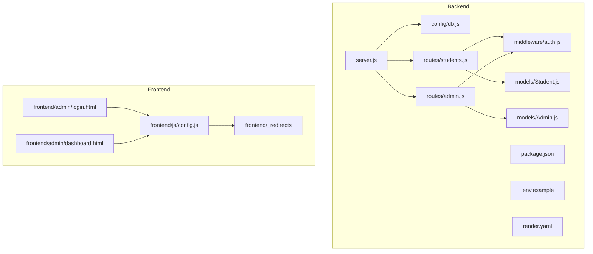
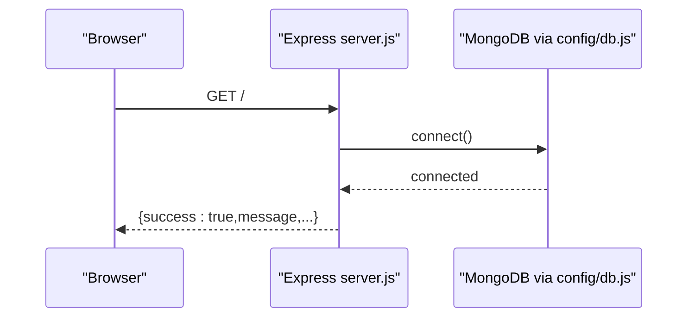
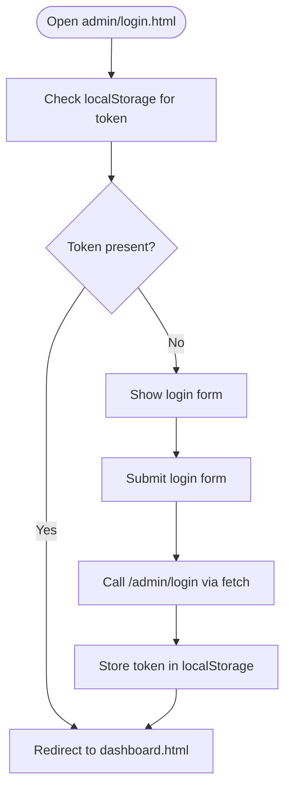
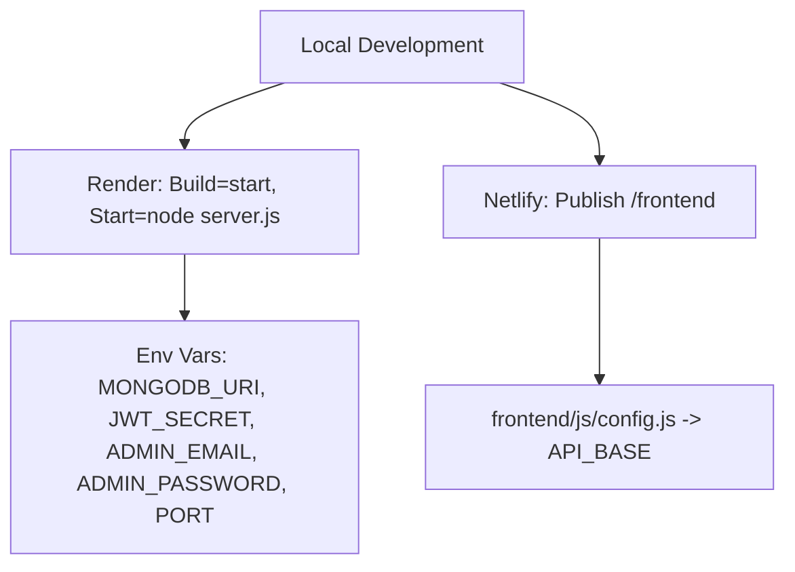

# Getting Started

<cite>
**Referenced Files in This Document**
- [README.md](file://README.md)
- [backend/package.json](file://backend/package.json)
- [backend/server.js](file://backend/server.js)
- [backend/config/db.js](file://backend/config/db.js)
- [backend/.env.example](file://backend/.env.example)
- [backend/render.yaml](file://backend/render.yaml)
- [backend/routes/students.js](file://backend/routes/students.js)
- [backend/routes/admin.js](file://backend/routes/admin.js)
- [backend/middleware/auth.js](file://backend/middleware/auth.js)
- [backend/models/Admin.js](file://backend/models/Admin.js)
- [backend/models/Student.js](file://backend/models/Student.js)
- [frontend/js/config.js](file://frontend/js/config.js)
- [frontend/_redirects](file://frontend/_redirects)
- [frontend/admin/login.html](file://frontend/admin/login.html)
- [frontend/admin/dashboard.html](file://frontend/admin/dashboard.html)
</cite>

## Table of Contents
1. [Introduction](#introduction)
2. [Project Structure](#project-structure)
3. [Prerequisites](#prerequisites)
4. [Step-by-Step Local Setup](#step-by-step-local-setup)
5. [Environment Variables](#environment-variables)
6. [Database Setup with MongoDB Atlas](#database-setup-with-mongodb-atlas)
7. [Backend Development Server](#backend-development-server)
8. [Frontend Development](#frontend-development)
9. [Verification Steps](#verification-steps)
10. [Troubleshooting Guide](#troubleshooting-guide)
11. [Deployment Preparation](#deployment-preparation)
12. [Conclusion](#conclusion)

## Introduction
This guide helps you set up the JK Mobiles project locally, configure environment variables, connect to MongoDB Atlas, and run both backend and frontend. It also covers verification steps, troubleshooting, and preparation for production deployment.

## Project Structure
The project consists of:
- Backend: Node.js + Express API with MongoDB via Mongoose, JWT auth, and admin/student management.
- Frontend: Static HTML/CSS/JS pages with shared layout and admin portal.

**Diagram sources**
- [backend/server.js:1-52](file://backend/server.js#L1-L52)
- [backend/config/db.js:1-17](file://backend/config/db.js#L1-L17)
- [backend/routes/students.js:1-100](file://backend/routes/students.js#L1-L100)
- [backend/routes/admin.js:1-55](file://backend/routes/admin.js#L1-L55)
- [backend/middleware/auth.js:1-34](file://backend/middleware/auth.js#L1-L34)
- [backend/models/Student.js:1-39](file://backend/models/Student.js#L1-L39)
- [backend/models/Admin.js:1-34](file://backend/models/Admin.js#L1-L34)
- [backend/package.json:1-22](file://backend/package.json#L1-L22)
- [backend/.env.example:1-6](file://backend/.env.example#L1-L6)
- [backend/render.yaml:1-18](file://backend/render.yaml#L1-L18)
- [frontend/js/config.js:1-33](file://frontend/js/config.js#L1-L33)
- [frontend/_redirects:1-5](file://frontend/_redirects#L1-L5)
- [frontend/admin/login.html:1-376](file://frontend/admin/login.html#L1-L376)
- [frontend/admin/dashboard.html:1-800](file://frontend/admin/dashboard.html#L1-L800)

**Section sources**
- [README.md:7-42](file://README.md#L7-L42)

## Prerequisites
- Node.js and npm installed on your machine.
- A MongoDB Atlas account and cluster ready.
- Basic familiarity with command-line tools and HTTP requests.

**Section sources**
- [README.md:48-57](file://README.md#L48-L57)

## Step-by-Step Local Setup
Follow these steps to clone and prepare the project locally.

1. Clone the repository to your machine.
2. Navigate to the backend directory and install dependencies.
3. Create a local .env file from the provided template and fill in values.
4. Start the backend server in development mode.
5. Open the frontend pages in a browser.

Notes:
- The frontend uses static HTML/CSS/JS and can be opened directly in a browser.
- The frontend’s API base URL must point to your local backend during development.

**Section sources**
- [backend/package.json:6-9](file://backend/package.json#L6-L9)
- [backend/.env.example:1-6](file://backend/.env.example#L1-L6)
- [frontend/js/config.js:5-6](file://frontend/js/config.js#L5-L6)

## Environment Variables
Set the following environment variables in your local .env file:
- PORT: Port for the backend server.
- MONGODB_URI: MongoDB Atlas connection string.
- JWT_SECRET: Secret key for signing JWT tokens.
- ADMIN_EMAIL: Initial admin email.
- ADMIN_PASSWORD: Initial admin password.

These keys are consumed by the backend server and middleware.

**Section sources**
- [backend/.env.example:1-6](file://backend/.env.example#L1-L6)
- [backend/server.js:1-1](file://backend/server.js#L1-L1)
- [backend/middleware/auth.js:22-22](file://backend/middleware/auth.js#L22-L22)
- [backend/routes/admin.js:18-21](file://backend/routes/admin.js#L18-L21)

## Database Setup with MongoDB Atlas
1. Create a free MongoDB Atlas cluster.
2. Create a database user with a username and password.
3. Whitelist your IP address (or use 0.0.0.0/0 for testing).
4. Obtain your connection string from Atlas.
5. Paste the connection string into MONGODB_URI in your .env file.

The backend connects to MongoDB using the provided URI and logs connection status.

**Section sources**
- [README.md:48-57](file://README.md#L48-L57)
- [backend/config/db.js:4-13](file://backend/config/db.js#L4-L13)
- [backend/.env.example:2-2](file://backend/.env.example#L2-L2)

## Backend Development Server
- Install dependencies in the backend directory.
- Start the server in development mode using the dev script.
- Confirm the server is listening on the configured port.

Key behaviors:
- CORS is enabled for development.
- Routes are mounted under /students and /admin.
- A health endpoint returns a success message and available endpoints.

**Diagram sources**
- [backend/server.js:25-35](file://backend/server.js#L25-L35)
- [backend/config/db.js:4-13](file://backend/config/db.js#L4-L13)

**Section sources**
- [backend/package.json:6-9](file://backend/package.json#L6-L9)
- [backend/server.js:1-52](file://backend/server.js#L1-L52)

## Frontend Development
- The frontend is static HTML/CSS/JS with shared layout injected via JavaScript.
- The API base URL is configured in frontend/js/config.js and used by admin pages.
- Netlify redirects are handled via frontend/_redirects for SPA routing.

Local development tips:
- Keep the backend running locally.
- Update the API base URL in frontend/js/config.js to point to your local backend (e.g., http://localhost:5000).
- Open index.html or admin/login.html directly in a browser.

**Diagram sources**
- [frontend/admin/login.html:315-372](file://frontend/admin/login.html#L315-L372)
- [frontend/js/config.js:9-19](file://frontend/js/config.js#L9-L19)

**Section sources**
- [frontend/js/config.js:5-6](file://frontend/js/config.js#L5-L6)
- [frontend/_redirects:1-5](file://frontend/_redirects#L1-L5)
- [frontend/admin/login.html:312-373](file://frontend/admin/login.html#L312-L373)

## Verification Steps
After completing setup, verify:
- Backend health endpoint responds with success.
- MongoDB connection logs show “Connected”.
- Admin setup endpoint creates an admin account.
- Admin login returns a JWT token.
- Admin dashboard loads and displays data.

Endpoints to test:
- GET / (health check)
- POST /admin/setup (initialize admin)
- POST /admin/login (returns token)
- GET /admin/me (verify token)
- GET /students/stats/overview (admin-only)

**Section sources**
- [backend/server.js:25-35](file://backend/server.js#L25-L35)
- [backend/routes/admin.js:11-26](file://backend/routes/admin.js#L11-L26)
- [backend/routes/admin.js:28-52](file://backend/routes/admin.js#L28-L52)
- [backend/routes/students.js:86-97](file://backend/routes/students.js#L86-L97)

## Troubleshooting Guide
Common issues and resolutions:
- MongoDB connection fails:
  - Verify MONGODB_URI correctness and network access.
  - Ensure IP whitelist allows connections.
- CORS errors in browser:
  - Confirm CORS configuration permits your frontend origin.
- Admin login fails:
  - Ensure /admin/setup was called once to create admin.
  - Confirm ADMIN_EMAIL and ADMIN_PASSWORD match.
- Token invalid or unauthorized:
  - Check JWT_SECRET matches between frontend and backend.
  - Ensure Authorization header is formatted as Bearer <token>.
- Frontend cannot reach backend:
  - Update API_BASE in frontend/js/config.js to your local backend URL.
  - Confirm backend is running on the expected port.

**Section sources**
- [backend/config/db.js:10-12](file://backend/config/db.js#L10-L12)
- [backend/server.js:12-16](file://backend/server.js#L12-L16)
- [backend/routes/admin.js:11-26](file://backend/routes/admin.js#L11-L26)
- [backend/middleware/auth.js:21-30](file://backend/middleware/auth.js#L21-L30)
- [frontend/js/config.js:5-6](file://frontend/js/config.js#L5-L6)

## Deployment Preparation
The project includes deployment configurations for Render (backend) and Netlify (frontend). Prepare the following:
- Backend:
  - Build command: npm install
  - Start command: node server.js
  - Environment variables: MONGODB_URI, JWT_SECRET, ADMIN_EMAIL, ADMIN_PASSWORD, PORT
  - Run /admin/setup once after deployment to create admin
- Frontend:
  - Publish directory: /frontend
  - Update API_BASE in frontend/js/config.js to your deployed backend URL
  - Ensure Netlify redirects are applied for SPA routing

**Diagram sources**
- [backend/render.yaml:5-6](file://backend/render.yaml#L5-L6)
- [backend/render.yaml:7-17](file://backend/render.yaml#L7-L17)
- [README.md:60-84](file://README.md#L60-L84)
- [README.md:87-94](file://README.md#L87-L94)
- [README.md:97-102](file://README.md#L97-L102)
- [frontend/js/config.js:5-6](file://frontend/js/config.js#L5-L6)

**Section sources**
- [backend/render.yaml:1-18](file://backend/render.yaml#L1-L18)
- [README.md:46-102](file://README.md#L46-L102)
- [frontend/js/config.js:5-6](file://frontend/js/config.js#L5-L6)

## Conclusion
You now have the complete setup to run JK Mobiles locally, manage environment variables, connect to MongoDB Atlas, and prepare for production deployment on Render and Netlify. Use the verification steps to confirm everything is working, and refer to the troubleshooting section for common issues.