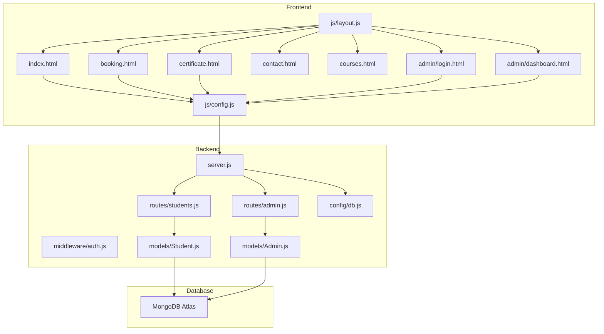
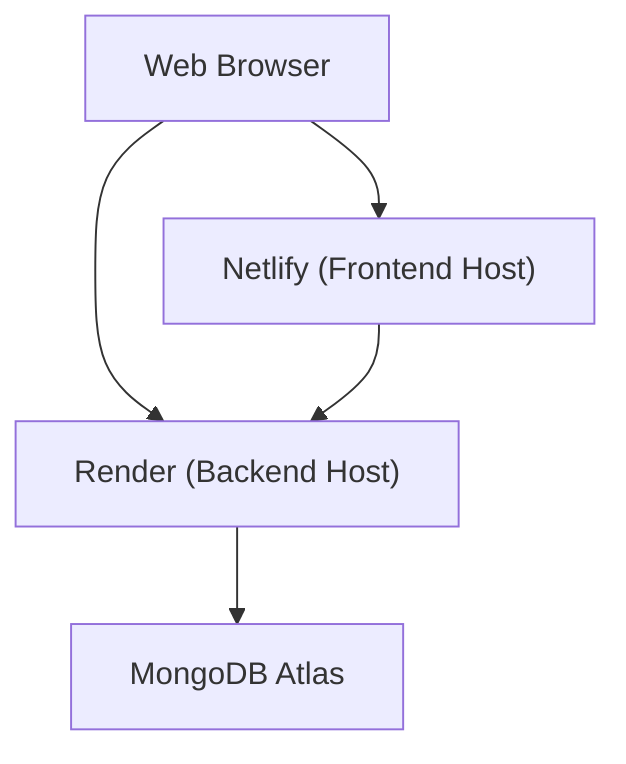
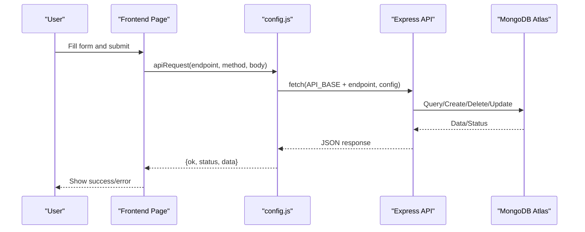
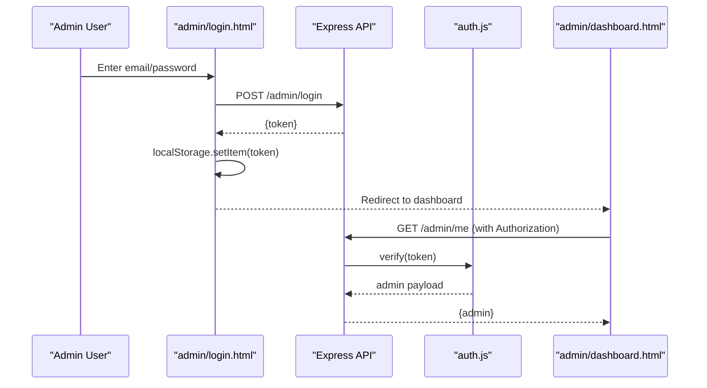
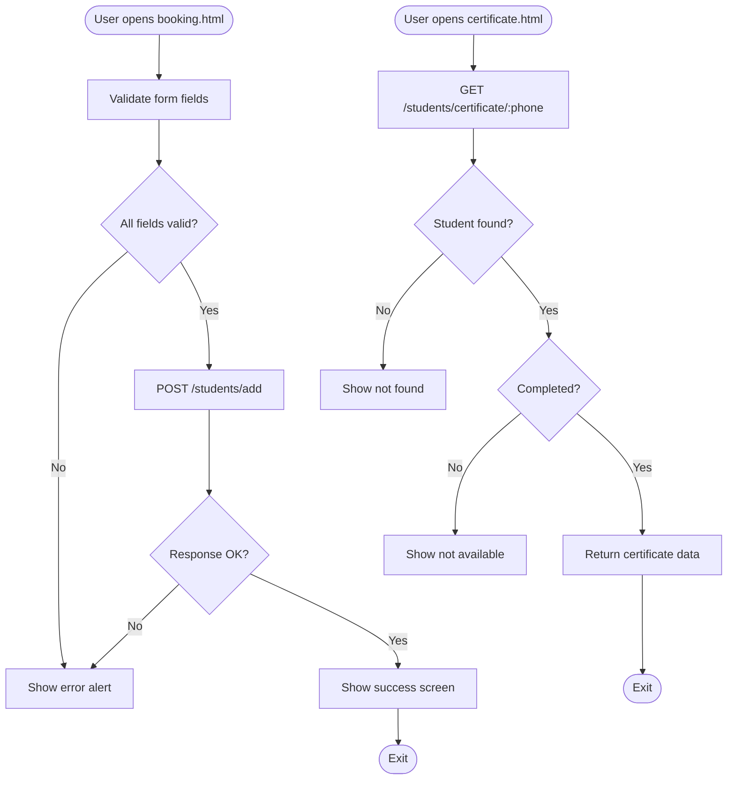
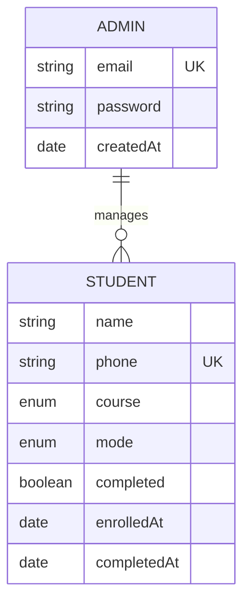
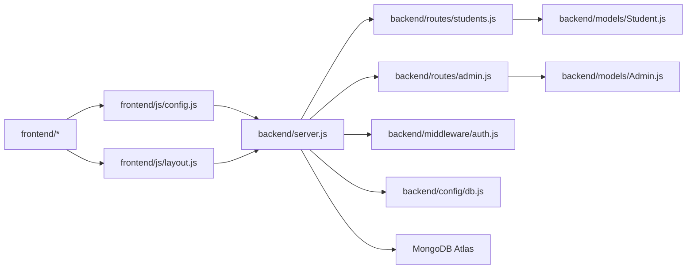

# Project Overview

<cite>
**Referenced Files in This Document**
- [README.md](file://README.md)
- [package.json](file://backend/package.json)
- [server.js](file://backend/server.js)
- [db.js](file://backend/config/db.js)
- [auth.js](file://backend/middleware/auth.js)
- [Student.js](file://backend/models/Student.js)
- [Admin.js](file://backend/models/Admin.js)
- [students.js](file://backend/routes/students.js)
- [admin.js](file://backend/routes/admin.js)
- [index.html](file://frontend/index.html)
- [booking.html](file://frontend/booking.html)
- [certificate.html](file://frontend/certificate.html)
- [contact.html](file://frontend/contact.html)
- [courses.html](file://frontend/courses.html)
- [login.html](file://frontend/admin/login.html)
- [dashboard.html](file://frontend/admin/dashboard.html)
- [config.js](file://frontend/js/config.js)
- [layout.js](file://frontend/js/layout.js)
</cite>

## Table of Contents
1. [Introduction](#introduction)
2. [Project Structure](#project-structure)
3. [Core Components](#core-components)
4. [Architecture Overview](#architecture-overview)
5. [Detailed Component Analysis](#detailed-component-analysis)
6. [Dependency Analysis](#dependency-analysis)
7. [Performance Considerations](#performance-considerations)
8. [Troubleshooting Guide](#troubleshooting-guide)
9. [Conclusion](#conclusion)
10. [Appendices](#appendices)

## Introduction
JK Mobiles Training Institute is a complete full-stack website designed to streamline the operations of a mobile repair training institute. It provides a responsive frontend for prospective students, a secure admin dashboard for managing enrollments and issuing certificates, and a robust backend API powered by Node.js and Express.js with MongoDB Atlas storage. The platform supports student enrollment, certificate verification, and administrative oversight with JWT-based authentication and bcrypt password hashing.

Key value proposition:
- Centralized student lifecycle management from enrollment to certificate issuance.
- Transparent, real-time dashboards for administrators.
- Scalable, cloud-hosted infrastructure suitable for small to medium-sized training centers.

Target audience:
- Training institute staff needing an admin panel to manage students and courses.
- Prospective learners seeking course information, enrollment, and certificate access.
- Institutions requiring a lightweight, cost-effective solution for online presence and operations.

## Project Structure
The project follows a clear separation of concerns:
- Frontend: Static HTML/CSS/JS with shared layout injection and Bootstrap 5 for responsive design.
- Backend: Node.js + Express.js REST API with Mongoose ODM for MongoDB Atlas.
- Authentication: JWT tokens for admin sessions, bcrypt for password hashing.
- Deployment: Render for backend hosting, Netlify for frontend hosting.

**Diagram sources**
- [server.js:1-52](file://backend/server.js#L1-L52)
- [db.js:1-17](file://backend/config/db.js#L1-L17)
- [auth.js:1-34](file://backend/middleware/auth.js#L1-L34)
- [Student.js:1-39](file://backend/models/Student.js#L1-L39)
- [Admin.js:1-34](file://backend/models/Admin.js#L1-L34)
- [students.js:1-100](file://backend/routes/students.js#L1-L100)
- [admin.js:1-55](file://backend/routes/admin.js#L1-L55)
- [config.js:1-33](file://frontend/js/config.js#L1-L33)
- [layout.js:1-69](file://frontend/js/layout.js#L1-L69)
- [index.html:1-567](file://frontend/index.html#L1-L567)
- [booking.html:1-326](file://frontend/booking.html#L1-L326)
- [certificate.html](file://frontend/certificate.html)
- [contact.html](file://frontend/contact.html)
- [courses.html](file://frontend/courses.html)
- [login.html:1-376](file://frontend/admin/login.html#L1-L376)
- [dashboard.html:1-1233](file://frontend/admin/dashboard.html#L1-L1233)

**Section sources**
- [README.md:7-42](file://README.md#L7-L42)
- [server.js:1-52](file://backend/server.js#L1-L52)
- [db.js:1-17](file://backend/config/db.js#L1-L17)
- [package.json:1-22](file://backend/package.json#L1-L22)

## Core Components
- Frontend pages:
  - Home, Courses, Booking, Certificate, Contact, and Admin Login/Dashboard.
  - Shared navigation and footer injected via layout.js.
  - API base URL configured centrally in config.js.
- Backend API:
  - CORS-enabled Express server with JSON parsing and route modules.
  - MongoDB connection via Mongoose.
  - JWT-based admin authentication middleware.
- Models:
  - Student schema with required fields, enums, and timestamps.
  - Admin schema with bcrypt password hashing and comparison.
- Routes:
  - Students: enrollment, listing, completion marking, certificate retrieval, and stats.
  - Admin: setup, login, and profile verification.

**Section sources**
- [README.md:130-141](file://README.md#L130-L141)
- [config.js:1-33](file://frontend/js/config.js#L1-L33)
- [layout.js:1-69](file://frontend/js/layout.js#L1-L69)
- [server.js:1-52](file://backend/server.js#L1-L52)
- [Student.js:1-39](file://backend/models/Student.js#L1-L39)
- [Admin.js:1-34](file://backend/models/Admin.js#L1-L34)
- [students.js:1-100](file://backend/routes/students.js#L1-L100)
- [admin.js:1-55](file://backend/routes/admin.js#L1-L55)

## Architecture Overview
High-level system diagram showing frontend, backend, and database components:

**Diagram sources**
- [README.md:46-103](file://README.md#L46-L103)
- [server.js:1-52](file://backend/server.js#L1-L52)
- [db.js:1-17](file://backend/config/db.js#L1-L17)

## Detailed Component Analysis

### Frontend Pages and Navigation
- Shared layout injection:
  - Navbar and footer are injected dynamically to reduce duplication and improve maintainability.
- API integration:
  - Centralized API helper encapsulates request construction, headers, and response handling.
- Admin pages:
  - Login page handles credential submission and stores JWT in local storage.
  - Dashboard page manages navigation, data refresh, and admin actions.

**Diagram sources**
- [config.js:9-19](file://frontend/js/config.js#L9-L19)
- [students.js:6-25](file://backend/routes/students.js#L6-L25)
- [Student.js:1-39](file://backend/models/Student.js#L1-L39)
- [db.js:1-17](file://backend/config/db.js#L1-L17)

**Section sources**
- [layout.js:3-61](file://frontend/js/layout.js#L3-L61)
- [config.js:9-19](file://frontend/js/config.js#L9-L19)
- [booking.html:286-322](file://frontend/booking.html#L286-L322)
- [login.html:335-372](file://frontend/admin/login.html#L335-L372)

### Admin Authentication and Dashboard
- Authentication flow:
  - Admin login posts credentials to backend, receives JWT, and persists token locally.
  - Protected routes enforce JWT verification via middleware.
- Dashboard features:
  - Statistics cards, student listing with filters/search, completion toggles, and quick links to certificate and booking portals.
  - Responsive sidebar navigation and toast notifications.

**Diagram sources**
- [login.html:350-364](file://frontend/admin/login.html#L350-L364)
- [admin.js:28-52](file://backend/routes/admin.js#L28-L52)
- [auth.js:4-31](file://backend/middleware/auth.js#L4-L31)
- [dashboard.html:751-753](file://frontend/admin/dashboard.html#L751-L753)

**Section sources**
- [login.html:312-372](file://frontend/admin/login.html#L312-L372)
- [admin.js:11-52](file://backend/routes/admin.js#L11-L52)
- [auth.js:1-34](file://backend/middleware/auth.js#L1-L34)
- [dashboard.html:718-754](file://frontend/admin/dashboard.html#L718-L754)

### Student Enrollment and Certificate Workflow
- Enrollment:
  - Client-side validation ensures required fields and phone format.
  - Submission triggers POST to create a new student record.
- Certificate retrieval:
  - Lookup by phone number; only available if completion flag is set.
  - Returns structured certificate data for printing or display.

**Diagram sources**
- [booking.html:286-322](file://frontend/booking.html#L286-L322)
- [students.js:6-25](file://backend/routes/students.js#L6-L25)
- [students.js:56-84](file://backend/routes/students.js#L56-L84)

**Section sources**
- [booking.html:286-322](file://frontend/booking.html#L286-L322)
- [students.js:6-25](file://backend/routes/students.js#L6-L25)
- [students.js:56-84](file://backend/routes/students.js#L56-L84)

### Data Models

**Diagram sources**
- [Admin.js:4-19](file://backend/models/Admin.js#L4-L19)
- [Student.js:3-36](file://backend/models/Student.js#L3-L36)

**Section sources**
- [Admin.js:1-34](file://backend/models/Admin.js#L1-L34)
- [Student.js:1-39](file://backend/models/Student.js#L1-L39)

## Dependency Analysis
- Frontend depends on:
  - Bootstrap 5 for responsive UI.
  - Shared JS modules for navigation and API communication.
- Backend depends on:
  - Express for routing and middleware.
  - Mongoose for MongoDB connectivity.
  - JWT and bcrypt for authentication and password security.
- External services:
  - Render hosts the backend API.
  - Netlify hosts the static frontend.
  - MongoDB Atlas provides the database.

**Diagram sources**
- [config.js:1-33](file://frontend/js/config.js#L1-L33)
- [layout.js:1-69](file://frontend/js/layout.js#L1-L69)
- [server.js:1-52](file://backend/server.js#L1-L52)
- [students.js:1-100](file://backend/routes/students.js#L1-L100)
- [admin.js:1-55](file://backend/routes/admin.js#L1-L55)
- [Student.js:1-39](file://backend/models/Student.js#L1-L39)
- [Admin.js:1-34](file://backend/models/Admin.js#L1-L34)
- [auth.js:1-34](file://backend/middleware/auth.js#L1-L34)
- [db.js:1-17](file://backend/config/db.js#L1-L17)

**Section sources**
- [package.json:10-16](file://backend/package.json#L10-L16)
- [README.md:162-171](file://README.md#L162-L171)

## Performance Considerations
- Frontend:
  - Minimize DOM manipulations; leverage centralized layout injection to avoid duplication.
  - Debounce search/filter inputs in admin tables to reduce API churn.
- Backend:
  - Index phone field in Student collection for fast certificate lookups.
  - Paginate student listings for large datasets.
  - Cache frequently accessed stats where appropriate.
- Database:
  - Use connection pooling and limit returned fields to essentials.
  - Monitor slow queries and add compound indexes if filtering by course/mode becomes frequent.

## Troubleshooting Guide
Common issues and resolutions:
- Backend not reachable:
  - Verify Render deployment logs and environment variables (MONGODB_URI, JWT_SECRET, ADMIN_EMAIL, ADMIN_PASSWORD, PORT).
- Admin login fails:
  - Ensure admin setup was executed once and the admin document does not pre-exist.
  - Confirm JWT_SECRET matches between frontend and backend.
- Certificate not available:
  - Confirm the student’s completion flag is set and the phone number matches exactly.
- CORS errors:
  - Confirm CORS configuration allows requests from the frontend origin.

**Section sources**
- [README.md:48-84](file://README.md#L48-L84)
- [README.md:144-151](file://README.md#L144-L151)
- [admin.js:11-26](file://backend/routes/admin.js#L11-L26)
- [auth.js:4-31](file://backend/middleware/auth.js#L4-L31)
- [students.js:56-84](file://backend/routes/students.js#L56-L84)

## Conclusion
JK Mobiles Training Institute delivers a practical, scalable solution for managing a mobile repair training program. Its modular frontend and backend, combined with MongoDB Atlas and JWT authentication, provide a solid foundation for growth. Administrators gain powerful insights and controls, while students enjoy a seamless enrollment and certificate experience. With clear extension points, the platform is ready for future enhancements such as advanced reporting, SMS integrations, and expanded course catalogs.

## Appendices

### Business Context and Benefits
- Problem addressed:
  - Manual enrollment and certificate workflows leading to inefficiencies and errors.
  - Lack of centralized visibility into student progress and course statistics.
- Benefits:
  - Automated enrollment and certificate gating improves accuracy and trust.
  - Real-time dashboards enable data-driven decisions.
  - Scalable cloud infrastructure reduces operational overhead.

### Scope and Limitations
- Scope:
  - Student enrollment, course management, certificate portal, and admin dashboard.
- Limitations:
  - No payment gateway integration in current build.
  - Certificate generation/printing handled client-side; server returns data only.
  - No multi-language or advanced analytics included.

### Future Enhancements
- Payment processing and invoice generation.
- Email/SMS notifications for enrollment confirmations and reminders.
- Enhanced reporting and export capabilities.
- Multi-admin roles and permissions.
- Course content management and attendance tracking.