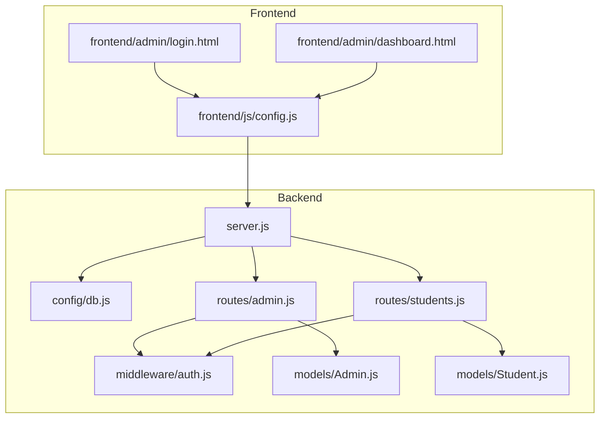
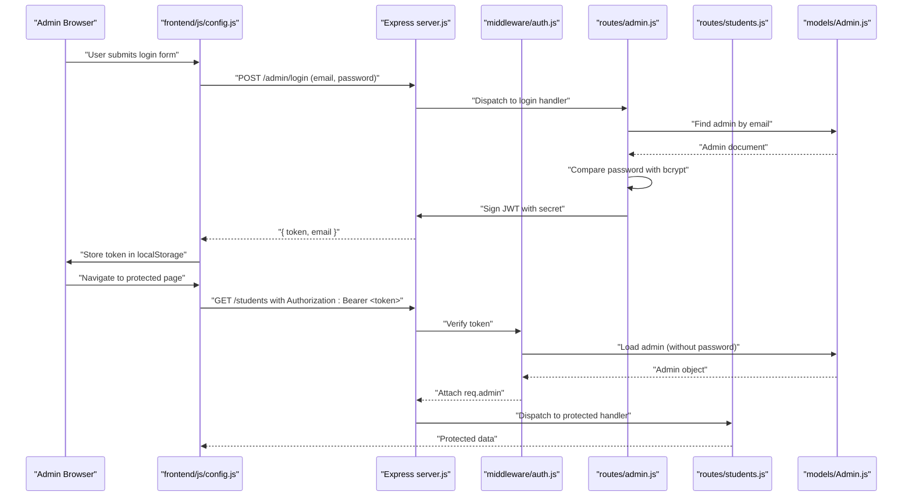
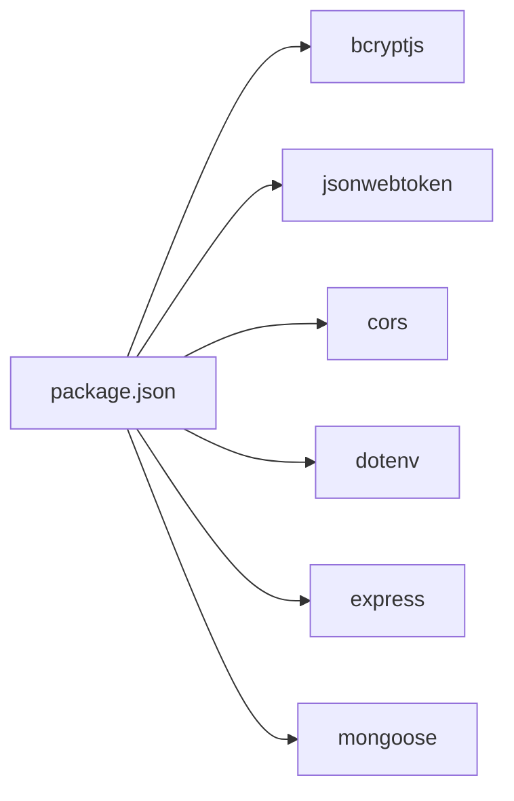

# Security Considerations

<cite>
**Referenced Files in This Document**
- [server.js](file://jk-mobiles/backend/server.js)
- [auth.js](file://jk-mobiles/backend/middleware/auth.js)
- [db.js](file://jk-mobiles/backend/config/db.js)
- [Admin.js](file://jk-mobiles/backend/models/Admin.js)
- [Student.js](file://jk-mobiles/backend/models/Student.js)
- [admin.js](file://jk-mobiles/backend/routes/admin.js)
- [students.js](file://jk-mobiles/backend/routes/students.js)
- [config.js](file://jk-mobiles/frontend/js/config.js)
- [login.html](file://jk-mobiles/frontend/admin/login.html)
- [dashboard.html](file://jk-mobiles/frontend/admin/dashboard.html)
- [package.json](file://jk-mobiles/backend/package.json)
- [render.yaml](file://jk-mobiles/backend/render.yaml)
- [README.md](file://jk-mobiles/README.md)
</cite>

## Table of Contents
1. [Introduction](#introduction)
2. [Project Structure](#project-structure)
3. [Core Components](#core-components)
4. [Architecture Overview](#architecture-overview)
5. [Detailed Component Analysis](#detailed-component-analysis)
6. [Dependency Analysis](#dependency-analysis)
7. [Performance Considerations](#performance-considerations)
8. [Troubleshooting Guide](#troubleshooting-guide)
9. [Conclusion](#conclusion)
10. [Appendices](#appendices)

## Introduction
This document provides comprehensive security documentation for the JK Mobiles application. It focuses on the JWT-based authentication implementation, password hashing with bcryptjs, token management strategies, CORS configuration, input validation and sanitization, security middleware, and secure deployment practices. It also addresses common security vulnerabilities (XSS, CSRF, injection attacks), environment variable security, secret key management, authentication flow security, session management, authorization patterns, and outlines security audit guidelines, vulnerability assessment procedures, and incident response protocols. Privacy and compliance considerations are included to guide responsible data handling.

## Project Structure
The application follows a clear separation of concerns:
- Backend: Express server, middleware, models, routes, and configuration
- Frontend: Static pages for public and admin areas, with shared configuration utilities
- Deployment: Render-managed backend with environment variables and a deployment manifest

**Diagram sources**
- [server.js:1-52](file://jk-mobiles/backend/server.js#L1-L52)
- [db.js:1-17](file://jk-mobiles/backend/config/db.js#L1-L17)
- [auth.js:1-34](file://jk-mobiles/backend/middleware/auth.js#L1-L34)
- [Admin.js:1-34](file://jk-mobiles/backend/models/Admin.js#L1-L34)
- [Student.js:1-39](file://jk-mobiles/backend/models/Student.js#L1-L39)
- [admin.js:1-55](file://jk-mobiles/backend/routes/admin.js#L1-L55)
- [students.js:1-100](file://jk-mobiles/backend/routes/students.js#L1-L100)
- [config.js:1-33](file://jk-mobiles/frontend/js/config.js#L1-L33)
- [login.html:1-376](file://jk-mobiles/frontend/admin/login.html#L1-L376)
- [dashboard.html:1-800](file://jk-mobiles/frontend/admin/dashboard.html#L1-L800)

**Section sources**
- [server.js:1-52](file://jk-mobiles/backend/server.js#L1-L52)
- [README.md:7-42](file://jk-mobiles/README.md#L7-L42)

## Core Components
- JWT-based authentication middleware validates bearer tokens and attaches admin context to requests.
- Password hashing with bcryptjs ensures secure credential storage.
- CORS policy is configured broadly; input validation is minimal and relies on schema constraints.
- Frontend stores JWT in localStorage and sends Authorization headers for protected routes.
- Environment variables are managed via Render and dotenv.

Key security-relevant files:
- Authentication middleware: [auth.js:1-34](file://jk-mobiles/backend/middleware/auth.js#L1-L34)
- Admin model with bcrypt hashing: [Admin.js:1-34](file://jk-mobiles/backend/models/Admin.js#L1-L34)
- Admin routes (login, setup, profile): [admin.js:1-55](file://jk-mobiles/backend/routes/admin.js#L1-L55)
- Protected student routes: [students.js:1-100](file://jk-mobiles/backend/routes/students.js#L1-L100)
- Frontend API helper and login flow: [config.js:1-33](file://jk-mobiles/frontend/js/config.js#L1-L33), [login.html:312-376](file://jk-mobiles/frontend/admin/login.html#L312-L376)
- CORS configuration: [server.js:12-16](file://jk-mobiles/backend/server.js#L12-L16)
- Environment variables and deployment: [render.yaml:1-18](file://jk-mobiles/backend/render.yaml#L1-L18), [package.json:10-16](file://jk-mobiles/backend/package.json#L10-L16)

**Section sources**
- [auth.js:1-34](file://jk-mobiles/backend/middleware/auth.js#L1-L34)
- [Admin.js:21-31](file://jk-mobiles/backend/models/Admin.js#L21-L31)
- [admin.js:28-52](file://jk-mobiles/backend/routes/admin.js#L28-L52)
- [students.js:6-35](file://jk-mobiles/backend/routes/students.js#L6-L35)
- [config.js:9-19](file://jk-mobiles/frontend/js/config.js#L9-L19)
- [login.html:312-376](file://jk-mobiles/frontend/admin/login.html#L312-L376)
- [server.js:12-16](file://jk-mobiles/backend/server.js#L12-L16)
- [render.yaml:7-17](file://jk-mobiles/backend/render.yaml#L7-L17)
- [package.json:10-16](file://jk-mobiles/backend/package.json#L10-L16)

## Architecture Overview
The system enforces authentication at the route level using a JWT middleware. The frontend obtains a JWT from the admin login endpoint and persists it locally. Subsequent requests include an Authorization header with the token. Protected routes enforce admin-only access.

**Diagram sources**
- [login.html:335-372](file://jk-mobiles/frontend/admin/login.html#L335-L372)
- [config.js:9-19](file://jk-mobiles/frontend/js/config.js#L9-L19)
- [server.js:12-16](file://jk-mobiles/backend/server.js#L12-L16)
- [auth.js:4-31](file://jk-mobiles/backend/middleware/auth.js#L4-L31)
- [admin.js:28-47](file://jk-mobiles/backend/routes/admin.js#L28-L47)
- [students.js:27-35](file://jk-mobiles/backend/routes/students.js#L27-L35)
- [Admin.js:28-31](file://jk-mobiles/backend/models/Admin.js#L28-L31)

## Detailed Component Analysis

### JWT Authentication Implementation
- Token issuance: The admin login endpoint signs a JWT with a secret stored in environment variables and sets an expiration.
- Token verification: The middleware extracts the Bearer token from the Authorization header, verifies it against the secret, loads the admin record excluding the password, and attaches it to the request.
- Protected routes: Student routes apply the same middleware to enforce admin-only access.

Security considerations:
- Secret management: The JWT secret must be strong and rotated periodically.
- Token lifecycle: Short-lived tokens reduce risk; refresh mechanisms can be introduced if needed.
- Token transport: Authorization headers are safer than cookies for this client-side SPA.

**Section sources**
- [admin.js:7-9](file://jk-mobiles/backend/routes/admin.js#L7-L9)
- [admin.js:28-47](file://jk-mobiles/backend/routes/admin.js#L28-L47)
- [auth.js:4-31](file://jk-mobiles/backend/middleware/auth.js#L4-L31)
- [students.js:27-35](file://jk-mobiles/backend/routes/students.js#L27-L35)

### Password Hashing with bcryptjs
- Pre-save hook hashes the password with a high salt round count before persisting.
- Password comparison uses bcrypt compare during login.

Security considerations:
- Salt rounds: Ensure sufficient cost to deter brute-force attempts.
- Field normalization: Email is normalized to lowercase to avoid duplicates.

**Section sources**
- [Admin.js:21-31](file://jk-mobiles/backend/models/Admin.js#L21-L31)

### Token Management Strategies
- Storage: The frontend stores the JWT in localStorage after login.
- Transmission: The API helper adds an Authorization header for protected endpoints.
- Logout: The dashboard provides a logout action that should clear stored tokens and redirect to login.

Recommendations:
- Prefer HttpOnly, SameSite cookies for SPA token storage to mitigate XSS and CSRF risks.
- Implement token refresh and rotation policies.
- Add token binding (device fingerprinting) and short expiry windows.

**Section sources**
- [login.html:358-361](file://jk-mobiles/frontend/admin/login.html#L358-L361)
- [config.js:9-19](file://jk-mobiles/frontend/js/config.js#L9-L19)
- [dashboard.html:751](file://jk-mobiles/frontend/admin/dashboard.html#L751)

### CORS Configuration
- The server enables CORS for all origins and allows common methods and headers.
- This permissive configuration increases attack surface and should be restricted to trusted origins in production.

Recommendations:
- Limit origin to the frontend domain(s).
- Restrict exposed methods and headers to only what is necessary.

**Section sources**
- [server.js:12-16](file://jk-mobiles/backend/server.js#L12-L16)

### Input Validation and Sanitization
- Minimal runtime validation occurs at the route level (presence checks).
- Strong schema constraints exist at the model level (required fields, enums, uniqueness).
- Frontend does not perform sanitization; trust is placed in backend validation.

Recommendations:
- Add explicit input validation (length limits, allowed characters) at the route layer.
- Sanitize and normalize inputs (trimming, lowercasing) consistently.
- Use a validation library and centralize rules.

**Section sources**
- [admin.js:33-40](file://jk-mobiles/backend/routes/admin.js#L33-L40)
- [students.js:11-13](file://jk-mobiles/backend/routes/students.js#L11-L13)
- [Student.js:4-24](file://jk-mobiles/backend/models/Student.js#L4-L24)

### Security Middleware Implementation
- The auth middleware centralizes token verification and admin loading.
- It handles missing tokens, invalid tokens, and admin-not-found scenarios.

Recommendations:
- Add rate limiting around login attempts.
- Log authentication events for monitoring.
- Consider adding IP/device binding and secondary factors.

**Section sources**
- [auth.js:4-31](file://jk-mobiles/backend/middleware/auth.js#L4-L31)

### Authentication Flow Security
- Login: Validates presence of credentials, normalizes email, compares hashed passwords, and issues a JWT.
- Profile verification: Returns admin info for the current token.
- Protected endpoints: Require Authorization header with a valid JWT.

Recommendations:
- Enforce HTTPS in production.
- Add multi-factor authentication for admin accounts.
- Implement secure password policies and periodic resets.

**Section sources**
- [admin.js:28-52](file://jk-mobiles/backend/routes/admin.js#L28-L52)
- [auth.js:21-30](file://jk-mobiles/backend/middleware/auth.js#L21-L30)

### Session Management and Authorization Patterns
- Stateless JWT: No server-side session storage.
- Role-based access: Admin-only routes; no granular permissions are enforced.

Recommendations:
- Introduce roles and scopes within the JWT payload.
- Add fine-grained authorization checks per endpoint.
- Implement logout by clearing tokens and optionally blacklisting.

**Section sources**
- [students.js:27-35](file://jk-mobiles/backend/routes/students.js#L27-L35)
- [auth.js:21-27](file://jk-mobiles/backend/middleware/auth.js#L21-L27)

### Environment Variable Security and Secret Key Management
- Secrets stored in Render environment variables: JWT_SECRET, MONGODB_URI, ADMIN_EMAIL, ADMIN_PASSWORD.
- Package dependencies include bcryptjs, jsonwebtoken, cors, dotenv, express, mongoose.

Recommendations:
- Rotate secrets regularly and revoke old keys.
- Store secrets outside the repository; use encrypted secrets vaults.
- Limit exposure of secrets in logs and error messages.

**Section sources**
- [render.yaml:7-17](file://jk-mobiles/backend/render.yaml#L7-L17)
- [package.json:10-16](file://jk-mobiles/backend/package.json#L10-L16)

### Secure Deployment Practices
- Backend runs on Render with Node.js; environment variables are injected.
- Frontend deployed separately; API base URL must match the backend domain.

Recommendations:
- Enforce HTTPS at the CDN and application level.
- Configure CSP headers and HSTS.
- Use CI/CD with automated security scans.

**Section sources**
- [render.yaml:1-18](file://jk-mobiles/backend/render.yaml#L1-L18)
- [README.md:60-84](file://jk-mobiles/README.md#L60-L84)

### Data Protection, Privacy, and Compliance
- Personal data includes student names, phones, and course metadata.
- Consider anonymization and data minimization.
- Implement data retention policies and secure deletion.

Recommendations:
- Add GDPR-style consent and right to erasure where applicable.
- Encrypt sensitive data at rest and in transit.
- Audit data access and maintain logs.

[No sources needed since this section provides general guidance]

## Dependency Analysis
External libraries and their security relevance:
- bcryptjs: Used for password hashing; ensure secure salt rounds.
- jsonwebtoken: Used for JWT signing and verification; manage secret securely.
- cors: Broadly permissive; restrict origins in production.
- dotenv: Loads environment variables; keep .env out of version control.
- express: Base framework; ensure latest patches.
- mongoose: ODM; secure connection string and network access.

**Diagram sources**
- [package.json:10-16](file://jk-mobiles/backend/package.json#L10-L16)

**Section sources**
- [package.json:10-16](file://jk-mobiles/backend/package.json#L10-L16)

## Performance Considerations
- JWT verification is lightweight; avoid excessive token sizes.
- bcrypt hashing cost affects login latency; tune salt rounds appropriately.
- CORS wildcard allows cross-origin requests; consider preflight caching.

[No sources needed since this section provides general guidance]

## Troubleshooting Guide
Common issues and mitigations:
- 401 Unauthorized on protected routes: Verify Authorization header format and token validity.
- Invalid token errors: Confirm JWT_SECRET matches across deployments.
- Login failures: Check email normalization and password comparison.
- CORS errors: Restrict origin to frontend domain and ensure credentials support if needed.
- 500 Internal Server Errors: Inspect server logs and ensure environment variables are set.

**Section sources**
- [auth.js:14-30](file://jk-mobiles/backend/middleware/auth.js#L14-L30)
- [admin.js:33-40](file://jk-mobiles/backend/routes/admin.js#L33-L40)
- [server.js:43-46](file://jk-mobiles/backend/server.js#L43-L46)

## Conclusion
The JK Mobiles application implements a functional JWT-based admin authentication system with bcrypt-powered password hashing and basic input validation. To strengthen security, adopt stricter CORS policies, implement robust input validation and sanitization, prefer secure token storage, enforce HTTPS, and introduce role-based authorization and token rotation. Regular security audits, vulnerability assessments, and incident response procedures will further harden the system.

[No sources needed since this section summarizes without analyzing specific files]

## Appendices

### Security Audit Guidelines
- Penetration testing: Validate authentication, authorization, and CORS configurations.
- Secret scanning: Ensure no hardcoded secrets in client-side code.
- Dependency review: Audit libraries for known vulnerabilities.
- Logging and monitoring: Track authentication events and anomalies.

[No sources needed since this section provides general guidance]

### Vulnerability Assessment Procedures
- Static analysis: Review token handling, input validation, and CORS configuration.
- Dynamic analysis: Test for XSS, CSRF, and injection vectors.
- Configuration review: Validate environment variables and deployment settings.

[No sources needed since this section provides general guidance]

### Incident Response Protocols
- Compromised credentials: Rotate JWT_SECRET and admin credentials; revoke tokens.
- Data breach: Assess scope, notify affected parties, and remediate.
- Downtime: Restore from backups and implement mitigations.

[No sources needed since this section provides general guidance]