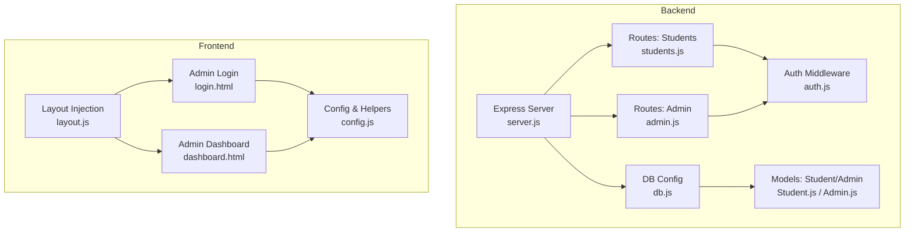
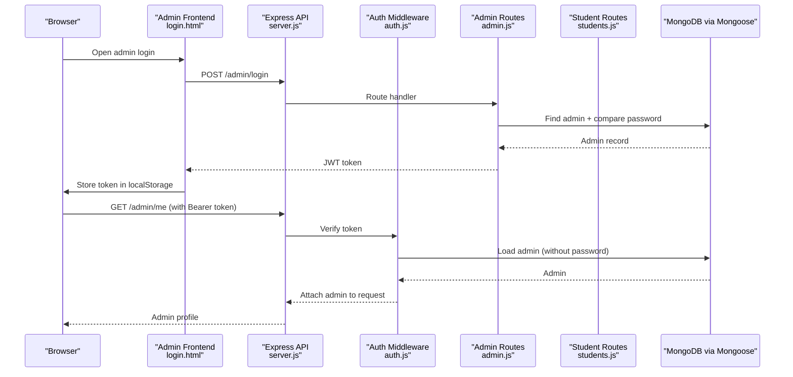
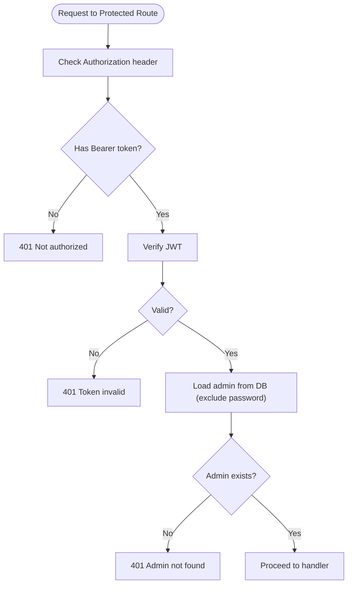
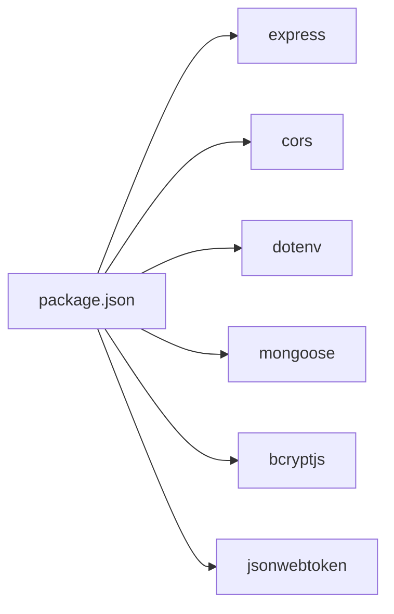

# Troubleshooting and FAQ

<cite>
**Referenced Files in This Document**
- [README.md](file://README.md)
- [server.js](file://backend/server.js)
- [db.js](file://backend/config/db.js)
- [auth.js](file://backend/middleware/auth.js)
- [Admin.js](file://backend/models/Admin.js)
- [Student.js](file://backend/models/Student.js)
- [students.js](file://backend/routes/students.js)
- [admin.js](file://backend/routes/admin.js)
- [config.js](file://frontend/js/config.js)
- [layout.js](file://frontend/js/layout.js)
- [login.html](file://frontend/admin/login.html)
- [dashboard.html](file://frontend/admin/dashboard.html)
- [package.json](file://backend/package.json)
- [render.yaml](file://backend/render.yaml)
</cite>

## Table of Contents
1. [Introduction](#introduction)
2. [Project Structure](#project-structure)
3. [Core Components](#core-components)
4. [Architecture Overview](#architecture-overview)
5. [Detailed Component Analysis](#detailed-component-analysis)
6. [Dependency Analysis](#dependency-analysis)
7. [Performance Considerations](#performance-considerations)
8. [Troubleshooting Guide](#troubleshooting-guide)
9. [FAQ](#faq)
10. [Maintenance and Monitoring](#maintenance-and-monitoring)
11. [Rollback, Backup, and Disaster Recovery](#rollback-backup-and-disaster-recovery)
12. [Conclusion](#conclusion)

## Introduction
This document provides a comprehensive troubleshooting and FAQ guide for the JK Mobiles application. It covers setup, deployment, and operational issues across the backend (Node.js + Express + MongoDB), admin frontend, and public frontend. It also includes diagnostics, performance tuning, maintenance, and recovery procedures.

## Project Structure
The application consists of:
- Backend: Express server, MongoDB via Mongoose, JWT-based admin auth, CORS, and route handlers for students and admin.
- Frontend: Static HTML/CSS/JS with shared layout injection, admin login and dashboard, and public pages.
- Deployment: Render for backend, Netlify for frontend, with environment variables and a Render configuration file.

**Diagram sources**
- [server.js:1-52](file://backend/server.js#L1-L52)
- [students.js:1-100](file://backend/routes/students.js#L1-L100)
- [admin.js:1-55](file://backend/routes/admin.js#L1-L55)
- [auth.js:1-34](file://backend/middleware/auth.js#L1-L34)
- [Student.js:1-39](file://backend/models/Student.js#L1-L39)
- [Admin.js:1-34](file://backend/models/Admin.js#L1-L34)
- [db.js:1-17](file://backend/config/db.js#L1-L17)
- [config.js:1-33](file://frontend/js/config.js#L1-L33)
- [layout.js:1-69](file://frontend/js/layout.js#L1-L69)
- [login.html:1-376](file://frontend/admin/login.html#L1-L376)
- [dashboard.html:1-800](file://frontend/admin/dashboard.html#L1-L800)

**Section sources**
- [README.md:7-42](file://README.md#L7-L42)
- [server.js:1-52](file://backend/server.js#L1-L52)
- [config.js:1-33](file://frontend/js/config.js#L1-L33)

## Core Components
- Express server initializes CORS, JSON parsing, connects to MongoDB, registers routes, and exposes health check and error handlers.
- Authentication middleware validates Authorization: Bearer tokens and attaches admin payload to requests.
- Admin model hashes passwords and compares candidates using bcrypt.
- Student model defines enrollment fields and completion tracking.
- Routes expose public enrollment and certificate endpoints, plus protected admin endpoints for listing students, marking completion, and fetching stats.

**Section sources**
- [server.js:1-52](file://backend/server.js#L1-L52)
- [auth.js:1-34](file://backend/middleware/auth.js#L1-L34)
- [Admin.js:1-34](file://backend/models/Admin.js#L1-L34)
- [Student.js:1-39](file://backend/models/Student.js#L1-L39)
- [students.js:1-100](file://backend/routes/students.js#L1-L100)
- [admin.js:1-55](file://backend/routes/admin.js#L1-L55)

## Architecture Overview

**Diagram sources**
- [login.html:312-376](file://frontend/admin/login.html#L312-L376)
- [server.js:1-52](file://backend/server.js#L1-L52)
- [auth.js:1-34](file://backend/middleware/auth.js#L1-L34)
- [admin.js:1-55](file://backend/routes/admin.js#L1-L55)

## Detailed Component Analysis

### Database Connectivity (MongoDB)
Common symptoms:
- Application fails to start with a MongoDB error.
- Immediate exit after logging a connection failure.

Root causes and fixes:
- Incorrect or missing MONGODB_URI environment variable.
- Network restrictions (Atlas IP whitelist) preventing connections.
- DNS or replica set configuration mismatch.

Diagnostic steps:
- Confirm environment variables are set in Render dashboard and synchronized.
- Verify the connection string format and cluster availability.
- Test connectivity from your machine to the Atlas cluster.

Operational tips:
- Keep MONGODB_URI secret and avoid committing to version control.
- Use a dedicated database user with minimal privileges.

**Section sources**
- [db.js:1-17](file://backend/config/db.js#L1-L17)
- [render.yaml:10-11](file://backend/render.yaml#L10-L11)
- [README.md:48-56](file://README.md#L48-L56)

### Authentication and Admin Login
Common symptoms:
- 401 Not authorized when accessing protected admin endpoints.
- Token invalid errors despite correct credentials.
- Login succeeds but subsequent requests fail.

Root causes and fixes:
- Missing or malformed Authorization header (Bearer token).
- Expired or incorrect JWT_SECRET.
- Admin does not exist or was deleted; re-run setup endpoint.

Diagnostic steps:
- Inspect browser storage for the stored token.
- Verify JWT_SECRET matches between client and server environments.
- Confirm admin exists and credentials are correct.

**Diagram sources**
- [auth.js:1-34](file://backend/middleware/auth.js#L1-L34)
- [admin.js:28-52](file://backend/routes/admin.js#L28-L52)

**Section sources**
- [auth.js:1-34](file://backend/middleware/auth.js#L1-L34)
- [Admin.js:1-34](file://backend/models/Admin.js#L1-L34)
- [admin.js:11-52](file://backend/routes/admin.js#L11-L52)

### API Integration Errors (Frontend)
Common symptoms:
- Login fails with “Network error” messages.
- Certificate lookup returns “not found” or “not completed.”
- Admin dashboard shows empty data or loading indefinitely.

Root causes and fixes:
- API_BASE URL not updated to deployed backend URL.
- CORS misconfiguration blocking requests.
- Frontend pages not served from the correct directory.

Diagnostic steps:
- Replace API_BASE with your Render URL in config.js and admin pages.
- Confirm the backend responds to health check and routes.
- Check browser network tab for 404/401/500 responses.

**Section sources**
- [config.js:1-33](file://frontend/js/config.js#L1-L33)
- [login.html:312-376](file://frontend/admin/login.html#L312-L376)
- [dashboard.html:1-800](file://frontend/admin/dashboard.html#L1-L800)
- [README.md:87-94](file://README.md#L87-L94)

### Frontend Rendering Issues
Common symptoms:
- Navigation links not highlighting active page.
- Navbar/footer not appearing on pages.
- Layout injection errors in console.

Root causes and fixes:
- Missing DOM placeholders for layout injection.
- Script load order issues.
- Mixed content or CSP blocking assets.

Diagnostic steps:
- Ensure placeholders exist in pages for layout injection.
- Confirm script loading order and absence of syntax errors.
- Validate static hosting configuration for Netlify.

**Section sources**
- [layout.js:1-69](file://frontend/js/layout.js#L1-L69)
- [login.html:1-376](file://frontend/admin/login.html#L1-L376)
- [dashboard.html:1-800](file://frontend/admin/dashboard.html#L1-L800)

## Dependency Analysis

**Diagram sources**
- [package.json:1-22](file://backend/package.json#L1-L22)

**Section sources**
- [package.json:1-22](file://backend/package.json#L1-L22)

## Performance Considerations
- Database queries: Use indexes on frequently queried fields (e.g., phone) and limit projections to reduce payload sizes.
- Pagination: Implement pagination for listing all students to avoid large payloads.
- Caching: Consider caching non-sensitive dashboard stats for short TTLs.
- CDN: Serve frontend assets via Netlify’s CDN for improved latency.
- Connection pooling: Configure Mongoose connection pool settings for production workloads.
- Logging: Avoid excessive console logging in production; use structured logs and sampling.

[No sources needed since this section provides general guidance]

## Troubleshooting Guide

### Setup Phase
- Backend not starting:
  - Confirm MONGODB_URI and JWT_SECRET are set in Render.
  - Check Render logs for startup errors and environment synchronization.
- Admin initialization:
  - Run the setup endpoint once to create the admin account.
  - If admin exists, delete the admin document in Atlas to reset.

**Section sources**
- [render.yaml:7-17](file://backend/render.yaml#L7-L17)
- [README.md:80-83](file://README.md#L80-L83)
- [admin.js:11-26](file://backend/routes/admin.js#L11-L26)

### Deployment Phase
- Frontend not reflecting backend changes:
  - Update API_BASE in config.js and admin pages to your Render URL.
  - Re-deploy frontend to Netlify after changes.
- CORS errors:
  - Confirm CORS configuration allows your frontend origin.
  - Ensure Authorization header is included in preflight checks.

**Section sources**
- [README.md:87-94](file://README.md#L87-L94)
- [server.js:12-18](file://backend/server.js#L12-L18)

### Operation Phase
- Database connectivity failures:
  - Validate MONGODB_URI and Atlas IP whitelist.
  - Monitor connection retries and timeouts.
- Authentication failures:
  - Verify JWT_SECRET consistency.
  - Ensure admin exists and credentials are correct.
- API errors:
  - Check 404 for wrong routes, 401 for missing/invalid tokens, 500 for server errors.
  - Inspect server logs for stack traces.

**Section sources**
- [db.js:1-17](file://backend/config/db.js#L1-L17)
- [auth.js:1-34](file://backend/middleware/auth.js#L1-L34)
- [server.js:42-46](file://backend/server.js#L42-L46)

### Frontend Issues
- Login fails:
  - Confirm API_BASE is updated and reachable.
  - Check browser console for network errors.
- Dashboard empty:
  - Ensure token is present and valid.
  - Verify protected routes receive Authorization header.

**Section sources**
- [config.js:1-33](file://frontend/js/config.js#L1-L33)
- [login.html:312-376](file://frontend/admin/login.html#L312-L376)
- [dashboard.html:1-800](file://frontend/admin/dashboard.html#L1-L800)

## FAQ

Q: How do I initialize the admin account?
A: Visit the setup endpoint once to create the admin. If an admin already exists, delete the admin document in Atlas to reset, then re-run setup.

Q: How do I update the frontend to point to my deployed backend?
A: Replace the API_BASE URL in config.js and admin pages with your Render URL.

Q: Why am I getting a “Token is invalid” error?
A: Ensure JWT_SECRET is identical in your environment variables and that the token was issued by the same secret.

Q: How do I reset the admin password?
A: Change ADMIN_PASSWORD in Render, then re-run the setup endpoint (only works if no admin exists yet — delete the admin document in Atlas first).

Q: How do I enable CORS for local development?
A: Adjust the CORS origin to allow localhost ports during development.

Q: How do I scale the backend?
A: Use Render’s scaling options and ensure MONGODB_URI supports connection pooling. Consider adding rate limiting and caching for heavy endpoints.

Q: Can I customize the frontend pages?
A: Yes, modify HTML/CSS/JS under the frontend directory. Ensure proper asset paths and rebuild/deploy.

Q: Are there built-in rate limits?
A: Not in the current code. Add rate limiting middleware in server.js for production.

Q: How do I monitor uptime and errors?
A: Use Render’s logs and metrics. For frontend, consider adding analytics or error reporting.

**Section sources**
- [README.md:80-83](file://README.md#L80-L83)
- [README.md:87-94](file://README.md#L87-L94)
- [README.md:144-151](file://README.md#L144-L151)
- [server.js:12-18](file://backend/server.js#L12-L18)

## Maintenance and Monitoring
- Logs:
  - Backend: Review Render logs for startup, runtime errors, and stack traces.
  - Frontend: Check browser console and network tab for failed requests.
- Metrics:
  - Track response times and error rates for key endpoints.
- Health checks:
  - Use the root health endpoint to confirm service readiness.
- Security:
  - Rotate JWT_SECRET periodically.
  - Limit admin privileges and enforce HTTPS.

**Section sources**
- [server.js:24-35](file://backend/server.js#L24-L35)

## Rollback, Backup, and Disaster Recovery
- Rollback:
  - Re-deploy previous commits on Render and Netlify.
  - Revert environment variables to known-good values.
- Backup:
  - Export MongoDB collections from Atlas or use automated backups.
  - Back up environment variables and deployment configurations.
- Disaster Recovery:
  - Recreate the database cluster if needed.
  - Restore admin credentials by deleting the admin document and re-running setup.

**Section sources**
- [README.md:80-83](file://README.md#L80-L83)

## Conclusion
This guide consolidates actionable steps to troubleshoot and maintain the JK Mobiles application across setup, deployment, and operations. By validating environment variables, ensuring correct frontend/backend URLs, and following secure admin initialization practices, most issues can be resolved quickly. Adopt monitoring, backups, and disaster recovery procedures to sustain reliable operations.